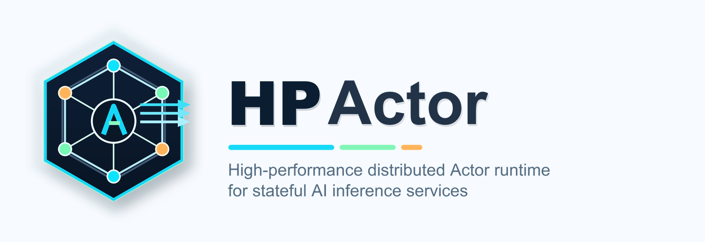

# HPActor

<picture>
  <source srcset="docs/project-logo/assets/hpactor-logo.png" media="(prefers-color-scheme: dark)">
  
</picture>

[](https://github.com/skg7on/HPActor/actions/workflows/ci.yml)
[](https://skg7on.github.io/HPActor/coverage-html/)

A high-performance C++20 actor framework for million-level concurrency on a small thread pool via cooperative coroutines. Combines a work-stealing hybrid scheduler with EDF real-time scheduling, lock-free priority-aware mailboxes with backpressure, a two-tier slab memory allocator, and protobuf-native typed messaging. Built for production with deterministic fault injection, graceful shutdown, Prometheus metrics, distributed tracing, daemon mode, and cluster abstractions — evolving toward an advanced distributed runtime for AI training and distributed inference. No exceptions, no RTTI, bounded by default.

## Documentation

The **[HPActor Developer Manual](https://skg7on.github.io/HPActor/)** is the authoritative guide for building, deploying, monitoring, and operating HPActor-based systems. It covers:

| Section | Topics |
|---------|--------|
| [Getting Started](https://skg7on.github.io/HPActor/getting-started/overview.html) | Framework overview, installation, your first actor, project structure |
| [Building Applications](https://skg7on.github.io/HPActor/building-applications/actor-types.html) | Actor types, message passing, lifecycle, topology config, remote actors |
| [Monitoring](https://skg7on.github.io/HPActor/monitoring/metrics.html) | Prometheus metrics, structured logging, distributed tracing, health/readiness |
| [Operations](https://skg7on.github.io/HPActor/operations/cli.html) | Interactive CLI, CLI server, HTTP gateway, daemon mode with systemd |
| [SRE Integration](https://skg7on.github.io/HPActor/sre-integration/prometheus-grafana.html) | Prometheus + Grafana, Loki, Jaeger, AlertManager, chaos engineering |
| [Best Practices](https://skg7on.github.io/HPActor/best-practices/actor-design.html) | Actor design, error handling, performance tuning, testing, deployment |

To build the manual locally:

```bash
cd docs/manual
pip install sphinx sphinx-rtd-theme
make html
```

Built HTML lands in `docs/manual/_build/html/`.

## Recent Work (June–July 2026)

- **Python language binding (Phases 1A–1E, 2)** — Official Python programming interface with two complementary surfaces: (1) an asyncio-first in-process actor API backed by a pybind11-based `_hpactor` native extension (CPython 3.11+ ABI3 wheels for Linux/macOS x86_64/ARM64), and (2) a pure-Python external SDK (`hpactor.client`) providing sync/async `HealthClient`, `MetricsClient`, `GatewayClient`, and `CliClient` for external health, metrics, HTTP gateway, and CLI surfaces without importing the native runtime. Lazy native imports via `__getattr__`; frozen validated config; bounded HTTPX transports; HPAC frame codec byte-compatible with C++. 103 Python tests pass. See [#426](https://github.com/skg7on/HPActor/issues/426).
- **ActorSystem architecture refactoring (Phases 0–8)** — Monolithic ActorSystem decomposed into runtime components behind an Impl seam: `ActorRuntime`, `MessagingRuntime`, `NetworkRuntime`, `StreamRuntime`, `ObservabilityRuntime`, `ClusterRuntime`. `RuntimeCoordinator` lifecycle state machine with coordinated startup/shutdown. Immutable `RuntimeBlueprint` builder. New `include/hpactor/runtime/` public header directory. Architecture docs reorganized to match source-level organization.
- **Fixed-disruptor actor mailbox** — Lock-free disruptor-pattern mailbox: `MultiLaneQueue<T>` with dedicated system lane, priority-aware routing, and per-lane depth observability. Bounded ring buffer with backpressure. Formal concurrency correctness rules documented.
- **Timer plane & batch messaging (MSG-007)** — Sharded timer backend: `TimerPlane` with per-shard hierarchical wheel + slot array, `TimerCommandQueue` (lock-free bounded MPSC), `TimerGroup` bulk cancellation. Batch send/receive protocol: `BatchEntry`, `BatchMsgFrame`, `send_batch()`/`try_send_batch()`.
- **Streaming protocol (MSG-008)** — Peer-to-peer streaming: `StreamSenderActor`, `StreamReceiverActor`, `StreamConfig`, `StreamHandle`, `open_stream()` routing, `/stream` CLI commands, stream metrics and fault domain.
- **Akka gap closure (Sprints 1–4)** — Receptionist + ClusterReceptionist, `BehaviorTestKit`, `TestProbe`, `MessageAdapter`. Cluster abstractions (failure model, node state, route invalidation). Sharding (resolver, table, handoff, coordinator) and Singleton (identity, manager, majority/fixed-priority election). Reliable messaging: `OutboundTracker`, delivery stores, auto-ACK/NACK. `DurableBehavior`, `EventSourcedBehavior`, `PassivationManager`. Admin API (OPS-002), DeathPact, PipeTo, per-exception supervision directives, `schedule_to()` cross-actor scheduling, Distributed PubSub Mediator.
- **Behavior API enhancements** — Fluent builder API, composable combinators (`setup`, `intercept`, `compose`, `on_signal`), FSM DSL with state data/per-state handlers/timeouts/transition hooks, `StashBuffer`, Router subsystem (`PoolRouter`, `GroupRouter`, 4 routing strategies).
- **Scheduler extreme performance (SCHED-01–07)** — Direct actor pointer in `WorkItem`, bounded MPSC inject ring, `Futex`/`EventCount` worker park, adaptive batch, single-priority fast path, adaptive time-based backoff with OS calibration, EDF queue wire-up.
- **Memory optimization (MEM-001–07)** — Segregated free lists with coalescing, per-region strategies, super carrier + huge page support, message inlining (constexpr trait, inline payload in `TypedMessage`), NUMA-aware memory manager.
- **CAF benchmark suite** — New `apps/bench_caf/` with 3-phase suite: actor creation and mailbox throughput, parameter sweeps (ring, pipeline, zipf, bursty distributions with skew metrics), distributed ping/pong scenario, automated performance report generator.
- **CLI & HTTP API standardization** — Host interfaces (`ICliCommandHost`, `ISystemCliHost`, `ILifecycleCliHost`), `CliClientActor` (remote CLI as DaemonActor), proto-based `CliProtoServerActor` and HTTP-based `CliHttpServerActor`, RESTful HTTP API with OpenAPI 3.0 spec, `JsonBuilder`.

## Quick Start

```bash
# Configure and build
cmake -S . -B build -GNinja
ninja -C build

# Run tests
ctest --output-on-failure --parallel 8

# Run a single test
./build/tests/unit/core/test_unit_core --gtest_filter="*ActorId*"
```

### Build Options

| Option | Default | Purpose |
|--------|---------|---------|
| `ENABLE_TSAN` / `ENABLE_ASAN` | OFF | Thread/Address sanitizers |
| `ENABLE_EXAMPLES` | ON | Build API examples |
| `ENABLE_APPS` | ON | Build complex demo apps |
| `ENABLE_PROACTOR` | OFF | Proactor backend (IoUring, GCD) |
| `ENABLE_ACTOR_METRICS` | ON | Actor-level Prometheus metrics |
| `ENABLE_ACTOR_LOGGING` | ON | Structured logging subsystem |
| `ENABLE_ACTOR_TRACING` | ON | Distributed tracing (W3C TraceContext) |
| `ENABLE_CLI` | ON | Interactive CLI (runtime opt-in) |
| `ENABLE_COVERAGE` | OFF | Code coverage instrumentation |
| `ENABLE_MEMORY_DEBUG` | OFF | Memory poisoning + canary verification |
| `ENABLE_FAULT_INJECTION` | ON | Deterministic fault injection hooks |
| `ENABLE_PYTHON_BINDINGS` | OFF | pybind11-based Python native extension + pure-Python SDK |

## Architecture

### Actor Model

HPActor is an event-based actor framework inspired by CAF. Actors are lightweight concurrency units communicating exclusively via message passing — no shared mutable state.

```
ActorRef (std::variant)
├── Actor        — shared_ptr to local actor (direct dispatch)
└── ActorProxy   — remote actor handle (transport-based send)
```

Messages are protobuf `TypedMessage` (TypeTag + payload) with sender and reply routing:

```cpp
context()->send(addr, msg);        // send to actor
context()->reply(msg);             // reply to current sender
context()->reply_with_error(code); // structured error reply
context()->schedule(delay, msg);   // self-delivery after delay
become(Behavior);                  // dynamic handler swap
co_await mailbox_awaiter;          // suspend for next message (coroutine)
```

Proto actors use declarative handler registration:

```cpp
on<T>([](T& msg) { /* fire-and-forget */ });
on_request<ReqT, ResT>([](ReqT& req) -> ResT { /* request-response */ });
```

### Actor Type Hierarchy

```
AbstractActor (interface base)
└── LocalActor (has ActorContext)
    ├── EventBasedActor (cooperative, behavior-based, coroutine-powered)
    │   ├── StatefulActor<T> (explicit state)
    │   ├── ProtoStatefulActor<T> (protobuf-native + explicit state)
    │   ├── StreamSenderActor (outbound stream peer)
    │   ├── StreamReceiverActor (inbound stream peer)
    │   └── DenseComputingActor (dedicated pool dispatch)
    ├── TypedEventBasedActor<Signatures...> (statically typed)
    ├── BlockingActor (thread-based, blocking receive)
    │   └── ScopedActor (main/non-actor context)
    └── DaemonActor (dedicated thread loop)
        ├── PollingActor (CPU affinity, poll budget)
        ├── ExternalMsgGatewayActor (named route table)
        │   └── HTTPGatewayActor (HTTP ingress)
        ├── CliActor (interactive CLI)
        ├── CliClientActor (remote CLI client)
        ├── CliProtoServerActor (protobuf CLI server)
        └── CliHttpServerActor (HTTP CLI server)
```

### Subsystem Overview

| Subsystem | Key Components |
|-----------|---------------|
| **Runtime** | `ActorRuntime`, `MessagingRuntime`, `NetworkRuntime`, `StreamRuntime`, `ObservabilityRuntime`, `ClusterRuntime`; `RuntimeCoordinator` lifecycle state machine; `RuntimeBlueprint` immutable builder; coordinated startup/shutdown |
| **Scheduling** | `HybridScheduler` with work-stealing + A2WS, `ChaseLevDeque`, `EDFQueue` (earliest deadline first), `TimingWheel` (hierarchical O(1) timer), `CoroutineFramePool`, adaptive batch, single-priority fast path, Futex/EventCount worker park |
| **Mailbox** | `MultiLaneQueue<T>` lock-free multi-lane queue with dedicated system lane, priority-aware routing, per-lane depth observability; bounded admission, overflow handlers, backpressure signals, `DedupCache`, dead-letter queue |
| **Timer** | `TimerPlane` sharded timer backend with per-shard hierarchical wheel + slot array, `TimerCommandQueue` (lock-free bounded MPSC), `TimerGroup` bulk cancellation |
| **Memory** | Two-tier slab allocator (mmap segments → thread-local caches), 8 size classes (32B–4KB), segregated free lists with coalescing, super carrier + huge page support, message inlining (constexpr trait), NUMA-aware manager, typed regions with pressure limits, hibernation/ZRAM, per-actor tracking |
| **Networking** | kqueue/epoll event loop, TLS 1.3, connection pooling, UDS, reactor/proactor backends |
| **Discovery** | Pluggable `IServiceDiscovery` — SWIM gossip, UDP registrar, hybrid, static |
| **Observability** | OpenMetrics `/metrics` (Prometheus), structured logging with pluggable sinks, W3C distributed tracing (OTLP exporter), `ObservabilityRuntime`, `ObservabilitySnapshot` |
| **Config** | TOML topology bootstrapping with templates, imports, AOT binary compilation; self-registering subsystem parsers |
| **Reliability** | Failure envelopes (23 canonical reasons, 12 subsystem sources), circuit breakers, quarantine, rate limiting, passivation, graceful shutdown, deterministic fault injection (80 sites, 14 domains), auto-ACK/NACK, `OutboundTracker`, `DurableBehavior`, `EventSourcedBehavior`, `PassivationManager` |
| **Supervision** | OneForOne, AllForOne, self-supervising with restart policies; remote child tracking; per-exception supervision directive map |

### Daemon Mode

HPActor runs as a systemd service (`Type=notify`) with socket-based CLI access, health HTTP endpoint, watchdog heartbeats, and syslog logging. See the [Operations](https://skg7on.github.io/HPActor/operations/daemon-mode.html) section of the developer manual.

## Design Principles

- **C++20, no exceptions, no RTTI** — message dispatch is exception-free; `TypeTag` replaces RTTI for cross-process type identification
- **Cooperative coroutines** — thousands of actors multiplexed onto a small thread pool via C++20 stackless coroutines
- **Header-only API, compiled runtime** — actor types inline at zero cost; runtime (scheduler, event loop, networking) in shared library
- **Bounded by default** — explicit capacity limits with overflow policies; no unbounded growth
- **Deterministic testing** — no timing/thread-order assumptions; seed-replayable fault injection
- **Minimal dependencies** — system: OpenSSL, Protobuf; vendored: llhttp, toml++ v3.4.0, pybind11 v2.13.6

## Project Structure

```
include/hpactor/   — Public headers: actor, adt, ai, cli, cluster, config, core, coroutine, fault, log, mailbox, mem, metrics, msg, net, observability, process, ref, rpc, runtime, sched, supervision, timer, tracing, types (26 directories)
src/               — Compiled runtime (hpactor_lib), 23 subsystem directories each with per-subsystem CMakeLists.txt
tests/             — 4-tier GTest suite: unit/ (24 subsystem subdirectories), integration/, system/, architecture/
apps/              — 8 demo/benchmark apps: bench_caf, bench_perf, bench_saturate, cli_demo, cluster_control_plane, edgeops_telemetry, hpactor_demo, order_platform
examples/          — Simple API usage examples
bindings/python/   — Python language binding: native extension (_hpactor), pure-Python SDK (hpactor.client), tests, packaging, examples
protos/hpactor/    — Protobuf schemas (common, frame, gossip, messages, ai_resource, cli, registrar, etc.)
tools/             — toml-compiler (AOT), hpactor-cli (standalone client)
docs/              — Architecture specs, production reliability designs, developer manual
third_party/       — Vendored: googletest, llhttp, toml++, pybind11
cmake/             — CMake modules
```

## Status

**2,358 CTest tests, 408 test source files, 371 public headers, 240 source files. 312 Python tests (209 CTest + 103 unit).** Core runtime is complete: actor lifecycle, all actor types, scheduling, networking, service discovery, remote spawn, RPC, TOML config topology, memory management, metrics, logging, tracing, CLI, failure semantics, mailbox (priority lanes, bounded admission, DLQ), supervision, fault injection, graceful shutdown, daemon service mode, AI accelerator subsystem, timer plane with sharded wheels, streaming protocol, receptionist and cluster receptionist, distributed pub-sub mediator, cluster sharding and singleton, durable behavior and event sourcing, passivation management, admin API, death pact and pipe-to patterns, per-exception supervision directives, behavior fluent builder and FSM DSL, StashBuffer, router subsystem (pool/group with 4 routing strategies), batch message send/receive, EDF real-time scheduling, NUMA-aware memory allocation with super carriers and huge pages, CLI architecture standardization with proto/HTTP servers, CAF benchmark suite, RESTful HTTP API with OpenAPI 3.0 spec, reliable messaging primitives (ACK/NACK, OutboundTracker, auto-ACK/NACK), and performance benchmarks (perf, saturate, CAF).

**Python bindings delivered:** asyncio-first in-process actor API (Phases 1A–1E) with pybind11 native extension, CPython 3.11+ ABI3 wheels for Linux (x86_64, ARM64) and macOS (x86_64, ARM64), declarative TOML topology for mixed C++/Python actor trees, and bounded reliability/operations surfaces. Pure-Python external SDK (Phase 2) with sync/async `HealthClient`, `MetricsClient`, `GatewayClient`, `CliClient`, and capability bundles — importable without the native runtime. 209 CTest PythonBinding tests + 81 Python client unit tests + 22 Python Phase 1 tests passing. See [#426](https://github.com/skg7on/HPActor/issues/426).

**Production reliability in progress:** data/control/operations plane features for 24x7 distributed operation. Delivered foundations include delivery modes, receiver deduplication, structured failure envelopes, bounded mailboxes, multi-lane priority queues, DLQ with CLI replay/export, distributed tracing, circuit breakers, quarantine, rate limiting, ask/timeout, passivation, per-message TTL enforcement, graceful shutdown, ACK/NACK retry, outbound delivery tracking, durable behavior with event sourcing, and admin API (OPS-002). Durable outbox/inbox, cluster control plane hardening, and security (mTLS) remain backlog.

See the [developer manual](https://skg7on.github.io/HPActor/) for detailed architecture docs, the [production reliability roadmap](docs/architecture/production/production-reliability-plane.md), and the [refined feature-gap backlog](docs/architecture/production/feature-gap-refined-requirement-backlog.md).
