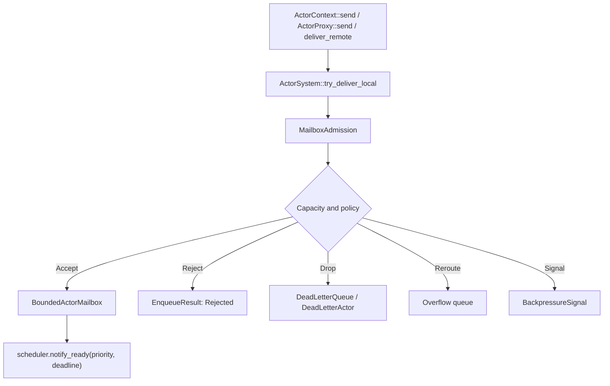
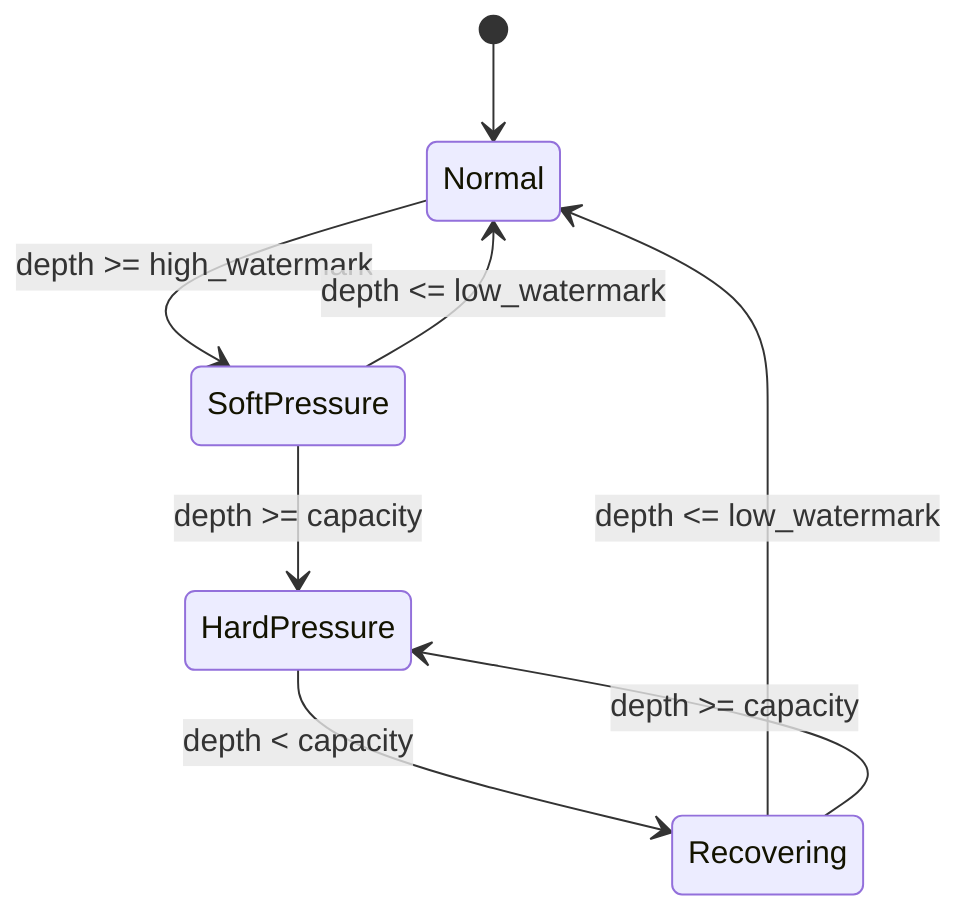
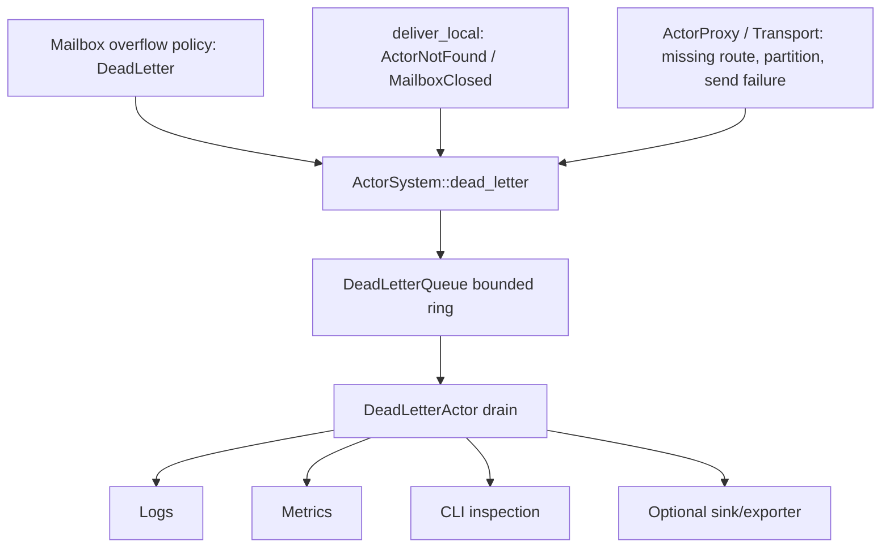

# Mailbox Management and Backpressure Architecture Design

## 1. Executive Summary

HPActor currently uses a per-actor lock-free MPSC mailbox that accepts every
message and warns when depth exceeds 1024. That preserves throughput in the
normal case, but it gives the runtime no hard memory boundary when producers
outpace a consumer. A slow actor can accumulate unbounded messages, exhaust the
message allocator, and destabilize the whole node.

This design introduces bounded mailbox admission and backpressure as a core
actor-system concern. Every message entering an actor mailbox is admitted
through a policy engine that can accept, reject, drop, reroute, or signal
pressure. The default `send()` API remains asynchronous and source-compatible,
while new `try_send()` and `try_deliver_local()` paths expose precise admission
results to producers that want flow control.

The recommended architecture is:

- Keep `ActorSystem::deliver_local()` as the single inbound sink for local and
  remote messages.
- Add a `MailboxConfig` per actor, with system-wide defaults and TOML overrides.
- Extend `MPSCActorMailbox` into a bounded actor mailbox with admission checks,
  watermarks, pressure state, and policy-specific overflow handling.
- Preserve FIFO ordering within the default priority lane, while enabling
  priority-aware lanes for actors that opt into priority scheduling.
- Emit `BackpressureSignal` system messages and remote control frames so
  upstream producers can slow down before hard rejection begins.
- Surface mailbox pressure through metrics, logs, CLI inspection, and dead-letter
  routing.

The first implementation should favor bounded rejection plus observable pressure
over complex queue reshaping. Priority-aware dropping and overflow queues can be
layered in once the admission contract is stable.

---

## 2. Current State

### 2.1 Mailbox

`MPSCActorMailbox<TypedMessage>` wraps an intrusive Vyukov MPSC queue. Producers
allocate a `TypedMessage` node from the message allocator and call
`MPSCMailbox::enqueue()`. The consumer dequeues one message at a time.

Current behavior:

- Mailbox depth is tracked by the underlying queue count.
- A warning is logged when depth exceeds 1024.
- Metrics emit `kMailboxEnqueue` and `kMailboxDequeue`.
- The mailbox has no hard capacity and no admission result.
- `push()` returns `void`, so producers cannot distinguish accepted, dropped, or
  rejected delivery.

### 2.2 Message Delivery

`ActorSystem::deliver_local(ActorId, TypedMessage, priority, deadline)` is the
documented single inbound sink for local sends and remote receives. Today the
priority and deadline parameters are accepted but ignored by the mailbox:

```cpp
void ActorSystem::deliver_local(ActorId target, TypedMessage msg,
                                uint8_t priority, int64_t deadline_ns) {
    auto* mailbox = get_mailbox(target);
    if (mailbox == nullptr) {
        return;
    }
    mailbox->push(std::move(msg));
}
```

This is the correct architectural boundary for backpressure because every
inbound path already converges here:

- `ActorContext::send()`
- `ActorContext::send_with_priority()`
- `ActorRef::send()`
- `ActorProxy::send()` after remote frame decode
- `ActorSystem::enqueue_completion()`
- topology `SystemInit` broadcasts
- supervision, link, monitor, and down messages

### 2.3 Configuration and Observability

The topology model already has a per-actor `mailbox_capacity` field and system
defaults such as `max_queue_depth` and `default_mailbox_size`, but mailbox
construction does not apply these fields yet.

CLI mailbox snapshots currently expose depth and a few counters. Metrics expose
enqueue and dequeue events, but not capacity, dropped messages, rejected
messages, pressure state, or upstream signals.

---

## 3. Problem Statement

An unbounded actor mailbox turns overload into memory pressure. When producers
are faster than a consumer, the system has only one response: keep allocating
message nodes until memory is exhausted.

This creates several operational failures:

- A single slow actor can consume memory needed by unrelated actors.
- Low-value messages can crowd out high-priority control messages.
- Producers receive no signal to slow down or retry later.
- Remote nodes cannot learn that a target actor is overloaded.
- Operators can see depth after the fact, but not the active pressure policy or
  drop/rejection reason.

Mailbox management must therefore become an explicit runtime contract, not just
a queue implementation detail.

---

## 4. Goals

1. Bound memory per actor by message count, byte budget, or both.
2. Keep `send()` source-compatible and fire-and-forget by default.
3. Add opt-in result-returning APIs for producers that need flow control.
4. Support policy choices per actor: reject, drop, dead-letter, overflow queue,
   or signal-only.
5. Preserve FIFO behavior for the default single-priority mailbox.
6. Support priority-aware admission for actors using priority/deadline sends.
7. Protect system control messages from ordinary user-message overload.
8. Propagate pressure locally and across the cluster.
9. Integrate with metrics, logging, CLI inspection, topology config, and tests.
10. Avoid blocking event-based actor handlers on the hot path.

## 5. Non-Goals

- Exactly-once delivery under overload.
- A durable broker or persistent queue.
- Infinite buffering for `NoDrop` messages.
- Global distributed flow-control consensus.
- Replacing the scheduler priority model.
- Changing actor turn-based execution semantics.

---

## 6. Recommended Architecture

The mailbox subsystem should be split into three logical layers.



### 6.1 `ActorSystem::try_deliver_local`

`try_deliver_local()` is the result-returning internal API. It performs actor
lookup, mailbox lookup, admission, and scheduler wakeup.

```cpp
EnqueueResult ActorSystem::try_deliver_local(ActorId target,
                                             TypedMessage msg,
                                             MessagePriority priority,
                                             int64_t deadline_ns,
                                             DeliveryOptions options);
```

Existing `deliver_local()` remains as a compatibility wrapper:

```cpp
void ActorSystem::deliver_local(ActorId target, TypedMessage msg,
                                uint8_t priority, int64_t deadline_ns) {
    (void)try_deliver_local(target, std::move(msg),
                            MessagePriority{priority}, deadline_ns, {});
}
```

The wrapper still gives async messaging semantics to existing code. Dropped or
rejected messages become observable through metrics, logs, dead letters, and
optional backpressure signals.

### 6.2 `MailboxAdmission`

`MailboxAdmission` is a small policy component owned by each actor mailbox. It
answers one question before a node is committed to the queue:

> Given this message, current mailbox pressure, and actor policy, what should
> happen?

It returns one of:

- accept the message
- accept and emit soft-pressure signal
- reject the message
- drop this message
- drop an existing lower-priority message and accept this one
- reroute this message to an overflow queue
- accept only for a protected system lane

The admission check must run before allocating avoidable mailbox storage. A
`TypedMessage` may already own its serialized payload, but the mailbox node
allocation and queue depth growth must be avoidable when admission fails.

### 6.3 `BoundedActorMailbox`

The mailbox remains MPSC for producer scalability and single-consumer for actor
turn-based execution. The first implementation can extend
`MPSCActorMailbox<TypedMessage>` with capacity checks. A later implementation
can introduce priority lanes while keeping the same public admission contract.

Recommended internal shape:

```cpp
template <typename T>
class BoundedActorMailbox {
public:
    EnqueueResult try_push(T&& msg, const MailboxEnvelopeMeta& meta) noexcept;
    bool try_pop(T& out) noexcept;
    cli::MboxSnapshot snapshot() const noexcept;

private:
    MailboxConfig config_;
    MailboxCounters counters_;
    MailboxPressureState pressure_state_;
    MPSCMailbox<T> default_lane_;
    PriorityLaneSet<T> priority_lanes_; // optional in phase 2
};
```

`MPSCActorMailbox` can be retained as the concrete class name if that minimizes
churn. The important change is behavioral: mailbox admission is bounded and
returns an explicit result.

### 6.4 `BackpressureController`

`BackpressureController` converts mailbox pressure transitions into rate-limited
signals. It is not a broker and does not own message storage.

Responsibilities:

- Track `Normal`, `SoftPressure`, `HardPressure`, and `Recovering` states.
- Apply high/low watermark hysteresis.
- Rate-limit repeated signals to the same sender.
- Produce local `BackpressureSignal` messages.
- Produce remote control frames for overloaded remote targets.
- Update metrics and CLI snapshots.

The controller may be implemented as a small per-mailbox object at first. A
future `BackpressureManager` system actor can aggregate node-level pressure and
coordinate global policies.

---

## 7. Core Types

### 7.1 Mailbox Capacity

Mailbox capacity should support both message count and estimated bytes.

```cpp
struct MailboxCapacity {
    uint32_t max_messages = 1024;
    uint64_t max_bytes = 0; // 0 means disabled
};
```

Message count is cheap and deterministic. Byte capacity prevents a small number
of large messages from bypassing protection. The initial byte estimate can be:

```cpp
sizeof(TypedMessage) + msg.payload().size()
```

If the message has a parsed protobuf object, exact heap ownership is difficult
to know without protobuf reflection. The estimate is still useful because remote
payloads and serialized local messages dominate the overload case.

### 7.2 Mailbox Config

```cpp
enum class OverflowPolicy : uint8_t {
    RejectNewest,
    DropNewest,
    DropOldest,
    DropLowestPriority,
    DeadLetter,
    SpillToOverflowQueue,
    SignalOnly,
    BlockWhenAllowed,
};

enum class BackpressureMode : uint8_t {
    Disabled,
    LocalSignal,
    RemoteSignal,
    LocalAndRemoteSignal,
};

struct MailboxConfig {
    MailboxCapacity capacity;
    uint8_t priority_levels = 4;
    OverflowPolicy overflow_policy = OverflowPolicy::RejectNewest;
    BackpressureMode backpressure_mode = BackpressureMode::LocalAndRemoteSignal;

    double high_watermark = 0.80;
    double low_watermark = 0.50;
    uint32_t protected_system_messages = 32;
    uint32_t max_overflow_depth = 0;
    uint32_t signal_min_interval_ms = 100;
    bool priority_aware = false;
    bool enable_dead_letters = true;
};
```

Default policy should be `RejectNewest` because it is predictable, preserves
existing mailbox contents, and avoids silent data loss. Actors with telemetry or
best-effort update streams can opt into `DropLowestPriority` or `DropNewest`.

### 7.3 Envelope Metadata

HPActor already carries payload, type tag, sender, and trace context in
`TypedMessage`. Mailbox admission needs a small metadata view that does not
force every actor message to become a new wrapper type immediately.

```cpp
struct MessagePriority {
    uint8_t value = 0; // 0 is highest
};

struct DeliveryOptions {
    bool no_drop = false;
    bool allow_blocking = false;
    bool emit_backpressure = true;
};

struct MailboxEnvelopeMeta {
    ActorAddress sender;
    TypeTag type_tag = TypeTag::Invalid;
    uint64_t message_id = 0;
    uint8_t priority = 0; // 0 is highest
    int64_t deadline_ns = INT64_MAX;
    uint32_t flags = 0;
    uint64_t estimated_bytes = 0;
    uint64_t sequence = 0;
};
```

If a future `MailboxEnvelope` type is introduced, `TypedMessage` should remain
the user-facing carrier and become the envelope payload rather than forcing all
actor handlers to change.

`DeliveryOptions::no_drop` maps to the existing wire `NoDrop` flag for remote
messages. It means "do not silently drop"; it does not mean "buffer forever."

### 7.4 Enqueue Result

```cpp
enum class EnqueueResultCode : uint8_t {
    Accepted,
    AcceptedWithSoftPressure,
    Rejected,
    DroppedNewest,
    DroppedExisting,
    ReroutedToDeadLetter,
    ReroutedToOverflow,
    MailboxClosed,
    ActorNotFound,
};

struct EnqueueResult {
    EnqueueResultCode code = EnqueueResultCode::Accepted;
    ActorId target;
    uint32_t depth = 0;
    uint32_t capacity = 0;
    double pressure_ratio = 0.0;
    std::chrono::milliseconds retry_after{0};
    TypeTag affected_type = TypeTag::Invalid;
    uint64_t affected_message_id = 0;

    bool accepted() const noexcept;
    bool retryable() const noexcept;
};
```

`send()` ignores the result after instrumentation. `try_send()` returns it to
the caller. `rpc()` converts a non-accepted result into a failed future with
`errors::mailbox_full`.

### 7.5 Backpressure Signal

```cpp
enum class BackpressureReason : uint8_t {
    HighWatermark,
    HardCapacity,
    ByteCapacity,
    OverflowPolicy,
    NodeMemoryPressure,
};

struct BackpressureSignal {
    ActorAddress target;
    ActorAddress sender;
    BackpressureReason reason;
    uint32_t depth = 0;
    uint32_t capacity = 0;
    uint64_t bytes = 0;
    uint64_t byte_capacity = 0;
    double pressure_ratio = 0.0;
    std::chrono::milliseconds retry_after{0};
    uint64_t sequence = 0;
};
```

Signals are advisory. Producers that ignore them may still have messages
rejected when the target reaches hard capacity.

---

## 8. Pressure State Machine

Mailbox pressure should use hysteresis so producers do not receive noisy signals
as depth oscillates around a single threshold.



State meanings:

| State | Meaning | Action |
|-------|---------|--------|
| `Normal` | Mailbox is comfortably below high watermark | Accept normally |
| `SoftPressure` | Mailbox is filling but not full | Accept and signal producers |
| `HardPressure` | Mailbox is at hard capacity | Apply overflow policy |
| `Recovering` | Mailbox has drained below full but not below low watermark | Continue signal throttling |

The default high watermark is 80 percent. The default low watermark is 50
percent.

---

## 9. Admission Algorithm

The mailbox admission path should be short, branch-predictable, and allocation
aware.

```cpp
EnqueueResult BoundedActorMailbox::try_push(TypedMessage&& msg,
                                            const MailboxEnvelopeMeta& meta) {
    auto snapshot = counters_.snapshot();
    auto estimate = estimate_message_bytes(msg);

    if (is_system_protected(meta) && has_system_reserve(snapshot, estimate)) {
        return accept_system(std::move(msg), meta, estimate);
    }

    if (fits_capacity(snapshot, estimate)) {
        auto result = accept_user(std::move(msg), meta, estimate);
        if (crossed_high_watermark(result.pressure_ratio)) {
            signal_soft_pressure(meta.sender, result);
            result.code = EnqueueResultCode::AcceptedWithSoftPressure;
        }
        return result;
    }

    switch (config_.overflow_policy) {
        case OverflowPolicy::RejectNewest:
            return reject_newest(meta, snapshot);
        case OverflowPolicy::DropNewest:
            return drop_newest(meta, snapshot);
        case OverflowPolicy::DropOldest:
            return drop_oldest_then_accept(std::move(msg), meta, estimate);
        case OverflowPolicy::DropLowestPriority:
            return drop_lowest_priority_then_accept(std::move(msg), meta, estimate);
        case OverflowPolicy::DeadLetter:
            return dead_letter_newest(std::move(msg), meta, snapshot);
        case OverflowPolicy::SpillToOverflowQueue:
            return spill_to_overflow(std::move(msg), meta, snapshot);
        case OverflowPolicy::SignalOnly:
            signal_hard_pressure(meta.sender, snapshot);
            return reject_newest(meta, snapshot);
        case OverflowPolicy::BlockWhenAllowed:
            return maybe_block_or_reject(std::move(msg), meta, snapshot);
    }
}
```

Admission invariants:

- A rejected message is never enqueued and never wakes the scheduler.
- A dropped message increments drop counters and optionally becomes a dead
  letter.
- A rerouted message is not counted against the target actor's active mailbox.
- `NoDrop` user messages are not silently dropped; if capacity cannot be
  reserved, they are rejected with a retryable result.
- System control messages use a protected reserve but are still bounded.
- Scheduler wakeup uses the accepted message's effective priority and deadline.

---

## 10. Ordering and Priority

The default mailbox remains FIFO for messages in the same priority class. When
priority-aware mode is disabled, every message goes to the default lane and the
current ordering semantics are preserved.

When priority-aware mode is enabled:

- Priority `0` is the highest priority.
- Each priority level has its own MPSC lane.
- The actor consumer drains the highest non-empty priority lane first.
- FIFO is preserved inside each lane.
- Deadlines are used as scheduler wakeup metadata, not as a per-mailbox sort key
  in the first phase.
- `DropLowestPriority` removes candidates from the lowest priority non-empty
  lane that is eligible for dropping.

This aligns mailbox pressure with the scheduler's existing priority model
without requiring the scheduler to own per-message queues.

---

## 11. Backpressure Propagation

### 11.1 Local Producers

Existing sends:

```cpp
context()->send(target, msg);
```

remain fire-and-forget. If admission fails, the system records the result and
optionally sends a `BackpressureSignal` to the producer.

New opt-in APIs:

```cpp
EnqueueResult ActorContext::try_send(const ActorAddress& target,
                                     TypedMessage msg);

EnqueueResult ActorContext::try_send_with_priority(const ActorAddress& target,
                                                   TypedMessage msg,
                                                   uint8_t priority,
                                                   int64_t deadline_ns);
```

Recommended producer behavior:

- On `Accepted`, continue normally.
- On `AcceptedWithSoftPressure`, reduce send rate if the producer is adaptive.
- On retryable `Rejected`, retry after `result.retry_after`.
- On non-retryable `MailboxClosed` or `ActorNotFound`, stop sending and surface
  an application error.

### 11.2 Event-Based Actors

Event-based actors must not block on mailbox capacity by default. Blocking an
actor handler while trying to send to another overloaded actor can deadlock a
pipeline and consume scheduler workers.

Allowed behavior:

- `send()` never blocks.
- `try_send()` never blocks.
- `BlockWhenAllowed` is only valid for `BlockingActor`, `ScopedActor`, external
  gateway threads, or explicit future/coroutine APIs that suspend without
  occupying a worker.

### 11.3 Remote Producers

Remote backpressure requires a cluster-visible control signal. The receiving
node should send a compact control frame when a remote sender contributes to
soft or hard pressure.

Recommended wire-level options:

1. Add `BackpressureSignalTag` as a system `TypeTag` and send it through normal
   actor messaging.
2. Add a lightweight `MailboxControlFrame` beside `ActorMsgFrame`.

The first implementation should use a system `TypeTag` because it reuses the
existing frame, actor addressing, transport, and tracing paths. A dedicated
control frame can be added later if control traffic needs a separate priority
lane.

Remote signal effects:

- `ActorProxy` records pressure by `(endpoint, target_actor_id)`.
- Connection pools apply token-bucket throttling for pressured targets.
- Fire-and-forget remote sends may be locally rejected while pressure is active.
- RPC sends fail fast with `errors::mailbox_full` when the remote target is known
  to be in hard pressure.
- HTTP gateway ingress can translate hard pressure to HTTP 429.

### 11.4 Ingress Actors

Ingress actors are natural backpressure boundaries:

- `HTTPGatewayActor`: return `429 Too Many Requests` with `Retry-After`.
- RPC channel: complete futures with `errors::mailbox_full`.
- Spawn receiver: reject remote spawn requests when system mailbox reserve is
  exhausted.
- External gateways: stop reading or reduce read interest when downstream actors
  are pressured.

---

## 12. Overflow Policies

| Policy | Behavior | Best For |
|--------|----------|----------|
| `RejectNewest` | Reject incoming message when full | Request/response, critical state transitions |
| `DropNewest` | Drop incoming message silently or as dead letter | Best-effort telemetry |
| `DropOldest` | Remove oldest eligible queued message, accept incoming | Latest-value streams |
| `DropLowestPriority` | Remove lower-priority eligible queued message | Mixed control/data mailboxes |
| `DeadLetter` | Capture incoming message in the bounded dead-letter queue | Debug-heavy deployments, critical message-loss analysis |
| `SpillToOverflowQueue` | Move incoming message to bounded overflow queue | Burst absorption with clear limits |
| `SignalOnly` | Signal pressure and reject at hard capacity | Compatibility mode |
| `BlockWhenAllowed` | Wait for capacity only on approved blocking/suspending callers | Backpressure-aware gateways |

The default should be `RejectNewest`. Silent dropping must be an explicit actor
configuration choice.

---

## 13. Dead-Letter Queue and Overflow Queues

### 13.1 Dead-Letter Queue Scope

The `DeadLetter` overflow policy must route undeliverable messages into a
bounded dead-letter queue, not directly into another normal actor mailbox. The
same queue also captures messages that cannot be delivered for reasons outside
mailbox overflow:

- target actor does not exist on the local node
- target actor has terminated or its mailbox is closed
- route lookup fails for a remote actor
- service discovery reports no member for the target endpoint
- connection pool cannot send because of network partition or node
  unreachability
- remote frame cannot be decoded or mapped to a live target actor
- a `NoDrop` message is rejected because capacity cannot be reserved

Dead letters are diagnostic records. Capturing a message as a dead letter means
"delivery failed and the runtime preserved enough context for operators to
debug, alert, or manually replay." It does not mean the original delivery
succeeded.

### 13.2 Components



#### `DeadLetterQueue`

`DeadLetterQueue` is a bounded, node-local diagnostic queue owned by
`ActorSystem`. It should not depend on normal actor mailbox delivery for its
own safety path, because the system may be recording dead letters precisely
when actor mailboxes are overloaded.

Recommended API:

```cpp
class DeadLetterQueue {
public:
    bool try_push(DeadLetterRecord&& record) noexcept;
    bool try_pop(DeadLetterRecord& out) noexcept;
    DeadLetterQueueSnapshot snapshot() const noexcept;
};
```

The queue can be implemented as a bounded MPSC ring buffer: many producer
threads can report failed delivery, while one `DeadLetterActor` or metrics drain
consumes records. If the ring is full, the queue applies its own overflow policy
and increments a lost-dead-letter counter.

#### `DeadLetterActor`

`DeadLetterActor` is the operational surface for the queue. It drains records
from `DeadLetterQueue`, batches log entries, updates metrics, serves CLI
inspection requests, and optionally forwards records to an external sink. It
must never route its own failed output back into the same dead-letter queue
without a recursion guard.

#### Optional Sink

An optional sink interface can export dead letters to files, OpenTelemetry logs,
or a user-provided diagnostics actor:

```cpp
class IDeadLetterSink {
public:
    virtual ~IDeadLetterSink() = default;
    virtual void on_dead_letter(const DeadLetterRecord& record) noexcept = 0;
};
```

The sink is best-effort. Sink failure increments sink-error counters and is not
allowed to block mailbox admission.

### 13.3 Dead-Letter Record

A dead-letter record should preserve enough context to explain why the message
was not delivered:

```cpp
enum class DeadLetterReason : uint8_t {
    MailboxFull,
    MailboxClosed,
    ActorNotFound,
    ActorTerminated,
    MissingRoute,
    RemoteNodeUnreachable,
    NetworkPartition,
    TransportSendFailed,
    DecodeFailed,
    OverflowPolicy,
    NoDropRejected,
};

enum class DeadLetterSource : uint8_t {
    LocalDelivery,
    RemoteDelivery,
    ActorProxy,
    Transport,
    MailboxAdmission,
    ServiceDiscovery,
    Replay,
};

struct DeadLetterRecord {
    DeadLetterReason reason;
    DeadLetterSource source;
    ActorAddress sender;
    ActorAddress target;
    TypeTag type_tag = TypeTag::Invalid;
    uint64_t message_id = 0;
    uint32_t frame_flags = 0;
    uint8_t priority = 0;
    int64_t deadline_ns = INT64_MAX;
    uint64_t trace_id_hi = 0;
    uint64_t trace_id_lo = 0;
    uint64_t span_id = 0;
    uint32_t payload_size = 0;
    StreamBuffer payload_sample;
    uint32_t mailbox_depth = 0;
    uint32_t mailbox_capacity = 0;
    uint64_t timestamp_ns = 0;
};
```

The queue should support payload sampling rather than unlimited payload
retention. Operators need enough bytes to identify the message type and debug
common failures, but the dead-letter path must not become a second OOM vector.

Default payload policy:

- Store metadata for every dead letter.
- Store at most `max_payload_sample_bytes` bytes from the serialized payload.
- Preserve trace context when distributed tracing is enabled.
- Redact payload bytes entirely when `store_payload = false`.

### 13.4 Capture Points

Dead letters should be produced at every delivery boundary where the runtime can
prove the target will not receive the message.

| Boundary | Failure | Dead-letter reason |
|----------|---------|--------------------|
| `ActorSystem::try_deliver_local()` | no mailbox or actor entry exists | `ActorNotFound` |
| `ActorSystem::try_deliver_local()` | actor exists but mailbox is closed | `MailboxClosed` |
| `BoundedActorMailbox::try_push()` | policy is `DeadLetter` and capacity is full | `MailboxFull` or `OverflowPolicy` |
| `BoundedActorMailbox::try_push()` | `NoDrop` cannot reserve capacity | `NoDropRejected` |
| `ActorContext::resolve()` | local registry and remote resolution fail | `MissingRoute` |
| `ActorProxy::send()` | discovery cannot find a member | `MissingRoute` |
| `ActorProxy::send()` | member is known dead or partitioned | `RemoteNodeUnreachable` or `NetworkPartition` |
| `Transport::send()` | connection pool rejects or socket send fails | `TransportSendFailed` |
| `ActorSystem::deliver_remote()` | frame decodes but receiver is not live | `ActorNotFound` |
| frame decode | frame is malformed or unsupported | `DecodeFailed` |

Capture should happen exactly once per failed delivery. If a local send resolves
to a remote proxy and the proxy later records `MissingRoute`, the earlier
resolution layer must not also record a dead letter for the same message.

### 13.5 Queue Overflow Policy

The dead-letter queue must be bounded independently from actor mailboxes:

```cpp
enum class DeadLetterOverflowPolicy : uint8_t {
    DropOldestRecord,
    DropNewestRecord,
    MetadataOnly,
};

struct DeadLetterConfig {
    bool enabled = true;
    uint32_t capacity = 4096;
    uint64_t byte_capacity = 0;
    uint32_t max_payload_sample_bytes = 512;
    DeadLetterOverflowPolicy overflow_policy =
        DeadLetterOverflowPolicy::DropOldestRecord;
    bool store_payload = true;
    bool alert_on_first_failure = false;
    uint32_t alert_threshold_per_minute = 100;
};
```

Recommended default is `DropOldestRecord`: keep the most recent failures because
they usually describe the active incident. For regulated deployments,
`MetadataOnly` keeps every record cheaper by dropping payload samples before
dropping whole records.

If the queue cannot accept a record:

1. Increment `hpactor_dead_letter_lost_total`.
2. Increment a per-reason aggregate counter.
3. Emit a rate-limited critical log.
4. Do not recursively dead-letter the failed dead-letter record.

### 13.6 Replay Semantics

Dead-letter replay is optional and disabled by default. Replaying a dead letter
can duplicate application effects, especially for non-idempotent messages.

If replay is added later:

- Only CLI or an explicit admin API can trigger replay.
- Replay preserves original sender, target, type tag, trace context, priority,
  and deadline metadata.
- Replay creates a new message id and links to the dead-letter record id.
- Messages without an idempotent or admin-approved flag require confirmation.
- Replay failure creates a new dead-letter record with `DeadLetterSource::Replay`.

### 13.7 Overflow Queue

`SpillToOverflowQueue` is a bounded secondary queue owned by the actor system, not
by the actor mailbox. It is useful for bursty workloads where temporary queuing
is acceptable.

Rules:

- The overflow queue has its own capacity and metrics.
- It drains into the target mailbox only after the mailbox returns below the low
  watermark.
- Draining preserves original priority metadata.
- Overflow is not durable across process restart.
- Overflow does not apply to protected system messages.

---

## 14. Scheduler Integration

Backpressure must not create duplicate runnable work or wake actors for messages
that were not accepted.

Scheduler rules:

- Only accepted messages call `scheduler.notify_ready()`.
- The wakeup priority is the accepted message priority or the highest priority
  currently present in the mailbox.
- The wakeup deadline is the accepted message deadline or the earliest known
  deadline among queued messages when the mailbox tracks that cheaply.
- Rejected, dropped, and dead-lettered messages do not wake the target actor.
- When a pressured actor drains below the low watermark, the mailbox emits a
  recovery signal and can drain its overflow queue.

This preserves the existing edge-triggered scheduling model: an actor is woken
when its mailbox transitions from empty to non-empty.

---

## 15. System Message Reserve

Some messages are required for runtime correctness and must not be starved by
ordinary user traffic:

- `DownMsg`
- `ExitMsg`
- `LinkMsg`
- `UnlinkMsg`
- `SystemInitTag`
- supervision control messages
- backpressure recovery/control messages

The mailbox should reserve a small bounded system lane for these messages. The
reserve prevents a full user mailbox from blocking lifecycle and supervision,
but it does not create unbounded memory growth.

If the system reserve is exhausted, the runtime escalates:

1. Increment `hpactor_mailbox_system_reserve_exhausted_total`.
2. Emit a critical log event.
3. Notify the supervisor or system actor.
4. Reject non-critical system messages until reserve recovers.

---

## 16. Configuration Model

### 16.1 Runtime Config

Add a mailbox defaults block to `hpactor::Config`:

```cpp
struct MailboxDefaults {
    uint32_t default_capacity = 1024;
    uint64_t default_byte_capacity = 0;
    OverflowPolicy default_policy = OverflowPolicy::RejectNewest;
    double high_watermark = 0.80;
    double low_watermark = 0.50;
    uint32_t protected_system_messages = 32;
    BackpressureMode backpressure_mode = BackpressureMode::LocalAndRemoteSignal;
};

struct Config {
    ...
    MailboxDefaults mailbox;
};
```

`Config::max_queue_depth` can remain as a compatibility alias during migration.
New code should read from `Config::mailbox.default_capacity`.

### 16.2 Topology Config

The topology model already contains `ActorDef::mailbox_capacity`. Extend it into
a nested mailbox policy while preserving the scalar field as shorthand.

```toml
[system.mailbox]
default_capacity = 1024
default_byte_capacity = 0
default_policy = "reject_newest"
high_watermark = 0.80
low_watermark = 0.50
protected_system_messages = 32
backpressure = "local_and_remote"

[system.dead_letters]
enabled = true
capacity = 4096
byte_capacity = 0
max_payload_sample_bytes = 512
overflow_policy = "drop_oldest_record"
store_payload = true
alert_threshold_per_minute = 100

[[actors]]
id = "orders"
behavior = "OrderActor"
mailbox_capacity = 4096

[actors.mailbox]
policy = "drop_lowest_priority"
priority_aware = true
max_overflow_depth = 256
```

Parsing rules:

- `mailbox_capacity` overrides `system.mailbox.default_capacity`.
- `[actors.mailbox]` overrides both actor scalar and system defaults.
- Invalid watermark pairs fail topology validation.
- `BlockWhenAllowed` fails validation for cooperative event-based actors unless
  the actor explicitly uses a suspending send API.
- `[system.dead_letters]` configures the node-level dead-letter queue. It is not
  inherited by actor mailboxes because dead letters are a system diagnostic
  facility, not an actor-local overflow queue.

---

## 17. Metrics, Logs, and CLI

### 17.1 Metrics

Add mailbox pressure metric events and aggregate them into OpenMetrics output.

| Metric | Type | Labels | Meaning |
|--------|------|--------|---------|
| `hpactor_mailbox_depth` | Gauge | `actor`, `type` | Current queued message count |
| `hpactor_mailbox_capacity` | Gauge | `actor`, `type` | Configured message capacity |
| `hpactor_mailbox_bytes` | Gauge | `actor`, `type` | Estimated queued bytes |
| `hpactor_mailbox_pressure_ratio` | Gauge | `actor`, `type` | `depth / capacity` |
| `hpactor_mailbox_rejected_total` | Counter | `actor`, `policy`, `reason` | Messages rejected by admission |
| `hpactor_mailbox_dropped_total` | Counter | `actor`, `policy`, `reason` | Messages dropped by policy |
| `hpactor_mailbox_dead_letters_total` | Counter | `actor`, `reason` | Messages routed to dead letters |
| `hpactor_backpressure_signals_total` | Counter | `actor`, `scope`, `reason` | Local or remote pressure signals |
| `hpactor_overflow_queue_depth` | Gauge | `actor` | Messages waiting in overflow queue |
| `hpactor_dead_letter_queue_depth` | Gauge | `node` | Records waiting in the dead-letter queue |
| `hpactor_dead_letters_total` | Counter | `node`, `source`, `reason` | Delivery failures captured as dead letters |
| `hpactor_dead_letter_lost_total` | Counter | `node`, `reason` | Dead-letter records lost because the queue was full |
| `hpactor_dead_letter_sink_errors_total` | Counter | `node`, `sink` | Export/logging sink failures |

### 17.2 Logs

Add mailbox log event ids:

- `kMailboxHighWatermark`
- `kMailboxLowWatermarkRecovered`
- `kMailboxFull`
- `kMailboxMessageRejected`
- `kMailboxMessageDropped`
- `kMailboxOverflowRerouted`
- `kBackpressureSignalSent`
- `kSystemReserveExhausted`

Logs should include actor id, sender id if available, type tag, priority,
deadline, depth, capacity, policy, and trace id when distributed tracing is
enabled.

### 17.3 CLI

Extend `cli::MboxSnapshot`:

```cpp
struct MboxSnapshot {
    uint32_t depth = 0;
    uint32_t capacity = 0;
    uint64_t queued_bytes = 0;
    uint64_t byte_capacity = 0;
    double pressure_ratio = 0.0;
    uint64_t total_enqueued = 0;
    uint64_t total_dequeued = 0;
    uint64_t total_rejected = 0;
    uint64_t total_dropped = 0;
    uint64_t total_dead_letters = 0;
    uint32_t high_priority_depth = 0;
    std::string pressure_state;
    std::string overflow_policy;
};
```

CLI commands should expose:

- actor mailbox depth and capacity
- pressure state
- overflow policy
- per-priority depth when enabled
- drop/reject counters
- recent backpressure signal count
- dead-letter queue depth and lost-record counters
- recent dead-letter records filtered by reason, target actor, source, or trace id

---

## 18. API Compatibility

### 18.1 Existing APIs

These APIs remain valid and source-compatible:

```cpp
context()->send(target, msg);
context()->send_with_priority(target, msg, priority, deadline_ns);
context()->reply(msg);
ActorRef::send(target, msg);
ActorSystem::deliver_local(target, msg);
```

Behavior changes under overload:

- Messages may be rejected, dropped, or dead-lettered according to the target
  actor policy.
- Existing `void` APIs do not report the result directly.
- Operators and adaptive producers can observe pressure through signals and
  metrics.

### 18.2 New APIs

```cpp
EnqueueResult ActorSystem::try_deliver_local(ActorId target,
                                             TypedMessage msg,
                                             uint8_t priority = 0,
                                             int64_t deadline_ns = INT64_MAX,
                                             DeliveryOptions options = {});

EnqueueResult ActorContext::try_send(const ActorAddress& target,
                                     TypedMessage msg,
                                     DeliveryOptions options = {});

EnqueueResult ActorContext::try_send_with_priority(const ActorAddress& target,
                                                   TypedMessage msg,
                                                   uint8_t priority,
                                                   int64_t deadline_ns,
                                                   DeliveryOptions options = {});

using BackpressureHandler = std::function<void(const BackpressureSignal&)>;
void ActorContext::on_backpressure(BackpressureHandler handler);
```

`try_send()` works for local actors immediately. For remote actors, it returns
the local proxy admission result. A later remote acknowledgement protocol can
extend it to report target-node admission results.

---

## 19. Design Alternatives Considered

### 19.1 Hard Bounded FIFO Only

This is the smallest change: add a capacity counter and reject when full.

Pros:

- Simple and fast.
- Prevents mailbox-driven OOM.
- Easy to test.

Cons:

- No priority protection.
- No graceful pressure signal before rejection.
- No way to preserve high-value messages under overload.

This should be phase 1 behavior, but it is not enough as the final design.

### 19.2 Global Memory Pressure Only

The allocator could reject new message nodes when memory is scarce.

Pros:

- Protects the whole process from allocator exhaustion.
- Does not require per-actor policy.

Cons:

- Detects overload too late.
- Cannot identify the actor causing pressure.
- Cannot choose drop/reject policy by workload.
- Provides poor feedback to producers.

This remains useful as a last-resort safeguard, but mailbox admission should act
earlier.

### 19.3 External Broker Queue

Messages could be routed through an external queue or broker when mailboxes are
full.

Pros:

- Can absorb large bursts.
- Can provide durability if the broker is durable.

Cons:

- Breaks actor locality and latency expectations.
- Adds another operational dependency.
- Changes delivery semantics substantially.

This is out of scope for the core actor runtime. The overflow queue design keeps
burst absorption bounded and local.

### 19.4 Bounded Mailbox with Policy and Signals

This design is the recommended target.

Pros:

- Prevents OOM at the actor boundary.
- Keeps existing async APIs compatible.
- Gives adaptive producers a feedback path.
- Supports workload-specific policies.
- Integrates with scheduler priority, topology config, metrics, and CLI.

Cons:

- More runtime state per actor.
- Priority-aware dropping requires additional mailbox structure.
- Remote backpressure needs protocol support.

The complexity is justified because overload is a correctness and availability
concern for clustered actor systems.

---

## 20. Implementation Phases

### Phase 1: Bounded Admission

- Add mailbox config structs and defaults.
- Apply `Config::max_queue_depth`, `default_mailbox_size`, and
  `ActorDef::mailbox_capacity` to mailbox construction.
- Add `EnqueueResult`.
- Add `try_push()` and `try_deliver_local()`.
- Keep FIFO single-lane storage.
- Implement `RejectNewest`.
- Add reject/drop metrics and CLI snapshot fields.

### Phase 2: Pressure State and Signals

- Add high/low watermark state machine.
- Emit local `BackpressureSignal` system messages.
- Rate-limit signals by sender and target.
- Add log events for pressure transitions.
- Convert RPC admission failure to `errors::mailbox_full`.

### Phase 3: Priority-Aware Policies

- Add priority lane storage.
- Preserve FIFO within each lane.
- Use `send_with_priority()` metadata for admission and wakeup.
- Implement `DropLowestPriority`, `DropOldest`, and `DropNewest`.
- Protect system message reserve.

### Phase 4: Remote Backpressure

- Add `BackpressureSignalTag` system message or control frame.
- Teach `ActorProxy` and transport pools to record remote target pressure.
- Add target-level throttling and retry-after handling.
- Translate ingress overload to HTTP/RPC status responses.

### Phase 5: Overflow and Dead Letters

- Add bounded `DeadLetterQueue` and `DeadLetterActor`.
- Capture dead letters from mailbox overflow, actor-not-found, mailbox-closed,
  missing-route, network-partition, transport-send-failed, and decode-failed
  paths.
- Add bounded overflow queue.
- Add overflow drain when target mailbox recovers.
- Add CLI and metrics for overflow and dead-letter state.

---

## 21. Test Strategy

Required test coverage:

- Bounded mailbox accepts up to capacity and rejects after capacity.
- `deliver_local()` wrapper preserves existing behavior below capacity.
- `try_deliver_local()` returns `ActorNotFound` and `MailboxClosed` correctly.
- High watermark emits one soft-pressure signal per rate-limit interval.
- Low watermark emits recovery transition after draining.
- `RejectNewest` never enqueues rejected messages.
- `DropNewest` drops only the incoming message.
- `DropLowestPriority` preserves higher-priority messages under pressure.
- System control messages use reserve capacity.
- `NoDrop` messages are rejected rather than silently dropped.
- Remote backpressure signal updates sender-side proxy state.
- Missing route, network partition, dead actor, and malformed remote frame paths
  create dead-letter records with the correct reason.
- Dead-letter queue overflow drops records according to
  `DeadLetterOverflowPolicy` and increments lost-record metrics.
- RPC admission failure completes with `errors::mailbox_full`.
- TOML `mailbox_capacity` and `[system.mailbox]` settings configure spawned
  actors.
- TOML `[system.dead_letters]` configures queue capacity, payload sampling, and
  dead-letter overflow behavior.
- Metrics include enqueue, dequeue, rejected, dropped, pressure, and dead-letter
  counters.
- Stress tests demonstrate bounded memory under producer overload.

---

## 22. Definition of Done

The mailbox enhancement is complete when:

1. Every actor mailbox has an enforced capacity from system defaults or actor
   config.
2. `ActorSystem::try_deliver_local()` is the single result-returning admission
   path.
3. Existing `send()` and `deliver_local()` APIs remain source-compatible.
4. At least `RejectNewest` and one drop policy are implemented.
5. System control messages have a bounded protected reserve.
6. Backpressure signals are emitted locally and remotely.
7. Metrics, logs, and CLI show capacity, depth, pressure state, drops, rejects,
   and dead letters.
8. Delivery failures from mailbox overflow, missing routes, network partitions,
   dead actors, transport send failures, and malformed frames are captured in
   the bounded dead-letter queue.
9. Tests cover bounded overload, priority-aware dropping, config, remote
   signaling, dead-letter capture, queue overflow, and recovery.
10. Stress tests show producer overload does not grow mailbox memory without
   bound.
