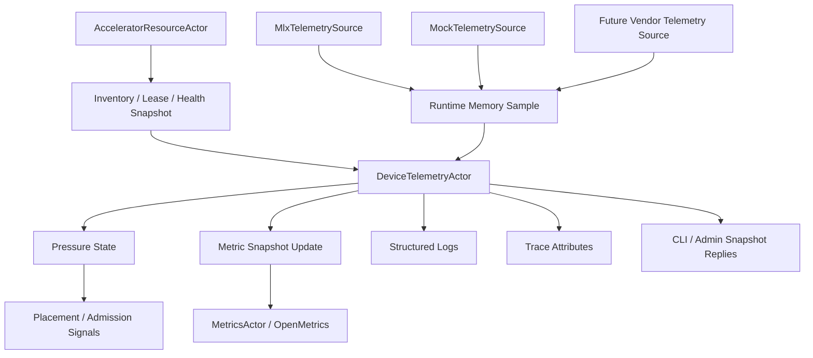

# AI-ACC-002 Accelerator Observability And Telemetry Design

**Status:** Proposed design; implementation not started
**Requirement ID:** AI-ACC-002
**Parent Architecture:** [Distributed AI Model Inference and Training Architecture](distributed-ai-model-inference-training-architecture.md)
**Depends On:** [AI-ACC-001 Accelerator Resource Plane Design](accelerator-resource-plane-design.md)

## 1. Executive Summary

AI-ACC-001 defines the node-local accelerator inventory and lease model.
AI-ACC-002 defines the observability contract for that resource plane: device
health, memory, utilization, pressure, probe freshness, and runtime telemetry
must be exported through bounded metrics, structured logs, traces, and
message-based CLI/admin snapshots.

The first concrete target is macOS on Apple silicon with MLX. That means the
initial memory model is Apple unified memory, not a strict host-memory versus
VRAM split. MLX exposes useful process-level memory telemetry such as active,
peak, and cached memory, and MLX/Metal can report device metadata. HPActor
should normalize those signals into backend-neutral AI device telemetry while
also preserving MLX-specific metrics where operators need to debug MLX runtime
behavior.

This design keeps telemetry out of actor hot paths. Resource and runtime actors
emit low-frequency snapshots or bounded state-change events. A node-local
`DeviceTelemetryActor` validates and coalesces those samples, computes pressure
states, updates the metrics export surface, and serves CLI/admin requests.

## 2. Goals

1. Expose device health, memory, pressure, and utilization signals for CPU,
   mock devices, and MLX/Metal devices.
2. Normalize MLX unified-memory telemetry into the accelerator resource model.
3. Preserve stable low-cardinality OpenMetrics families.
4. Provide CLI/admin snapshots that agree with metrics and logs.
5. Correlate device health and pressure transitions with traces and structured
   logs.
6. Keep sampling, formatting, and vendor calls away from event-loop and
   cooperative scheduler hot paths.
7. Avoid public HPActor API dependencies on MLX, Metal, CUDA, ROCm, exceptions,
   or RTTI.
8. Make unavailable telemetry explicit instead of silently reporting misleading
   zeroes.

## 3. Non-Goals

- Implementing a kernel profiler, Metal capture UI, or GPU debugger.
- Guaranteeing exact GPU compute utilization for MLX in the first milestone.
  If a backend does not expose true compute utilization, HPActor must report the
  metric as unavailable rather than inventing a value.
- Exporting per-request, per-token, per-tensor, or per-tenant device metrics in
  the default path.
- Replacing MLX memory management or vendor health tools.
- Automatically remediating pressure by killing actors or clearing MLX caches.
  This spec emits signals; later policy specs decide remediation.
- Making Prometheus scrape paths call blocking vendor APIs directly.

## 4. Design Approach

Three approaches were considered:

| Approach | Trade-off |
|----------|-----------|
| Emit metrics directly from every AI actor | Simple locally, but creates high-cardinality labels, inconsistent health semantics, and hot-path overhead. |
| Let `MetricsActor` call every backend during `/metrics` scrape | Keeps data close to export, but makes scrapes block on MLX/vendor APIs and couples Prometheus availability to runtime calls. |
| Node-local telemetry actor with coalesced snapshots | Recommended. It keeps source ownership clear, avoids blocking scrapes, and creates one place for cardinality and freshness rules. |

The recommended design adds a node-local `DeviceTelemetryActor` and a small
telemetry data model. `AcceleratorResourceActor` remains the owner of inventory
and leases. Runtime adapters such as `MlxModelRuntime` remain the owner of
backend-specific runtime telemetry. `DeviceTelemetryActor` merges those signals
into an export-ready snapshot.

## 5. Architecture



Components:

- `DeviceTelemetryActor`: node-local owner of current AI device telemetry,
  freshness state, derived pressure state, and CLI/admin snapshots.
- `TelemetrySource`: no-throw interface used by MLX, mock, CPU, and future
  vendor sources.
- `MlxTelemetrySource`: optional source compiled behind `ENABLE_MLX` or
  provided by `MlxProcessRuntime`; reports MLX memory and device metadata.
- `AiMetricSnapshotUpdate`: bounded message from the telemetry actor to metrics
  export code. It is not sent per request or per token.
- `AiDeviceTelemetrySnapshot`: immutable snapshot used by CLI/admin and
  metrics formatting.

## 6. Data Model

### 6.1 Telemetry Identity

Telemetry identity must match AI-ACC-001 device identity.

```cpp
struct DeviceTelemetryKey {
    DeviceId device_id;
    DeviceKind kind;
    DeviceVendor vendor;
    std::string backend;      // "mlx", "mock", "cpu", "cuda", ...
    uint64_t probe_epoch;
};
```

Allowed default metric labels:

- `node`
- `device_id`
- `kind`
- `vendor`
- `backend`

Labels that must not be used by default for device metrics:

- actor id
- request id
- trace id
- tenant id
- prompt text or model input data
- model version with unbounded values
- file paths or artifact URIs

Model, tenant, request, and trace correlation belongs in logs and traces unless
a later quota or SLO design introduces carefully bounded labels.

### 6.2 Health State

AI-ACC-002 exports the `DeviceHealth` state from AI-ACC-001:

- `Unknown`
- `Healthy`
- `Degraded`
- `Unavailable`
- `Lost`

Metrics should expose this as one numeric state gauge and one transition
counter, not as unbounded free-form strings.

```cpp
enum class DeviceHealthCode : uint8_t {
    Unknown = 0,
    Healthy = 1,
    Degraded = 2,
    Unavailable = 3,
    Lost = 4,
};
```

### 6.3 Pressure State

Pressure is derived from health, memory, leases, and source freshness.

```cpp
enum class DevicePressureState : uint8_t {
    Unknown = 0,
    Normal = 1,
    Warm = 2,
    High = 3,
    Critical = 4,
    Stale = 5,
};
```

Initial pressure rules:

- `Stale`: latest telemetry sample is older than `stale_after_ms`
- `Critical`: health is `Lost` or `Unavailable`, or memory pressure is over
  the configured critical threshold
- `High`: memory pressure is over the high threshold
- `Warm`: memory pressure is over the warm threshold
- `Normal`: sample is fresh and below warm threshold
- `Unknown`: no successful sample has been received

Pressure states are advisory signals for placement and admission. They do not
directly revoke leases; lease changes remain owned by `AcceleratorResourceActor`.

### 6.4 Memory Sample

```cpp
struct DeviceMemorySample {
    uint64_t total_bytes;
    uint64_t allocatable_bytes;
    uint64_t reserved_bytes;
    uint64_t active_bytes;
    uint64_t peak_bytes;
    uint64_t cache_bytes;
    uint64_t limit_bytes;
    uint64_t wired_limit_bytes;
    uint64_t kv_cache_bytes;
    bool active_bytes_available;
    bool peak_bytes_available;
    bool cache_bytes_available;
    bool limit_bytes_available;
};
```

Field meanings:

- `total_bytes`: physical or logical memory associated with the device when
  available.
- `allocatable_bytes`: resource-plane admission budget.
- `reserved_bytes`: bytes reserved through `DeviceLease`.
- `active_bytes`: runtime-reported bytes currently used.
- `peak_bytes`: runtime-reported peak since process start or the last reset.
- `cache_bytes`: runtime cache retained for reuse.
- `limit_bytes`: configured or runtime memory limit.
- `wired_limit_bytes`: Apple/MLX wired-memory limit when exposed.
- `kv_cache_bytes`: KV cache reservation or runtime estimate.

Unavailable values keep their `*_available` flag false. Exporters must not
turn unavailable values into zero unless the metric family explicitly documents
zero as meaningful.

### 6.5 Utilization Sample

```cpp
struct DeviceUtilizationSample {
    double memory_pressure_ratio;
    double lease_utilization_ratio;
    double compute_utilization_ratio;
    double stream_utilization_ratio;
    bool compute_utilization_available;
    bool stream_utilization_available;
};
```

Definitions:

- `memory_pressure_ratio`: preferred ratio for admission and alerting.
  For MLX, use `(active_bytes + cache_bytes) / limit_bytes` when limit is
  known; otherwise use the best configured allocatable-memory budget.
- `lease_utilization_ratio`: `reserved_bytes / allocatable_bytes`.
- `compute_utilization_ratio`: true backend-reported compute utilization only.
  If unavailable, do not derive it from leases.
- `stream_utilization_ratio`: runtime stream slot use when available.

The first MLX implementation should prioritize memory pressure and lease
utilization. True GPU compute utilization remains optional until an accurate
source is selected.

### 6.6 Telemetry Snapshot

```cpp
struct AiDeviceTelemetrySnapshot {
    DeviceTelemetryKey key;
    DeviceHealthCode health;
    DevicePressureState pressure;
    DeviceMemorySample memory;
    DeviceUtilizationSample utilization;
    uint64_t sample_timestamp_ns;
    uint64_t source_epoch;
    uint64_t consecutive_sample_errors;
    bool source_available;
};
```

Snapshots are immutable once published. The telemetry actor may keep a small
ring of recent snapshots for CLI inspection and incident timelines.

## 7. MLX Telemetry Model

MLX is the first concrete runtime target. Official MLX APIs currently expose:

- active memory in bytes through `mlx.core.get_active_memory()`
- peak memory in bytes through `mlx.core.get_peak_memory()`
- cache memory in bytes through `mlx.core.get_cache_memory()`
- memory limits through `mlx.core.set_memory_limit()`
- cache clearing through `mlx.core.clear_cache()`
- stream synchronization through `mlx.core.synchronize()`
- Metal device metadata through `mlx.core.metal.device_info()`

MLX/Metal discovery and unified-memory budget rules are defined in
[AI-MLX-002](mlx-device-probe-unified-memory-design.md). MLX array ownership,
readiness, and handle lifetime rules are defined in
[AI-MLX-003](mlx-tensor-handle-design.md).

The MLX telemetry source maps those signals as follows:

| MLX Signal | HPActor Field |
|------------|---------------|
| active memory | `memory.active_bytes` |
| peak memory | `memory.peak_bytes` |
| cache memory | `memory.cache_bytes` |
| configured memory limit | `memory.limit_bytes` |
| configured wired limit when known | `memory.wired_limit_bytes` |
| Metal device info | descriptor metadata and device info labels outside default metrics |

Sampling rules:

- Sampling must not call `mlx.core.synchronize()` by default. Synchronization can
  perturb workloads and should be enabled only for diagnostics.
- Peak reset policy is explicit. The default is process lifetime. Per-model
  peak reset is an opt-in runtime setting.
- `clear_cache()` is an admin operation, not part of regular telemetry
  collection.
- A Python MLX sidecar may report the same telemetry over IPC until native C++
  API coverage is proven sufficient.
- All MLX exceptions or Python sidecar failures are converted to structured
  telemetry source errors before crossing HPActor boundaries.

## 8. Metrics Contract

Metrics use OpenMetrics through the existing `MetricsActor` surface. AI device
telemetry is lower-frequency snapshot data, so it should not be forced through
the existing 32-byte hot-path `MetricEvent` format when values require 64-bit
bytes, explicit availability, or stable labels.

Recommended integration:

1. `DeviceTelemetryActor` receives source snapshots.
2. It validates, coalesces, and computes derived pressure.
3. It sends bounded `AiMetricSnapshotUpdate` messages to `MetricsActor`.
4. `MetricsActor` stores the latest AI device metric families in its registry.
5. `/metrics` serves the latest snapshot without calling MLX or vendor APIs.

Metric families:

| Metric | Type | Labels | Meaning |
|--------|------|--------|---------|
| `hpactor_ai_devices` | Gauge | `node`, `kind`, `vendor`, `backend` | Number of known devices. |
| `hpactor_ai_device_health_state` | Gauge | `node`, `device_id`, `kind`, `vendor`, `backend` | Numeric `DeviceHealthCode`. |
| `hpactor_ai_device_pressure_state` | Gauge | `node`, `device_id`, `kind`, `vendor`, `backend` | Numeric `DevicePressureState`. |
| `hpactor_ai_device_health_transitions_total` | Counter | `node`, `kind`, `vendor`, `backend`, `from`, `to` | Health transitions. |
| `hpactor_ai_device_memory_total_bytes` | Gauge | default device labels | Total memory when known. |
| `hpactor_ai_device_memory_allocatable_bytes` | Gauge | default device labels | Resource-plane admission budget. |
| `hpactor_ai_device_memory_reserved_bytes` | Gauge | default device labels | Bytes reserved by leases. |
| `hpactor_ai_device_memory_active_bytes` | Gauge | default device labels | Runtime active bytes. |
| `hpactor_ai_device_memory_peak_bytes` | Gauge | default device labels | Runtime peak bytes. |
| `hpactor_ai_device_memory_cache_bytes` | Gauge | default device labels | Runtime cache bytes. |
| `hpactor_ai_device_memory_limit_bytes` | Gauge | default device labels | Configured/runtime memory limit. |
| `hpactor_ai_device_memory_pressure_ratio` | Gauge | default device labels | Derived memory pressure ratio. |
| `hpactor_ai_device_lease_utilization_ratio` | Gauge | default device labels | Reserved/allocatable memory ratio. |
| `hpactor_ai_device_compute_utilization_ratio` | Gauge | default device labels plus `source` | True backend compute utilization when available. |
| `hpactor_ai_device_probe_errors_total` | Counter | `node`, `kind`, `vendor`, `backend`, `reason` | Probe or telemetry source failures. |
| `hpactor_ai_device_samples_stale` | Gauge | default device labels | `1` when latest telemetry is stale. |
| `hpactor_ai_device_last_sample_timestamp_seconds` | Gauge | default device labels | Last successful sample time. |
| `hpactor_ai_mlx_active_memory_bytes` | Gauge | `node`, `device_id`, `runtime` | MLX active memory, preserved for MLX debugging. |
| `hpactor_ai_mlx_peak_memory_bytes` | Gauge | `node`, `device_id`, `runtime` | MLX peak memory. |
| `hpactor_ai_mlx_cache_memory_bytes` | Gauge | `node`, `device_id`, `runtime` | MLX cache memory. |

Metric names use singular `device` when they represent one device and plural
`devices` only for inventory counts.

Availability rules:

- If a metric is unavailable for a device, omit that time series for the device
  and increment a source availability/error metric where appropriate.
- Do not export zero for unavailable memory or compute utilization.
- Optional debug metrics may include actor or model labels only when explicitly
  enabled and bounded by config.

Cardinality guardrails:

- Default device labels are limited to node and device identity metadata.
- `reason`, `from`, `to`, and `source` values must be enums.
- `device_id` is node-local and bounded by `max_devices`.
- If `max_devices` is exceeded, telemetry enters degraded mode and exports an
  error counter instead of creating unbounded series.

## 9. Logs, Traces, And Incident Correlation

Structured logs:

- telemetry source started
- telemetry source failed
- telemetry sample rejected
- health transition
- pressure transition
- stale telemetry detected
- telemetry recovered
- metric cardinality guard triggered
- MLX cache clear requested by admin

Log fields:

- `ai.device.id`
- `ai.device.kind`
- `ai.device.vendor`
- `ai.device.backend`
- `ai.device.health`
- `ai.device.pressure`
- `ai.telemetry.source`
- `ai.telemetry.epoch`
- `ai.telemetry.reason`
- `trace_id` when handling a traced admin request

Trace attributes for AI actors:

- `ai.device.id`
- `ai.device.health`
- `ai.device.pressure`
- `ai.device.memory_pressure_ratio`
- `ai.lease.id`
- `ai.runtime.backend`
- `ai.runtime.mlx.active_memory_bytes`
- `ai.runtime.mlx.cache_memory_bytes`

Telemetry sampling itself should not create high-volume spans. Admin actions,
model load, model warmup, lease grant, lease rejection, and health transitions
attach telemetry attributes to existing spans.

## 10. CLI And Admin Surface

CLI/admin reads must use actor messages and immutable snapshots. They must not
read another actor's private memory directly.

Commands:

- `/ai devices`
- `/ai devices --metrics`
- `/ai device <id> show`
- `/ai device <id> metrics`
- `/ai resources pressure`
- `/ai telemetry sources`
- `/ai runtime mlx stats`
- `/ai runtime mlx clear-cache`

`clear-cache` is an explicit admin command. It requires authorization once the
security plane exists and must emit an audit log. It is not run automatically by
the telemetry actor.

Snapshot fields:

- device identity and descriptor
- health and pressure state
- last successful sample time
- sample source and source epoch
- active, peak, cache, limit, reserved, and allocatable bytes
- utilization availability and values
- latest sample error reason, if any

## 11. Configuration

Example:

```toml
[system.ai.telemetry]
enabled = true
sample_interval_ms = 1000
stale_after_ms = 5000
max_devices = 64
emit_health_transition_logs = true
emit_pressure_transition_logs = true
export_mlx_metrics = true
debug_actor_labels = false
debug_model_labels = false

[system.ai.telemetry.pressure]
warm_ratio = 0.70
high_ratio = 0.85
critical_ratio = 0.95

[system.ai.telemetry.mlx]
enabled = true
sample_memory = true
synchronize_before_sample = false
peak_reset_policy = "process"
allow_admin_clear_cache = false
```

Defaults:

- telemetry is enabled when `[system.ai]` and `[system.metrics]` are enabled
- sample interval defaults to one second
- stale threshold defaults to five seconds
- MLX metrics are enabled when `ENABLE_MLX` and `[system.ai.mlx]` are enabled
- debug labels are disabled
- `synchronize_before_sample` is disabled
- admin cache clearing is disabled

Config parsing must follow the existing TOML parser IoC pattern with
self-registering subsystem parsers and public `TomlTableView` interfaces.

## 12. Failure Semantics

| Failure | Runtime Behavior |
|---------|------------------|
| telemetry source unavailable at startup | device telemetry starts with `Unknown` pressure and increments source error counter |
| MLX memory API fails | last good sample remains active until stale threshold; source error is logged and counted |
| sample is older than `stale_after_ms` | pressure becomes `Stale`; placement/admission can avoid the device by policy |
| source reports negative or impossible values | sample is rejected; previous sample remains active |
| compute utilization unavailable | compute utilization metric is omitted; availability is visible through source status |
| metrics actor disabled | telemetry remains available through CLI/admin snapshots |
| metrics ring overflows | existing metrics lost counter reports overflow; telemetry snapshots continue at next update |
| telemetry actor restarts | sources resend latest state; metrics become stale until first successful sample |
| device is lost | health state comes from resource actor; telemetry marks sample stale or unavailable |
| admin clears MLX cache | action is logged/audited; cache memory should drop on a later sample, not synchronously assumed |

## 13. Integration With AI-ACC-001

AI-ACC-001 owns inventory, leases, admission, and device health. AI-ACC-002
owns export and correlation of those signals.

Integration messages:

- `DeviceTelemetrySourceRegistered`
- `DeviceTelemetrySample`
- `DeviceTelemetrySourceError`
- `LeaseTelemetrySnapshot`
- `DeviceHealthTelemetrySnapshot`
- `AiMetricSnapshotUpdate`
- `AiTelemetrySnapshotRequest`
- `AiTelemetrySnapshotReply`

Ownership rules:

- `AcceleratorResourceActor` remains authoritative for `DeviceHealth`.
- `DeviceTelemetryActor` computes pressure state from resource and runtime
  snapshots.
- `MlxModelRuntime` or `MlxProcessRuntime` owns MLX runtime sampling.
- `MetricsActor` owns OpenMetrics formatting and registry export.
- CLI/admin actors request snapshots by message.

## 14. Testing Strategy

Unit tests:

- memory pressure calculations
- pressure state thresholds
- health state numeric mapping
- stale sample detection
- impossible sample rejection
- label cardinality enforcement
- OpenMetrics family names and label sets
- MLX telemetry mapping with a fake source
- availability behavior for missing compute utilization

Integration tests:

- mock resource actor publishes device and lease snapshots
- telemetry actor updates metrics snapshots
- `/metrics` includes AI device health and memory families
- CLI/admin snapshot reads use messages
- telemetry source failure becomes stale pressure
- metrics disabled still leaves CLI/admin telemetry available
- high device count triggers cardinality guard

Stress and reliability tests:

- rapid lease changes while telemetry samples arrive
- repeated source failures and recoveries
- scrape storm while telemetry actor updates snapshots
- long-running MLX mock memory sample soak
- telemetry actor restart and source re-registration

Determinism rules:

- default tests use `MockTelemetrySource`
- MLX-specific tests use mocked MLX APIs unless explicitly gated by
  `ENABLE_MLX_INTEGRATION_TESTS`
- time-sensitive tests use controllable clocks or condition polling

## 15. Acceptance Criteria

AI-ACC-002 is complete when:

- CPU, mock, and MLX-capable configurations expose device health metrics.
- Memory metrics include allocatable, reserved, active, peak, cache, limit, and
  pressure values where available.
- MLX active, peak, and cache memory are normalized into device metrics and
  exported through MLX-specific metrics.
- True compute utilization is exported only when a real source exists; otherwise
  it is clearly unavailable.
- OpenMetrics output uses bounded labels and omits unavailable metric values
  instead of exporting misleading zeroes.
- CLI/admin snapshots show the same device health, memory, pressure, and source
  freshness state as metrics.
- Health and pressure transitions produce structured logs and trace attributes.
- Telemetry sampling does not call blocking MLX/vendor APIs from event-loop or
  cooperative scheduler hot paths.
- No public HPActor headers expose MLX, Metal, CUDA, ROCm, exceptions, or RTTI.
- The design remains source-compatible with existing non-AI actor APIs.

## 16. Open Questions

1. What should be the first accurate compute-utilization source for Apple
   silicon: MLX, Metal performance counters, a sidecar, or no default compute
   utilization in Milestone 1?
2. Should MLX peak memory reset be process-lifetime by default forever, or
   should model load/warmup reset become the default once model lifecycle actors
   exist?
3. Should pressure state feed placement directly in Milestone 1, or should it
   remain operator-only until distributed placement is implemented?
4. Should MLX cache clearing be exposed only through admin CLI, or also through
   a policy-controlled automatic pressure action in a later requirement?
5. Should future vendor telemetry use one generic `TelemetrySource` ABI or
   backend-specific adapters with only normalized snapshots crossing into
   HPActor core?

## 17. External Design Inputs

- [MLX framework documentation](https://ml-explore.github.io/mlx/build/html/index.html)
  for the Apple silicon, unified-memory, lazy-computation, and CPU/GPU device
  model.
- [MLX unified memory](https://ml-explore.github.io/mlx/build/html/usage/unified_memory.html)
  for the first accelerator memory model.
- [MLX memory APIs](https://ml-explore.github.io/mlx/build/html/python/_autosummary/mlx.core.get_active_memory.html)
  for active memory; companion APIs include peak memory, cache memory, memory
  limits, cache clearing, and synchronization.
- [MLX Metal device information](https://ml-explore.github.io/mlx/build/html/python/_autosummary/mlx.core.metal.device_info.html)
  for initial MLX/Metal device metadata.
