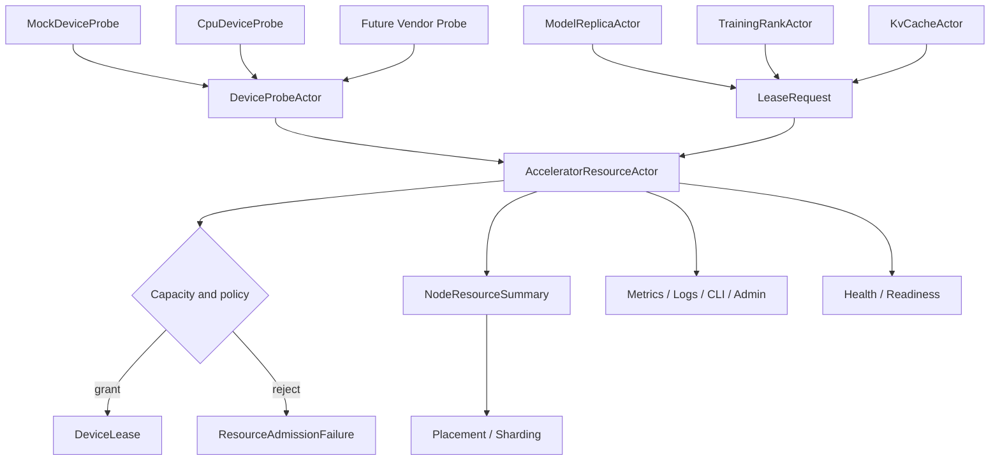

# AI-ACC-001 Accelerator Resource Plane Design

**Status:** Proposed design; implementation not started
**Requirement ID:** AI-ACC-001
**Parent Architecture:** [Distributed AI Model Inference and Training Architecture](distributed-ai-model-inference-training-architecture.md)

## 1. Executive Summary

AI inference and training cannot be placed safely with actor count, CPU thread
count, or mailbox depth alone. Model replicas and training ranks need device
memory, accelerator health, topology locality, pinned host memory, stream slots,
and sometimes exclusive access to a GPU slice. If these resources are not
represented explicitly, the runtime will discover overload late as backend OOM,
device reset, stalled collectives, or opaque model load failures.

This design introduces the accelerator resource plane. The first requirement,
`AI-ACC-001`, adds a node-local resource inventory and lease model. It defines
device descriptors, probe interfaces, a single authoritative
`AcceleratorResourceActor`, resource lease requests, lease lifecycle, failure
semantics, observability, and configuration.

The first implementation should support CPU-only and mock-device probes so the
rest of the AI runtime can be built and tested deterministically without real
GPU hardware. The first real accelerator probe is the MLX/Metal path defined by
[AI-MLX-002](mlx-device-probe-unified-memory-design.md). Vendor probes for
CUDA, ROCm, DCGM, or future devices plug into the same interfaces later.

## 2. Goals

1. Discover local compute devices and expose a stable resource inventory.
2. Reserve bounded device resources before model replicas or training ranks
   allocate backend memory.
3. Represent GPU-like resources without hard-coding one vendor API into HPActor
   core.
4. Provide deterministic CPU-only and mock-device behavior for tests.
5. Integrate resource decisions with placement, readiness, tracing, metrics,
   logging, CLI/admin inspection, and graceful shutdown.
6. Keep resource ledger mutations actor-owned and avoid shared mutable state
   between AI actors.
7. Preserve HPActor's no-exception/no-RTTI public API constraints.

## 3. Non-Goals

- Implementing CUDA, ROCm, Metal, NCCL, or vendor memory allocators in the core
  runtime.
- Guaranteeing that backend allocation can never fail after a lease is granted.
  Leases are conservative admission control, not a replacement for backend
  error handling.
- Scheduling kernels or managing GPU streams directly.
- Migrating live GPU memory between processes or devices.
- Solving cluster-wide placement by itself. This plane provides node-local
  capacity and leases; distributed placement uses this data.
- Providing production DCGM/NVML/ROCm metrics in the first milestone.

## 4. Design Approach

Three approaches were considered:

| Approach | Trade-off |
|----------|-----------|
| Direct backend-owned resource checks | Simple for a single backend, but every model runtime repeats placement logic and failures remain late. |
| Central cluster resource manager first | Useful long-term, but too much control-plane complexity before single-node inference exists. |
| Node-local actor-owned resource ledger | Recommended. Gives deterministic local admission now and feeds future cluster placement. |

The recommended design is a node-local `AcceleratorResourceActor` that owns the
mutable resource ledger. Probe components report device snapshots to it. Model
replicas, training ranks, and future tensor caches request leases before
allocating backend resources. Cluster placement consumes summarized capacity and
pressure from this actor.

## 5. Architecture



Components:

- `AcceleratorResourceActor`: node-local owner of inventory, leases, pressure,
  and device health state.
- `DeviceProbe`: no-throw interface that produces snapshots for one device
  family.
- `DeviceProbeActor`: daemon or polling actor that runs blocking/vendor probe
  calls away from event-loop and cooperative scheduler hot paths.
- `ResourceLedger`: internal capacity accounting table owned only by
  `AcceleratorResourceActor`.
- `DeviceLease`: explicit reservation granted to one actor or job component.
- `NodeResourceSummary`: compact, shareable node capacity summary for placement.

## 6. Data Model

### 6.1 Device Identity

Device identity must be stable enough for logs, leases, and operator
inspection, but not trusted across process restarts without fresh probing.

```cpp
enum class DeviceKind : uint8_t {
    Cpu,
    Gpu,
    Npu,
    Accelerator,
    Mock,
};

enum class DeviceVendor : uint8_t {
    Unknown,
    Nvidia,
    Amd,
    Apple,
    Intel,
    Mock,
};

struct DeviceId {
    uint64_t node_local_id;
    DeviceKind kind;
};
```

`node_local_id` is assigned by the resource actor from a deterministic ordering
of probe results. Vendor-specific identifiers stay in descriptor metadata so
public HPActor APIs do not depend on vendor headers.

Descriptor fields:

- device id
- kind and vendor
- human-readable name
- backend-visible ordinal
- PCI bus id or vendor uuid when available
- parent physical device id for MIG/slice-like partitions
- NUMA node if known
- total memory bytes
- allocatable memory bytes
- compute capability or architecture string
- supported precision flags
- health state
- static labels

### 6.2 Resource Quantities

The resource plane tracks several independent quantities:

- `device_memory_bytes`
- `host_memory_bytes`
- `pinned_host_memory_bytes`
- `compute_units`
- `stream_slots`
- `copy_engine_slots`
- `kv_cache_bytes`
- `batch_slots`
- `exclusive_device`

Only `device_memory_bytes`, `host_memory_bytes`, `compute_units`, and
`exclusive_device` are required in the first implementation. The other fields
exist so later inference and training specs do not need a new lease contract.

### 6.3 Device Health

```cpp
enum class DeviceHealth : uint8_t {
    Unknown,
    Healthy,
    Degraded,
    Unavailable,
    Lost,
};
```

Health meanings:

- `Unknown`: probe has not completed or cannot read health.
- `Healthy`: device can receive new leases.
- `Degraded`: existing leases may continue by policy; new leases are avoided.
- `Unavailable`: no new leases; existing owners are asked to drain.
- `Lost`: existing leases are revoked and owners are notified.

### 6.4 Lease Request

```cpp
struct DeviceLeaseRequest {
    ActorAddress requester;
    std::string workload_id;
    std::string model_or_job;
    ResourceQuantities requested;
    DeviceSelector selector;
    std::chrono::milliseconds ttl;
    uint32_t priority;
    bool allow_degraded_device;
    bool exclusive;
};
```

Selectors support:

- any device of a kind
- exact device id
- vendor
- minimum memory
- labels
- NUMA preference
- topology group preference
- allow CPU fallback

### 6.5 Lease Record

```cpp
enum class LeaseState : uint8_t {
    Pending,
    Granted,
    Active,
    Releasing,
    Released,
    Revoked,
    Expired,
};

struct DeviceLease {
    uint64_t lease_id;
    DeviceId device_id;
    ActorAddress owner;
    std::string workload_id;
    ResourceQuantities reserved;
    LeaseState state;
    uint64_t granted_epoch;
    int64_t expires_at_ns;
};
```

The lease id is node-local and monotonically increasing. A future cluster
placement layer can wrap it with node endpoint and placement epoch.

## 7. Probe Model

### 7.1 Probe Interface

Probe interfaces must not expose vendor SDK types in public HPActor headers.

```cpp
class DeviceProbe {
  public:
    virtual ~DeviceProbe() = default;
    virtual std::string_view name() const noexcept = 0;
    virtual result<DeviceSnapshot> snapshot() noexcept = 0;
};
```

First probes:

- `CpuDeviceProbe`: reports CPU capacity and host memory estimates.
- `MockDeviceProbe`: configurable fake devices for deterministic tests.
- `MlxDeviceProbe`: optional first real accelerator probe for macOS Apple
  silicon, defined by [AI-MLX-002](mlx-device-probe-unified-memory-design.md).

Future optional probes:

- `CudaDeviceProbe`
- `RocmDeviceProbe`
- `DcgmHealthProbe`

Vendor probes should be compiled only when their dependencies are enabled.
Their translation units may include vendor headers, but shared public types
remain HPActor-owned.

### 7.2 Probe Execution

Some vendor probe calls can block, allocate, or hold driver locks. They must not
run on the event loop or cooperative actor scheduler hot path.

Recommended execution:

- `DeviceProbeActor` extends `PollingActor` or `DaemonActor`.
- It runs probes at startup and at a configured interval.
- It sends `DeviceSnapshotUpdate` control messages to
  `AcceleratorResourceActor`.
- Snapshot updates are idempotent and carry a probe epoch.

### 7.3 Snapshot Reconciliation

The resource actor reconciles probe snapshots:

1. Match known devices by stable metadata when possible.
2. Add newly discovered devices as unavailable until validated.
3. Update capacity and health for known devices.
4. Mark missing devices `Lost` only after configured grace periods.
5. Recalculate available capacity after preserving current leases.
6. Emit events for health, capacity, and topology changes.

## 8. Lease Lifecycle

### 8.1 Grant Flow

1. Requester sends `DeviceLeaseRequest`.
2. `AcceleratorResourceActor` checks readiness and selector match.
3. It filters devices by health and policy.
4. It checks available quantities against current reservations.
5. It reserves resources and returns `DeviceLeaseGranted`.
6. Requester loads model or starts worker.
7. Requester sends `DeviceLeaseActivated` after backend allocation succeeds.

Activation is explicit because a lease may be granted but backend load can still
fail. If activation fails, the requester releases the lease with a failure
reason.

### 8.2 Renewal and TTL

Leases have a TTL to prevent leaked reservations after actor death or lost
control messages.

- Long-running owners renew periodically.
- Expired leases transition to `Expired` and release capacity.
- Owners that renew an expired lease receive `LeaseExpired`.
- TTL can be disabled only for test-only configs or system actors.

### 8.3 Release Flow

Owners release leases when models unload, training ranks stop, or cache
reservations shrink.

Release is best-effort and idempotent:

- unknown lease id returns `LeaseNotFound`
- already released lease returns success with current state
- releasing actor does not need to block shutdown indefinitely

### 8.4 Revocation Flow

The resource actor may revoke leases when:

- device is lost
- health becomes unavailable and policy requires drain
- admin forces drain
- node shutdown starts
- future preemption policy selects a lower-priority lease

Revocation flow:

1. Lease moves to `Revoked`.
2. Owner receives `DeviceLeaseRevoked`.
3. Owner transitions to drain, failed, or recovery path.
4. Routes and placement entries are invalidated by downstream AI actors.
5. Capacity is released after owner acknowledges or timeout expires.

Preemption is not required for the first implementation. The state exists so
the protocol does not need to be replaced later.

## 9. Admission Policy

Admission decisions should be deterministic and explainable.

Initial policies:

- `FirstFit`: first healthy matching device with enough capacity.
- `MostFreeMemory`: healthy matching device with the most free memory.
- `ExactDevice`: only grant if selector names a specific device.
- `CpuFallback`: allow CPU when accelerator selector permits fallback.

Policy inputs:

- device health
- available resource quantities
- exclusive lease state
- selector constraints
- workload priority
- model or job labels
- drain/shutdown state

Rejection reasons:

- `ResourceActorNotReady`
- `NoMatchingDevice`
- `DeviceUnhealthy`
- `InsufficientDeviceMemory`
- `InsufficientPinnedMemory`
- `InsufficientComputeUnits`
- `ExclusiveLeaseConflict`
- `NodeDraining`
- `RejectedByPolicy`

Every rejection is observable and maps to a stable reason code.

## 10. Integration with Existing HPActor Subsystems

### 10.1 Actor Lifecycle and Shutdown

`AcceleratorResourceActor` is a system actor and drains after user AI actors.
During shutdown:

1. Ingress stops admitting new AI requests.
2. Model and training actors release leases while draining.
3. Resource actor revokes remaining leases after timeout.
4. Probe actors stop last or with the resource actor.

### 10.2 Mailbox and Backpressure

Lease requests use bounded mailboxes like all actor messages. If the resource
actor mailbox is under pressure, callers receive normal backpressure outcomes.
High-frequency metrics updates must be sampled or coalesced before reaching the
resource actor.

### 10.3 Placement and Sharding

`NodeResourceSummary` feeds future placement:

- healthy device count by kind
- allocatable and free memory by device kind
- device labels
- topology groups
- pressure state
- current lease count

The summary can be included in gossip metadata or queried through admin APIs.
The first implementation can keep it local.

### 10.4 Metrics, Logs, and Traces

Lease grant/reject/release/revoke operations emit structured logs and metrics.
Inference and training spans should include lease id and device id when policy
allows.

The detailed device health, memory, pressure, utilization, and MLX telemetry
export contract is defined by
[AI-ACC-002](accelerator-observability-telemetry-design.md).

### 10.5 Config Parser IoC

AI resource config must live behind a self-registering TOML subsystem parser.
Public parser interfaces must continue to use `TomlTableView`, not `toml++`
types.

## 11. Configuration

Example:

```toml
[system.ai.accelerators]
enabled = true
probe_interval_ms = 1000
lease_ttl_ms = 30000
admission_policy = "most_free_memory"
allow_cpu_fallback = true
missing_device_grace_ms = 5000

[[system.ai.accelerators.mock_device]]
id = "mock-gpu-0"
kind = "gpu"
vendor = "mock"
name = "Mock GPU 0"
memory_mb = 24576
compute_units = 100
labels = { zone = "local", precision = "fp16,bf16" }

[[system.ai.accelerators.mock_device]]
id = "mock-gpu-1"
kind = "gpu"
vendor = "mock"
name = "Mock GPU 1"
memory_mb = 24576
compute_units = 100
labels = { zone = "local", precision = "fp16,bf16" }
```

Defaults:

- disabled unless `[system.ai]` or `[system.ai.accelerators]` enables it
- CPU probe enabled when AI is enabled
- mock devices only enabled when explicitly configured
- lease TTL defaults to 30 seconds
- admission policy defaults to `MostFreeMemory`

## 12. Observability

Metrics:

- `hpactor_ai_devices_total`
- `hpactor_ai_device_health`
- `hpactor_ai_device_memory_bytes`
- `hpactor_ai_device_memory_reserved_bytes`
- `hpactor_ai_device_compute_units`
- `hpactor_ai_device_compute_reserved_units`
- `hpactor_ai_device_leases`
- `hpactor_ai_device_lease_requests_total`
- `hpactor_ai_device_lease_rejections_total`
- `hpactor_ai_device_lease_revocations_total`
- `hpactor_ai_device_probe_errors_total`

CLI/Admin:

- `/ai devices`
- `/ai device <id> show`
- `/ai leases`
- `/ai lease <id> show`
- `/ai resources summary`
- `/ai device <id> drain`

Logs:

- probe startup and failure
- device discovered
- device health transition
- lease granted
- lease rejected with reason
- lease released
- lease revoked
- capacity reconciliation conflict

Trace attributes:

- `ai.device.id`
- `ai.device.kind`
- `ai.device.vendor`
- `ai.lease.id`
- `ai.lease.rejection_reason`
- `ai.resource.device_memory_bytes`

## 13. Failure Semantics

| Failure | Runtime Behavior |
|---------|------------------|
| probe fails at startup | resource actor starts with CPU-only or empty inventory based on config |
| probe update fails | previous snapshot remains active; error metric increments |
| device disappears once | mark degraded or unavailable during grace period |
| device remains missing | mark lost, revoke leases, notify owners |
| backend allocation fails after lease | owner releases lease with failure reason; resource actor records failed activation |
| owner actor dies | lease expires or is released when lifecycle/down notification arrives |
| resource actor restarts | leases are cleared; owners must reacquire before serving |
| node shutdown starts | new leases rejected; existing leases drain or revoke by timeout |

## 14. Testing Strategy

Unit tests:

- device descriptor normalization
- mock probe snapshot generation
- selector matching
- admission policy decisions
- lease lifecycle transitions
- TTL expiry
- snapshot reconciliation
- rejection reason mapping

Integration tests:

- resource actor starts with mock devices
- model-like test actor acquires and releases a lease
- lease rejection under memory exhaustion
- device health transition revokes active lease
- shutdown rejects new leases and releases existing leases
- CLI/admin snapshot reads do not access actor memory unsafely

Stress and reliability tests:

- concurrent lease request storm
- repeated probe updates while leases are active
- owner death with un-released leases
- device lost during model load
- long-running lease renewal soak

Determinism rules:

- tests use `MockDeviceProbe`
- tests avoid timing assumptions by driving TTL with controllable clock where
  possible
- scheduler-sensitive tests use paused workers or condition polling

## 15. Acceptance Criteria

AI-ACC-001 is complete when:

- A node-local resource actor can report CPU and mock accelerator inventory.
- Model or training test actors can request, activate, renew, and release
  leases.
- Lease admission enforces at least device memory, compute units, and exclusive
  access.
- Lease rejections use stable structured reason codes.
- Device health changes can mark devices unavailable and revoke leases.
- Resource summaries are exposed through metrics and CLI/admin snapshots.
- Configuration uses a self-registering parser and does not expose `toml++` in
  public headers.
- The design remains source-compatible with existing non-AI actor APIs.

## 16. Open Questions

1. After MLX/Metal, should the next real vendor probe be CUDA/NVML, ROCm, or an
   external process probe to avoid linking vendor SDKs into `hpactor_lib`?
2. Should lease state be durable across process restart, or should all AI owners
   always reacquire after restart?
3. Should `compute_units` be user-configured weights, measured capacity, or
   vendor-reported multiprocessor counts in the first non-mock implementation?
4. Should high-priority inference be allowed to preempt training leases, or
   should preemption wait until the training orchestration plane is designed?
