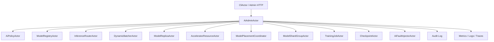

# AI-OPS-001 AI Admin And CLI Operations Design

**Status:** Proposed design; implementation not started
**Requirement ID:** AI-OPS-001
**Parent Architecture:** [Distributed AI Model Inference and Training Architecture](distributed-ai-model-inference-training-architecture.md)
**Depends On:** [Operations and SRE Architecture Design](../production/operations-sre-design.md), [AI-OBS-001](ai-observability-request-token-metrics-design.md), [AI-SEC-001](ai-tenant-model-authorization-design.md)
**Related Requirements:** [AI-ACC-001](accelerator-resource-plane-design.md), [AI-ACC-002](accelerator-observability-telemetry-design.md), [AI-MOD-001](model-registry-artifact-metadata-design.md), [AI-INF-001](model-replica-lifecycle-design.md), [AI-INF-002](dynamic-batcher-cancellation-design.md), [AI-INF-003](streaming-token-response-design.md), [AI-DIST-001](model-placement-coordinator-design.md), [AI-DIST-002](model-shard-group-readiness-stale-routes-design.md), [AI-DIST-MLX-001](mlx-distributed-rendezvous-adapter-design.md), [AI-TRN-001](training-job-worker-group-lifecycle-design.md), [AI-TRN-002](training-rank-rendezvous-checkpoint-design.md), [AI-TST-001](ai-fault-injection-chaos-testing-design.md)

## 1. Executive Summary

AI-OPS-001 defines the AI-specific operations surface for HPActor. The existing
CLI and production operations plane already establish important rules:
inspection must use actor messages, mutating admin actions require
authorization and audit, and operational data should be returned as bounded
snapshots rather than unsafe memory reads.

This requirement applies those rules to AI workloads. Operators need to inspect
models, replicas, devices, routes, batchers, streams, MLX runtime state,
distributed shard groups, training jobs, ranks, checkpoints, tenant policy
decisions, and fault-injection state. They also need safe mutating commands for
drain, unload, rollout, cancel, checkpoint, cache clear, and test-only fault
injection.

## 2. Goals

1. Define AI CLI command groups and matching admin API resources.
2. Standardize bounded snapshot request/reply messages for AI actors.
3. Define safe mutation semantics: authorize, dry-run where useful, audit, then
   execute through actor messages.
4. Provide incident timeline queries for one AI request, model replica,
   training job, rank, or checkpoint.
5. Keep prompt, completion, dataset, checkpoint, hostfile, and artifact secrets
   redacted by default.
6. Support both human-readable CLI output and scriptable JSON/tabular output.
7. Expose MLX-first runtime and device diagnostics without making MLX required
   for non-AI builds.
8. Keep command implementation aligned with existing `CliActor`,
   `CommandNode`, and output formatter patterns.

## 3. Non-Goals

- Building a hosted dashboard or web console.
- Letting admin commands bypass AI-SEC-001 policy.
- Reading actor internals or worker process memory directly.
- Exposing raw prompts, completions, tensors, checkpoint bytes, credentials, or
  full process environments by default.
- Implementing autoscaling decisions in this requirement.
- Replacing Prometheus, traces, logs, or external incident tooling.

## 4. Design Approach

Three approaches were considered:

| Approach | Trade-off |
|----------|-----------|
| Add ad hoc commands to every AI actor | Easy early, but command behavior, auth, audit, and output formats drift. |
| Expose only metrics and logs | Safe, but operators cannot perform bounded control actions or inspect current state. |
| Add an AI admin facade over actor-owned snapshots and mutations | Recommended. It centralizes command shape while preserving actor ownership. |

The recommended design adds an `AiAdminActor` facade. CLI and HTTP admin
resources talk to this facade, and the facade sends typed request messages to
the underlying AI actors. The facade does not own model or training state.

## 5. Architecture



Primary components:

- `AiAdminActor`: facade for AI inspection and safe mutation.
- `AiAdminRequest`: typed command request with identity, scope, filters, and
  output bounds.
- `AiAdminSnapshot`: immutable response envelope with freshness, pagination,
  redaction, and partial-data flags.
- `AiAdminMutation`: structured mutation request with dry-run support.
- `AiIncidentQuery`: query by request id, trace id, model, replica, job, rank,
  checkpoint, or time window.

## 6. Admin Contract

```cpp
enum class AiAdminAction : uint16_t {
    ListModels,
    ShowModel,
    ListReplicas,
    DrainReplica,
    UnloadReplica,
    ListDevices,
    ClearMlxCache,
    ListRequests,
    CancelRequest,
    ListPlacements,
    ReplanPlacement,
    ListShardGroups,
    ListTrainingJobs,
    ShowTrainingJob,
    PauseTrainingJob,
    ResumeTrainingJob,
    CancelTrainingJob,
    RequestCheckpoint,
    ListCheckpoints,
    RestoreCheckpoint,
    ListFaultScenarios,
    ArmFaultScenario,
};

struct AiAdminRequest {
    AiAdminAction action;
    AiIdentityContext identity;
    TraceContext trace;
    AiAdminFilter filter;
    uint32_t limit;
    std::string page_token;
    bool dry_run;
};
```

Rules:

- Every request has a bounded `limit`.
- Every response declares whether it is complete, partial, stale, or redacted.
- Mutations go through AI-SEC-001 authorization before the underlying actor
  receives the command.
- Mutations emit audit records whether they succeed or fail.
- Dry-run returns planned effects and policy decision without changing state.

## 7. Snapshot Envelope

```cpp
enum class AiSnapshotFreshness : uint8_t {
    Fresh,
    Cached,
    Partial,
    Stale,
};

struct AiAdminSnapshot {
    AiAdminAction action;
    AiSnapshotFreshness freshness;
    uint64_t generated_at_ns;
    bool redacted;
    bool truncated;
    std::string next_page_token;
    std::vector<AiSnapshotRecord> records;
};
```

Snapshot rules:

- snapshots are immutable copies created by owning actors
- snapshot requests must not block event-loop or cooperative scheduler paths
- large values use summaries and handles
- raw tensors, prompts, completions, dataset rows, hostfile secrets, and
  checkpoint bytes are never included

## 8. CLI Command Catalog

Model and artifact commands:

| Command | Purpose |
|---------|---------|
| `/ai models` | list registered models and routeable versions |
| `/ai model <name> show` | show metadata, versions, rollout state |
| `/ai model <name> replicas` | list replicas and lifecycle states |
| `/ai model <name> rollout` | inspect rollout or canary state |
| `/ai artifacts` | list bounded artifact cache snapshot |

Inference commands:

| Command | Purpose |
|---------|---------|
| `/ai requests --active` | list active or recently failed requests |
| `/ai request <id> show` | show redacted request timeline |
| `/ai request <id> cancel` | cancel own or admin-authorized request |
| `/ai batchers` | show queues, limits, and pressure |
| `/ai streams` | show active streams and cancellation state |

Device and runtime commands:

| Command | Purpose |
|---------|---------|
| `/ai devices` | list devices, leases, pressure, and health |
| `/ai device <id> show` | show one device and lease summary |
| `/ai runtime` | list runtime plugins and health |
| `/ai runtime mlx stats` | show MLX memory, cache, and sync stats |
| `/ai runtime mlx clear-cache` | authorized cache-clear command |

Distributed commands:

| Command | Purpose |
|---------|---------|
| `/ai placements` | list deployment placements and epochs |
| `/ai placement <model> show` | show placement plan summary |
| `/ai shards` | list shard groups and readiness |
| `/ai shard <id> show` | show shard membership and stale-route state |
| `/ai mlx distributed backends` | show MLX distributed backend capability |
| `/ai mlx rendezvous <id> show` | show MLX rendezvous diagnostics |

Training commands:

| Command | Purpose |
|---------|---------|
| `/ai training jobs` | list training jobs |
| `/ai training job <id> show` | show job state, group attempt, progress |
| `/ai training job <id> ranks` | show rank readiness and failure state |
| `/ai training job <id> pause` | authorized pause |
| `/ai training job <id> resume` | authorized resume |
| `/ai training job <id> cancel` | authorized cancel |
| `/ai checkpoint <job_id> list` | list committed and failed checkpoints |
| `/ai checkpoint <job_id> create` | request checkpoint barrier |
| `/ai checkpoint <job_id> restore <checkpoint_id>` | authorized restore |

Testing commands:

| Command | Purpose |
|---------|---------|
| `/ai fault scenarios` | list configured test-only fault scenarios |
| `/ai fault scenario <name> dry-run` | show injection plan |
| `/ai fault scenario <name> arm` | authorized test-only activation |
| `/ai fault scenario <name> disarm` | stop active scenario |

## 9. Admin API Resources

The admin API should mirror CLI semantics with scriptable resources:

- `/admin/ai/models`
- `/admin/ai/models/{name}`
- `/admin/ai/replicas`
- `/admin/ai/devices`
- `/admin/ai/runtime`
- `/admin/ai/runtime/mlx`
- `/admin/ai/requests`
- `/admin/ai/placements`
- `/admin/ai/shards`
- `/admin/ai/training/jobs`
- `/admin/ai/training/jobs/{id}`
- `/admin/ai/training/jobs/{id}/checkpoints`
- `/admin/ai/incidents`
- `/admin/ai/faults`

HTTP admin requests should use the same internal `AiAdminRequest` messages as
CLI commands. This avoids two behavior paths.

## 10. Safe Mutation Rules

Mutation flow:

1. Parse command and normalize identifiers.
2. Build `AiAdminMutation` with identity and trace context.
3. Authorize through AI-SEC-001.
4. If `dry_run`, return planned target actors and expected effects.
5. Send bounded actor command to owning actor.
6. Wait for structured acknowledgement or timeout.
7. Emit audit event with outcome.

Mutation classes:

- soft control: pause, drain, checkpoint, cancel own request
- hard control: force-stop, unload, restore, replan, cache clear
- test-only control: arm or disarm fault scenario

Hard control actions should require stricter role policy and should be visibly
audited.

## 11. Incident Timeline

`AiIncidentQuery` supports:

- request id
- trace id
- model name/version
- replica id
- placement epoch
- shard group id
- training job id
- rank id
- checkpoint id
- tenant hash when policy allows
- time window

Timeline event sources:

- AI telemetry events
- actor lifecycle transitions
- request rejection and cancellation
- model load/unload/warmup
- device lease and pressure transitions
- placement and route invalidation
- training job and rank events
- checkpoint and restore events
- security decisions
- admin mutations
- fault injection events

The timeline is diagnostic, not a durable audit database. Audit ownership stays
with the production security and logging planes.

## 12. Security And Redaction

Default redaction:

- prompt text and completion text hidden
- tenant id hashed or classed unless policy allows raw display
- artifact URIs redacted to ids
- dataset paths hidden
- checkpoint paths hidden
- hostfiles and process environments hidden
- tensor previews disabled unless explicitly authorized

Authorization examples:

- user may inspect own request but not another tenant's request
- ai-reader may list models but not unload replicas
- ai-operator may drain a replica but not restore training checkpoints
- platform-admin may clear MLX cache and force-stop jobs
- test-operator may arm fault scenarios only in test mode

## 13. Observability

Metrics:

- `hpactor_ai_admin_requests_total`
- `hpactor_ai_admin_request_duration_seconds`
- `hpactor_ai_admin_mutations_total`
- `hpactor_ai_admin_denials_total`
- `hpactor_ai_admin_snapshot_truncated_total`

Trace spans:

- `ai.admin.request`
- `ai.admin.authorize`
- `ai.admin.snapshot`
- `ai.admin.mutate`
- `ai.admin.incident_query`

Structured logs:

- admin request denied
- admin mutation started
- admin mutation completed or failed
- snapshot truncated
- incident query failed
- redaction policy applied

## 14. Configuration

Example:

```toml
[system.ai.admin]
enabled = true
max_snapshot_records = 256
snapshot_timeout_ms = 2000
incident_timeline_records = 1024
allow_mutations = true
require_dry_run_for_force = true
redact_raw_tenant = true
redact_artifact_paths = true

[system.ai.admin.mlx]
allow_clear_cache = false

[system.ai.admin.faults]
enabled = false
```

CLI registration should use existing trie-based command registration. Admin
parsing should follow the subsystem-owned TOML parser pattern.

## 15. Testing Strategy

Deterministic tests:

- each command maps to the expected `AiAdminAction`
- bounded `limit` is enforced
- snapshot truncation returns `next_page_token`
- prompt, completion, dataset path, artifact URI, and checkpoint path are
  redacted by default
- denied mutation does not reach target actor
- dry-run mutation does not change state
- successful mutation emits audit record
- incident query merges events by request id or training job id

Integration tests:

- CLI lists mock models, replicas, devices, and batchers
- CLI cancels a mock request through actor message path
- CLI pauses and cancels a mock training job
- admin API and CLI produce equivalent snapshots for the same query
- MLX stats command degrades gracefully when MLX support is disabled

Security tests:

- user cannot inspect another tenant's request by default
- non-admin cannot unload model or restore checkpoint
- test-only fault commands fail when fault plane is disabled

## 16. Acceptance Criteria

AI-OPS-001 is ready for implementation when:

- CLI command groups and admin resources are defined
- all AI snapshots use actor messages and immutable copies
- every mutation is authorized and audited
- dry-run exists for high-risk mutations
- redaction rules are explicit and testable
- incident timeline can answer request, model, device, placement, training, and
  checkpoint questions
- MLX commands are optional and degrade gracefully when MLX is not built

## 17. Open Questions

1. Should `AiAdminActor` be one facade actor or several subsystem facades under
   one CLI namespace?
2. Should admin HTTP be shipped in the runtime or only exposed through existing
   gateway examples at first?
3. Which AI mutations should require explicit two-step confirmation in the CLI
   rather than only authorization?
4. Should incident timeline data be persisted, or remain bounded in memory
   until a durable audit/event store exists?
