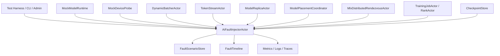

# AI-TST-001 AI Fault Injection And Chaos Test Harness Design

**Status:** Proposed design; implementation not started
**Requirement ID:** AI-TST-001
**Parent Architecture:** [Distributed AI Model Inference and Training Architecture](distributed-ai-model-inference-training-architecture.md)
**Depends On:** [Chaos and Reliability Testing Architecture Design](../production/chaos-reliability-testing-design.md), [AI-RUN-002](mock-model-runtime-design.md), [AI-OBS-001](ai-observability-request-token-metrics-design.md), [AI-OPS-001](ai-admin-cli-operations-design.md), [AI-SEC-001](ai-tenant-model-authorization-design.md)
**Related Requirements:** [AI-ACC-001](accelerator-resource-plane-design.md), [AI-ACC-002](accelerator-observability-telemetry-design.md), [AI-INF-001](model-replica-lifecycle-design.md), [AI-INF-002](dynamic-batcher-cancellation-design.md), [AI-INF-003](streaming-token-response-design.md), [AI-DIST-001](model-placement-coordinator-design.md), [AI-DIST-002](model-shard-group-readiness-stale-routes-design.md), [AI-DIST-MLX-001](mlx-distributed-rendezvous-adapter-design.md), [AI-TRN-001](training-job-worker-group-lifecycle-design.md), [AI-TRN-002](training-rank-rendezvous-checkpoint-design.md)

## 1. Executive Summary

AI-TST-001 extends HPActor's production reliability test strategy with
AI-specific system tests, deterministic fault injection, and chaos scenarios.
AI workloads add failure modes that ordinary actor tests do not cover: model
load failure, MLX runtime error, device pressure, batcher saturation, streaming
cancellation races, artifact checksum mismatch, stale placement epochs,
distributed rendezvous timeout, rank failure, checkpoint corruption, and
restore failure.

This requirement defines a test harness extension that uses mock runtimes,
mock devices, mock checkpoint stores, deterministic seeds, and actor-owned
fault policies. The goal is high-quality system tests, not more isolated unit
tests. Fast deterministic scenarios should run in CI. Longer chaos and soak
scenarios should run in nightly or release lanes.

## 2. Goals

1. Define AI fault injection points across runtime, model lifecycle, device,
   batcher, stream, placement, distributed rendezvous, training, checkpoint,
   security, and admin surfaces.
2. Make fault injection deterministic and reproducible from saved seeds.
3. Provide scenario definitions that can run with `MockModelRuntime`,
   mock training workers, mock devices, and mock checkpoint stores.
4. Support test-only admin/CLI activation through AI-OPS-001.
5. Record fault timelines, metrics, logs, traces, and final assertions.
6. Separate fast CI system tests from long chaos, soak, sanitizer, and
   hardware-gated MLX tests.
7. Keep fault hooks disabled by default in production builds or runtime config.
8. Preserve the rule that fault injection must not bypass authorization or
   audit for mutating admin actions.

## 3. Non-Goals

- Running destructive chaos scenarios in every local build.
- Replacing focused unit tests for data structures and parsers.
- Depending on Apple GPU hardware, multiple machines, or MLX availability for
  ordinary CI.
- Simulating real model quality or kernel performance.
- Injecting faults by reading or mutating private actor memory.
- Providing cloud-provider-specific chaos automation.

## 4. Design Approach

Three approaches were considered:

| Approach | Trade-off |
|----------|-----------|
| Add fault flags directly to AI actors | Quick, but hard to reproduce and risky to leave enabled. |
| Use only external process killing and network partition tools | Useful for chaos, but misses deterministic actor-level edge cases. |
| Add a test-only AI fault controller with subsystem-owned injection points | Recommended. It gives deterministic CI coverage and can drive larger chaos scenarios. |

The recommended design adds `AiFaultInjectorActor` and a small set of explicit
fault hook interfaces. Subsystems opt into fault points at safe boundaries such
as runtime ABI calls, lease decisions, queue admission, route lookup, rank
readiness, and checkpoint store operations.

## 5. Architecture



Primary components:

- `AiFaultInjectorActor`: owns active scenarios, seeds, hook decisions, and
  fault timeline.
- `AiFaultHook`: no-throw query interface used by AI subsystems at explicit
  injection points.
- `FaultScenario`: deterministic scenario definition.
- `FaultTimeline`: ordered record of planned and fired faults.
- `MockDeviceProbe`: deterministic device health and pressure changes.
- `MockCheckpointStore`: deterministic checkpoint write, validate, commit, and
  load failures.
- `AiSystemTestHarness`: multi-actor system harness for end-to-end scenarios.

## 6. Fault Scenario Model

```cpp
enum class AiFaultKind : uint16_t {
    ModelLoadFailure,
    ModelWarmupFailure,
    RuntimeCrash,
    RuntimeTimeout,
    MlxExecutionFailure,
    DevicePressure,
    DeviceLost,
    BatcherQueueFull,
    StreamCancelRace,
    ArtifactChecksumMismatch,
    PlacementEpochStale,
    ShardReadinessTimeout,
    RendezvousBackendUnavailable,
    RankLaunchFailure,
    RankRuntimeFailure,
    CheckpointWriteFailure,
    CheckpointChecksumMismatch,
    CheckpointStoreUnavailable,
    RestoreFailure,
    PolicyDeny,
    AdminMutationTimeout,
};

struct AiFaultRule {
    AiFaultKind kind;
    std::string target_selector;
    uint64_t trigger_after_count;
    uint64_t trigger_at_step;
    uint64_t seed;
    uint32_t max_fires;
    std::chrono::milliseconds duration;
};

struct AiFaultScenario {
    std::string name;
    uint64_t seed;
    std::vector<AiFaultRule> rules;
    bool deterministic_order;
    bool requires_test_mode;
};
```

Target selectors are bounded identifiers such as model name, runtime name,
replica id, device id, training job id, rank id, checkpoint id, or subsystem
name. They must not include prompt text, dataset rows, raw paths, or secrets.

## 7. Injection Points

| Plane | Injection point | Example expected behavior |
|-------|-----------------|---------------------------|
| model registry | artifact metadata invalid | model version rejected before load |
| artifact cache | checksum mismatch | artifact state failed; old version remains serving |
| runtime ABI | load, warmup, infer, stream, cancel, stats, unload | replica enters structured failure or drains |
| MLX runtime | execution/sync failure | runtime error mapped without crashing HPActor |
| device plane | pressure, stale telemetry, lost device | leases rejected, revoked, or drained |
| batcher | queue full or dispatch delay | structured overload and retry-after |
| stream | cancellation race or sink failure | stream closes once and releases slots |
| placement | stale epoch or invalid route | request retries or returns stale route reason |
| shard group | readiness timeout | route not published and failure visible |
| rendezvous | backend unavailable or rank duplicate | group fails closed |
| training | rank launch or runtime failure | whole worker group restart by policy |
| checkpoint | write, validate, commit, load failure | manifest not committed or restore fails |
| security | policy deny or policy unavailable | fail closed in enforce mode |
| admin | mutation timeout | audit failure and no hidden state change |

Hooks should be placed at public subsystem boundaries, not inside lock-free
queues or allocator internals unless the production chaos framework already
provides a safe hook.

## 8. System Test Categories

Fast CI system tests:

- model load failure keeps previous model serving
- runtime crash fails one replica and invalidates route
- batcher queue saturation rejects with structured reason
- stream cancellation releases request and KV/batch slots
- device pressure denies new model load
- stale placement epoch is detected
- mock training rank fails and whole group restarts
- checkpoint write failure keeps previous checkpoint selected
- admin mutation denial does not reach target actor

Nightly chaos tests:

- random runtime crashes under sustained streaming load
- device health flaps during model rollout
- distributed shard readiness timeout during route publication
- rank failure during checkpoint barrier
- checkpoint store unavailable during recovery
- mixed inference and training load under bounded device leases

Soak tests:

- long streaming request churn with cancellation
- repeated model load/unload and MLX cache clear in mock mode
- checkpoint retention under many training attempts
- placement epoch churn while requests continue
- memory and telemetry trend recording over hours

Hardware-gated MLX tests:

- MLX runtime unavailable or backend unavailable maps to structured errors
- MLX sidecar process crash during stream or training
- MLX distributed ring readiness with local test ranks when available
- MLX memory pressure telemetry changes are reflected in snapshots

## 9. Reproducibility Contract

Every chaos scenario result must record:

- scenario name
- global seed
- ordered fault rules
- hook firings with timestamp and logical step
- actor ids or subsystem targets
- trace ids when present
- final assertions
- relevant config digest

Re-run contract:

- the same seed and deterministic scenario should produce the same injection
  order in single-process CI
- multi-process or wall-clock chaos scenarios may vary timing, but must record
  enough timeline data to reproduce the plan and narrow failure windows
- failing scenarios should print or export a compact replay descriptor

## 10. Safety And Security

Fault injection is disabled by default.

Runtime modes:

- `off`: hooks return no fault
- `test`: deterministic tests may arm scenarios
- `chaos`: longer-running scenarios enabled by explicit config
- `production`: fault injection commands rejected unless a separately audited
  break-glass policy exists

Safety rules:

- AI-SEC-001 authorizes fault scenario arm/disarm commands
- every scenario activation is audited
- active scenarios appear in CLI/admin snapshots
- scenarios have TTL or max-fire limits
- fault hooks must be no-throw and bounded
- faults must not expose raw data or secrets

## 11. Observability

Metrics:

- `hpactor_ai_fault_scenarios_active`
- `hpactor_ai_fault_injections_total`
- `hpactor_ai_fault_hook_duration_seconds`
- `hpactor_ai_system_test_runs_total`
- `hpactor_ai_system_test_failures_total`

Trace spans:

- `ai.fault.scenario.arm`
- `ai.fault.hook`
- `ai.fault.scenario.disarm`
- `ai.test.scenario.run`

Structured logs:

- scenario armed
- scenario disarmed
- fault fired
- hook skipped by selector
- scenario TTL expired
- replay descriptor emitted

CLI/admin surface comes from AI-OPS-001:

- `/ai fault scenarios`
- `/ai fault scenario <name> dry-run`
- `/ai fault scenario <name> arm`
- `/ai fault scenario <name> disarm`

## 12. Configuration

Example:

```toml
[system.ai.testing]
fault_injection = "test"
max_active_scenarios = 4
default_scenario_ttl_ms = 300000
record_timeline = true
timeline_capacity = 4096

[[system.ai.testing.scenario]]
name = "rank-fails-during-checkpoint"
seed = 42
deterministic_order = true

[[system.ai.testing.scenario.rule]]
kind = "rank-runtime-failure"
target = "job:mock-train/rank:1"
trigger_at_step = 20
max_fires = 1

[[system.ai.testing.scenario.rule]]
kind = "checkpoint-write-failure"
target = "job:mock-train/rank:1"
trigger_after_count = 1
max_fires = 1
```

Fault parser implementation should be isolated in its own config parser source
file and should not add `toml++` to public HPActor headers.

## 13. Harness Design

`AiSystemTestHarness` should provide:

- actor system bootstrap with AI subsystem config
- mock model registry and artifact metadata
- mock runtime registration
- mock device inventory and leases
- mock checkpoint store
- optional local multi-node harness for placement tests
- scenario arm/disarm helpers
- logical step driver where possible
- assertion helpers for state snapshots, metrics, traces, logs, and audit

The harness should favor full actor-message paths over direct method calls.
This is the core difference between these system tests and unit tests.

## 14. CI Strategy

Fast lane:

- deterministic AI system tests with mock runtime and mock devices
- parser smoke for fault scenarios
- redaction and authorization tests
- stream cancellation and overload tests
- checkpoint and rank recovery mock tests

Nightly lane:

- randomized but recorded chaos scenarios
- multi-process placement and shard readiness scenarios
- longer streaming and training checkpoint soak
- sanitizer runs for selected AI actor paths

Release lane:

- full AI chaos scenario suite
- compatibility tests for AI config and runtime descriptors
- hardware-gated MLX smoke tests on macOS Apple silicon
- extended soak with memory and telemetry trend checks

## 15. Acceptance Criteria

AI-TST-001 is ready for implementation when:

- AI fault kinds, rules, scenarios, and hook contracts are explicit
- fault injection is disabled by default and gated by config plus authorization
- deterministic replay captures seed, fault plan, fired hooks, and final
  assertions
- mock runtime, mock device, and mock checkpoint paths can exercise every AI
  plane without MLX hardware
- CLI/admin can list, dry-run, arm, and disarm scenarios in test mode
- fast CI system tests cover model lifecycle, overload, streaming, placement,
  training, checkpoint, security, and admin failures
- longer chaos and soak lanes are clearly separated from the normal unit-test
  loop

## 16. Open Questions

1. Should fault hooks be compiled only in test builds, or always compiled but
   disabled by config?
2. Should `AiFaultInjectorActor` be shared with production chaos hooks, or wrap
   the existing `FaultController` from the production test framework?
3. Should replay descriptors be plain JSON, TOML, or a protobuf message?
4. Which MLX hardware-gated tests should be required before the first
   MLX-enabled release?
