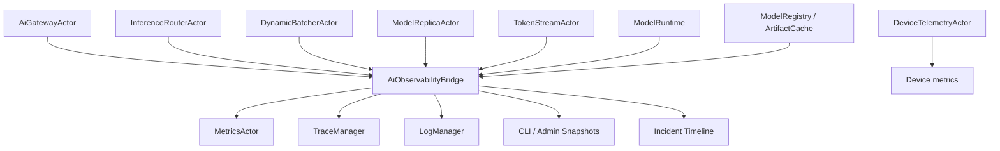

# AI-OBS-001 AI Observability Request And Token Metrics Design

**Status:** Proposed design; implementation not started
**Requirement ID:** AI-OBS-001
**Parent Architecture:** [Distributed AI Model Inference and Training Architecture](distributed-ai-model-inference-training-architecture.md)
**Depends On:** [AI-ACC-002](accelerator-observability-telemetry-design.md)
**Related Requirements:** [AI-MOD-001](model-registry-artifact-metadata-design.md), [AI-INF-001](model-replica-lifecycle-design.md), [AI-INF-002](dynamic-batcher-cancellation-design.md), [AI-INF-003](streaming-token-response-design.md), [AI-RUN-001](model-runtime-plugin-abi-design.md), [AI-SEC-001](ai-tenant-model-authorization-design.md), [AI-DATA-001](tensor-buffer-handle-data-plane-design.md), [AI-DIST-001](model-placement-coordinator-design.md), [AI-DIST-002](model-shard-group-readiness-stale-routes-design.md), [AI-DIST-MLX-001](mlx-distributed-rendezvous-adapter-design.md), [AI-TRN-001](training-job-worker-group-lifecycle-design.md), [AI-TRN-002](training-rank-rendezvous-checkpoint-design.md), [AI-OPS-001](ai-admin-cli-operations-design.md), [AI-TST-001](ai-fault-injection-chaos-testing-design.md)

## 1. Executive Summary

AI-OBS-001 defines model-aware observability for AI inference and future
training workloads. HPActor already has metrics, structured logs, distributed
tracing, CLI, and admin-oriented patterns. AI workloads need a layer on top of
those foundations that can answer questions such as: which model was slow, how
long did a request wait in the batcher, how long until the first token, why was
a request rejected, did a runtime fail, and which rollout generation served the
request.

This design adds an AI observability contract for request, batch, stream,
token, model lifecycle, runtime, artifact, policy, and tensor-handle signals.
It keeps the default metric surface low-cardinality and redacted. Detailed
request-level information belongs in traces, structured logs, and filtered
admin snapshots, not in unbounded metric labels.

## 2. Goals

1. Define OpenMetrics families for AI requests, queueing, batching, streaming,
   token generation, model lifecycle, artifacts, runtime errors, and policy
   decisions.
2. Define stable trace spans and attributes across gateway, router, batcher,
   replica, runtime, stream, registry, artifact, and policy actors.
3. Define structured log events and redaction rules for prompts, completions,
   tensors, artifact paths, and tenant data.
4. Keep metrics out of AI actor hot paths through bounded event or snapshot
   delivery.
5. Integrate AI device telemetry from AI-ACC-002 without duplicating device
   metrics.
6. Provide CLI/admin snapshots and incident correlation keys.
7. Support deterministic observability tests with `MockModelRuntime`.
8. Preserve existing metrics/tracing/logging behavior for non-AI workloads.

## 3. Non-Goals

- Building a hosted observability UI.
- Exporting prompt, completion, tensor, or dataset contents by default.
- Adding tenant, request id, trace id, artifact URI, or file path as default
  metric labels.
- Replacing Prometheus, OpenTelemetry, existing log sinks, or trace exporters.
- Profiling MLX kernels or Metal commands in detail.
- Defining alert thresholds for every deployment.

## 4. Design Approach

Three approaches were considered:

| Approach | Trade-off |
|----------|-----------|
| Emit ad hoc metrics from every AI actor | Fast to add locally, but inconsistent labels and cardinality controls drift quickly. |
| Force all AI values through existing hot-path metric events | Reuses infrastructure, but request/token data needs richer snapshots and 64-bit counters. |
| Add an AI observability bridge over existing metrics, logs, and traces | Recommended. It keeps one AI contract while reusing HPActor's existing exporters. |

The recommended design adds an `AiObservabilityActor` or equivalent bridge that
receives bounded AI telemetry events and low-frequency snapshots. Existing
`MetricsActor`, `TraceManager`, and `LogManager` remain the export owners.

## 5. Architecture



Primary components:

- `AiObservabilityBridge`: bounded bridge from AI actors to metrics/logs/traces.
- `AiTelemetryEvent`: compact event for request, batch, stream, token, and
  lifecycle observations.
- `AiMetricSnapshot`: current gauges and aggregate counters exposed to
  `MetricsActor`.
- `AiTraceAttributes`: shared attribute keys and redaction policy.
- `AiIncidentTimeline`: bounded correlation view for CLI/admin inspection.

## 6. Telemetry Event Model

```cpp
enum class AiTelemetryEventKind : uint8_t {
    RequestAccepted,
    RequestRejected,
    RequestCompleted,
    BatchDispatched,
    StreamStarted,
    FirstToken,
    TokenGenerated,
    StreamCompleted,
    ModelLoad,
    RuntimeError,
    ArtifactEvent,
    PolicyDecision,
    TensorHandleEvent,
};

struct AiTelemetryEvent {
    AiTelemetryEventKind kind;
    RequestId request_id;
    TraceContext trace;
    ModelVersionId model_version;
    ModelReplicaId replica_id;
    std::string backend;
    std::string runtime_name;
    AiOutcomeCode outcome;
    AiReasonCode reason;
    uint64_t input_tokens;
    uint64_t output_tokens;
    uint64_t bytes;
    uint64_t duration_ns;
};
```

Rules:

- Events are bounded and enum-heavy.
- Prompt, completion, tensor contents, artifact URI, and file paths are never
  carried in telemetry events.
- Request id and trace id are allowed in traces, logs, and admin snapshots, but
  not default metric labels.
- Tenant id is redacted or hashed outside explicit admin/debug modes.

## 7. Metrics Contract

Default metric labels:

- `model`
- `version`
- `backend`
- `runtime`
- `outcome`
- `reason`
- `output_mode`

Optional labels disabled by default:

- `tenant`
- `replica_id`
- `rollout_generation`

Forbidden default labels:

- request id
- trace id
- prompt text
- completion text
- tensor id
- artifact URI
- local file path

Metric families:

| Metric | Type | Meaning |
|--------|------|---------|
| `hpactor_ai_requests_total` | Counter | Requests accepted, rejected, completed, cancelled, or failed. |
| `hpactor_ai_request_duration_seconds` | Histogram | End-to-end request latency. |
| `hpactor_ai_queue_delay_seconds` | Histogram | Time from batcher admission to dispatch. |
| `hpactor_ai_runtime_duration_seconds` | Histogram | Runtime infer or stream execution time. |
| `hpactor_ai_time_to_first_token_seconds` | Histogram | Streaming time from admission to first token. |
| `hpactor_ai_time_per_output_token_seconds` | Histogram | Token interval latency after first token. |
| `hpactor_ai_tokens_total` | Counter | Input and output token counts. |
| `hpactor_ai_batch_size` | Histogram | Requests per dispatched batch. |
| `hpactor_ai_batch_tokens` | Histogram | Estimated tokens per dispatched batch. |
| `hpactor_ai_streams_total` | Counter | Stream start, complete, cancel, and failure outcomes. |
| `hpactor_ai_model_load_duration_seconds` | Histogram | Replica model load latency. |
| `hpactor_ai_model_warmup_duration_seconds` | Histogram | Replica warmup latency. |
| `hpactor_ai_model_unload_duration_seconds` | Histogram | Replica unload latency. |
| `hpactor_ai_model_runtime_errors_total` | Counter | Runtime errors by backend and reason. |
| `hpactor_ai_artifact_verify_total` | Counter | Artifact verification outcomes. |
| `hpactor_ai_policy_decisions_total` | Counter | Authorization allow, deny, and error decisions. |
| `hpactor_ai_tensor_handles` | Gauge | Current tensor handle count by device kind and owner class. |
| `hpactor_ai_tensor_materialization_total` | Counter | Tensor materialization outcomes. |

AI device metrics remain owned by AI-ACC-002 and should not be duplicated here.

## 8. Trace Contract

Span names:

- `ai.gateway.request`
- `ai.policy.authorize`
- `ai.router.resolve`
- `ai.batcher.admit`
- `ai.batcher.dispatch`
- `ai.replica.load`
- `ai.replica.warmup`
- `ai.replica.infer`
- `ai.replica.stream`
- `ai.runtime.infer`
- `ai.runtime.stream`
- `ai.stream.open`
- `ai.stream.first_token`
- `ai.stream.finish`
- `ai.artifact.fetch`
- `ai.artifact.verify`
- `ai.tensor.materialize`

Common attributes:

- `ai.model.name`
- `ai.model.version`
- `ai.model.rollout_generation`
- `ai.backend`
- `ai.runtime.name`
- `ai.replica.id`
- `ai.request.id`
- `ai.batch.id`
- `ai.stream.id`
- `ai.output_mode`
- `ai.outcome`
- `ai.reason`
- `ai.prompt_tokens`
- `ai.completion_tokens`
- `ai.device.id`
- `ai.lease.id`

Tenant attributes are controlled by AI-SEC-001 policy. Default traces can carry
tenant hash or tenant class, but not raw tenant identifiers unless configured.

## 9. Structured Logs

Log events:

- request rejected
- request completed with failure
- queue saturation
- stream backpressure
- runtime error
- model load or warmup failure
- artifact verification failure
- policy deny
- tensor materialization denied
- rollout generation change

Required fields:

- timestamp
- event name
- trace id when present
- request id when present
- model name and version when present
- backend and runtime when present
- outcome and reason

Redaction:

- prompt and completion content disabled by default
- tensor previews disabled by default
- artifact URI and local paths redacted by default
- auth credentials and secret material never logged
- tenant identifiers follow AI-SEC-001 privacy policy

## 10. CLI And Admin Surface

Commands:

- `/ai requests --active`
- `/ai request <id> show`
- `/ai model <name> metrics`
- `/ai batcher <model> metrics`
- `/ai streams`
- `/ai stream <id> show`
- `/ai runtime <name> errors`
- `/ai incident request <id>`
- `/ai incident trace <trace_id>`

Snapshots use actor messages and immutable copies. CLI/admin must not read
another actor's private memory.

Incident timeline inputs:

- request lifecycle events
- policy decisions
- batcher admission and dispatch
- replica state transitions
- runtime errors
- stream terminal events
- artifact verification events
- device pressure snapshots from AI-ACC-002

## 11. Cardinality And Privacy Guardrails

Rules:

- Default metrics use bounded enum labels and configured model catalog labels.
- High-cardinality values move to traces, logs, or filtered admin queries.
- Tenant labels are disabled by default.
- Debug labels require explicit config and maximum-series limits.
- Metrics with unavailable values are omitted or use explicit availability
  indicators; they do not emit misleading zeroes.
- Prompt and completion logging requires opt-in plus redaction policy.

If cardinality guardrails are exceeded, the bridge increments a guard metric
and drops or coalesces the unsafe series.

## 12. Configuration

Example:

```toml
[system.ai.observability]
enabled = true
request_metrics = true
token_metrics = true
stream_metrics = true
artifact_metrics = true
policy_metrics = true
tensor_metrics = true
incident_timeline_size = 4096
debug_tenant_labels = false
debug_replica_labels = false
log_prompts = false
log_completions = false
max_metric_series = 20000

[system.ai.observability.histograms]
request_latency_ms = [1, 5, 10, 25, 50, 100, 250, 500, 1000, 2500, 5000]
queue_delay_ms = [1, 2, 5, 10, 20, 50, 100, 250, 500]
time_to_first_token_ms = [5, 10, 25, 50, 100, 250, 500, 1000]
```

## 13. Failure Semantics

| Failure | Runtime behavior |
|---------|------------------|
| observability bridge disabled | AI actors continue; existing traces/logs remain available where instrumented |
| event queue overflow | increment dropped-events counter and keep serving |
| metrics actor disabled | telemetry remains available through logs/traces/admin snapshots |
| trace manager disabled | metrics and logs continue without trace export |
| cardinality limit exceeded | drop unsafe labels and increment guard metric |
| redaction policy lookup fails | fail closed for sensitive fields |
| admin snapshot buffer full | evict oldest records by policy |

Observability failures must not fail inference requests unless the request
explicitly asks for diagnostic materialization that policy denies.

## 14. Testing Strategy

Unit tests:

- metric label allowlist rejects forbidden labels
- request accepted/completed increments expected counters
- queue delay histogram records dispatch latency
- first token span and metric fire once
- runtime errors map to stable reason labels
- redaction removes prompts, completions, paths, and credentials
- cardinality guard drops unsafe series
- disabled metrics do not affect request flow

Integration tests:

- mock inference request emits gateway, router, batcher, replica, runtime, and
  stream spans
- cancellation closes metrics and traces exactly once
- artifact verification failure appears in logs, metrics, and incident timeline
- policy denial appears as authorization failure, not model unavailable
- device pressure from AI-ACC-002 is attached to model load or rejection traces

## 15. Acceptance Criteria

AI-OBS-001 is ready for implementation when:

- AI metric families, labels, and forbidden labels are documented
- trace spans and shared attributes are documented
- prompt, completion, tensor, artifact path, and tenant redaction rules are
  explicit
- observability delivery is bounded and cannot block model execution
- AI device telemetry remains owned by AI-ACC-002
- `MockModelRuntime` can validate request, token, cancellation, and error
  telemetry in CI
- CLI/admin snapshots can reconstruct a basic incident timeline for one request

## 16. Open Questions

1. Should raw tenant id ever be allowed in traces, or should traces only carry a
   stable hashed tenant id?
2. Should token interval histograms be sampled by default for high-throughput
   models?
3. Should the first implementation add a dedicated `AiObservabilityActor`, or
   use direct helper APIs that update `MetricsActor`, `TraceManager`, and
   `LogManager` separately?
4. Which default histogram buckets should be tuned first for local MLX serving?
