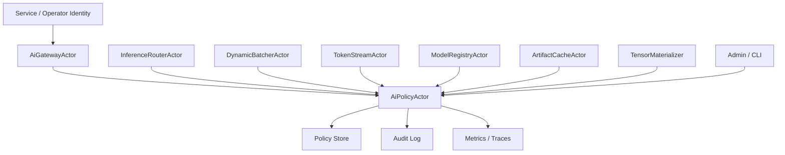

# AI-SEC-001 Tenant And Model Authorization Hooks Design

**Status:** Proposed design; implementation not started
**Requirement ID:** AI-SEC-001
**Parent Architecture:** [Distributed AI Model Inference and Training Architecture](distributed-ai-model-inference-training-architecture.md)
**Depends On:** [Security Architecture Design](../production/security-architecture-design.md)
**Related Requirements:** [AI-MOD-001](model-registry-artifact-metadata-design.md), [AI-INF-002](dynamic-batcher-cancellation-design.md), [AI-INF-003](streaming-token-response-design.md), [AI-OBS-001](ai-observability-request-token-metrics-design.md), [AI-DATA-001](tensor-buffer-handle-data-plane-design.md), [AI-ACC-001](accelerator-resource-plane-design.md), [AI-DIST-001](model-placement-coordinator-design.md), [AI-DIST-002](model-shard-group-readiness-stale-routes-design.md), [AI-DIST-MLX-001](mlx-distributed-rendezvous-adapter-design.md), [AI-TRN-001](training-job-worker-group-lifecycle-design.md), [AI-TRN-002](training-rank-rendezvous-checkpoint-design.md), [AI-OPS-001](ai-admin-cli-operations-design.md), [AI-TST-001](ai-fault-injection-chaos-testing-design.md)

## 1. Executive Summary

AI-SEC-001 defines authorization hooks for AI model access, adapter use,
artifact operations, admin actions, tensor materialization, request
cancellation, and future training submission. It extends HPActor's production
security design with AI-specific resources and decisions while avoiding a
hard dependency on a full external identity provider.

The first implementation should support static TOML policy and deterministic
tests. In development mode, policy can be disabled or permissive. In enforce
mode, AI ingress, router, model registry, artifact cache, batcher, stream actor,
tensor materializer, and admin operations call a common `AiPolicyActor` before
performing sensitive actions. Denials are explicit authorization outcomes and
are audited; they must not be hidden as generic model unavailable errors.

## 2. Goals

1. Define AI-specific authorization resources and actions.
2. Provide one decision contract for ingress, router, registry, artifact,
   batcher, stream, tensor, training, and admin surfaces.
3. Support static TOML roles and tenant policy for the first implementation.
4. Keep prompts, completions, tensors, artifacts, and tenant identifiers
   protected by default.
5. Emit audit records for allow, deny, and policy errors on sensitive actions.
6. Preserve source-compatible development defaults while making enforce mode
   precise and testable.
7. Keep policy decisions bounded and non-blocking for hot request paths.
8. Leave room for external policy engines and quota systems later.

## 3. Non-Goals

- Building a full identity provider.
- Implementing billing, complete quota accounting, or autoscaling policy.
- Replacing application-level authorization.
- Adding cryptographic model artifact signing implementation in this spec.
- Logging prompt, completion, or tensor contents for audit.
- Making AI security mandatory for non-AI HPActor users.

## 4. Design Approach

Three approaches were considered:

| Approach | Trade-off |
|----------|-----------|
| Embed checks inside each AI actor | Simple locally, but policy logic fragments and audit becomes inconsistent. |
| Require an external policy engine immediately | Flexible, but too much integration before the AI runtime shape is stable. |
| Actor-owned policy service with static policy first | Recommended. It gives consistent decisions now and allows external engines later. |

The recommended design adds an `AiPolicyActor` with a no-throw decision API.
Policy data can come from TOML at first. The actor returns explicit decisions,
reason codes, redaction directives, and optional quota hints.

## 5. Architecture



Primary components:

- `AiPolicyActor`: actor-owned policy and decision cache owner.
- `AiIdentityContext`: authenticated service, operator, tenant, and request
  identity metadata.
- `AiAuthorizationRequest`: action, resource, context, and requested scope.
- `AiAuthorizationDecision`: allow, deny, or error plus reason and redaction.
- `AiAuditEvent`: structured security event emitted for sensitive actions.
- `AiPolicyStore`: static TOML policy first, external provider later.

## 6. Identity Model

```cpp
struct AiIdentityContext {
    std::string principal_id;
    std::string tenant_id;
    std::vector<std::string> roles;
    std::string authn_method;
    std::string source_endpoint;
    TraceContext trace;
};
```

Identity sources:

- HTTP or RPC service identity
- operator identity for CLI/admin
- node identity for internal system actors
- test identity for deterministic CI

If authentication is disabled, the runtime may synthesize a development
identity. In enforce mode, unauthenticated external requests are denied.

## 7. Action And Resource Model

Actions:

```cpp
enum class AiAction : uint16_t {
    Infer,
    Stream,
    CancelOwnRequest,
    CancelAnyRequest,
    UseModel,
    UseAdapter,
    RegisterModel,
    DeleteModel,
    FetchArtifact,
    DeleteArtifact,
    RolloutModel,
    RollbackModel,
    InspectModel,
    InspectRequest,
    MaterializeTensor,
    DebugPreviewTensor,
    SubmitTrainingJob,
    CancelTrainingJob,
    AdminRuntime,
};
```

Resources:

```cpp
struct AiResource {
    std::string kind;          // model, adapter, artifact, tensor, request, job
    std::string model_name;
    std::string model_version;
    std::string adapter_id;
    std::string artifact_id;
    std::string request_owner_tenant;
    std::string tensor_sensitivity;
};
```

Resource fields are bounded and redacted before logs. Artifact URIs and local
paths are not policy resource identifiers in logs or metrics.

## 8. Decision Contract

```cpp
enum class AiDecisionCode : uint8_t {
    Allow,
    Deny,
    Error,
};

enum class AiDenyReason : uint16_t {
    Unauthenticated,
    TenantNotAllowed,
    ModelNotAllowed,
    VersionNotAllowed,
    AdapterNotAllowed,
    ActionNotAllowed,
    RequestNotOwned,
    TensorMaterializationDenied,
    DebugPreviewDenied,
    PolicyUnavailable,
    QuotaUnavailable,
};

struct AiAuthorizationDecision {
    AiDecisionCode decision;
    AiDenyReason reason;
    bool audit_required;
    bool redact_tenant;
    bool redact_prompt;
    bool redact_completion;
    bool allow_debug_materialization;
    uint32_t decision_ttl_ms;
};
```

Rules:

- Deny decisions are final for the requested action.
- Error decisions fail closed in enforce mode and log-only in permissive mode.
- Decision caching is allowed only for policy inputs that are stable for the
  decision TTL.
- Mutating admin actions are always audited.
- Request owner checks are required for cancellation and inspection.

## 9. Enforcement Points

| Component | Required checks |
|-----------|-----------------|
| `AiGatewayActor` | infer, stream, request inspect, own cancellation |
| `InferenceRouterActor` | model/version access and adapter access |
| `DynamicBatcherActor` | tenant admission share and cancellation authority |
| `TokenStreamActor` | client disconnect/cancel ownership and redaction |
| `ModelRegistryActor` | register, delete, inspect, rollout, rollback |
| `ArtifactCacheActor` | fetch, delete, inspect artifact |
| `TensorMaterializer` | host copy, debug preview, remote export |
| `TrainingJobActor` | submit, inspect, cancel training job |
| CLI/admin | all mutating AI admin commands |

Denials return structured `RejectedByPolicy` or action-specific authorization
errors. They do not masquerade as `ModelNotFound` or `ModelUnavailable`.

## 10. Policy Model

Example:

```toml
[system.ai.security]
mode = "enforce"
default_tenant = "dev"
audit_all_denies = true
audit_all_admin = true
decision_cache_ttl_ms = 1000

[[system.ai.security.role]]
name = "ai-reader"
allow = ["ai.model.inspect", "ai.request.inspect-own"]

[[system.ai.security.role]]
name = "ai-user"
allow = ["ai.infer", "ai.stream", "ai.cancel-own"]
models = ["chat-small", "embed-small"]

[[system.ai.security.role]]
name = "ai-admin"
allow = ["ai.*"]

[[system.ai.security.tenant]]
id = "team-a"
models = ["chat-small"]
adapters = ["team-a-lora"]
allow_training = false
allow_tensor_debug_preview = false
```

Modes:

- `off`: development only; no authorization checks.
- `permissive`: evaluate and audit, but allow actions.
- `enforce`: deny unauthorized actions.

The first production-oriented examples should use `enforce`. Existing tests and
non-AI workloads remain unaffected unless AI security is enabled.

## 11. Audit Contract

Audit events:

- authorization deny
- policy evaluation error
- model register/delete
- artifact fetch/delete
- artifact checksum or signature failure
- rollout/canary/rollback
- request cancellation by non-owner
- tensor materialization or debug preview
- admin runtime action
- training job submit/cancel

Audit fields:

- timestamp
- principal id or redacted principal hash
- tenant id or redacted tenant hash
- action
- resource kind
- model name and version when present
- decision
- reason
- trace id when present
- source endpoint

Audit logs must never include prompt text, completion text, tensor contents,
secrets, local artifact paths, or credentials.

## 12. Observability

Metrics:

- `hpactor_ai_policy_decisions_total`
- `hpactor_ai_policy_denials_total`
- `hpactor_ai_policy_errors_total`
- `hpactor_ai_policy_cache_hits_total`
- `hpactor_ai_audit_events_total`

Trace spans:

- `ai.policy.authorize`
- `ai.policy.audit`

Trace attributes:

- `ai.policy.action`
- `ai.policy.resource_kind`
- `ai.policy.decision`
- `ai.policy.reason`
- `ai.tenant.hash`

Default metric labels must use bounded action and reason enums. Raw tenant id is
not a default metric label.

## 13. Failure Semantics

| Failure | Enforce mode | Permissive mode |
|---------|--------------|-----------------|
| unauthenticated external request | deny | allow and audit |
| policy actor unavailable | deny with `PolicyUnavailable` | allow and audit error |
| policy config invalid at startup | AI security fails startup when enabled | AI security starts disabled only if explicitly configured |
| decision cache stale | re-evaluate | re-evaluate |
| audit sink unavailable | continue if policy allows; count audit failure | continue and count audit failure |
| unknown action | deny | allow and audit error |
| tenant not found | deny | allow and audit |

Security errors must be visible as security failures in metrics, logs, traces,
and admin surfaces.

## 14. Testing Strategy

Unit tests:

- action/resource matching
- role allow and deny rules
- tenant model allowlist
- adapter allowlist
- request owner cancellation
- tensor materialization denial
- mode behavior for off, permissive, and enforce
- policy cache respects TTL and invalidation
- audit event redaction
- invalid policy config rejection

Integration tests:

- unauthorized inference returns `RejectedByPolicy`
- unauthorized model rollout is denied and audited
- policy denial appears in AI observability as authz denial
- cancellation by non-owner is denied
- artifact delete while unauthorized is denied before cache mutation
- tensor debug preview requires explicit allow

## 15. Acceptance Criteria

AI-SEC-001 is ready for implementation when:

- AI actions and resources have explicit enum or bounded string contracts
- every P0 AI actor has a named enforcement point
- policy decisions have stable allow, deny, error, and reason codes
- denials are distinct from model unavailable and runtime errors
- audit records are emitted for sensitive actions and redacted by default
- static TOML policy can exercise all P0 decisions in CI
- default non-AI HPActor behavior remains source-compatible

## 16. Open Questions

1. Should policy decision caching happen inside `AiPolicyActor` only, or may
   hot-path actors keep short local caches?
2. Should tenant quotas be represented as advisory hints in this spec, or wait
   for a dedicated quota requirement?
3. Should raw tenant id be allowed in admin snapshots for local development, or
   always hashed unless an operator passes an explicit reveal flag?
4. Which external policy engine should be targeted first after static TOML:
   OPA, Cedar, SPIFFE/SPIRE metadata, or user-provided callbacks?
