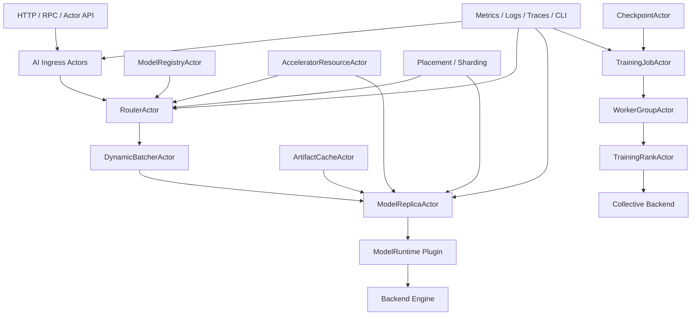

# Distributed AI Model Inference and Training Architecture

**Status:** Proposed high-level architecture design

## 1. Executive Summary

HPActor already provides a strong distributed actor substrate: local and remote
actors, bounded mailboxes, backpressure, dead letters, tracing, metrics,
structured logging, service discovery, remote spawn, RPC, topology config,
dedicated execution pools, lifecycle state, and graceful shutdown.

To support distributed AI model inference and training, HPActor should evolve
into an actor-native AI workload orchestration runtime. It should not become a
tensor-kernel framework. For the first production-oriented development path,
HPActor should target macOS on Apple silicon with MLX as the primary native
runtime. Matrix kernels, graph execution, model loading, token generation,
training math, and distributed collectives should be delegated to MLX or
MLX-based runtime components first, then to optional backends such as ONNX
Runtime, TensorRT-LLM, Triton, llama.cpp, PyTorch workers, NCCL/RCCL/UCC, or
future accelerators.

HPActor's value is the runtime around those engines:

- placement of model replicas and shards
- bounded admission under overload
- streaming request orchestration
- model lifecycle and rollout control
- distributed inference coordination
- training job and rank supervision
- checkpoint and recovery policy
- Apple unified-memory accelerator and resource observability
- multi-tenant quota and security policy
- operational diagnostics for long-running AI systems

This document defines the high-level AI workload architecture, the major missing
planes, and an incremental roadmap. It is a design specification only. Unless a
subsystem is already called out as implemented in project memory, treat every AI
plane below as proposed future runtime behavior.

## 2. Goals

1. Support production-grade single-node and multi-node model inference.
2. Make macOS on Apple silicon with MLX the first concrete native runtime
   target.
3. Support distributed training orchestration without embedding a deep-learning
   framework into HPActor core.
4. Keep actor APIs source-compatible and preserve current non-AI workloads.
5. Add accelerator-aware resource admission and placement.
6. Support streaming, cancellation, dynamic batching, and model hot-swap.
7. Integrate with the existing production reliability planes: data, control, and
   operations.
8. Make all expensive queues, caches, model loads, and device allocations
   bounded and observable.
9. Keep AI backends pluggable, optional, and build-time/runtime configurable,
   while giving the MLX path first-class roadmap priority.

## 3. Non-Goals

- Reimplementing MLX, CUDA, ROCm, Metal, or collective communication kernels in
  HPActor core.
- Replacing MLX, PyTorch, ONNX Runtime, TensorRT-LLM, Triton, vLLM-style
  engines, or llama.cpp.
- Providing exactly-once model execution or exactly-once training side effects.
- Making large tensor payloads flow through protobuf `TypedMessage` by default.
- Supporting transparent migration of live GPU memory between processes.
- Shipping a hosted model registry or full MLOps product inside the runtime.

## 4. Existing HPActor Foundations

The AI architecture builds on existing and planned HPActor facilities:

| Foundation | Existing Capability | AI Use |
|------------|---------------------|--------|
| `ActorSystem` | spawn, registry, topology, network wiring | runtime boundary for AI system actors |
| `ActorContext` / `ActorRef` | location-transparent send/reply | model requests, rank coordination |
| `TypedMessage` | protobuf control envelope | metadata, commands, small payloads |
| bounded mailboxes | admission result and pressure state | request queue and batcher overload control |
| DLQ | failed delivery capture | rejected inference/training control messages |
| scheduler | cooperative, dedicated thread, dedicated pool | isolate blocking and accelerator work |
| service discovery | static, registrar, gossip, hybrid | node and worker discovery |
| remote spawn/RPC | remote actors and async calls | worker/rank creation and command channels |
| tracing/logging/metrics | production observability | per-model, per-request, per-rank diagnostics |
| topology config | TOML plus self-registering parsers | model, device, training, quota config |
| lifecycle/shutdown | drain, stop, readiness | model load/unload, rollout, job cancellation |

## 5. Architecture Overview

The recommended shape is a layered runtime:



Core principle:

- HPActor owns control, lifecycle, routing, placement, admission, and
  observability.
- MLX owns the first native tensor execution path on macOS. Other backend
  runtimes stay behind the same plugin boundary.
- Large tensors and GPU buffers use explicit tensor/data-plane handles rather
  than ordinary actor protobuf payloads.

## 6. Major Missing Planes

### 6.0 macOS and MLX First Priority

The first concrete AI implementation target is a macOS Apple silicon developer
and deployment path using MLX. This shapes the early architecture differently
than a CUDA-first cluster:

- memory admission must model Apple unified memory instead of treating GPU VRAM
  and host RAM as completely separate pools
- the first real device probe should understand MLX/Metal device availability,
  MLX device metadata, and MLX memory telemetry
- the first native model runtime should be `MlxModelRuntime`
- training and distributed inference orchestration should use HPActor for
  placement, lifecycle, rendezvous, health, and observability, while MLX owns
  tensor execution and distributed communication backends
- CUDA, ROCm, ONNX Runtime, TensorRT-LLM, Triton, and PyTorch worker support
  should remain planned extension paths, not Milestone 1 blockers

Initial MLX development constraints:

- target native arm64 macOS only
- require an explicit build option such as `ENABLE_MLX`
- keep MLX headers and exceptions out of HPActor public core headers
- provide a sidecar fallback for Python-first MLX workflows if native C++ API
  integration blocks early progress
- test all actor orchestration with `MockModelRuntime` and mock MLX telemetry so
  CI does not require Apple GPU hardware

The architecture should still stay backend-neutral at the public HPActor API
boundary. The priority shift is in roadmap order, default examples, and first
runtime adapter, not in making every HPActor user depend on MLX.

### 6.1 Accelerator Resource Plane

The accelerator resource plane tracks devices and admits work based on real
capacity, not only actor counts.

Responsibilities:

- Discover CPU, MLX GPU, Metal-backed Apple GPU, and future accelerator
  devices.
- Track Apple unified-memory capacity and pressure first, then device memory,
  compute capability, topology, NUMA locality, PCIe/NVLink relationships, MIG
  or slice partitions, and health for non-Apple backends.
- Represent allocatable resources in placement decisions.
- Enforce unified-memory budgets, host RAM, backend cache limits, batch slots,
  and KV cache budgets. Non-Apple backends may also enforce VRAM and pinned
  memory separately.
- Surface device pressure and failures through metrics, logs, traces, CLI, and
  admin APIs.

Proposed components:

- `AcceleratorResourceActor`: node-local authoritative resource inventory.
- `DeviceProbe`: pluggable backend for MLX/Metal, CPU-only, CUDA, ROCm, and
  future devices.
- `DeviceLease`: bounded reservation for a model replica, training rank, or
  tensor cache.
- `TopologyMap`: device-to-device and device-to-node locality graph.
- `ResourceAdmissionPolicy`: accepts, queues, rejects, or preempts AI work.

Runtime contract:

- Model load and training rank start must acquire leases before allocating MLX
  arrays, model weights, KV cache, or other backend resources.
- Lease failure is a structured admission failure, not a late OOM when possible.
- Device loss transitions affected actors to `Failed` or `Draining` and emits
  shard or replica invalidation events.
- Resource estimates are allowed to be conservative and must be observable.

### 6.2 Model Runtime Plugin Plane

The model runtime plugin plane isolates HPActor core from heavyweight AI engine
dependencies.

Responsibilities:

- Provide a stable runtime ABI for model load, warmup, infer, stream, cancel,
  unload, health, and stats.
- Support in-process native plugins and out-of-process sidecars.
- Keep exception and RTTI boundaries outside HPActor public APIs.
- Allow multiple backend engines in one cluster.

Proposed plugin interface:

```cpp
class ModelRuntime {
  public:
    virtual result<ModelHandle> load(const ModelLoadRequest& request) noexcept = 0;
    virtual result<void> warmup(ModelHandle model) noexcept = 0;
    virtual result<InferenceResult>
    infer(ModelHandle model, const InferenceRequest& request) noexcept = 0;
    virtual result<void>
    start_stream(ModelHandle model, const StreamRequest& request,
                 TokenSink& sink) noexcept = 0;
    virtual result<void> cancel(RequestId request_id) noexcept = 0;
    virtual ModelRuntimeStats stats(ModelHandle model) noexcept = 0;
    virtual result<void> unload(ModelHandle model) noexcept = 0;
};
```

Initial backend strategy:

- `MlxModelRuntime`: first native macOS Apple silicon backend. It wraps MLX
  model load, warmup, inference, streaming decode, cancellation, stats, memory
  telemetry, and unload behind HPActor's no-throw runtime interface.
- `MockModelRuntime`: deterministic tests and examples.
- `MlxProcessRuntime`: sidecar process with framed IPC for Python-first MLX
  workflows, MLX-LM experiments, and early training jobs.
- `ProcessModelRuntime`: sidecar process for PyTorch or heavyweight engines.
- Future `OnnxRuntimePlugin`, `LlamaCppPlugin`, `TensorRtLlmPlugin`,
  `TritonClientPlugin`, and framework-specific adapters.

Runtime contract:

- Plugins must return structured errors and never throw across HPActor
  boundaries.
- Blocking model calls run on dedicated threads or sidecar processes, not the
  cooperative scheduler or event loop.
- Plugin memory ownership must be explicit and observable.
- MLX streams, lazy evaluation, synchronization, memory limits, cache clearing,
  and active/peak memory telemetry are owned by the MLX runtime adapter and
  surfaced through HPActor metrics and admin snapshots.

### 6.3 Tensor and Data Plane

The tensor/data plane moves large payloads without abusing protobuf control
messages.

Responsibilities:

- Represent tensors, token buffers, embeddings, logits, activations, gradients,
  and checkpoint chunks.
- Support host memory, pinned host memory, device memory, mmap files, shared
  memory, and remote object handles.
- Allow zero-copy or copy-minimized interop with backend runtimes.
- Define fragmentation and chunking for remote transport.

Proposed types:

```cpp
enum class TensorDeviceKind : uint8_t {
    Cpu,
    PinnedCpu,
    MlxUnified,
    Cuda,
    Rocm,
    Metal,
    Remote,
    MmapFile,
};

struct TensorShape {
    std::vector<int64_t> dims;
    std::vector<int64_t> strides;
};

struct TensorBuffer {
    TensorDeviceKind device;
    uint32_t device_index;
    DataType dtype;
    TensorShape shape;
    uint64_t byte_size;
    TensorOwnership ownership;
    TensorHandle handle;
};
```

Transport policy:

- Protobuf actor messages carry tensor metadata and small payloads only.
- On the MLX-first path, large tensors use `MlxTensorHandle` or opaque
  `TensorHandle` references to MLX arrays and unified-memory buffers owned by
  the runtime adapter. Actor messages never assume that an MLX array can be
  safely copied or shared across process boundaries.
- Other large tensors use `TensorHandle` references to shared memory, mmap
  files, object storage, device IPC handles, or stream chunks.
- Remote tensor transfer has explicit byte budgets, cancellation, checksum, and
  retry policy.
- Training gradients and activations should use MLX distributed communication
  or other backend collective transports when possible, not HPActor actor
  messaging.

### 6.4 Inference Serving Plane

The inference serving plane turns HPActor into a production model-serving
runtime.

Responsibilities:

- Accept HTTP, RPC, and actor-native inference requests.
- Route requests by model, version, tenant, locality, and capacity.
- Support dynamic batching and continuous batching for token generation.
- Support streaming tokens, cancellation, timeout, and backpressure.
- Support model warmup, readiness, rollout, rollback, and canarying.

Proposed actors:

- `AiGatewayActor`: OpenAI-compatible HTTP routes and internal RPC ingress.
- `InferenceRouterActor`: model/version/tenant-aware route selection.
- `DynamicBatcherActor`: queueing, microbatch formation, priority, deadlines,
  and retry-after signals.
- `ModelReplicaActor`: owns one loaded model instance or backend handle.
- `TokenStreamActor`: sends ordered token deltas and handles cancellation.
- `PromptCacheActor`: optional prefix/prompt cache metadata owner.
- `KvCacheActor`: per-device or per-model KV cache accounting and eviction.

Inference lifecycle:

1. Ingress validates request, tenant policy, model name, and deadline.
2. Router selects a model version and candidate replica or shard group.
3. Batcher admits the request according to queue, token, and memory budgets.
4. Replica calls the MLX runtime or another backend runtime on a dedicated
   execution context.
5. Streaming results flow through `TokenStreamActor` until completion,
   cancellation, or error.
6. Final outcome is recorded with request id, trace id, model id, token counts,
   queue delay, runtime latency, and delivery status.

Overload contract:

- Batcher queues are bounded by request count, token count, and estimated bytes.
- Router must return structured `RejectedByPolicy`, `Overloaded`, `TimedOut`, or
  `ModelUnavailable` outcomes.
- Streaming cancellation must release batch slots and KV cache reservations.

### 6.5 Distributed Inference Plane

The distributed inference plane coordinates model shards and replicas across
nodes and accelerators.

Responsibilities:

- Support replica parallelism for throughput.
- Support tensor, pipeline, expert, and prefill/decode split topologies.
- Place model shards using device topology and resource leases.
- Keep route tables coherent during failure, rolling upgrade, and rebalance.
- Coordinate shard group readiness before routing user traffic.

Proposed actors:

- `ModelPlacementCoordinator`: computes model replica and shard placement.
- `ModelShardGroupActor`: owns shard membership, epoch, and readiness.
- `ShardReplicaActor`: actor wrapper for one model shard on one device.
- `ShardRouteTable`: cached model shard routing with epoch.
- `InferenceSessionActor`: coordinates multi-step distributed inference for one
  request or batch.
- `MlxDistributedRuntime`: optional adapter that translates HPActor placement
  and rendezvous metadata into MLX distributed backend initialization for ring,
  JACCL, MPI, or NCCL where available.

Runtime contract:

- Each distributed model deployment has a placement epoch.
- Requests include the model version and known placement epoch when possible.
- Stale shard routes return `ModelShardMoved` or `PlacementEpochStale`.
- Shard groups become ready only after every required shard is loaded and
  warmed.
- Failure of required shards makes the shard group unavailable unless a
  configured degraded mode exists.
- HPActor does not carry tensor-parallel payloads through actor messages. It
  starts, supervises, and observes MLX distributed workers while MLX performs
  collectives.

### 6.6 Training Orchestration Plane

The training plane manages jobs, workers, ranks, checkpoints, datasets, and
failure recovery while delegating tensor math to training frameworks.

Responsibilities:

- Admit training jobs as gang-scheduled resource allocations.
- Start, monitor, pause, resume, and cancel worker groups.
- Manage rank assignment, rendezvous, process environment, and group topology.
- Coordinate checkpoint save/restore.
- Recover from worker, node, or device failure according to job policy.

Proposed actors:

- `TrainingJobActor`: authoritative job lifecycle and policy.
- `WorkerGroupActor`: owns the set of workers/ranks for one job.
- `TrainingRankActor`: supervises one framework worker process or in-process
  runtime.
- `RendezvousActor`: assigns ranks, world size, endpoints, and group epochs.
- `CollectiveGroupActor`: describes MLX ring, JACCL, MPI, NCCL/RCCL/UCC, or
  framework collective topology.
- `DatasetShardActor`: assigns dataset shards and tracks progress.
- `CheckpointActor`: coordinates checkpoint manifests, retention, and restore.

Training lifecycle:

1. Job is submitted with model, dataset, resource, and recovery policy.
2. Resource plane reserves all required devices or rejects the job.
3. Rendezvous assigns ranks and publishes group metadata.
4. Rank actors start MLX native workers or MLX sidecar processes and report
   readiness.
5. Training progresses with periodic metrics and checkpoint barriers.
6. Failure policy decides restart rank, restart group, recover from checkpoint,
   or fail job.

Failure contract:

- The first implementation should prefer whole-worker-group restart over
  partial rank repair.
- Rank failure is visible as structured job state, not just process exit.
- Checkpoint restore must complete before the job returns to `Running`.
- Non-idempotent dataset side effects must be owned by the training framework or
  explicit user code.

### 6.7 Model Lifecycle and Artifact Plane

The model lifecycle plane makes model versions deployable, inspectable, and
reversible.

Responsibilities:

- Track model identity, version, format, backend, tokenizer, adapters, and
  quantization metadata.
- Fetch, validate, cache, pin, and garbage-collect model artifacts.
- Support model rollout, canary, rollback, unload, and hot-swap.
- Verify checksums and signatures where configured.

Proposed actors:

- `ModelRegistryActor`: model catalog and version state.
- `ArtifactCacheActor`: node-local artifact download, verification, and cache
  eviction.
- `TokenizerActor`: optional tokenizer service or metadata owner.
- `AdapterRegistryActor`: LoRA/adapter metadata and tenant permissions.
- `ModelRolloutActor`: rollout, canary, rollback, and traffic shifting.

Model states:

- `Registered`
- `Fetching`
- `Verified`
- `Loading`
- `Warming`
- `Ready`
- `Draining`
- `Unloading`
- `Failed`
- `RolledBack`

Runtime contract:

- A model is routable only in `Ready` state.
- Loading and warmup failure produce structured diagnostics and keep previous
  ready versions serving when possible.
- Artifact cache eviction cannot remove files pinned by live model replicas.

### 6.8 AI Observability Plane

AI workloads need model-aware telemetry on top of actor telemetry.

Metric families:

- `hpactor_ai_requests_total`
- `hpactor_ai_request_duration_seconds`
- `hpactor_ai_queue_delay_seconds`
- `hpactor_ai_time_to_first_token_seconds`
- `hpactor_ai_time_per_output_token_seconds`
- `hpactor_ai_tokens_total`
- `hpactor_ai_batch_size`
- `hpactor_ai_kv_cache_bytes`
- `hpactor_ai_model_load_duration_seconds`
- `hpactor_ai_model_runtime_errors_total`
- `hpactor_ai_device_memory_bytes`
- `hpactor_ai_device_utilization_ratio`
- `hpactor_ai_mlx_active_memory_bytes`
- `hpactor_ai_mlx_peak_memory_bytes`
- `hpactor_ai_mlx_cache_memory_bytes`
- `hpactor_ai_training_step_duration_seconds`
- `hpactor_ai_checkpoint_duration_seconds`
- `hpactor_ai_collective_duration_seconds`

Trace attributes:

- model name, version, backend, replica id
- tenant id and request id where policy allows
- prompt token count and completion token count
- batch id and queue delay
- device id and placement epoch
- training job id, rank, step, and checkpoint id

CLI/Admin surface:

- `/ai models`
- `/ai model <name> versions`
- `/ai model <name> replicas`
- `/ai devices`
- `/ai runtime mlx stats`
- `/ai requests --active`
- `/ai training jobs`
- `/ai training job <id> show`
- `/ai checkpoint <job_id> list`

### 6.9 Security, Policy, and Multi-Tenancy Plane

AI serving usually handles expensive resources and sensitive inputs. Security
must be part of the first production design, not a later add-on.

Responsibilities:

- Authorize model access, adapter use, admin actions, training submission, and
  checkpoint restore.
- Enforce tenant quotas for request rate, queue depth, tokens, model memory,
  device leases, and training jobs.
- Protect prompts, completions, datasets, checkpoints, and model artifacts.
- Audit model rollout, artifact fetch, DLQ replay, checkpoint restore, and job
  cancellation.

Policy examples:

- tenant may access `model=a` but not `model=b`
- tenant may use adapter `x` only with base model `m`
- tenant may submit inference but not training
- admin may canary a model but only platform admin may delete artifacts

Runtime contract:

- Policy denial must be observable as authorization failure, not generic model
  unavailable.
- Prompt and completion logging is disabled by default unless explicitly
  configured and redacted.
- Model artifacts and checkpoints can require checksum and signature
  verification before use.

### 6.10 AI Operations and Reliability Testing Plane

The AI operations plane extends production reliability testing with model and
accelerator fault modes.

Fault injection points:

- model load failure
- tokenizer failure
- backend process crash
- MLX execution or lazy-evaluation synchronization failure
- unified-memory pressure or backend allocation failure
- device health transition
- batcher queue saturation
- KV cache exhaustion
- stream cancellation race
- checkpoint write failure
- collective timeout
- rank restart
- artifact checksum mismatch

Test categories:

- deterministic unit tests with `MockModelRuntime`
- deterministic MLX adapter tests with mocked MLX device and memory telemetry
- single-node inference integration tests
- multi-node shard placement tests
- streaming and cancellation tests
- overload and backpressure stress tests
- training rank failure/restart tests
- checkpoint restore tests
- long-running soak tests for memory, queue, and device telemetry

## 7. AI Runtime Contracts

### 7.1 Message and Payload Contract

- Actor `TypedMessage` remains the control envelope for commands and metadata.
- Large tensors, embeddings, logits, gradients, and checkpoint chunks use
  `TensorBuffer` or `ArtifactHandle` references.
- MLX arrays stay behind `MlxTensorHandle` or backend-private handles; actor
  APIs only see shape, dtype, ownership, and lifecycle metadata.
- Every inference request gets a stable `RequestId` and trace context.
- Every training job gets a stable `JobId`; every worker group gets an epoch.

### 7.2 Admission Contract

Admission is layered:

1. API/tenant policy admission.
2. model/version availability admission.
3. router and replica queue admission.
4. device lease and memory admission.
5. backend runtime admission.

Each rejection maps to a structured reason:

- `ModelNotFound`
- `ModelVersionUnavailable`
- `TenantQuotaExceeded`
- `QueueFull`
- `DeviceUnavailable`
- `InsufficientMemory`
- `BackendUnavailable`
- `DeadlineExceeded`
- `Cancelled`
- `RejectedByPolicy`

### 7.3 Lifecycle Contract

AI actors should use explicit lifecycle state:

- model replicas reject new inference while `Loading`, `Warming`, `Draining`, or
  `Unloading`
- training ranks reject control messages outside valid job states
- rollout keeps old versions serving until new versions are ready
- shutdown drains ingress before unloading models and worker groups

### 7.4 Placement Contract

Placement inputs:

- model size and format
- required backend
- required device kind and memory, including MLX unified-memory pressure for
  Apple silicon targets
- tensor/pipeline/expert parallel layout
- replica count
- tenant isolation constraints
- zone/node/device locality
- current pressure and health

Placement output:

- model version
- replica id
- shard group id
- node endpoint
- device lease id
- placement epoch

### 7.5 Failure Contract

Failure should be explicit and operator-visible:

- model load failure does not crash the node
- backend crash fails the replica and invalidates routes
- device loss marks affected replicas or ranks unavailable
- training rank failure follows job recovery policy
- checkpoint failure can fail, retry, or continue based on policy
- exhausted retries enter DLQ or job failure history with trace correlation

## 8. Configuration Model

New AI config should follow the existing parser IoC rule: subsystem-owned parser
source files self-register and expose no public `toml++` types.

Example sketch:

```toml
[system.ai]
enabled = true
default_backend = "mlx"
max_active_requests = 4096
request_timeout_ms = 30000

[system.ai.devices]
probe = "mlx"
require_exclusive_lease = true
metrics_interval_ms = 1000

[system.ai.mlx]
enabled = true
device = "gpu"
memory_limit_mb = 24576
prefer_gpu = true
allow_cpu_fallback = true
clear_cache_on_unload = true
stream_synchronization = "runtime_owned"

[[system.ai.runtime]]
name = "mlx"
kind = "in_process"
backend = "mlx"

[[system.ai.runtime]]
name = "mock"
kind = "in_process"
backend = "mock"

[[system.ai.runtime]]
name = "mlx-python-worker"
kind = "process"
command = "python3"
args = ["mlx_worker.py"]

[[model]]
name = "chat-small"
version = "2026-05-20"
runtime = "mlx"
format = "safetensors"
artifact_uri = "file:///models/chat-small"
replicas = 2
max_batch_tokens = 8192
max_queue_depth = 256

[model.resources]
device = "mlx-gpu"
unified_memory_mb = 16000

[[training.job_template]]
name = "pretrain-small"
runtime = "mlx-python-worker"
world_size = 4
checkpoint_interval_steps = 500

[training.job_template.resources]
device = "mlx-gpu"
unified_memory_mb = 40000
```

## 9. Roadmap

### Milestone 0: AI Architecture Backlog

Deliverables:

- this high-level architecture document
- feature-gap backlog for AI planes
- detailed specs for accelerator resources, runtime plugin ABI, mock runtime,
  MLX runtime plugins, MLX/Metal probing, MLX tensor handles, model/artifact
  metadata, tensor data plane, inference serving, AI observability, AI
  security, distributed inference, and training orchestration
- acceptance test matrix and mock runtime design

Exit criteria:

- the AI architecture is decomposed into implementable design docs
- no AI runtime behavior is described as implemented before code exists

### Milestone 1: Single-Node Production Inference

Scope:

- `MlxModelRuntime` as the first real native backend on macOS Apple silicon
- `MockModelRuntime`
- model registry and artifact metadata
- accelerator inventory with CPU-only, mock-GPU, and MLX/Metal probes
- `ModelReplicaActor`, `InferenceRouterActor`, `DynamicBatcherActor`
- OpenAI-compatible HTTP endpoint subset through existing HTTP gateway
- streaming token response and cancellation
- model load, warmup, readiness, drain, unload
- AI metrics, logs, traces, and CLI inspection

Why first:

- It matches the intended macOS/MLX development environment.
- It validates the control model without distributed sharding or training
  complexity.
- It uses HPActor's existing bounded mailbox, lifecycle, tracing, HTTP, and
  dedicated execution features.

Exit criteria:

- one model can be loaded, warmed, served, streamed, cancelled, drained, and
  unloaded
- overload produces structured rejection and backpressure
- model metrics and traces are visible
- all behavior is testable with `MockModelRuntime`
- MLX-specific memory, synchronization, and runtime errors are surfaced as
  structured actor outcomes

### Milestone 2: MLX Runtime Hardening and Sidecar Integration

Scope:

- stable runtime plugin ABI
- native MLX runtime adapter hardening
- process sidecar protocol for Python MLX and future PyTorch-style workers
- MLX-LM or equivalent model-loading integration path where appropriate
- artifact cache with checksum validation
- tokenizer and adapter metadata
- backend crash, MLX execution failure, and sidecar restart policy

Exit criteria:

- MLX can serve through the same actor API as `MockModelRuntime`
- backend failure does not crash HPActor
- plugin boundaries preserve no-exception/no-RTTI core constraints

### Milestone 3: MLX-Aware Multi-Node Distributed Inference

Scope:

- model placement coordinator
- model shard groups and placement epochs
- topology-aware device placement
- replica parallel routing
- tensor/pipeline/expert parallel control metadata
- MLX distributed rendezvous adapter for supported communication backends
- route invalidation on node, device, or shard failure
- rolling model rollout across replicas and shard groups

Dependencies:

- cluster failure model
- sharding and placement
- health/readiness
- security for admin rollout actions

Exit criteria:

- a model deployment can span multiple Apple silicon nodes or devices where the
  selected MLX distributed backend supports it
- stale routes are detected and corrected
- shard-group readiness gates traffic
- rolling update keeps old replicas serving until new ones are ready

### Milestone 4: Distributed Training Orchestration

Scope:

- training job submission and lifecycle
- gang resource reservation
- worker group and rank actors
- rendezvous metadata for MLX distributed jobs first
- checkpoint actor and restore flow
- dataset shard assignment
- failure policy for rank, worker, node, and device loss

Dependencies:

- accelerator resource plane
- model/artifact plane
- durable state or external checkpoint store adapter
- security and tenant quotas

Exit criteria:

- a mock distributed training job and an MLX training worker path can start,
  checkpoint, fail a rank, recover, and finish
- job state is inspectable through CLI/admin
- checkpoint and restore failures produce structured diagnostics

### Milestone 5: Production Operations and Autoscaling

Scope:

- tenant quota engine
- autoscaling signals for replicas and workers
- SLO dashboards and alert rule docs
- incident timeline for one inference request or training job
- chaos and soak tests for AI workloads
- compatibility tests for model config and runtime plugin versions

Exit criteria:

- operators can answer: why was a request slow, why did a model unload, why did
  a rank restart, and why was a tenant rejected
- autoscaling decisions are observable and reversible
- AI chaos scenarios are reproducible from saved seeds

## 10. Requirement Backlog Seed

| ID | Priority | Requirement |
|----|----------|-------------|
| [AI-ACC-001](accelerator-resource-plane-design.md) | P0 | Add accelerator inventory and device lease model. |
| [AI-ACC-002](accelerator-observability-telemetry-design.md) | P0 | Expose device health, memory, and utilization metrics. |
| [AI-MLX-001](mlx-runtime-plugin-design.md) | P0 | Add macOS Apple silicon MLX runtime plugin as the first native backend. |
| [AI-MLX-002](mlx-device-probe-unified-memory-design.md) | P0 | Add MLX/Metal device probe and unified-memory pressure accounting. |
| [AI-MLX-003](mlx-tensor-handle-design.md) | P0 | Add `MlxTensorHandle` and MLX unified-memory tensor metadata contract. |
| [AI-RUN-001](model-runtime-plugin-abi-design.md) | P0 | Define no-throw model runtime plugin ABI. |
| [AI-RUN-002](mock-model-runtime-design.md) | P0 | Add deterministic `MockModelRuntime`. |
| [AI-INF-001](model-replica-lifecycle-design.md) | P0 | Add single-node model replica actor lifecycle. |
| [AI-INF-002](dynamic-batcher-cancellation-design.md) | P0 | Add bounded dynamic batcher with cancellation. |
| [AI-INF-003](streaming-token-response-design.md) | P0 | Add streaming token response actor. |
| [AI-MOD-001](model-registry-artifact-metadata-design.md) | P0 | Add model registry and artifact metadata model. |
| [AI-OBS-001](ai-observability-request-token-metrics-design.md) | P0 | Add model/request/token metrics and trace attributes. |
| [AI-SEC-001](ai-tenant-model-authorization-design.md) | P0 | Add tenant/model authorization hooks. |
| [AI-DATA-001](tensor-buffer-handle-data-plane-design.md) | P1 | Add tensor buffer metadata and handle model. |
| [AI-DIST-001](model-placement-coordinator-design.md) | P1 | Add model placement coordinator and placement epoch. |
| [AI-DIST-002](model-shard-group-readiness-stale-routes-design.md) | P1 | Add model shard group readiness and stale-route handling. |
| [AI-DIST-MLX-001](mlx-distributed-rendezvous-adapter-design.md) | P1 | Add MLX distributed rendezvous adapter for supported communication backends. |
| [AI-TRN-001](training-job-worker-group-lifecycle-design.md) | P1 | Add training job actor and worker group lifecycle. |
| [AI-TRN-002](training-rank-rendezvous-checkpoint-design.md) | P1 | Add rank rendezvous and checkpoint coordination. |
| [AI-OPS-001](ai-admin-cli-operations-design.md) | P1 | Add AI admin/CLI surfaces. |
| [AI-TST-001](ai-fault-injection-chaos-testing-design.md) | P1 | Add AI fault injection and chaos test harness extensions. |

## 11. Acceptance Criteria

This architecture is ready to decompose when:

- Every AI plane has a clear owner component and runtime contract.
- Large payloads are separated from actor control messages.
- Resource admission is bounded and observable.
- Model lifecycle states map cleanly onto existing HPActor lifecycle/shutdown
  behavior.
- MLX has a first-class runtime, tensor, device, config, and observability path
  without making non-AI HPActor users depend on MLX.
- Inference and training are separate but share device, artifact, security, and
  observability planes.
- Each roadmap milestone can be implemented and tested without requiring all
  later milestones.

## 12. Open Questions

1. Should the first MLX adapter link directly against MLX's native APIs, use a
   Python MLX sidecar first, or ship both behind one `MlxModelRuntime` facade?
2. Should HPActor provide an OpenAI-compatible API as a built-in optional
   feature, or only as an example gateway?
3. Should MLX training orchestration target process workers first, in-process
   native workers first, or a framework-neutral launcher API?
4. Which durable store should be the first checkpoint/job-state adapter:
   filesystem, object storage, RocksDB, or user-provided?
5. How much tenant identity should be visible in default metrics before
   cardinality and privacy become unsafe?
6. Which MLX distributed backend should be the first supported path on macOS
   clusters: ring, JACCL, MPI, or NCCL where available?

## 13. External Design Inputs

- [MLX framework](https://mlx-framework.org/) for the first macOS Apple silicon
  runtime target.
- [MLX unified memory](https://ml-explore.github.io/mlx/build/html/usage/unified_memory.html)
  for the early accelerator memory model.
- [MLX distributed communication](https://ml-explore.github.io/mlx/build/html/usage/distributed.html)
  for future distributed inference and training rendezvous integration.
