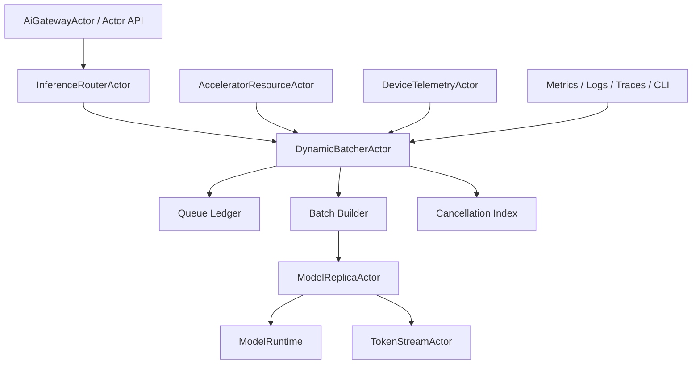

# AI-INF-002 Bounded Dynamic Batcher With Cancellation Design

**Status:** Proposed design; implementation not started
**Requirement ID:** AI-INF-002
**Parent Architecture:** [Distributed AI Model Inference and Training Architecture](distributed-ai-model-inference-training-architecture.md)
**Depends On:** [AI-INF-001](model-replica-lifecycle-design.md), [AI-RUN-001](model-runtime-plugin-abi-design.md), [AI-RUN-002](mock-model-runtime-design.md), [AI-ACC-001](accelerator-resource-plane-design.md), [AI-ACC-002](accelerator-observability-telemetry-design.md)
**Related Requirements:** [AI-MLX-001](mlx-runtime-plugin-design.md), [AI-INF-003](streaming-token-response-design.md), [AI-MOD-001](model-registry-artifact-metadata-design.md), [AI-OBS-001](ai-observability-request-token-metrics-design.md), [AI-SEC-001](ai-tenant-model-authorization-design.md), [AI-DATA-001](tensor-buffer-handle-data-plane-design.md)

## 1. Executive Summary

AI-INF-002 defines `DynamicBatcherActor`, a bounded actor-owned admission and
microbatch formation component for single-node inference. The batcher accepts
validated inference work from the router, applies queue, token, byte, deadline,
tenant, and resource-pressure budgets, forms batches for compatible model
replicas, and handles cancellation across queued, assigned, running, and
streaming requests.

The batcher exists because actor mailboxes alone are not an inference admission
policy. Model serving needs bounded queues with model-aware budgets, explicit
rejection reasons, deadline-aware scheduling, and cancellation that can release
queue slots, batch slots, KV cache reservations, stream actors, and runtime
request state. All of this must be testable with `MockModelRuntime` before
MLX-specific optimization exists.

## 2. Goals

1. Bound every batcher queue by request count, estimated tokens, estimated
   bytes, and optional tenant share.
2. Form microbatches using configurable max requests, token budget, byte
   budget, deadline, and max wait.
3. Support idempotent cancellation before and after a request is assigned to a
   replica.
4. Preserve request ordering guarantees defined by scheduling policy, not by
   accidental mailbox order.
5. Return structured admission outcomes such as `QueueFull`,
   `TokenBudgetExceeded`, `DeadlineExceeded`, `ReplicaUnavailable`, and
   `DevicePressureHigh`.
6. Integrate with `ModelReplicaActor` readiness, generation, in-flight
   capacity, and failure semantics.
7. Provide deterministic tests with `MockModelRuntime` and controllable time.
8. Keep batching policy backend-neutral while allowing MLX runtime hints.

## 3. Non-Goals

- Implementing vLLM, paged attention, speculative decoding, or backend-native
  continuous batching internals.
- Owning HTTP streams or token delivery to clients. That belongs to AI-INF-003.
- Owning model placement or rollout policy.
- Solving distributed shard scheduling.
- Guaranteeing exactly-once model execution.
- Inferring prompt token counts with an embedded tokenizer in the first
  implementation. Estimates may be supplied by ingress or tokenizer metadata.

## 4. Design Approach

Three approaches were considered:

| Approach | Trade-off |
|----------|-----------|
| Send every request directly to a replica | Lowest latency at tiny scale, but no model-aware overload control, weak batching, and poor cancellation accounting. |
| Put batching inside each model runtime | Lets engines optimize internally, but makes HPActor admission, queue visibility, and cancellation backend-specific. |
| Actor-owned batcher in front of replicas | Recommended. Keeps admission and cancellation observable while still allowing backend runtime hints. |

The recommended first design uses one `DynamicBatcherActor` per model version
or compatible replica group. It owns the queued work ledger and dispatches
microbatches to ready replicas. Later backend-specific runtimes can advertise
`supports_batching` or `supports_continuous_batching`, but the actor-owned
admission contract remains stable.

## 5. Architecture



Primary components:

- `DynamicBatcherActor`: actor-owned queue, policy, and dispatch coordinator.
- `BatchAdmissionPolicy`: deterministic admission decision function.
- `BatchBuilder`: selects compatible queued work for one replica dispatch.
- `CancellationIndex`: maps request id and stream id to queue or in-flight
  state.
- `ReplicaPicker`: selects a ready replica snapshot and validates generation.
- `BatchTimer`: scheduled self-message for max-wait and deadline triggers.

## 6. Batcher Scope

One batcher should serve work with compatible batching requirements:

- same model name
- same model version or rollout generation
- same runtime backend
- compatible output mode
- compatible tensor/device requirements
- compatible tokenizer or prompt metadata

Separate batchers are recommended for unrelated model versions or materially
different policies. This avoids building a central multi-model queue before the
single-node lifecycle is proven.

## 7. Data Model

### 7.1 Request Envelope

```cpp
struct QueuedInferenceRequest {
    RequestId request_id;
    TraceContext trace;
    ActorAddress reply_to;
    StreamId stream_id;
    std::string tenant_id;
    std::string model_name;
    std::string model_version;
    uint64_t estimated_input_tokens;
    uint64_t max_output_tokens;
    uint64_t estimated_input_bytes;
    uint64_t estimated_output_bytes;
    Deadline deadline;
    InferenceOutputMode output_mode;
    PriorityClass priority;
    TensorHandle input_handle;
};
```

Prompt text or sensitive payloads should not be stored in the batcher unless an
explicit bounded inline-input policy allows it.

### 7.2 Batch Policy

```cpp
struct DynamicBatchPolicy {
    uint32_t max_queue_requests;
    uint64_t max_queue_tokens;
    uint64_t max_queue_bytes;
    uint32_t max_batch_requests;
    uint64_t max_batch_tokens;
    uint64_t max_batch_bytes;
    std::chrono::milliseconds max_wait;
    std::chrono::milliseconds min_deadline_slack;
    uint32_t max_in_flight_batches;
    bool enable_priority;
    bool enable_tenant_fairness;
    bool reject_on_high_device_pressure;
};
```

The default policy for Milestone 1 should be conservative: bounded queue,
bounded batch size, first-ready dispatch, deadline-aware rejection, and no
unbounded tenant-specific queues.

### 7.3 Batch Record

```cpp
enum class BatchState : uint8_t {
    Building,
    Assigned,
    Running,
    Completing,
    Completed,
    Failed,
    Cancelled,
};

struct InferenceBatch {
    BatchId batch_id;
    ModelReplicaId replica_id;
    uint64_t replica_generation;
    BatchState state;
    std::vector<RequestId> request_ids;
    uint64_t total_input_tokens;
    uint64_t max_output_tokens;
    Deadline earliest_deadline;
};
```

The request vector is bounded by `max_batch_requests`.

### 7.4 Request State

```cpp
enum class BatcherRequestState : uint8_t {
    Queued,
    Assigned,
    Running,
    Streaming,
    Cancelling,
    Completed,
    Failed,
    Cancelled,
};
```

Every request id appears in exactly one state record until final completion is
reported and retention expires.

## 8. Admission Contract

Admission is a pure decision over current queue state, request metadata, model
policy, tenant policy, replica readiness, and resource pressure.

Admission checks:

1. model/version still routeable
2. deadline has enough slack for queue and runtime execution
3. estimated tokens fit per-request and queue budgets
4. estimated bytes fit per-request and queue budgets
5. queue request count remains under capacity
6. tenant share remains under capacity when enabled
7. replica group has at least one routeable or warming-by-policy replica
8. device pressure policy allows new queueing
9. output mode is supported by selected runtime capability

Structured rejection reasons:

- `ModelUnavailable`
- `ModelVersionUnavailable`
- `QueueFull`
- `TokenBudgetExceeded`
- `ByteBudgetExceeded`
- `DeadlineTooSoon`
- `TenantQuotaExceeded`
- `ReplicaUnavailable`
- `DevicePressureHigh`
- `UnsupportedOutputMode`
- `RejectedByPolicy`

Rejected work is not enqueued. The response includes a stable reason code,
optional `retry_after_ms`, queue pressure snapshot, and trace id.

## 9. Batch Formation

Batch formation triggers:

- queue was previously empty and new work arrives
- queue reaches `max_batch_requests`
- queue reaches `max_batch_tokens` or `max_batch_bytes`
- oldest queued request reaches `max_wait`
- earliest deadline approaches `min_deadline_slack`
- a replica transitions to ready or capacity becomes available
- cancellation frees enough budget to form a better batch

Selection rules for the first implementation:

1. choose a ready replica snapshot with in-flight capacity
2. select compatible queued requests in priority and deadline order
3. stop before crossing request, token, or byte budget
4. skip cancelled tombstones
5. dispatch the batch with replica generation
6. start a batch timeout or deadline alarm

The first implementation does not need backend-native continuous batching, but
the batch record should allow later prefill/decode separation and token-step
rescheduling.

## 10. Cancellation Contract

Cancellation is idempotent. A duplicate `CancelInference` for the same request
returns the current final or cancelling state.

Cancellation states:

| Current state | Batcher action | Runtime action |
|---------------|----------------|----------------|
| `Queued` | remove from queue or mark tombstone; release queue budgets | none |
| `Assigned` | mark cancelling; include cancel before dispatch if possible | none if dispatch has not crossed the runtime boundary |
| `Running` | mark cancelling; forward cancel to replica | replica calls runtime `cancel()` |
| `Streaming` | notify stream actor and replica | stream actor closes; runtime `cancel()` |
| `Completed` | no-op | none |
| `Failed` | no-op | none |
| `Cancelled` | no-op | none |

Cancellation must release:

- queue count budget
- queued token and byte budget
- batch slot if not yet dispatched
- stream actor ownership when created
- KV cache reservation when that plane exists
- trace span final status

If runtime cancellation is best-effort, the batcher keeps the request in
`Cancelling` until the replica reports final `Cancelled`, `Completed`, or
`Failed`. A late successful completion for a cancelled request is surfaced as
`CompletedAfterCancel` in diagnostics and metrics, but the client-facing
response remains governed by the cancellation policy.

## 11. Replica Interaction

The batcher sends one of two request types to `ModelReplicaActor`:

- `RunInference` for non-streaming or whole-result work
- `StartTokenStream` for streaming work

Each dispatch includes:

- batch id
- request ids
- expected replica generation
- trace context or span links
- deadline
- cancellation tokens
- bounded input metadata and tensor handles
- output stream ids where applicable

Replica responses:

- `BatchAccepted`
- `BatchRejected`
- `BatchCompleted`
- `BatchFailed`
- `RequestCompleted`
- `RequestFailed`
- `RequestCancelled`
- `ReplicaGenerationStale`
- `ReplicaDraining`

If the replica rejects with `ReplicaGenerationStale`, the batcher refreshes
router snapshots once and may retry eligible requests if deadlines allow.

## 12. Time And Scheduling Contract

The batcher must use HPActor scheduled messages or a controllable test clock,
not fixed sleeps.

Timers:

- queue max-wait alarm for oldest request
- earliest-deadline alarm
- batch execution timeout
- cancellation grace timeout
- retention cleanup alarm for final request records

Tests should use deterministic scheduler control where possible. Timing
assertions should be state-based rather than millisecond-specific.

## 13. Backpressure And Fairness

The batcher reports pressure to routers and ingress:

- current queue request count
- current queued estimated tokens
- current queued estimated bytes
- oldest queue age
- in-flight batch count
- rejection counters by reason
- per-priority or per-tenant usage when enabled

Fairness starts simple:

- P0 implementation: global bounded queue plus optional static priority.
- Later: tenant shares and weighted fair queuing with bounded per-tenant state.

Fairness must not create unbounded tenant-cardinality metrics. Tenant-specific
details should be available through admin queries with explicit filters.

## 14. MLX-First Considerations

MLX does not change the public batcher contract, but it affects policy:

- token and byte estimates must account for Apple unified-memory pressure.
- device pressure from AI-ACC-002 can reject or slow new admission.
- batch policy should expose hints such as `preferred_prefill_batch_tokens`
  and `preferred_decode_batch_requests` without requiring MLX in public
  headers.
- runtime `supports_batching` determines whether the replica receives one
  batch call or per-request calls under a batch trace.
- warmup state from AI-INF-001 gates batch dispatch.

## 15. Observability

Metrics:

- `hpactor_ai_batcher_admissions_total`
- `hpactor_ai_batcher_rejections_total`
- `hpactor_ai_batcher_queue_depth`
- `hpactor_ai_batcher_queue_tokens`
- `hpactor_ai_batcher_queue_bytes`
- `hpactor_ai_batcher_queue_delay_seconds`
- `hpactor_ai_batch_size`
- `hpactor_ai_batch_tokens`
- `hpactor_ai_batch_dispatch_total`
- `hpactor_ai_batcher_cancellations_total`
- `hpactor_ai_batcher_deadline_drops_total`

Trace spans:

- `ai.batcher.admit`
- `ai.batcher.queue`
- `ai.batcher.dispatch`
- `ai.batcher.cancel`
- `ai.batcher.reject`

CLI/admin surface:

- `/ai batchers`
- `/ai batcher <model> show`
- `/ai batcher <model> queue`
- `/ai requests --active`
- `/ai request <id> cancel`

Queue inspection must redact prompts and sensitive payloads by default.

## 16. Configuration

Example:

```toml
[[model]]
name = "chat-small"
version = "2026-05-20"
runtime = "mlx"

[model.batching]
enabled = true
max_queue_requests = 256
max_queue_tokens = 262144
max_queue_bytes = 67108864
max_batch_requests = 16
max_batch_tokens = 8192
max_batch_bytes = 16777216
max_wait_ms = 8
min_deadline_slack_ms = 50
max_in_flight_batches = 4
enable_priority = true
enable_tenant_fairness = false
reject_on_high_device_pressure = true
```

The parser should follow the existing self-registering TOML subsystem parser
pattern and keep `toml++` out of public interfaces.

## 17. Failure Semantics

| Failure | Batcher action | External outcome |
|---------|----------------|------------------|
| Queue budget exceeded | reject before enqueue | `QueueFull` or budget-specific reason |
| Deadline expires in queue | remove request | `DeadlineExceeded` |
| Replica drains before dispatch | refresh route or fail | `ReplicaUnavailable` or retry |
| Replica generation stale | refresh once if deadline allows | retry or `ModelUnavailable` |
| Runtime batch fails all requests | mark batch failed | per-request runtime error |
| Partial request failure | complete unaffected requests | failed request gets structured error |
| Cancel arrives while dispatching | mark cancelling and forward if needed | final cancelled outcome |
| Batcher actor drains | stop new admission, drain queued by policy | complete, cancel, or reject |

Queued requests that cannot be delivered because the batcher is stopping should
receive structured final outcomes rather than silently disappearing.

## 18. Testing Strategy

Deterministic tests with `MockModelRuntime`:

- admission accepts until each budget is reached
- rejection reason matches the first configured failing budget
- max-wait timer dispatches a partial batch
- token budget stops batch formation before overflow
- deadline ordering wins over arrival ordering when configured
- queued cancellation removes budget usage
- running cancellation forwards to replica and runtime
- streaming cancellation closes stream actor and runtime request
- stale replica generation refreshes and retries once
- replica drain rejects new dispatch
- batcher drain rejects new work and finishes or cancels queued work by policy
- metrics counters match admission, rejection, dispatch, and cancellation

Stress tests:

- high-rate enqueue/cancel race with bounded queue
- many duplicate cancellations for the same request
- route invalidation during batch formation
- shutdown while batches are running

## 19. Acceptance Criteria

AI-INF-002 is ready for implementation when:

- queue and batch budgets have explicit types and tests
- all admission failures return stable reason codes
- cancellation is idempotent across all request states
- timers are driven through HPActor scheduling or deterministic test control
- the batcher integrates with replica generation and drain semantics
- prompts and large tensors are not copied into unbounded actor messages
- `MockModelRuntime` can validate dispatch, partial failure, and cancellation
  without MLX hardware

## 20. Open Questions

1. Should the first batcher use one global queue per model version or one queue
   per priority class with strict capacity partitions?
2. Should tenant fairness be a P0 capability or deferred until the quota engine
   exists?
3. Should continuous batching be modeled in this actor immediately, or left as
   a runtime capability surfaced through `ModelRuntimeDescriptor`?
4. What retry limit should apply after replica generation staleness?
