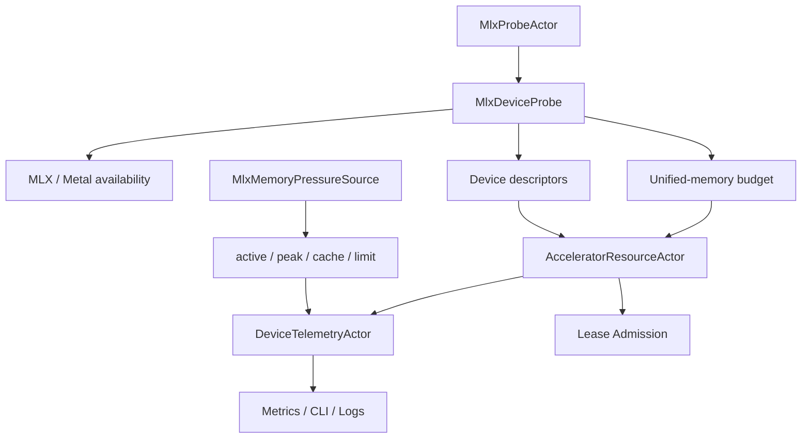

# AI-MLX-002 MLX/Metal Device Probe And Unified-Memory Design

**Status:** Proposed design; implementation not started
**Requirement ID:** AI-MLX-002
**Parent Architecture:** [Distributed AI Model Inference and Training Architecture](distributed-ai-model-inference-training-architecture.md)
**Related Requirements:** [AI-ACC-001](accelerator-resource-plane-design.md), [AI-ACC-002](accelerator-observability-telemetry-design.md), [AI-MLX-001](mlx-runtime-plugin-design.md), [AI-MLX-003](mlx-tensor-handle-design.md)

## 1. Executive Summary

AI-MLX-002 defines the MLX/Metal device probe and Apple unified-memory pressure
accounting model. On Apple silicon, CPU and GPU share one physical memory pool,
and MLX arrays are not permanently tied to a device. Operations are scheduled
on CPU or GPU streams. That makes a CUDA-style "GPU VRAM inventory" model the
wrong first abstraction.

The design adds an optional `MlxDeviceProbe` and `MlxMemoryPressureSource`.
Together they produce HPActor-owned device descriptors, unified-memory budgets,
MLX memory samples, and pressure state inputs for `AcceleratorResourceActor` and
`DeviceTelemetryActor`. The probe must be deterministic enough for tests, safe
when MLX or Metal is unavailable, and isolated from public HPActor headers.

## 2. Goals

1. Discover whether MLX and Metal-backed GPU execution are available.
2. Create HPActor-owned descriptors for Apple CPU, MLX GPU, and mock devices.
3. Model Apple unified memory as the first accelerator memory budget.
4. Feed allocatable memory, active memory, cache memory, peak memory, and memory
   limits into AI-ACC-001 and AI-ACC-002.
5. Avoid creating false compute-utilization metrics when MLX does not expose a
   reliable source.
6. Keep MLX and Metal calls off event-loop and cooperative scheduler hot paths.
7. Preserve no-exception, no-RTTI, no-vendor-header public APIs.
8. Support deterministic mock probe behavior in CI without Apple GPU hardware.

## 3. Non-Goals

- Implementing a Metal profiler, GPU performance counter backend, or kernel
  capture tool.
- Managing MLX tensor lifetimes; that belongs to AI-MLX-003.
- Loading models or running inference; that belongs to AI-MLX-001.
- Automatically clearing MLX caches or revoking leases based on pressure.
- Reporting per-process system memory from every macOS API in the first
  implementation.
- Supporting CUDA/ROCm device probing in this requirement.

## 4. Design Approach

Three approaches were considered:

| Approach | Trade-off |
|----------|-----------|
| Treat MLX GPU like a CUDA GPU with separate VRAM | Familiar, but inaccurate on Apple silicon because CPU and GPU share memory. |
| Only report MLX runtime memory counters | Useful for debugging, but insufficient for admission because leases need a configured budget. |
| Combine MLX/Metal availability, configured unified-memory budgets, and MLX runtime memory samples | Recommended. It matches Apple silicon semantics and supports deterministic admission. |

The recommended design separates static-ish device discovery from runtime memory
pressure:

- `MlxDeviceProbe` reports device descriptors, MLX availability, Metal
  availability, and configured budgets.
- `MlxMemoryPressureSource` reports active, peak, cache, and limit bytes.
- `AcceleratorResourceActor` owns health, leases, and admission budgets.
- `DeviceTelemetryActor` owns pressure state and metrics export.

## 5. Architecture



Components:

- `MlxProbeActor`: `PollingActor` or `DaemonActor` that runs MLX/Metal probe
  work away from hot paths.
- `MlxDeviceProbe`: no-throw probe interface implementation compiled behind
  `ENABLE_MLX`.
- `MlxMemoryPressureSource`: runtime telemetry source for MLX memory counters.
- `UnifiedMemoryBudget`: HPActor-owned budget derived from config and optional
  system/device metadata.
- `MlxDeviceDescriptor`: normalized descriptor for the resource plane.

## 6. Device Descriptor Model

The probe produces HPActor-owned descriptors. It does not expose MLX or Metal
types.

```cpp
struct MlxDeviceDescriptor {
    DeviceId device_id;
    DeviceKind kind;
    DeviceVendor vendor;
    std::string backend;       // "mlx"
    std::string name;
    bool mlx_available;
    bool metal_available;
    bool cpu_available;
    bool gpu_available;
    uint64_t unified_memory_total_bytes;
    uint64_t unified_memory_allocatable_bytes;
    uint64_t configured_memory_limit_bytes;
    uint64_t configured_wired_limit_bytes;
    std::vector<std::pair<std::string, std::string>> labels;
};
```

Initial device identity:

- CPU descriptor: `kind=Cpu`, `vendor=Apple` when running on Apple silicon.
- GPU descriptor: `kind=Gpu`, `vendor=Apple`, `backend=mlx` when MLX GPU or
  Metal backend is available.
- Mock descriptor: produced by mock probe and used in deterministic tests.

`device_id` is still node-local and assigned by `AcceleratorResourceActor` from
deterministic descriptor ordering.

Labels:

- `backend=mlx`
- `platform=macos`
- `arch=arm64`
- `memory_model=unified`
- `device_role=cpu` or `device_role=gpu`

Default metrics may use only the bounded labels defined by AI-ACC-002.

## 7. Unified-Memory Budget Model

Unified memory is one shared pool. HPActor therefore uses a configured
allocatable budget instead of trying to discover a separate GPU VRAM capacity.

```cpp
struct UnifiedMemoryBudget {
    uint64_t total_bytes;
    uint64_t allocatable_bytes;
    uint64_t runtime_limit_bytes;
    uint64_t wired_limit_bytes;
    double warm_ratio;
    double high_ratio;
    double critical_ratio;
    bool total_bytes_available;
    bool runtime_limit_available;
};
```

Budget sources, in priority order:

1. explicit model or runtime config, such as `unified_memory_mb`
2. `[system.ai.mlx].memory_limit_mb`
3. MLX runtime memory limit when configured
4. conservative fallback budget derived from host memory only when safe
5. unavailable, which rejects accelerator-required loads with a structured
   admission failure

Admission rules:

- `allocatable_bytes` is the maximum lease budget for MLX GPU work.
- `reserved_bytes` comes from active leases.
- `active_bytes` and `cache_bytes` come from MLX runtime telemetry.
- pressure ratio is `(active_bytes + cache_bytes) / runtime_limit_bytes` when
  limit is available, otherwise `(reserved_bytes / allocatable_bytes)`.
- cache bytes are included in pressure but are not automatically cleared.

## 8. Probe Lifecycle

Startup:

1. `MlxProbeActor` starts after core metrics/logging/tracing setup.
2. It checks platform and build gates.
3. It calls MLX/Metal availability APIs through private adapter code.
4. It builds descriptors and sends `DeviceSnapshotUpdate` to
   `AcceleratorResourceActor`.
5. It registers MLX memory telemetry with `DeviceTelemetryActor`.

Periodic probing:

- device availability is sampled at `probe_interval_ms`
- memory pressure is sampled at `sample_interval_ms` by telemetry source
- descriptor changes carry a `probe_epoch`
- repeated failures transition source freshness to stale, not zero

Shutdown:

- probe actor drains before runtime destruction
- no new telemetry samples are sent after runtime unload completes
- stale telemetry is acceptable during shutdown and must not block drain

## 9. MLX/Metal Signal Mapping

| Source Signal | HPActor Use |
|---------------|-------------|
| MLX availability | Enables `MlxModelRuntime` and MLX probe descriptors. |
| MLX device count/default device | Selects CPU/GPU descriptor availability. |
| MLX/Metal device info | Adds descriptor metadata and bounded labels. |
| active memory | Feeds `memory.active_bytes`. |
| peak memory | Feeds `memory.peak_bytes`. |
| cache memory | Feeds `memory.cache_bytes`. |
| configured memory limit | Feeds `memory.limit_bytes` and admission budget. |
| wired limit | Feeds `memory.wired_limit_bytes` when configured. |
| stream synchronization | Diagnostic-only; disabled by default. |

Compute utilization:

- The first implementation exports no MLX compute utilization unless a true
  source exists.
- Lease utilization and memory pressure are exported separately and must not be
  mislabeled as compute utilization.

## 10. Configuration

Example:

```toml
[system.ai.mlx]
enabled = true
device = "gpu"
prefer_gpu = true
allow_cpu_fallback = true
memory_limit_mb = 24576
wired_limit_mb = 0
clear_cache_on_unload = true

[system.ai.accelerators.mlx]
enabled = true
probe_interval_ms = 1000
missing_device_grace_ms = 5000
require_metal = false

[system.ai.telemetry.mlx]
enabled = true
sample_memory = true
sample_interval_ms = 1000
synchronize_before_sample = false
peak_reset_policy = "process"
```

Defaults:

- MLX probing is enabled when `[system.ai.mlx].enabled = true`.
- GPU is preferred when available.
- CPU fallback is allowed in development configs and model-specific when
  configured.
- `synchronize_before_sample` is false.
- `memory_limit_mb` must be set for accelerator-required production model
  deployments until a safer automatic policy is defined.

## 11. Integration Points

AI-ACC-001:

- receives `DeviceSnapshotUpdate`
- owns health state and lease accounting
- uses unified-memory allocatable bytes for admission
- rejects loads when required MLX resources are unavailable

AI-ACC-002:

- receives memory pressure samples
- exports active, peak, cache, limit, reserved, and pressure metrics
- marks samples stale when probe or runtime telemetry stops

AI-MLX-001:

- requires a compatible MLX descriptor and lease before `load()`
- reports runtime telemetry to the same telemetry source
- may update memory limits at runtime only through explicit config or admin
  action

AI-MLX-003:

- tensor handles reference descriptors and memory budget ids
- handle metadata uses unified-memory device kind

## 12. Failure Semantics

| Failure | Runtime Behavior |
|---------|------------------|
| `ENABLE_MLX=OFF` | MLX probe is not registered; MLX runtime config is rejected with `MlxNotBuilt`. |
| non-arm64 macOS or Rosetta | native MLX probe reports `UnsupportedPlatform`; sidecar may still be configured explicitly. |
| MLX unavailable | MLX device descriptors are absent; CPU/mock devices may remain available. |
| Metal unavailable | GPU descriptor is absent or degraded based on `require_metal`. |
| memory budget missing | accelerator-required loads are rejected with `MemoryBudgetUnavailable`. |
| memory sample fails | last good sample remains active until stale threshold. |
| impossible sample values | sample rejected and source error counter increments. |
| probe actor restarts | descriptors are resent with a new epoch; leases are reconciled by resource actor. |
| device disappears | resource actor owns degraded/unavailable/lost transition. |

## 13. Testing Strategy

Unit tests:

- config default resolution
- platform/build gate mapping
- MLX availability mapping with fake adapter
- descriptor normalization and deterministic ordering
- unified-memory budget calculation
- pressure ratio calculation
- missing budget rejection
- stale sample behavior

Integration tests:

- resource actor starts with mock MLX descriptors
- MLX GPU-required model fails when descriptor is absent
- CPU fallback model admits when GPU is absent and fallback is allowed
- memory pressure appears in metrics and CLI snapshots
- probe restart resends descriptors without duplicating device ids

Native gated tests:

- arm64 macOS smoke probe
- Metal availability descriptor
- MLX memory counters after simple evaluated workload

Stress tests:

- rapid probe updates while leases are active
- memory sample storm coalescing
- repeated source failure/recovery
- long-running pressure soak with fake telemetry

## 14. Acceptance Criteria

AI-MLX-002 is complete when:

- MLX/Metal probing is optional and behind `ENABLE_MLX`.
- Public HPActor headers expose no MLX or Metal types.
- CPU, GPU, and mock descriptor paths are deterministic.
- Apple unified memory is modeled as a configured allocatable budget.
- MLX active, peak, cache, and limit bytes feed AI-ACC-002 telemetry.
- Accelerator-required MLX workloads are rejected when no valid budget or
  descriptor exists.
- CPU fallback is explicit and observable.
- Compute utilization is omitted unless a true source exists.
- Probe and telemetry failures become structured health, pressure, log, and
  metric outcomes.

## 15. Open Questions

1. Should production configs require an explicit `memory_limit_mb`, or should
   HPActor derive a conservative default from host memory?
2. Should `require_metal = true` be the default for model deployments that say
   `device = "mlx-gpu"`?
3. What is the first acceptable true compute-utilization source for Apple
   silicon, if any?
4. Should MLX CPU and MLX GPU be represented as separate devices or one
   unified-memory runtime with separate execution roles?
5. Should wired memory limit be set by HPActor, or only observed when users set
   it externally?

## 16. External Design Inputs

- [MLX unified memory](https://ml-explore.github.io/mlx/build/html/usage/unified_memory.html)
  for Apple silicon shared-memory semantics.
- [MLX memory APIs](https://ml-explore.github.io/mlx/build/html/python/_autosummary/mlx.core.get_active_memory.html)
  for active, peak, cache, limit, cache-clear, and wired-limit telemetry.
- [MLX Metal device information](https://ml-explore.github.io/mlx/build/html/python/_autosummary/mlx.core.metal.device_info.html)
  for initial device metadata.
- [MLX streams](https://ml-explore.github.io/mlx/build/html/usage/using_streams.html)
  for CPU/GPU operation scheduling.
