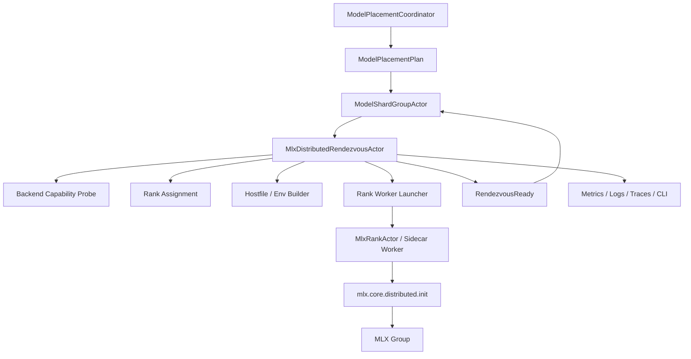
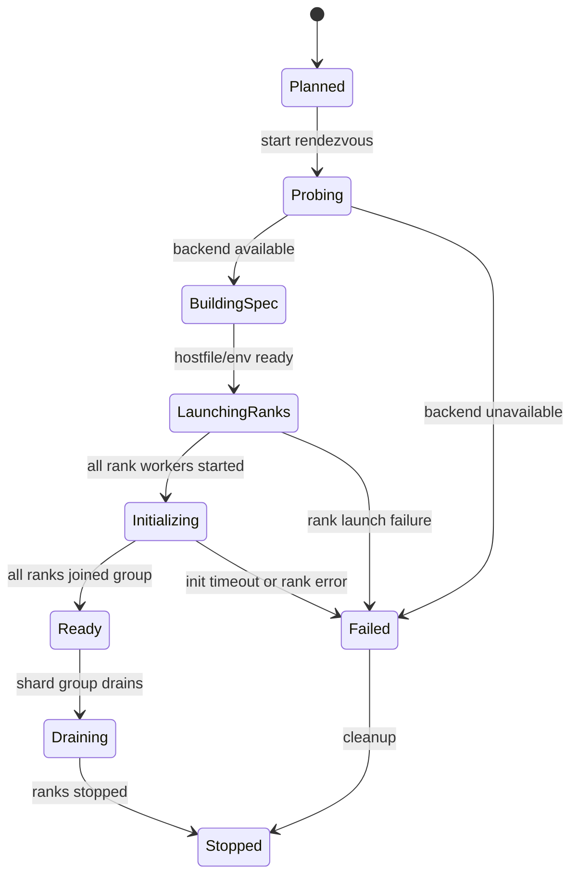

# AI-DIST-MLX-001 MLX Distributed Rendezvous Adapter Design

**Status:** Proposed design; implementation not started
**Requirement ID:** AI-DIST-MLX-001
**Parent Architecture:** [Distributed AI Model Inference and Training Architecture](distributed-ai-model-inference-training-architecture.md)
**Depends On:** [AI-DIST-001](model-placement-coordinator-design.md), [AI-DIST-002](model-shard-group-readiness-stale-routes-design.md), [AI-MLX-001](mlx-runtime-plugin-design.md), [AI-ACC-001](accelerator-resource-plane-design.md), [AI-ACC-002](accelerator-observability-telemetry-design.md)
**Related Requirements:** [AI-DATA-001](tensor-buffer-handle-data-plane-design.md), [AI-OBS-001](ai-observability-request-token-metrics-design.md), [AI-SEC-001](ai-tenant-model-authorization-design.md), [AI-MOD-001](model-registry-artifact-metadata-design.md), [AI-TRN-001](training-job-worker-group-lifecycle-design.md), [AI-TRN-002](training-rank-rendezvous-checkpoint-design.md), [AI-OPS-001](ai-admin-cli-operations-design.md), [AI-TST-001](ai-fault-injection-chaos-testing-design.md)

## 1. Executive Summary

AI-DIST-MLX-001 defines the adapter that translates HPActor placement and shard
group metadata into MLX distributed communication setup. HPActor owns placement,
rank assignment, lifecycle, rendezvous epochs, health, cancellation, audit, and
observability. MLX owns distributed communication operations and tensor
collectives.

The MLX documentation currently describes distributed backends including MPI,
ring, JACCL, and NCCL. `mlx.core.distributed.init()` accepts backend values such
as `mpi`, `ring`, `nccl`, `jaccl`, and `any`. The ring backend uses TCP sockets
and is broadly available; JACCL targets low-latency RDMA over Thunderbolt; NCCL
is for CUDA environments. The HPActor adapter should discover which backend is
usable, create deterministic rank and hostfile metadata, launch or configure
rank workers, wait for readiness, and report a structured rendezvous result to
AI-DIST-002.

## 2. Goals

1. Map `ModelPlacementPlan` assignments into MLX rank, world size, hostfile,
   environment, and backend configuration.
2. Support MLX ring, MPI, JACCL, NCCL, and `any` backend selection without
   hard-coding one backend into HPActor core.
3. Gate shard-group readiness on MLX distributed group initialization when a
   deployment requires collectives.
4. Support native and sidecar MLX runtime modes behind the same actor-facing
   contract.
5. Keep MLX headers, Python objects, exceptions, and backend-specific details
   out of HPActor public APIs.
6. Make rendezvous failures structured and observable.
7. Provide deterministic mock rendezvous tests without real MLX hardware or
   multiple machines.
8. Preserve the rule that HPActor does not carry tensor-parallel payloads
   through actor messages.

## 3. Non-Goals

- Implementing MLX collectives, ring algorithms, MPI, JACCL, or NCCL.
- Replacing `mlx.launch` for every development workflow.
- Guaranteeing performance for any distributed inference topology.
- Managing SSH credentials or arbitrary remote shell access in HPActor core.
- Defining model partitioning algorithms in detail.
- Supporting transparent live tensor migration between ranks.
- Making MLX a required dependency for non-AI HPActor builds.

## 4. Design Approach

Three approaches were considered:

| Approach | Trade-off |
|----------|-----------|
| Shell out to `mlx.launch` for all distributed jobs | Fast for experiments, but weak lifecycle, security, and rank health integration. |
| Native MLX distributed integration only | Best steady-state control, but risks early coupling to platform-specific APIs. |
| HPActor rendezvous adapter with native and sidecar launch modes | Recommended. It preserves one control contract and lets each deployment choose the safest MLX integration path. |

The recommended first implementation uses `MlxDistributedRendezvousActor` to
generate rank specs and launch sidecar or runtime workers through HPActor-owned
actor/process supervision. Development configs may still use `mlx.launch`
compatibility mode, but production-oriented paths should avoid unmanaged SSH or
opaque shell orchestration.

## 5. Architecture



Primary components:

- `MlxDistributedRendezvousActor`: owns rendezvous spec, epoch, backend choice,
  rank launch, readiness, and failure state.
- `MlxDistributedRuntime`: runtime adapter surface used by replica or shard
  actors.
- `MlxRankActor`: supervises one rank process or native runtime instance.
- `MlxBackendProbe`: detects whether ring, MPI, JACCL, NCCL, or any backend is
  usable.
- `MlxHostfileBuilder`: creates deterministic hostfile metadata for rank
  workers.
- `MlxRendezvousSnapshot`: immutable readiness and diagnostics snapshot.

## 6. Backend Model

```cpp
enum class MlxDistributedBackend : uint8_t {
    Any,
    Ring,
    Mpi,
    Jaccl,
    Nccl,
};

struct MlxBackendCapabilities {
    MlxDistributedBackend backend;
    bool available;
    bool supports_arbitrary_send_recv;
    bool supports_all_reduce;
    bool supports_all_gather;
    bool requires_hostfile;
    bool requires_external_launcher;
    std::string reason_if_unavailable;
};
```

Backend policy:

- `Ring` is the default Apple-silicon multi-node development backend when nodes
  are reachable over TCP and no lower-latency backend is proven available.
- `Jaccl` is preferred for Apple-silicon Thunderbolt/RDMA topologies when
  capability probing and deployment policy allow it.
- `Mpi` is allowed when MPI is installed and explicitly configured.
- `Nccl` is reserved for CUDA deployments and is not an Apple-silicon default.
- `Any` lets MLX choose, but HPActor should still record the backend that
  initialized successfully.

The adapter must record backend limitations. For example, MLX ring
communication is ring-shaped and does not provide arbitrary peer-to-peer
`send()`/`recv()` behavior in the same way as fuller communication libraries.

## 7. Rendezvous Data Model

```cpp
struct MlxRendezvousEpoch {
    ModelPlacementEpoch placement_epoch;
    uint64_t rendezvous_generation;
};

struct MlxRankSpec {
    uint32_t rank;
    uint32_t world_size;
    NodeId node_id;
    ActorAddress rank_actor;
    DeviceId device_id;
    std::string listen_host;
    uint16_t listen_port;
    std::vector<std::string> peer_hosts;
    MlxDistributedBackend backend;
};

struct MlxRendezvousSpec {
    MlxRendezvousEpoch epoch;
    MlxDistributedBackend requested_backend;
    std::vector<MlxRankSpec> ranks;
    std::chrono::milliseconds init_timeout;
    bool strict_backend;
};
```

Rendezvous generation increments when rank membership, backend choice,
hostfile, or placement epoch changes.

## 8. Lifecycle



Only `Ready` satisfies the AI-DIST-002 rendezvous readiness condition.

## 9. Launch And Initialization Contract

Rank launch modes:

- `native`: in-process optional MLX integration compiled behind `ENABLE_MLX`.
- `sidecar`: supervised Python or process worker with framed IPC.
- `mlx_launch_compat`: development-only compatibility mode that emits hostfile
  and command metadata for `mlx.launch`.

Initialization flow:

1. Shard group asks for rendezvous using a committed placement epoch.
2. Adapter probes configured backend availability.
3. Adapter builds rank specs and hostfile/env metadata.
4. Rank actors or sidecars are launched through HPActor supervision.
5. Each rank initializes MLX distributed group with strict backend policy.
6. Ranks report backend, rank, world size, and group readiness.
7. Adapter emits `MlxRendezvousReady` to `ModelShardGroupActor`.

HPActor should not place SSH credentials or shell command secrets in actor
messages, logs, metrics, or route snapshots.

## 10. Integration With Placement And Shards

AI-DIST-001 provides:

- placement epoch
- node and device assignment
- requested distributed backend
- topology hints
- lease ids

AI-DIST-002 consumes:

- rendezvous state
- rank readiness
- backend error reason
- rendezvous generation
- per-rank health

If a placement does not require distributed collectives, the rendezvous adapter
is not in the readiness path.

## 11. Failure Semantics

| Failure | Adapter behavior |
|---------|------------------|
| backend unavailable | fail rendezvous with `MlxDistributedBackendUnavailable` |
| strict backend fails but fallback allowed | retry with allowed fallback and record decision |
| rank launch failure | stop launched ranks and fail rendezvous |
| rank init timeout | cancel all ranks and fail rendezvous |
| hostfile mismatch | fail before rank launch |
| rank reports wrong epoch | reject rank and fail rendezvous |
| node down during init | fail rendezvous and notify shard group |
| rank dies after ready | notify shard group; fail or degrade by policy |
| duplicate rank id | fail closed and audit |
| adapter restart | reconstruct from shard group and rank snapshots or fail candidate epoch |

The first production-oriented recovery policy should restart the whole
distributed group rather than attempting partial rank repair.

## 12. Security And Audit

AI-SEC-001 gates:

- distributed rendezvous start
- forced backend override
- rank launch mode override
- hostfile inspection
- rank process stop

Audit events:

- rendezvous start
- backend selected
- backend fallback
- rank launch failure
- duplicate rank id
- forced stop

Redaction rules:

- do not log credentials
- redact hostfile paths when configured
- do not log full environment when it may contain secrets
- log node ids and bounded backend enums by default

## 13. Observability

Metrics:

- `hpactor_ai_mlx_rendezvous_total`
- `hpactor_ai_mlx_rendezvous_duration_seconds`
- `hpactor_ai_mlx_rendezvous_state`
- `hpactor_ai_mlx_rank_state`
- `hpactor_ai_mlx_backend_available`
- `hpactor_ai_mlx_backend_fallbacks_total`
- `hpactor_ai_mlx_rank_failures_total`

Trace spans:

- `ai.mlx.rendezvous.probe`
- `ai.mlx.rendezvous.build`
- `ai.mlx.rendezvous.launch`
- `ai.mlx.rendezvous.init`
- `ai.mlx.rank.init`
- `ai.mlx.rank.stop`

CLI/admin surface:

- `/ai mlx distributed backends`
- `/ai mlx rendezvous`
- `/ai mlx rendezvous <id> show`
- `/ai mlx rank <id> show`

## 14. Configuration

Example:

```toml
[system.ai.mlx.distributed]
enabled = true
backend = "ring"
strict_backend = true
launch_mode = "sidecar"
init_timeout_ms = 60000
allow_backend_fallback = false
allowed_fallbacks = ["ring", "mpi"]
redact_hostfile = true

[system.ai.mlx.distributed.ring]
port_base = 47000
interface = "en0"

[system.ai.mlx.distributed.jaccl]
enabled = true
require_thunderbolt_topology = true

[system.ai.mlx.distributed.compat]
allow_mlx_launch = false
```

## 15. Testing Strategy

Deterministic tests:

- backend probe selects configured available backend
- unavailable strict backend fails rendezvous
- fallback backend is selected only when allowed
- rank specs are deterministic for a placement plan
- hostfile builder emits expected rank order
- rank reports wrong epoch and is rejected
- duplicate rank id fails closed
- init timeout stops all rank workers
- ready rendezvous satisfies shard group readiness

Integration tests:

- mock two-rank distributed group reaches ready state
- shard group does not publish routes until rendezvous ready
- rank failure after ready invalidates shard group by policy
- forced backend override requires authorization and audit

Native or sidecar gated tests:

- local MLX `ring` initialization when available
- sidecar worker reports MLX backend selected by `mx.distributed.init`
- MLX backend unavailable maps to structured runtime error

## 16. Acceptance Criteria

AI-DIST-MLX-001 is ready for implementation when:

- rendezvous specs, rank specs, backend capabilities, and generations have
  explicit types
- backend selection and fallback policy are deterministic and observable
- shard-group readiness waits for MLX distributed readiness when required
- rank launch and initialization failures clean up partial groups
- HPActor public APIs expose no MLX, MPI, JACCL, NCCL, Python, or shell-specific
  object types
- credentials and hostfile details are redacted by default
- mock rendezvous tests run without MLX hardware

## 17. Open Questions

1. Should HPActor support `mlx_launch_compat` only as generated command output,
   or also as a supervised process mode for development?
2. Should `ring` be the default backend for Apple-silicon multi-node examples,
   or should backend default remain `any` and record the selected backend?
3. Should JACCL capability be inferred only from MLX backend availability, or
   also from topology labels reported by device probes?
4. Should partial rank restart be deferred until training orchestration defines
   a stronger recovery model?

## 18. External Design Inputs

- [MLX distributed communication](https://ml-explore.github.io/mlx/build/html/usage/distributed.html)
  for supported backend concepts and ring/JACCL/NCCL/MPI guidance.
- [`mlx.core.distributed.init`](https://ml-explore.github.io/mlx/build/html/python/_autosummary/mlx.core.distributed.init.html)
  for backend initialization options.
- [MLX distributed launching](https://ml-explore.github.io/mlx/build/html/usage/launching_distributed.html)
  for hostfile and launcher behavior.
