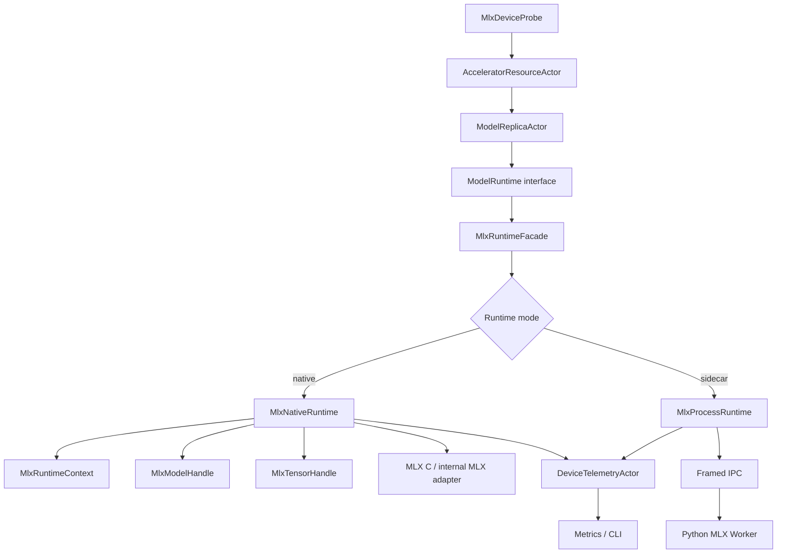

# AI-MLX-001 MLX Runtime Plugin Design

**Status:** Proposed design; implementation not started
**Requirement ID:** AI-MLX-001
**Parent Architecture:** [Distributed AI Model Inference and Training Architecture](distributed-ai-model-inference-training-architecture.md)
**Related Requirements:** [AI-MLX-002](mlx-device-probe-unified-memory-design.md), [AI-MLX-003](mlx-tensor-handle-design.md), [AI-ACC-001](accelerator-resource-plane-design.md), [AI-ACC-002](accelerator-observability-telemetry-design.md)

## 1. Executive Summary

AI-MLX-001 makes MLX the first real native model runtime backend for HPActor on
macOS Apple silicon. HPActor should still own actor lifecycle, bounded
admission, request routing, cancellation, telemetry, and failure semantics.
MLX owns tensor execution, lazy evaluation, streams, model math, memory caches,
and future distributed communication.

The runtime boundary is `MlxModelRuntime`, an optional backend behind the
generic `ModelRuntime` interface. It must not make non-AI HPActor users link
MLX, include MLX headers, enable exceptions, or depend on Apple-only APIs. The
first native adapter should prefer the MLX C bridge or a narrow internal C++
adapter because MLX C exposes opaque objects, stream/device handles, explicit
free calls, and integer error returns. A Python sidecar fallback remains part of
the design for MLX-LM workflows and for APIs that are not yet stable or
convenient through the native binding.

## 2. Goals

1. Add `MlxModelRuntime` as the first native non-mock backend.
2. Keep the public runtime ABI no-throw, no-RTTI, and source-compatible.
3. Isolate MLX headers, libraries, error handling, and Apple platform
   requirements behind `ENABLE_MLX`.
4. Support model load, warmup, inference, streaming decode, cancellation,
   telemetry, and unload through the same actor-facing contract as
   `MockModelRuntime`.
5. Integrate with accelerator leases, MLX/Metal device probes, MLX tensor
   handles, tracing, metrics, logs, CLI/admin, and graceful shutdown.
6. Force evaluation at explicit lifecycle boundaries so MLX lazy computation
   does not hide load, warmup, or inference failures.
7. Provide a sidecar path for Python-first MLX workflows without changing actor
   contracts.

## 3. Non-Goals

- Reimplementing MLX kernels, tokenizers, graph compilation, distributed
  collectives, or model libraries inside HPActor.
- Making MLX a required dependency of `hpactor_lib`.
- Defining the OpenAI HTTP API surface; that belongs to the inference serving
  plane.
- Defining every model format or tokenizer integration. This spec only defines
  the runtime boundary.
- Guaranteeing that every MLX model can run in-process. Some workflows may use
  the sidecar runtime.
- Passing MLX arrays through protobuf payloads.

## 4. Design Approach

Three approaches were considered:

| Approach | Trade-off |
|----------|-----------|
| Python MLX sidecar first | Fastest path for MLX-LM and experiments, but weaker type/lifetime integration and higher IPC overhead. |
| Native MLX C++ adapter only | Best performance and simplest steady-state runtime, but risks tight coupling to C++ exceptions, headers, and build details. |
| Runtime facade with native-first adapter and sidecar fallback | Recommended. It preserves one HPActor contract while letting the first implementation choose the safest MLX binding path per feature. |

The recommended shape is a `MlxRuntimeFacade` implementing `ModelRuntime`.
Behind it, `MlxNativeRuntime` is the default when `ENABLE_MLX` and native MLX
support are available. `MlxProcessRuntime` implements the same model operations
over framed IPC for Python MLX workflows. Both produce the same HPActor
results, telemetry, and error codes.

## 5. Architecture



Primary components:

- `MlxRuntimeFacade`: stable HPActor runtime implementation selected by config.
- `MlxNativeRuntime`: optional in-process MLX adapter.
- `MlxProcessRuntime`: process sidecar adapter for Python MLX.
- `MlxRuntimeContext`: runtime-owned state for device, stream policy, memory
  limits, error handling, model handles, tensor handles, and cancellation.
- `MlxModelHandle`: opaque loaded model id visible to HPActor only as a handle.
- `MlxTensorHandle`: opaque tensor/data-plane handle defined by AI-MLX-003.
- `MlxErrorBoundary`: internal component that maps MLX failures into stable
  `MlxRuntimeErrorCode` values.
- `MlxTelemetrySource`: runtime telemetry source consumed by AI-ACC-002.

## 6. Runtime Contract

`MlxModelRuntime` implements the same generic runtime interface used by all AI
backends:

```cpp
class ModelRuntime {
  public:
    virtual result<ModelHandle> load(const ModelLoadRequest& request) noexcept = 0;
    virtual result<void> warmup(ModelHandle model) noexcept = 0;
    virtual result<InferenceResult>
    infer(ModelHandle model, const InferenceRequest& request) noexcept = 0;
    virtual result<void>
    start_stream(ModelHandle model, const StreamRequest& request,
                 TokenSink& sink) noexcept = 0;
    virtual result<void> cancel(RequestId request_id) noexcept = 0;
    virtual ModelRuntimeStats stats(ModelHandle model) noexcept = 0;
    virtual result<void> unload(ModelHandle model) noexcept = 0;
};
```

MLX-specific contract:

- `load()` validates artifact metadata, device lease compatibility, model
  format, tokenizer binding, memory budget, and runtime mode.
- `warmup()` forces explicit MLX evaluation for configured warmup inputs.
- `infer()` returns only after the requested output has been evaluated or a
  structured asynchronous token stream has been started.
- `start_stream()` owns decode loop scheduling, token callbacks, and cancel
  checks. It must never call user callbacks while holding runtime internal
  locks.
- `cancel()` is best-effort and idempotent. It prevents future tokens and marks
  runtime-owned request state cancelled.
- `stats()` returns a snapshot; it must not call blocking MLX or Metal APIs.
- `unload()` releases model handles, tensor handles, and runtime-owned MLX
  arrays. Optional cache clearing is controlled by config.

MLX lazy evaluation rule:

- Load, warmup, inference, stream finalization, and unload boundaries must be
  explicit about whether they call `eval` or synchronize streams.
- A model cannot transition to `Ready` until required warmup evaluation has
  completed or failed with a structured error.
- Accessing scalar values, array data, or host copies is treated as an implicit
  evaluation boundary and must be captured in tracing and latency metrics.

## 7. Build And Packaging

Build configuration:

```cmake
option(ENABLE_MLX "Enable optional MLX runtime integration" OFF)
option(ENABLE_MLX_SIDECAR "Enable MLX process runtime support" ON)
option(ENABLE_MLX_NATIVE_TESTS "Enable native MLX tests that require Apple silicon" OFF)
```

Rules:

- `ENABLE_MLX=OFF` keeps HPActor buildable without MLX headers or libraries.
- Public HPActor headers expose only HPActor-owned interfaces and opaque ids.
- MLX includes live in private implementation files or private adapter headers.
- The first native implementation should prefer MLX C where practical because
  MLX C exposes opaque objects and integer status returns.
- If a C++ MLX adapter is needed, it must be isolated in optional translation
  units that convert failures to `result<T>` before re-entering HPActor code.
- macOS arm64 is the first supported native platform.
- Rosetta or x86_64 macOS native MLX runtime builds are rejected at configure
  time.
- Sidecar mode remains available when native MLX integration is not built.

Runtime config:

```toml
[[system.ai.runtime]]
name = "mlx"
kind = "in_process"
backend = "mlx"

[system.ai.mlx]
enabled = true
mode = "native"
device = "gpu"
prefer_gpu = true
allow_cpu_fallback = true
memory_limit_mb = 24576
clear_cache_on_unload = true
warmup_required = true
eval_policy = "warmup_and_result"
stream_policy = "runtime_owned"
sidecar_command = "python3"
sidecar_args = ["mlx_worker.py"]
```

Config defaults:

- `mode = "native"` when `ENABLE_MLX=ON`, otherwise `mode = "sidecar"` if
  sidecar support is enabled.
- `warmup_required = true`.
- `eval_policy = "warmup_and_result"`.
- `stream_policy = "runtime_owned"`.
- `allow_cpu_fallback = true` for development and false for explicitly
  accelerator-required models.

## 8. Error Model

```cpp
enum class MlxRuntimeErrorCode : uint16_t {
    NotBuilt,
    UnsupportedPlatform,
    MlxUnavailable,
    DeviceUnavailable,
    InvalidModelArtifact,
    UnsupportedModelFormat,
    TokenizerUnavailable,
    MemoryLimitExceeded,
    LeaseMismatch,
    LoadFailed,
    WarmupFailed,
    EvalFailed,
    StreamFailed,
    Cancelled,
    SidecarUnavailable,
    SidecarProtocolError,
    InternalError,
};
```

Error rules:

- No MLX exception, fatal default handler, Python traceback, or raw vendor error
  crosses into actor code.
- MLX C's default error handler must be overridden in native mode so HPActor can
  inspect return codes and convert them to `result<T>`.
- Error messages are redacted before logs and metrics.
- `Cancelled` is a normal terminal outcome, not a runtime failure.
- `MemoryLimitExceeded` includes lease id, model id, and device id when policy
  allows.
- Repeated runtime failures transition the replica to `Failed` and invalidate
  routes.

## 9. Runtime Lifecycle

Model replica lifecycle:

1. `ModelReplicaActor` acquires a `DeviceLease`.
2. It creates or reuses a `MlxRuntimeFacade`.
3. `load()` validates artifact metadata and creates `MlxModelHandle`.
4. `warmup()` runs configured prompt/input and forces evaluation.
5. Replica transitions to `Ready`.
6. Requests call `infer()` or `start_stream()`.
7. Drain stops new work and cancels or completes active streams.
8. `unload()` releases model and tensor handles.
9. Lease is released after unload completes or times out.

Shutdown rules:

- Ingress drains before model replicas unload.
- Active streams get cancellation signals before runtime destruction.
- `unload()` is bounded by timeout.
- If unload times out, actor state records a failed unload and releases the
  resource lease according to AI-ACC-001 timeout policy.

## 10. Concurrency Contract

MLX runtime calls must not run on the event loop or cooperative actor scheduler
hot path.

Execution rules:

- Runtime calls run on a dedicated model execution pool, dense-compute actor, or
  sidecar process.
- One `MlxRuntimeContext` owns its streams, handles, model state, and
  cancellation table.
- Requests for a single model replica are serialized unless the model declares
  safe parallel execution.
- `TokenSink` callbacks are delivered through actor messages or a bounded
  callback queue.
- MLX array handles are not shared across actors except through `MlxTensorHandle`
  references governed by AI-MLX-003.
- Runtime telemetry samples are coalesced before reaching metrics.

Stream policy:

- `runtime_owned`: runtime creates and owns MLX streams.
- `default_stream`: runtime uses MLX default stream for the selected device.
- `diagnostic_sync`: runtime synchronizes at configured boundaries for
  debugging only.

The default is `runtime_owned`.

## 11. Integration Points

Accelerator resource plane:

- `MlxModelRuntime` requires a compatible `DeviceLease` before load.
- Runtime stats feed lease activation and failed activation diagnostics.
- Memory limit and unified-memory budget come from AI-MLX-002.

Tensor/data plane:

- Inputs and outputs that contain arrays use `MlxTensorHandle`.
- Host copies are explicit and bounded.
- Protobuf control messages carry tensor metadata, not MLX arrays.

Observability:

- Metrics include model load duration, warmup duration, request latency,
  active streams, MLX active memory, MLX cache memory, and runtime errors.
- Logs include model id, runtime mode, device id, lease id, and error code.
- Traces include runtime backend, eval boundary, stream policy, and tensor
  handle metadata.

CLI/admin:

- `/ai runtime mlx stats`
- `/ai model <name> replicas`
- `/ai device <id> metrics`
- `/ai runtime mlx clear-cache` when authorized by a later security plane

## 12. Testing Strategy

Unit tests:

- config parsing and default resolution
- runtime mode selection
- error code mapping
- load/warmup/infer/unload state transitions with fake MLX adapter
- cancellation idempotence
- token sink ordering
- memory-limit rejection before load
- no public MLX header exposure

Integration tests:

- `ModelReplicaActor` loads a fake MLX model through `MlxRuntimeFacade`
- warmup must complete before readiness
- failed warmup keeps replica unroutable
- cancellation releases stream/request state
- unload releases tensor/model handles
- sidecar protocol errors map to structured runtime errors

Native gated tests:

- build and smoke test native MLX adapter on arm64 macOS
- active/peak/cache memory telemetry appears after a simple evaluated workload
- CPU fallback works when GPU is disabled and policy allows it

Stress and reliability tests:

- repeated load/unload cycles
- concurrent cancellation during streaming decode
- runtime failure storm with route invalidation
- long-running mock MLX inference soak

## 13. Acceptance Criteria

AI-MLX-001 is complete when:

- `MlxModelRuntime` is selectable by config without affecting non-MLX builds.
- HPActor builds with `ENABLE_MLX=OFF` and public headers include no MLX types.
- A fake/native adapter path can load, warm, infer, stream, cancel, report
  stats, and unload through the generic `ModelRuntime` contract.
- MLX lazy evaluation boundaries are explicit and observable.
- MLX errors map to stable HPActor runtime error codes.
- Model replicas require compatible resource leases before load.
- Runtime telemetry integrates with AI-ACC-002.
- Tensor outputs use `MlxTensorHandle` or host-copy handles defined by
  AI-MLX-003.
- No runtime call blocks the event loop or cooperative scheduler.

## 14. Open Questions

1. Should the first native adapter use MLX C exclusively, or use MLX C++ for
   model-level APIs once the exception boundary is proven safe?
2. Should the first model-loading path target MLX-LM sidecar, native
   safetensors loading, GGUF loading, or a minimal test model?
3. Should `MlxRuntimeFacade` own one runtime context per model replica or share
   one context per process and device?
4. Which stream policy gives the best first balance between correctness and
   performance: default stream or runtime-owned streams?
5. Should admin cache clearing live in this runtime spec or only in the
   observability/admin spec?

## 15. External Design Inputs

- [MLX documentation](https://ml-explore.github.io/mlx/build/html/) for MLX's
  Apple silicon, lazy computation, multi-device, C++, and unified-memory model.
- [MLX C overview](https://ml-explore.github.io/mlx-c/build/html/overview.html)
  for opaque C objects, stream/device semantics, explicit free calls, and error
  handler behavior.
- [MLX build and install](https://ml-explore.github.io/mlx/build/html/install.html)
  for C++ build requirements, macOS SDK/Xcode requirements, Metal library
  deployment, and arm64/Rosetta constraints.
- [MLX lazy evaluation](https://ml-explore.github.io/mlx/build/html/usage/lazy_evaluation.html)
  for explicit evaluation boundaries.
- [MLX streams](https://ml-explore.github.io/mlx/build/html/usage/using_streams.html)
  for operation scheduling on device streams.
