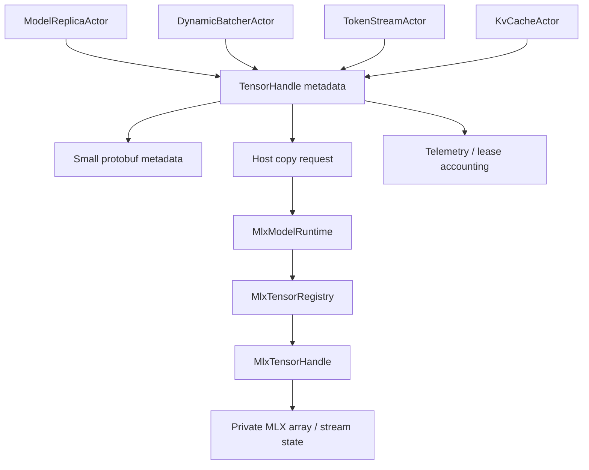

# AI-MLX-003 MlxTensorHandle And Unified-Memory Tensor Metadata Design

**Status:** Proposed design; implementation not started
**Requirement ID:** AI-MLX-003
**Parent Architecture:** [Distributed AI Model Inference and Training Architecture](distributed-ai-model-inference-training-architecture.md)
**Related Requirements:** [AI-MLX-001](mlx-runtime-plugin-design.md), [AI-MLX-002](mlx-device-probe-unified-memory-design.md), [AI-ACC-001](accelerator-resource-plane-design.md), [AI-ACC-002](accelerator-observability-telemetry-design.md)

## 1. Executive Summary

AI-MLX-003 defines the `MlxTensorHandle` contract. HPActor actor messages should
carry tensor metadata and opaque handles, not MLX arrays, device pointers, or
large payloads. On Apple silicon, MLX arrays live in unified memory and
operations are scheduled on streams. MLX is also lazy: array contents may not be
materialized until explicit or implicit evaluation happens. The handle contract
must therefore describe ownership, evaluation state, stream visibility, shape,
dtype, memory budget attribution, and export/copy behavior.

`MlxTensorHandle` is a backend-private capability represented publicly by an
opaque HPActor `TensorHandle`. It can be used by `MlxModelRuntime`, model
replicas, batchers, token stream actors, tensor caches, and future distributed
training actors without exposing MLX headers in public APIs.

## 2. Goals

1. Provide an opaque handle for MLX arrays and unified-memory buffers.
2. Keep MLX arrays out of protobuf payloads and public HPActor headers.
3. Capture tensor metadata needed for routing, admission, observability, and
   safe host-copy/export decisions.
4. Define explicit ownership and lifetime rules for MLX arrays.
5. Make MLX lazy evaluation and stream visibility visible in the handle state.
6. Support bounded host copies, token/logit outputs, embeddings, KV cache
   metadata, and future training tensors.
7. Preserve no-exception, no-RTTI, source-compatible HPActor APIs.
8. Support deterministic mock tensor handles in CI without MLX.

## 3. Non-Goals

- Defining a complete tensor library inside HPActor.
- Moving large tensor data through protobuf actor messages.
- Sharing live MLX arrays across processes or nodes in the first milestone.
- Guaranteeing zero-copy interop with every backend.
- Implementing distributed tensor collectives; MLX or another backend owns
  collective payload transport.
- Exposing raw `mlx_array`, Metal buffers, or device pointers to user actors.

## 4. Design Approach

Three approaches were considered:

| Approach | Trade-off |
|----------|-----------|
| Store MLX arrays directly in actor messages | Simple for one process, but leaks backend types and breaks remote/protobuf boundaries. |
| Always materialize tensors to host bytes | Portable, but destroys MLX unified-memory benefits and makes large outputs expensive. |
| Opaque tensor handle with explicit metadata and controlled materialization | Recommended. It keeps actor control messages small while preserving MLX execution semantics. |

The recommended design defines backend-neutral `TensorHandle` metadata and an
MLX-specific private implementation. Actor-visible APIs see only ids, shape,
dtype, byte size, ownership, readiness, and copy/export capabilities.

## 5. Architecture



Components:

- `TensorHandle`: backend-neutral opaque id and metadata.
- `MlxTensorHandle`: private runtime-owned handle for one or more MLX arrays.
- `MlxTensorRegistry`: per-runtime registry that owns handle table, reference
  counts, generation counters, and destruction.
- `TensorMaterializer`: bounded API for host copies and serialization.
- `TensorLeaseAccounting`: bridge from handle byte estimates to resource
  reservations and telemetry.

## 6. Public Metadata Model

```cpp
enum class TensorDeviceKind : uint8_t {
    Cpu,
    PinnedCpu,
    MlxUnified,
    Cuda,
    Rocm,
    Metal,
    Remote,
    MmapFile,
};

enum class TensorOwnership : uint8_t {
    Borrowed,
    RuntimeOwned,
    ActorOwned,
    SharedReadOnly,
    External,
};

enum class TensorReadiness : uint8_t {
    Unknown,
    Lazy,
    Evaluating,
    Ready,
    Failed,
    Released,
};

struct TensorShape {
    std::vector<int64_t> dims;
    std::vector<int64_t> strides;
};

struct TensorHandle {
    uint64_t id;
    uint32_t generation;
    TensorDeviceKind device;
    DataType dtype;
    TensorShape shape;
    uint64_t logical_bytes;
    uint64_t estimated_resident_bytes;
    TensorOwnership ownership;
    TensorReadiness readiness;
};
```

Metadata rules:

- `logical_bytes` is shape times dtype size.
- `estimated_resident_bytes` is a conservative memory-accounting estimate.
- `shape`, `dtype`, and ownership are actor-visible.
- Backend object pointers are not actor-visible.
- Handle ids are process-local unless wrapped by a future remote tensor handle.

## 7. Private MLX Handle Model

```cpp
struct MlxTensorHandleRecord {
    TensorHandle public_handle;
    uint64_t runtime_id;
    uint64_t model_id;
    uint64_t lease_id;
    uint64_t stream_epoch;
    uint64_t eval_epoch;
    uint32_t ref_count;
    bool host_copy_allowed;
    bool remote_export_allowed;
    bool contains_sensitive_data;
};
```

Private implementation fields include MLX arrays, MLX vector/map containers, or
sidecar object ids. Those fields live only in private implementation files.

Ownership rules:

- `RuntimeOwned`: the MLX runtime owns the array and frees it on handle release.
- `ActorOwned`: the receiving actor owns the handle capability and must release
  it through message/API contract.
- `SharedReadOnly`: multiple actors may read metadata or request materialized
  copies; mutation is forbidden.
- `Borrowed`: valid only for the duration of a runtime callback.
- `External`: sidecar or external runtime owns the object; HPActor owns only the
  capability id and release message.

Generation counters prevent stale handle reuse after release.

## 8. Evaluation And Stream Semantics

MLX arrays can represent lazy computation. A handle therefore has readiness
state.

Readiness rules:

- `Lazy`: graph exists but data may not be materialized.
- `Evaluating`: runtime requested evaluation or stream synchronization.
- `Ready`: runtime has completed the required evaluation boundary.
- `Failed`: evaluation or materialization failed.
- `Released`: handle id can no longer be used.

Evaluation policy:

- Model load/warmup handles must become `Ready` before replica readiness.
- Inference output handles may be `Lazy` internally but must become `Ready`
  before host-copy, serialization, or token emission.
- KV cache handles may stay `Lazy` or runtime-private as long as user-visible
  outputs are correct and the memory estimate is reserved.
- Any host data access request is an explicit evaluation boundary.

Stream policy:

- `stream_epoch` records the runtime stream generation that produced the handle.
- Actors outside the runtime cannot schedule operations on MLX streams.
- The runtime owns stream synchronization and dependency management.
- Diagnostic synchronization is opt-in and must be observable.

## 9. Materialization Contract

```cpp
struct TensorMaterializeRequest {
    TensorHandle handle;
    uint64_t max_bytes;
    bool require_ready;
    bool allow_copy;
    bool redact_if_sensitive;
};

struct TensorMaterializeResult {
    std::vector<uint8_t> bytes;
    DataType dtype;
    TensorShape shape;
    bool truncated;
};
```

Rules:

- Materialization is bounded by `max_bytes`.
- Sensitive tensors cannot be materialized unless policy allows it.
- Materialization must run on runtime execution context, not the event loop.
- If `require_ready` is true, lazy handles are evaluated first.
- Truncated materialization is allowed only for diagnostics, never for model
  correctness.
- Large remote transfer is out of scope for the first implementation.

Typical uses:

- logits summary for tests
- embeddings output when explicitly requested
- token id buffers
- debug tensor previews
- checkpoint metadata validation

## 10. Memory Accounting

`MlxTensorHandle` integrates with AI-MLX-002 unified-memory pressure:

- handle creation records `estimated_resident_bytes`
- runtime telemetry reports active/cache/peak bytes
- resource leases reserve model, KV cache, and batch budgets
- handle release decrements handle-level accounting

Accounting fields:

- `lease_id`
- `model_id`
- `runtime_id`
- `logical_bytes`
- `estimated_resident_bytes`
- `contains_sensitive_data`

Rules:

- Handle accounting is advisory and complements MLX runtime memory counters.
- Runtime memory counters remain authoritative for actual active/cache bytes.
- A handle cannot outlive the model/runtime context unless exported to an
  external owner with explicit release semantics.
- Releasing a handle does not guarantee immediate MLX cache reduction.

## 11. Message And Serialization Contract

Actor control messages may carry:

- `TensorHandle`
- shape
- dtype
- readiness
- byte estimates
- request id
- model id
- lease id

Actor control messages must not carry:

- MLX arrays
- raw device pointers
- raw Metal buffers
- unbounded tensor bytes
- Python object ids outside sidecar-private protocol

Protobuf compatibility:

- Assign new TypeTags explicitly when tensor control messages are introduced.
- Persisted or remote tensor metadata includes schema version.
- Handle ids are process-local unless a future `RemoteTensorHandle` wrapper
  adds node endpoint and generation.

## 12. Security And Privacy

Some tensors can contain prompts, completions, embeddings, logits, gradients, or
user data.

Policy fields:

- `contains_sensitive_data`
- `host_copy_allowed`
- `remote_export_allowed`
- `debug_preview_allowed`
- `retention_class`

Rules:

- Debug previews are disabled by default.
- Logs and metrics never include tensor contents.
- CLI/admin can show shape, dtype, bytes, readiness, and owner metadata.
- Host materialization requires explicit policy approval.
- Released sensitive tensors should be eligible for runtime cache clearing only
  through explicit policy/admin action.

## 13. Failure Semantics

| Failure | Runtime Behavior |
|---------|------------------|
| unknown handle id | return `TensorHandleNotFound` |
| stale generation | return `TensorHandleStale` |
| handle already released | idempotent release returns current released state |
| lazy evaluation fails | readiness becomes `Failed`; owner receives structured runtime error |
| materialization exceeds `max_bytes` | return `TensorTooLarge` or truncated diagnostic result based on request |
| sensitive tensor copy denied | return `TensorCopyDenied` |
| runtime unload with live handles | handles move to `Released`; owners receive release/invalidation events |
| sidecar disconnect | external handles become invalid and release is best-effort |
| memory accounting mismatch | emit warning metric/log; runtime memory counters remain authoritative |

## 14. Configuration

Example:

```toml
[system.ai.tensor]
enabled = true
max_handle_count = 65536
default_materialize_max_bytes = 1048576
allow_debug_previews = false
remote_export_enabled = false

[system.ai.tensor.mlx]
enabled = true
default_ownership = "runtime_owned"
lazy_handles_allowed = true
materialize_on_host_copy = true
release_timeout_ms = 5000
```

Defaults:

- tensor handles are enabled when MLX runtime is enabled
- debug previews are disabled
- remote export is disabled
- host materialization is bounded to 1 MiB for diagnostics unless overridden by
  an explicit API request
- lazy handles are allowed inside the runtime but user-visible outputs must be
  ready before serialization

## 15. Integration Points

AI-MLX-001:

- runtime creates and releases MLX tensor handles
- inference returns handles or materialized host outputs based on request type
- cancellation invalidates active output handles

AI-MLX-002:

- handle metadata feeds estimated resident bytes
- runtime memory counters remain authoritative for active/cache bytes
- device id and lease id tie handles back to unified-memory budgets

AI-ACC-001:

- leases reserve model, batch, and KV cache capacity before handle creation
- lease revocation invalidates affected handles

AI-ACC-002:

- handle counts, estimated bytes, release failures, and materialization failures
  are exported as bounded metrics

## 16. Testing Strategy

Unit tests:

- handle id and generation allocation
- reference count and release semantics
- stale handle rejection
- readiness state transitions
- materialization bounds
- sensitive tensor copy denial
- metadata serialization round trip
- memory estimate accounting

Integration tests:

- fake MLX runtime returns `MlxTensorHandle`
- host-copy request forces evaluation through fake adapter
- model unload invalidates live handles
- cancellation invalidates active output handles
- CLI/admin snapshot shows handle metadata without contents

Native gated tests:

- simple MLX array handle creation and release
- evaluated output materializes bounded host bytes
- lazy output becomes ready after explicit evaluation

Stress tests:

- high-rate handle create/release
- repeated stale generation access attempts
- runtime unload with many live handles
- long-running KV cache handle accounting soak

## 17. Acceptance Criteria

AI-MLX-003 is complete when:

- Actor-visible tensor metadata uses HPActor-owned types only.
- Public HPActor headers expose no MLX, Metal, or Python object types.
- `MlxTensorHandle` has explicit ownership, generation, readiness, and release
  semantics.
- MLX lazy evaluation boundaries are represented in handle state.
- Host materialization is explicit, bounded, and policy checked.
- Tensor metadata can be serialized without tensor contents.
- Runtime unload, cancellation, stale handle access, and materialization failure
  have stable error codes.
- Memory estimates tie back to leases and MLX telemetry without claiming exact
  cache release.
- Tests can run with mock handles without MLX hardware.

## 18. Open Questions

1. Should handle ids be globally unique across an `ActorSystem`, or scoped per
   runtime context with a runtime id prefix?
2. Should `SharedReadOnly` be allowed in the first implementation, or should all
   handles remain runtime-owned until a real consumer needs shared ownership?
3. Should debug previews be implemented as CLI/admin only, or also as a test
   helper API?
4. Should remote tensor export wait for the distributed inference plane, or be
   designed now as a disabled experimental extension?
5. Should KV cache handles have a specialized subtype, or remain ordinary
   `MlxTensorHandle` records with `retention_class = kv_cache`?

## 19. External Design Inputs

- [MLX documentation](https://ml-explore.github.io/mlx/build/html/) for MLX
  lazy, multi-device, and unified-memory behavior.
- [MLX unified memory](https://ml-explore.github.io/mlx/build/html/usage/unified_memory.html)
  for shared CPU/GPU memory semantics.
- [MLX lazy evaluation](https://ml-explore.github.io/mlx/build/html/usage/lazy_evaluation.html)
  for explicit evaluation and implicit materialization boundaries.
- [MLX C overview](https://ml-explore.github.io/mlx-c/build/html/overview.html)
  for opaque array objects, explicit free calls, and stream/device handling.
