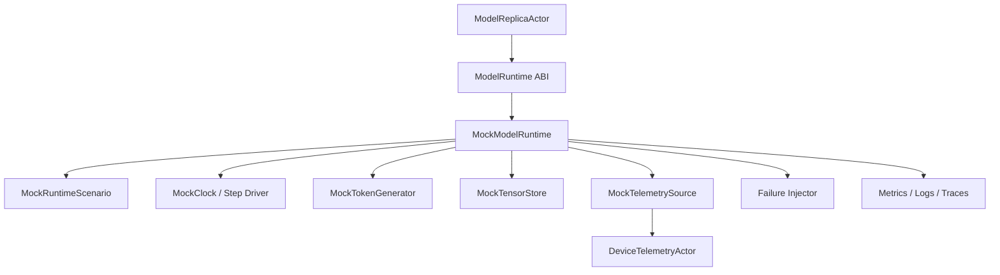

# AI-RUN-002 Deterministic MockModelRuntime Design

**Status:** Proposed design; implementation not started
**Requirement ID:** AI-RUN-002
**Parent Architecture:** [Distributed AI Model Inference and Training Architecture](distributed-ai-model-inference-training-architecture.md)
**Depends On:** [AI-RUN-001 No-Throw Model Runtime Plugin ABI Design](model-runtime-plugin-abi-design.md)
**Related Requirements:** [AI-INF-001](model-replica-lifecycle-design.md), [AI-INF-002](dynamic-batcher-cancellation-design.md), [AI-INF-003](streaming-token-response-design.md), [AI-MOD-001](model-registry-artifact-metadata-design.md), [AI-OBS-001](ai-observability-request-token-metrics-design.md), [AI-SEC-001](ai-tenant-model-authorization-design.md), [AI-DATA-001](tensor-buffer-handle-data-plane-design.md), [AI-ACC-001](accelerator-resource-plane-design.md), [AI-ACC-002](accelerator-observability-telemetry-design.md), [AI-TRN-001](training-job-worker-group-lifecycle-design.md), [AI-TRN-002](training-rank-rendezvous-checkpoint-design.md), [AI-TST-001](ai-fault-injection-chaos-testing-design.md)

## 1. Executive Summary

AI-RUN-002 defines `MockModelRuntime`, the deterministic runtime backend used to
develop and test HPActor's AI orchestration without MLX, GPUs, model files,
tokenizers, Python workers, or networked model services. It is not a toy unit
test helper. It is the system-test oracle for model lifecycle, routing,
dynamic batching, streaming, cancellation, resource admission, telemetry,
failure injection, and shutdown.

`MockModelRuntime` implements the AI-RUN-001 `ModelRuntime` ABI. It should be
fast, deterministic, scriptable, source-compatible with non-AI workloads, and
available in ordinary CI. Every AI plane should be able to run useful tests
against the mock runtime before real MLX or sidecar backends are enabled.

## 2. Goals

1. Provide a deterministic implementation of the runtime ABI.
2. Simulate load, warmup, inference, streaming, cancellation, stats, health, and
   unload.
3. Generate predictable tokens, tensor handles, latency, errors, and telemetry.
4. Support configurable failure injection for model load, warmup, inference,
   streaming, cancellation, telemetry, and unload.
5. Enable system tests for model replica lifecycle, router behavior, dynamic
   batching, stream ordering, resource leases, backpressure, and graceful
   shutdown.
6. Run without external services, model files, GPUs, Python, MLX, or network
   access.
7. Avoid sleeping on wall-clock time in tests unless driven by a controllable
   clock or deadline-aware polling.
8. Preserve the same actor-facing contract real runtimes use.

## 3. Non-Goals

- Measuring real model performance.
- Emulating MLX tensor semantics in detail.
- Testing tokenizer correctness.
- Producing semantically meaningful language.
- Replacing native MLX integration tests.
- Hiding bugs by special-casing actor code for mock mode.
- Acting as a benchmark runtime.

## 4. Design Approach

Three approaches were considered:

| Approach | Trade-off |
|----------|-----------|
| Minimal mock returning fixed strings | Easy, but does not exercise streaming, cancellation, timing, or resource pressure. |
| Scriptable deterministic runtime | Recommended. It exercises runtime contracts while staying CI-friendly. |
| Heavy simulator for batching and GPU behavior | More realistic, but risks becoming a second model engine and delaying core runtime work. |

The recommended design is a scriptable deterministic runtime. Tests and
examples configure a `MockRuntimeScenario` that controls load behavior,
warmup behavior, token output, timing steps, tensor outputs, health state, and
failure injection. The runtime exposes the same metrics and trace attributes as
real runtimes.

## 5. Architecture



Components:

- `MockModelRuntime`: AI-RUN-001 runtime implementation.
- `MockRuntimeScenario`: immutable scenario configuration.
- `MockClock` or step driver: deterministic time source.
- `MockTokenGenerator`: deterministic token sequence generator.
- `MockTensorStore`: fake tensor handles and bounded host materialization.
- `MockTelemetrySource`: deterministic memory/health/runtime stats.
- `MockFailureInjector`: scripted failures keyed by operation and attempt.

## 6. Runtime Contract

`MockModelRuntime` implements the full AI-RUN-001 contract:

- `load()` creates a `ModelHandle` and records model metadata.
- `warmup()` follows the scenario warmup policy and can fail deterministically.
- `infer()` returns deterministic inline output or tensor handles.
- `start_stream()` emits deterministic token deltas through `TokenSink`.
- `cancel()` stops future token emission and returns idempotently.
- `stats()` returns deterministic counters and gauges.
- `health()` returns scenario-controlled runtime health.
- `unload()` releases model, stream, and tensor state.

Mock mode must not bypass actor lifecycle, admission, queueing, resource lease,
or cancellation logic. The only mocked component is tensor/model execution.

## 7. Scenario Model

```cpp
struct MockRuntimeScenario {
    std::string scenario_name;
    uint64_t seed;
    MockLoadPolicy load_policy;
    MockWarmupPolicy warmup_policy;
    MockInferencePolicy inference_policy;
    MockStreamingPolicy streaming_policy;
    MockTensorPolicy tensor_policy;
    MockTelemetryPolicy telemetry_policy;
    MockFailurePolicy failure_policy;
};
```

### 7.1 Output Policy

```cpp
struct MockStreamingPolicy {
    std::vector<std::string> tokens;
    uint32_t tokens_per_step;
    uint32_t fail_at_token_index;
    bool emit_final_usage;
    bool require_step_driver;
};
```

Output generation options:

- fixed token list
- deterministic token template such as `tok-{request_id}-{index}`
- echo mode for bounded input snippets
- deterministic pseudo-random tokens from `seed`
- tensor-handle output mode for embeddings/logits tests

### 7.2 Timing Policy

Timing must be deterministic.

```cpp
struct MockTimingPolicy {
    uint64_t load_steps;
    uint64_t warmup_steps;
    uint64_t first_token_step;
    uint64_t token_interval_steps;
    uint64_t infer_steps;
};
```

Tests may drive time by:

- explicit step driver
- controllable HPActor clock
- condition polling with bounded deadline

Fixed sleeps are not part of the default mock contract.

### 7.3 Failure Policy

```cpp
enum class MockOperation : uint8_t {
    Load,
    Warmup,
    Infer,
    StartStream,
    EmitToken,
    Cancel,
    Stats,
    Health,
    Unload,
};

struct MockFailureRule {
    MockOperation operation;
    uint32_t fail_on_attempt;
    ModelRuntimeErrorCode error_code;
    uint32_t token_index;
};
```

Failure injection examples:

- fail first load attempt
- fail warmup permanently
- fail token stream at token 3
- make `stats()` temporarily unavailable
- make unload timeout path observable
- mark health degraded after N requests

## 8. Tensor And Memory Behavior

`MockModelRuntime` supports fake tensor handles so tensor/data-plane code can
be tested without MLX.

Mock tensor rules:

- handles use HPActor-owned `TensorHandle` metadata
- handle ids and generations are deterministic
- materialization returns deterministic bounded bytes
- tensor contents are small by default
- sensitive tensor policy can deny materialization
- release semantics match AI-MLX-003 where practical

Memory telemetry:

- `reserved_bytes` comes from resource leases
- `active_bytes` follows scenario policy
- `peak_bytes` is the max active bytes observed
- `cache_bytes` is scenario-controlled
- pressure ratios use AI-ACC-002 rules

The mock runtime must make memory pressure testable without allocating large
buffers.

## 9. Configuration

Example:

```toml
[[system.ai.runtime]]
name = "mock"
kind = "in_process"
backend = "mock"

[system.ai.mock]
enabled = true
default_scenario = "streaming_ok"
deterministic_seed = 42
require_step_driver = true

[[system.ai.mock.scenario]]
name = "streaming_ok"
tokens = ["hello", " ", "from", " ", "hpactor"]
tokens_per_step = 1
load_steps = 1
warmup_steps = 1
first_token_step = 1
token_interval_steps = 1
active_memory_mb = 256
cache_memory_mb = 64

[[system.ai.mock.scenario]]
name = "warmup_fails"
fail_operation = "warmup"
fail_code = "WarmupFailed"
```

Defaults:

- `MockModelRuntime` is always available when AI runtime support is built.
- deterministic seed defaults to zero.
- step driver is required in tests unless explicitly disabled.
- default scenario emits a short fixed token sequence.
- mock tensor materialization limit defaults to the system tensor config.
- failure injection is disabled by default.

Config parser rules:

- mock config uses a self-registering TOML subsystem parser
- public parser interfaces use `TomlTableView`
- invalid scenario names fail topology/config validation
- scenario names are bounded labels when exported in debug metrics

## 10. Observability

Metrics:

- `hpactor_ai_mock_requests_total`
- `hpactor_ai_mock_stream_tokens_total`
- `hpactor_ai_mock_failures_total`
- `hpactor_ai_mock_active_streams`
- `hpactor_ai_runtime_inference_duration_seconds`
- `hpactor_ai_runtime_errors_total`
- `hpactor_ai_device_memory_active_bytes`

Default labels:

- `runtime = mock`
- `backend = mock`
- bounded `scenario`
- bounded `error_code`

Logs:

- scenario selected
- load/warmup/infer/stream/unload operation
- injected failure triggered
- cancellation accepted
- stream completed

Trace attributes:

- `ai.runtime.name = mock`
- `ai.mock.scenario`
- `ai.mock.seed`
- `ai.mock.operation`
- `ai.runtime.error_code`

The mock runtime should use the same generic runtime metrics as real runtimes
and only add mock-specific metrics when they help diagnose tests.

## 11. Integration With AI Planes

Runtime ABI:

- implements AI-RUN-001 exactly
- advertises capabilities through `ModelRuntimeDescriptor`
- reports `RuntimeConcurrencyMode`

Inference serving:

- tests router selection
- tests batcher queue and rejection behavior
- tests streaming token ordering
- tests cancellation cleanup

Accelerator resource plane:

- can require a mock device lease before load
- can simulate memory pressure without allocating memory
- can produce failed activation diagnostics

Telemetry plane:

- publishes deterministic runtime stats and memory samples
- supports stale/failure scenarios

Tensor/data plane:

- returns fake tensor handles
- supports bounded materialization

Training plane:

- can later simulate rank progress, checkpoint barriers, and rank failure by
  extending the same scenario model.

## 12. Failure Semantics

| Failure | Runtime Behavior |
|---------|------------------|
| unknown scenario | config/topology validation fails |
| load failure rule fires | `load()` returns structured runtime error; no handle created |
| warmup failure rule fires | handle remains loaded but not ready; replica stays unroutable |
| inference failure rule fires | request fails with configured error code |
| stream token failure fires | stream emits ordered tokens before failure, then terminal error |
| cancel before start | returns success if request is known cancelled; otherwise `RequestNotFound` |
| duplicate cancel | idempotent success with current state |
| unload with active streams | active streams are cancelled, then handle releases |
| materialization denied | returns `TensorMaterializationDenied` |
| step driver stops | pending operations remain pending until timeout/cancel |

## 13. Testing Strategy

Unit tests:

- scenario parsing and validation
- deterministic token generation
- failure rule matching
- handle/generation behavior
- stats counters
- tensor materialization limits
- cancellation idempotence

Integration tests:

- model replica load/warmup/ready with mock runtime
- warmup failure keeps replica unroutable
- streaming emits ordered tokens
- cancellation stops token stream and releases state
- batcher rejects overload using mock latency/steps
- resource lease activation uses mock memory budget
- metrics/logs/traces contain runtime and scenario identifiers

System tests:

- TOML topology starts mock model service and serves actor-native inference
- graceful shutdown drains active mock streams
- route invalidation occurs after configured runtime failure
- telemetry stale scenario appears in CLI/admin snapshot

Stress tests:

- repeated load/unload cycles
- stream cancellation storm
- failure injection storm with bounded logs
- long-running deterministic inference soak

## 14. Acceptance Criteria

AI-RUN-002 is complete when:

- `MockModelRuntime` implements the AI-RUN-001 ABI without special actor paths.
- It is available in ordinary CI without MLX, GPUs, Python, or external
  services.
- Tests can configure deterministic load, warmup, inference, streaming,
  cancellation, tensor output, telemetry, and failure scenarios.
- Streaming output order is deterministic and cancel-safe.
- Mock tensor handles obey the same public metadata and release semantics as
  real tensor handles.
- Memory pressure and telemetry are simulated without large allocations.
- Metrics, logs, and traces use the same generic runtime surfaces as real
  runtimes.
- The mock runtime supports system tests for model lifecycle, dynamic batching,
  resource admission, observability, and shutdown.

## 15. Open Questions

1. Should mock runtime scenarios live only in TOML, or also support compact
   programmatic builders for tests?
2. Should the mock runtime be built whenever AI is enabled, or always available
   even when production AI backends are disabled?
3. Should deterministic timing use HPActor's `Clock`, a runtime-owned step
   driver, or both?
4. Should mock tensor contents be byte-for-byte deterministic across platforms,
   including endianness-sensitive data types?
5. Should the same scenario model later extend to mock distributed training
   ranks, or should training get a separate mock runtime?
