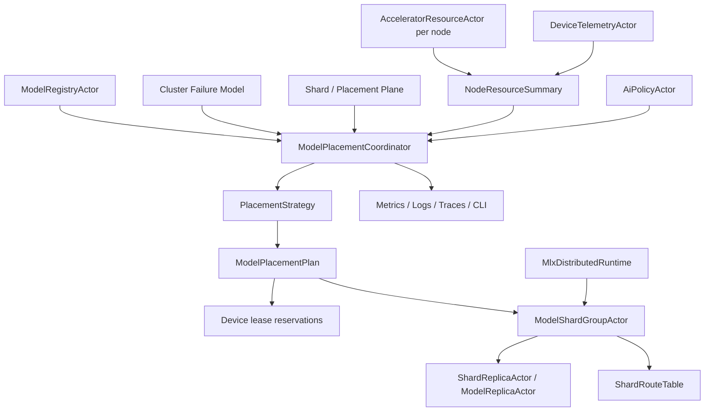

# AI-DIST-001 Model Placement Coordinator And Placement Epoch Design

**Status:** Proposed design; implementation not started
**Requirement ID:** AI-DIST-001
**Parent Architecture:** [Distributed AI Model Inference and Training Architecture](distributed-ai-model-inference-training-architecture.md)
**Depends On:** [Cluster Failure Model Architecture Design](../production/cluster-failure-model-design.md), [Cluster Sharding and Placement Architecture Design](../production/cluster-sharding-placement-design.md), [AI-ACC-001](accelerator-resource-plane-design.md), [AI-ACC-002](accelerator-observability-telemetry-design.md), [AI-MOD-001](model-registry-artifact-metadata-design.md), [AI-INF-001](model-replica-lifecycle-design.md)
**Related Requirements:** [AI-DIST-002](model-shard-group-readiness-stale-routes-design.md), [AI-DIST-MLX-001](mlx-distributed-rendezvous-adapter-design.md), [AI-OBS-001](ai-observability-request-token-metrics-design.md), [AI-SEC-001](ai-tenant-model-authorization-design.md), [AI-DATA-001](tensor-buffer-handle-data-plane-design.md)

## 1. Executive Summary

AI-DIST-001 defines `ModelPlacementCoordinator`, the control-plane actor that
computes distributed model placements and assigns placement epochs. It turns
model metadata, requested parallelism, cluster node state, node resource
summaries, device pressure, tenant policy, and rollout intent into a
`ModelPlacementPlan` for replicas, shards, and future prefill/decode split
topologies.

The coordinator does not execute tensor kernels or declare a model routeable by
itself. It owns desired placement and epoch decisions. `ModelShardGroupActor`
from AI-DIST-002 owns readiness and route publication. `MlxDistributedRuntime`
from AI-DIST-MLX-001 translates an accepted placement into MLX distributed
rendezvous metadata when MLX collectives are required.

## 2. Goals

1. Compute placements for model replicas, tensor shards, pipeline stages,
   expert shards, and prefill/decode split groups.
2. Assign monotonically increasing placement epochs for every distributed model
   deployment.
3. Use node state, device leases, MLX unified-memory pressure, topology
   locality, model metadata, tenant isolation, and rollout policy as placement
   inputs.
4. Support static, rendezvous-hash, and resource-aware placement strategies.
5. Reserve resources before shard actors allocate backend memory.
6. Keep old routeable epochs serving while new epochs load and warm when policy
   allows.
7. Make placement decisions auditable, observable, and testable with mock
   nodes, mock devices, and `MockModelRuntime`.
8. Preserve HPActor's source-compatible non-AI actor APIs.

## 3. Non-Goals

- Implementing a consensus system for placement metadata.
- Declaring shard group readiness or routing user traffic directly.
- Implementing MLX, MPI, ring, JACCL, NCCL, or tensor collectives.
- Moving live GPU or MLX unified-memory tensors between nodes.
- Guaranteeing optimal model-parallel performance.
- Replacing the generic cluster sharding and placement plane.
- Defining training gang scheduling. Training uses related concepts but has
  separate lifecycle requirements.

## 4. Design Approach

Three approaches were considered:

| Approach | Trade-off |
|----------|-----------|
| Reuse generic shard placement with no AI-specific coordinator | Avoids new actors, but cannot reason about model memory, device leases, runtimes, tensor parallel topology, or MLX constraints. |
| Build a full cluster scheduler first | Powerful, but too much infrastructure before distributed inference contracts are proven. |
| Add an AI-specific placement coordinator on top of cluster placement foundations | Recommended. It keeps model-specific decisions explicit while reusing node state, epochs, and route invalidation patterns. |

The recommended design starts with a single `ModelPlacementCoordinator` actor.
It can run as a protected cluster singleton or external-coordinator-backed actor
when the production control plane requires stronger ownership. The first
implementation may use static and resource-aware policies; the message and
epoch contracts should already support later rebalancing.

## 5. Architecture



Primary components:

- `ModelPlacementCoordinator`: authoritative desired placement and epoch owner.
- `PlacementStrategy`: pluggable plan computation policy.
- `NodeResourceSummaryCache`: bounded cache of cluster node/device summaries.
- `PlacementEpochStore`: optional persistent or external store for current and
  candidate epochs.
- `PlacementLeaseSession`: tracks resource reservations while a candidate plan
  is activating.
- `ModelPlacementPlan`: immutable desired assignment for one model deployment
  epoch.

## 6. Data Model

### 6.1 Deployment Spec

```cpp
struct ModelDeploymentSpec {
    ModelVersionId model_version;
    std::string deployment_name;
    std::string runtime_name;
    std::string backend;
    ModelParallelismSpec parallelism;
    ModelResourceEstimate resource_estimate;
    ModelRolloutGeneration rollout_generation;
    TenantPlacementPolicy tenant_policy;
};
```

### 6.2 Parallelism Spec

```cpp
enum class ModelParallelismKind : uint8_t {
    Replica,
    Tensor,
    Pipeline,
    Expert,
    PrefillDecodeSplit,
    Hybrid,
};

struct ModelParallelismSpec {
    ModelParallelismKind kind;
    uint32_t replica_count;
    uint32_t tensor_parallel_degree;
    uint32_t pipeline_stage_count;
    uint32_t expert_shard_count;
    bool requires_distributed_backend;
};
```

The first distributed implementation can support `Replica` and simple
`Pipeline` or `Tensor` metadata without requiring all runtime layouts to be
implemented immediately.

### 6.3 Placement Epoch

```cpp
struct ModelPlacementEpoch {
    ModelVersionId model_version;
    std::string deployment_name;
    uint64_t epoch;
};
```

Epoch rules:

- Epochs are monotonically increasing per model deployment.
- A candidate epoch is not routeable until AI-DIST-002 marks it ready.
- Requests carry the epoch they used for routing when possible.
- Stale epochs are rejected with `PlacementEpochStale`.
- Old epochs remain valid during rolling activation until drained or revoked.

### 6.4 Placement Plan

```cpp
struct ShardAssignment {
    uint32_t shard_id;
    uint32_t replica_ordinal;
    uint32_t pipeline_stage;
    uint32_t tensor_rank;
    NodeId node_id;
    DeviceId device_id;
    DeviceLeaseId lease_id;
    ActorAddress shard_actor;
};

struct ModelPlacementPlan {
    ModelPlacementEpoch epoch;
    ModelDeploymentSpec spec;
    std::vector<ShardAssignment> assignments;
    PlacementStrategyKind strategy;
    PlacementDecisionReason reason;
    uint64_t created_at_ns;
};
```

Assignments are immutable after the plan is committed. A change creates a new
epoch.

## 7. Placement Inputs

Required inputs:

- model metadata and resource estimates from AI-MOD-001
- node state from the cluster failure model
- generic shard/placement metadata from the production placement plane
- node resource summaries from AI-ACC-001
- device pressure and telemetry freshness from AI-ACC-002
- model replica lifecycle requirements from AI-INF-001
- security and tenant isolation policy from AI-SEC-001
- rollout generation and active/previous version state

MLX-first inputs:

- Apple unified-memory budget
- MLX runtime availability
- MLX distributed backend capability
- Thunderbolt or network locality labels when available
- device pressure state and sample freshness

## 8. Placement Strategies

Initial strategies:

- `Static`: explicit assignments from TOML or admin request.
- `RendezvousHash`: stable mapping from shard ids to nodes with bounded
  movement when membership changes.
- `ResourceAware`: filters candidates by leases, pressure, runtime, and health,
  then scores capacity and locality.
- `TopologyAware`: extension of resource-aware placement that scores
  high-bandwidth links and model-parallel adjacency.

Recommended rollout order:

1. `Static` for deterministic tests and early MLX experiments.
2. `ResourceAware` for safe single-cluster multi-node serving.
3. `TopologyAware` once MLX distributed rendezvous has reliable topology
   metadata.
4. `RendezvousHash` for replica groups where stable movement matters more than
   topology.

## 9. Placement Protocol

1. `SubmitModelDeployment` is received from rollout, admin, or topology
   bootstrap.
2. Coordinator authorizes the action through AI-SEC-001.
3. Coordinator resolves model metadata through AI-MOD-001.
4. Coordinator gathers fresh node/resource summaries and cluster node state.
5. Strategy computes a candidate `ModelPlacementPlan`.
6. Coordinator requests provisional device leases for every assignment.
7. If every required lease is granted, the candidate epoch is committed.
8. Coordinator starts or updates `ModelShardGroupActor` with the plan.
9. AI-DIST-002 tracks shard load/warm/rendezvous readiness.
10. When the shard group is ready, routes can publish the new epoch.
11. Old epoch drains by rollout and shutdown policy.

Lease reservation is all-or-nothing for required shards. Optional replicas may
be omitted only when the deployment spec declares a degraded mode.

## 10. Epoch And Route Contract

Routes include:

- model name and version
- deployment name
- placement epoch
- shard group id
- shard id or replica ordinal
- owner node endpoint
- actor address
- route generation

The coordinator publishes desired epochs; AI-DIST-002 publishes routeable
epochs. Routers must not route user traffic to a desired epoch until shard
group readiness is satisfied.

## 11. Failure Semantics

| Failure | Coordinator behavior |
|---------|----------------------|
| model metadata missing | reject deployment with `ModelVersionUnavailable` |
| policy denial | reject with `RejectedByPolicy` and audit |
| node not alive | exclude node from candidates |
| telemetry stale | exclude or de-preference by policy |
| lease rejected | release provisional leases and fail candidate plan |
| required shard cannot be placed | fail candidate plan |
| coordinator restarts | reload committed epoch or reconstruct from shard group snapshots |
| node goes down after plan commit | create replacement candidate epoch by policy |
| split-brain or duplicate node id | defer placement and surface cluster failure |
| old epoch drain timeout | mark old epoch incident and continue by rollout policy |

Placement failures do not crash serving replicas from the previous routeable
epoch.

## 12. Security And Audit

AI-SEC-001 gates:

- submit deployment
- rebalance
- rollback
- force drain
- force placement on specific node or device
- inspect full placement details

Audit events:

- placement plan accepted
- placement plan rejected
- lease reservation failure
- forced placement override
- epoch commit
- rollback to previous epoch

Default logs must not include artifact URIs, local paths, credentials, or raw
tenant identifiers.

## 13. Observability

Metrics:

- `hpactor_ai_placement_plans_total`
- `hpactor_ai_placement_plan_duration_seconds`
- `hpactor_ai_placement_epoch`
- `hpactor_ai_placement_failures_total`
- `hpactor_ai_placement_candidate_nodes`
- `hpactor_ai_placement_reserved_leases`
- `hpactor_ai_placement_rebalances_total`

Trace spans:

- `ai.placement.submit`
- `ai.placement.compute`
- `ai.placement.reserve`
- `ai.placement.commit`
- `ai.placement.rollback`

CLI/admin surface:

- `/ai placements`
- `/ai placement <model> show`
- `/ai placement <model> plan`
- `/ai placement <model> rebalance`
- `/ai placement <model> epochs`

## 14. Configuration

Example:

```toml
[system.ai.placement]
enabled = true
strategy = "resource_aware"
allow_degraded_replicas = false
require_fresh_telemetry = true
telemetry_stale_after_ms = 5000
provisional_lease_timeout_ms = 10000
old_epoch_drain_timeout_ms = 30000

[system.ai.placement.mlx]
prefer_topology = true
prefer_backend = "ring"
allow_jaccl = true
allow_mpi = true
allow_nccl = false

[[model.deployment]]
name = "chat-small-distributed"
model = "chat-small"
version = "2026-05-20"
parallelism = "tensor"
replicas = 1
tensor_parallel_degree = 2
strategy = "resource_aware"
```

Config parsing must use self-registering TOML subsystem parsers and
`TomlTableView` interfaces.

## 15. Testing Strategy

Deterministic tests:

- static placement creates expected assignments
- resource-aware placement filters unavailable nodes
- stale telemetry prevents placement when configured
- lease rejection releases all provisional leases
- epoch increments on replan
- old routeable epoch remains active when candidate fails
- node down triggers replacement candidate by policy
- policy denial blocks placement and emits audit event
- placement snapshots omit sensitive fields

Integration tests:

- mock two-node cluster places replica shards on available mock devices
- candidate epoch is not routeable until AI-DIST-002 readiness completes
- route refresh observes new epoch after activation
- rollback returns to previous routeable epoch

Stress tests:

- repeated node up/down while planning
- many models competing for mock leases
- concurrent admin replan and rollout request

## 16. Acceptance Criteria

AI-DIST-001 is ready for implementation when:

- placement plans, assignments, and epochs have explicit types
- desired placement and routeable readiness are separate contracts
- provisional leases are all-or-nothing for required shards
- old routeable epochs can remain serving during failed candidate activation
- node state, resource pressure, and policy decisions are visible in the plan
- placement decisions are auditable and observable
- deterministic mock tests can validate static and resource-aware placement

## 17. Open Questions

1. Should `ModelPlacementCoordinator` be a cluster singleton from the first
   implementation, or start as a single-node/local coordinator for tests?
2. Should resource-aware placement reserve leases before or after shard group
   actor creation?
3. Should topology-aware MLX placement prefer ring adjacency or lowest measured
   latency when both are available?
4. Which external coordinator should be supported first if singleton ownership
   needs stronger consistency?
