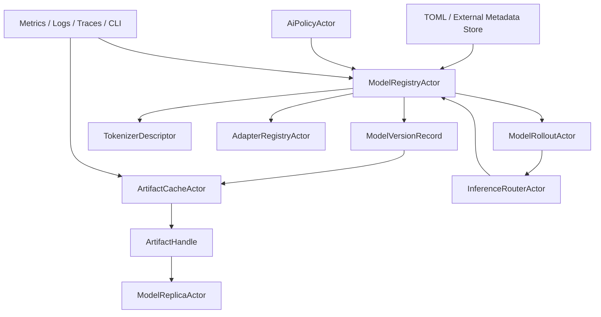

# AI-MOD-001 Model Registry And Artifact Metadata Design

**Status:** Proposed design; implementation not started
**Requirement ID:** AI-MOD-001
**Parent Architecture:** [Distributed AI Model Inference and Training Architecture](distributed-ai-model-inference-training-architecture.md)
**Depends On:** [AI-RUN-001](model-runtime-plugin-abi-design.md), [AI-RUN-002](mock-model-runtime-design.md)
**Related Requirements:** [AI-INF-001](model-replica-lifecycle-design.md), [AI-INF-002](dynamic-batcher-cancellation-design.md), [AI-INF-003](streaming-token-response-design.md), [AI-SEC-001](ai-tenant-model-authorization-design.md), [AI-OBS-001](ai-observability-request-token-metrics-design.md), [AI-DATA-001](tensor-buffer-handle-data-plane-design.md), [AI-DIST-001](model-placement-coordinator-design.md), [AI-DIST-002](model-shard-group-readiness-stale-routes-design.md), [AI-MLX-001](mlx-runtime-plugin-design.md)

## 1. Executive Summary

AI-MOD-001 defines the model registry and artifact metadata plane for HPActor's
AI runtime. This plane owns the authoritative catalog of model names, versions,
artifact descriptors, tokenizer metadata, adapter metadata, rollout state, and
artifact pinning rules. It gives inference actors stable model metadata without
turning HPActor into a hosted MLOps product.

The first implementation should support file-backed and mock metadata for
single-node MLX development. The runtime must be able to resolve a model name
and version into a verified local artifact handle, runtime selection, tokenizer
descriptor, resource estimate, and rollout generation before `ModelReplicaActor`
loads the model. Later storage backends, distributed registries, and external
model catalogs can plug into the same actor-facing contract.

## 2. Goals

1. Define `ModelRegistryActor` as the authoritative owner of model catalog
   metadata inside one HPActor system.
2. Define `ArtifactCacheActor` metadata and pinning semantics for local
   artifact fetch, verification, and garbage collection.
3. Represent model versions, formats, runtimes, tokenizer descriptors,
   adapters, quantization, resource estimates, and rollout generation.
4. Keep model metadata separate from replica readiness and runtime execution.
5. Support deterministic mock metadata and local filesystem artifacts in CI.
6. Make checksum and signature verification explicit before model load.
7. Integrate with authorization, audit, observability, topology config,
   rollout, and graceful shutdown.
8. Preserve source-compatible defaults for non-AI workloads.

## 3. Non-Goals

- Building a hosted model registry service.
- Implementing object storage, Hugging Face Hub, or package manager clients in
  the first milestone.
- Owning tensor execution, tokenizer implementation, dynamic batching, or
  stream delivery.
- Deciding replica placement or device leases.
- Persisting live runtime model handles.
- Defining distributed model shard placement epochs.

## 4. Design Approach

Three approaches were considered:

| Approach | Trade-off |
|----------|-----------|
| Let every replica parse model config directly | Simple for examples, but duplicates verification, pinning, rollout, and policy logic. |
| Build an external registry dependency first | Production-friendly long term, but too heavy before single-node MLX serving works. |
| Actor-owned in-process registry with pluggable metadata stores | Recommended. It gives stable actor contracts now and leaves room for external registries later. |

The recommended design uses `ModelRegistryActor` for model/version metadata,
`ArtifactCacheActor` for local artifact materialization, and `ModelRolloutActor`
for version traffic state. The first metadata store can be TOML plus an
in-memory test store. External registry adapters can be added behind the same
messages later.

## 5. Architecture



Primary components:

- `ModelRegistryActor`: authoritative catalog and version state owner.
- `ArtifactCacheActor`: node-local fetch, verify, pin, unpin, and garbage
  collection owner.
- `TokenizerActor`: optional metadata owner for tokenizer identity and bounded
  token estimate helpers.
- `AdapterRegistryActor`: LoRA or adapter metadata and access policy owner.
- `ModelRolloutActor`: rollout generation, canary, rollback, and traffic
  weights.
- `ModelMetadataStore`: pluggable read/write metadata persistence boundary.

## 6. Data Model

### 6.1 Identity

```cpp
struct ModelId {
    std::string name;
};

struct ModelVersionId {
    ModelId model;
    std::string version;
};

struct ModelRolloutGeneration {
    uint64_t value;
};
```

Model names and versions are stable control-plane identifiers. They are safe in
metrics only when bounded by configured catalog size. Artifact URIs and file
paths are not default metric labels.

### 6.2 Model Version Record

```cpp
struct ModelVersionRecord {
    ModelVersionId id;
    std::string display_name;
    std::string runtime_name;
    std::string backend;
    std::string format;
    QuantizationDescriptor quantization;
    TokenizerDescriptor tokenizer;
    std::vector<AdapterDescriptor> adapters;
    ArtifactDescriptor artifact;
    ModelResourceEstimate resources;
    ModelCapabilityFlags capabilities;
    ModelVersionState state;
    ModelRolloutGeneration rollout_generation;
};
```

Required fields for Milestone 1:

- model name
- version
- runtime name
- backend
- format
- artifact URI
- artifact checksum
- tokenizer id or tokenizer disabled marker
- resource estimate
- capability flags for streaming and batching

### 6.3 Artifact Descriptor

```cpp
enum class ArtifactKind : uint8_t {
    ModelWeights,
    Tokenizer,
    Adapter,
    Config,
    Checkpoint,
};

struct ArtifactDescriptor {
    ArtifactKind kind;
    std::string uri;
    std::string media_type;
    uint64_t expected_size_bytes;
    std::string checksum_algorithm;
    std::string checksum_hex;
    std::string signature_ref;
    bool required;
};
```

The first implementation should support `file://` artifacts and mock artifacts.
HTTP or object storage fetchers can be added later through `ArtifactFetcher`.

### 6.4 Artifact Handle

```cpp
struct ArtifactHandle {
    uint64_t id;
    uint32_t generation;
    ArtifactKind kind;
    std::string local_path;
    uint64_t verified_size_bytes;
    bool checksum_verified;
    bool signature_verified;
};
```

`ArtifactHandle` is node-local. A replica receives a handle only after the
artifact cache has verified required checksums and signatures.

## 7. State Model

Model version state:

```cpp
enum class ModelVersionState : uint8_t {
    Registered,
    ResolvingArtifact,
    Verified,
    Deploying,
    Ready,
    Draining,
    Unavailable,
    Failed,
    RolledBack,
};
```

State ownership:

- `ModelRegistryActor` owns catalog and version metadata state.
- `ArtifactCacheActor` owns local artifact materialization state.
- `ModelReplicaActor` owns per-replica load, warmup, and readiness state.
- `ModelRolloutActor` owns active traffic weights and rollout generation.

The registry must not mark a version `Ready` only because metadata exists. A
version is ready for routing only when rollout state and replica readiness agree.

## 8. Registry Message Contract

Messages:

| Message | Sender | Outcome |
|---------|--------|---------|
| `RegisterModelVersion` | admin, topology bootstrap | creates or updates a version record |
| `ResolveModelVersion` | router, rollout, replica | returns current version metadata |
| `ListModelVersions` | CLI/admin | returns bounded catalog snapshot |
| `ValidateModelVersion` | registry self-check, admin | validates required fields and artifact descriptors |
| `SetModelVersionState` | rollout, artifact cache, admin | changes registry-owned state by policy |
| `DeleteModelVersion` | admin | tombstones metadata when not pinned |
| `ResolveTokenizer` | ingress, batcher | returns tokenizer metadata or disabled marker |
| `ResolveAdapter` | router, registry | returns adapter descriptor by policy |

Every mutating message must carry an authenticated principal once AI-SEC-001 is
enabled. Mutating messages emit audit records.

## 9. Artifact Cache Contract

Responsibilities:

- resolve artifact descriptors into local handles
- verify checksum and signature when configured
- pin handles while replicas, streams, or rollout state reference them
- reject garbage collection while pinned
- expose bounded cache snapshots
- emit cache and verification diagnostics

Messages:

| Message | Outcome |
|---------|---------|
| `FetchArtifact` | starts or joins artifact materialization |
| `VerifyArtifact` | validates checksum/signature and updates handle state |
| `PinArtifact` | increments pin count for a model version or replica |
| `UnpinArtifact` | decrements pin count and makes GC possible |
| `GetArtifactHandle` | returns verified local handle when available |
| `GarbageCollectArtifacts` | removes unpinned cache entries by policy |

Artifact fetch and verification must not run on event-loop or cooperative
scheduler hot paths. Blocking filesystem, hashing, and signature operations use
dedicated workers or daemon actors.

## 10. Rollout And Routing Contract

The registry provides metadata. The rollout actor turns metadata and replica
readiness into routeable state.

Rollout state:

```cpp
struct ModelRoutePolicy {
    ModelVersionId active_version;
    ModelVersionId previous_version;
    ModelRolloutGeneration generation;
    uint32_t canary_percent;
    bool rollback_allowed;
};
```

Rules:

- Routers resolve model name to a route policy and version metadata.
- Route snapshots carry rollout generation and model version.
- Model hot-swap increments rollout generation.
- Old versions remain pinned until all active route snapshots and replicas are
  drained.
- Rollback points traffic back to the previous ready version and keeps the
  failed candidate available for diagnostics.

## 11. Security And Privacy

AI-SEC-001 supplies policy checks for:

- model version registration
- model use by tenant
- adapter use by tenant
- artifact fetch from external URI
- artifact delete and cache GC
- rollout, canary, rollback, and unload
- materialization of sensitive tokenizer or tensor debug data

Sensitive fields:

- artifact URI
- local file path
- signature reference
- tokenizer vocabulary path
- adapter metadata

Default logs and metrics must not include local file paths, external tokens,
or unbounded artifact URIs.

## 12. Observability

Metrics:

- `hpactor_ai_models`
- `hpactor_ai_model_versions`
- `hpactor_ai_model_version_state`
- `hpactor_ai_model_registry_updates_total`
- `hpactor_ai_artifact_fetch_total`
- `hpactor_ai_artifact_fetch_duration_seconds`
- `hpactor_ai_artifact_verify_total`
- `hpactor_ai_artifact_cache_bytes`
- `hpactor_ai_artifact_cache_entries`
- `hpactor_ai_artifact_pins`
- `hpactor_ai_model_rollout_generation`

Trace spans:

- `ai.model.register`
- `ai.model.resolve`
- `ai.artifact.fetch`
- `ai.artifact.verify`
- `ai.artifact.pin`
- `ai.model.rollout`
- `ai.model.rollback`

CLI/admin surface:

- `/ai models`
- `/ai model <name> versions`
- `/ai model <name> version <version> show`
- `/ai artifacts`
- `/ai artifact <id> show`
- `/ai model <name> rollout`

## 13. Configuration

Example:

```toml
[[model]]
name = "chat-small"
version = "2026-05-20"
runtime = "mlx"
backend = "mlx"
format = "safetensors"
artifact_uri = "file:///models/chat-small"
artifact_checksum = "sha256:0123456789abcdef"
replicas = 2

[model.tokenizer]
id = "chat-small-tokenizer"
kind = "mlx-tokenizer"
uri = "file:///models/chat-small/tokenizer.json"

[model.resources]
device = "mlx-gpu"
unified_memory_mb = 16000
kv_cache_mb = 4096

[system.ai.artifacts]
cache_dir = "build/ai-artifacts"
max_cache_bytes = 10737418240
require_checksum = true
require_signature = false
gc_interval_ms = 60000
```

Config parsing must use self-registering TOML subsystem parsers and
`TomlTableView` interfaces.

## 14. Failure Semantics

| Failure | Runtime behavior |
|---------|------------------|
| unknown model | router returns `ModelNotFound` |
| unknown version | router returns `ModelVersionUnavailable` |
| invalid metadata | registry rejects registration with validation errors |
| artifact missing | artifact cache returns `ArtifactUnavailable` |
| checksum mismatch | artifact handle is not published; audit event emitted |
| signature failure | artifact handle is not published; audit event emitted |
| artifact pinned during delete | delete is rejected with `ArtifactPinned` |
| registry actor restart | metadata store reloads catalog; route snapshots refresh |
| rollout candidate fails | previous ready version remains routeable when configured |
| tokenizer metadata missing | request admission fails with `TokenizerUnavailable` |

## 15. Testing Strategy

Deterministic tests:

- register model version with valid metadata
- reject missing runtime, artifact URI, or checksum when required
- resolve default model version
- fetch and verify mock artifact
- reject checksum mismatch
- pin prevents garbage collection
- unpin allows garbage collection
- rollout generation increments on canary and rollback
- router sees only routeable version snapshots
- mutation requires authorization when AI-SEC-001 is enabled
- audit records are emitted for registration, verification failure, and rollout

System tests:

- topology config registers a model, artifact cache verifies it, and replica
  loads from the returned handle
- failed candidate rollout keeps previous version serving
- artifact cache drain waits for pinned replicas to unload

## 16. Acceptance Criteria

AI-MOD-001 is ready for implementation when:

- model, version, artifact, tokenizer, and rollout metadata have explicit types
- registry, artifact cache, rollout, and replica state ownership are separate
- artifacts are verified before `ModelReplicaActor` receives a handle
- artifact pinning prevents unsafe cache deletion
- routers can resolve routeable model versions without reading replica internals
- sensitive paths and URIs are redacted from default logs and metrics
- mock metadata and mock artifacts can exercise the full path in CI

## 17. Open Questions

1. Should the first metadata store be TOML-only, or include a small JSON import
   format for compatibility with model tooling?
2. Should artifact signatures be P0 enforceable, or checksum-only with
   signature fields reserved?
3. Should `TokenizerActor` perform token estimates in Milestone 1, or only
   publish metadata for ingress and batcher estimates?
4. Should rollout traffic weights live in the registry actor or a separate
   rollout actor from the first implementation?
