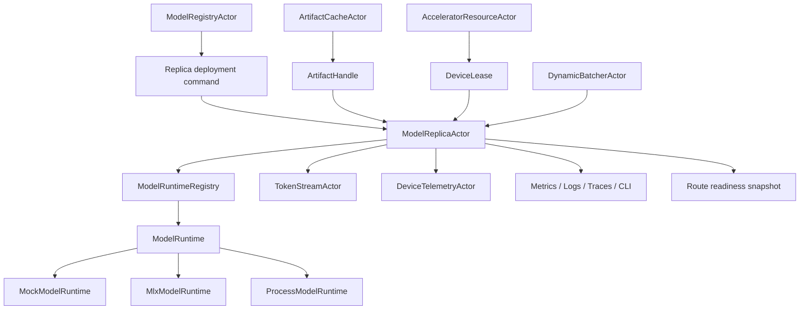
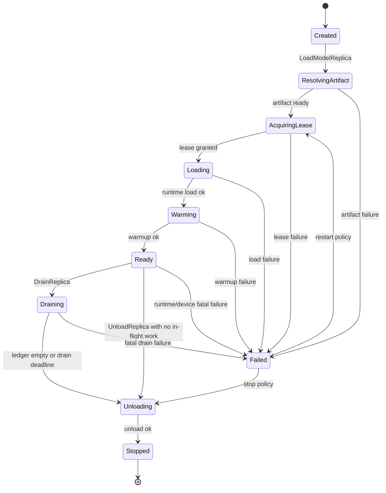

# AI-INF-001 Single-Node Model Replica Actor Lifecycle Design

**Status:** Proposed design; implementation not started
**Requirement ID:** AI-INF-001
**Parent Architecture:** [Distributed AI Model Inference and Training Architecture](distributed-ai-model-inference-training-architecture.md)
**Depends On:** [AI-RUN-001](model-runtime-plugin-abi-design.md), [AI-RUN-002](mock-model-runtime-design.md), [AI-ACC-001](accelerator-resource-plane-design.md), [AI-ACC-002](accelerator-observability-telemetry-design.md)
**Related Requirements:** [AI-MLX-001](mlx-runtime-plugin-design.md), [AI-MLX-002](mlx-device-probe-unified-memory-design.md), [AI-MLX-003](mlx-tensor-handle-design.md), [AI-MOD-001](model-registry-artifact-metadata-design.md), [AI-OBS-001](ai-observability-request-token-metrics-design.md), [AI-SEC-001](ai-tenant-model-authorization-design.md), [AI-DATA-001](tensor-buffer-handle-data-plane-design.md), [AI-DIST-001](model-placement-coordinator-design.md), [AI-DIST-002](model-shard-group-readiness-stale-routes-design.md), [AI-INF-002](dynamic-batcher-cancellation-design.md), [AI-INF-003](streaming-token-response-design.md)

## 1. Executive Summary

AI-INF-001 defines the single-node `ModelReplicaActor` lifecycle. A model
replica actor owns exactly one loaded model instance, model runtime handle,
device lease, readiness state, in-flight request ledger, and runtime telemetry
binding on one HPActor node. It is the actor boundary that turns the generic
`ModelRuntime` ABI into safe serving behavior.

The first implementation target is macOS on Apple silicon using
`MlxModelRuntime`, but this design must be testable in ordinary CI with
`MockModelRuntime`. The replica actor is not responsible for distributed
placement, model catalog ownership, HTTP parsing, dynamic batch formation, or
token transport. It is responsible for load, warmup, readiness, inference
execution, streaming execution handoff, cancellation forwarding, drain, unload,
and structured failure reporting.

## 2. Goals

1. Define the lifecycle state machine for one loaded model replica on one node.
2. Bind model load, warmup, infer, stream, cancel, stats, health, and unload to
   the no-throw runtime ABI from AI-RUN-001.
3. Require device lease acquisition before backend model allocation.
4. Gate user traffic until artifact, lease, load, and warmup are complete.
5. Keep blocking runtime calls away from event-loop and cooperative scheduler
   hot paths.
6. Support deterministic lifecycle, failure, drain, and unload tests with
   `MockModelRuntime`.
7. Make MLX lazy evaluation, unified-memory pressure, runtime errors, and cache
   release observable through actor state, logs, metrics, traces, CLI, and
   admin snapshots.
8. Preserve source-compatible defaults for non-AI actor workloads.

## 3. Non-Goals

- Defining HTTP or OpenAI-compatible request schemas.
- Forming dynamic batches. That belongs to AI-INF-002.
- Owning streaming client delivery. That belongs to AI-INF-003.
- Owning model registry, artifact download, or rollout policy.
- Coordinating distributed shard groups or placement epochs.
- Implementing MLX kernels, tokenizers, tensor math, or training loops.
- Migrating live model weights or KV cache between devices.

## 4. Design Approach

Three approaches were considered:

| Approach | Trade-off |
|----------|-----------|
| Let each runtime own model lifecycle internally | Keeps actor code small, but hides readiness, drain, route invalidation, and failure semantics behind backend-specific behavior. |
| Central model manager owns every loaded model | Gives one control point, but creates a large coordinator and weakens actor ownership of mutable state. |
| One actor owns one loaded replica lifecycle | Recommended. It matches HPActor supervision, bounded mailboxes, lifecycle, metrics, drain, and test patterns. |

The recommended design is a lifecycle-aware `ModelReplicaActor` per loaded
model replica. The actor owns the authoritative serving state. Long-running
runtime operations are dispatched to a runtime execution context and report
completion back through actor messages. The actor remains the only component
that mutates replica state.

## 5. Architecture



Primary components:

- `ModelReplicaActor`: actor-owned lifecycle, readiness, request ledger, and
  runtime handle owner.
- `ReplicaRuntimeWorker`: execution context or worker binding used for
  blocking runtime calls.
- `ModelRuntime`: AI-RUN-001 plugin interface.
- `DeviceLease`: AI-ACC-001 reservation required before model allocation.
- `ReplicaReadinessSnapshot`: routeable state exported to router and admin
  surfaces.
- `ReplicaInFlightLedger`: bounded request and stream records used for drain
  and cancellation.

## 6. Replica State Machine



State meanings:

- `Created`: actor exists but no deployment attempt has started.
- `ResolvingArtifact`: waiting for model artifact metadata and verified local
  artifact handle.
- `AcquiringLease`: waiting for a device or memory lease.
- `Loading`: runtime `load()` has been submitted and model allocation may be in
  progress.
- `Warming`: runtime `warmup()` is running and must force required backend
  evaluation.
- `Ready`: replica can accept inference or stream execution requests.
- `Draining`: no new work is admitted; in-flight requests are allowed to finish
  until the drain deadline.
- `Unloading`: runtime `unload()` is running and all route snapshots are
  invalidated.
- `Stopped`: model handle and device lease have been released.
- `Failed`: a structured failure is visible to router, admin, metrics, and
  logs.

Only `Ready` is routeable for normal user traffic. `Draining` can optionally
accept idempotent cancellation and stats requests, but not new inference.

## 7. Message Contract

Control messages:

| Message | Sender | Valid states | Outcome |
|---------|--------|--------------|---------|
| `LoadModelReplica` | rollout, registry, topology bootstrap | `Created`, `Failed` by restart policy | starts artifact resolution |
| `ArtifactReady` | artifact cache | `ResolvingArtifact` | moves to lease acquisition |
| `DeviceLeaseGranted` | resource actor | `AcquiringLease` | starts runtime load |
| `DeviceLeaseRejected` | resource actor | `AcquiringLease` | fails replica with admission reason |
| `RuntimeLoadComplete` | runtime worker | `Loading` | stores `ModelHandle`, starts warmup |
| `RuntimeWarmupComplete` | runtime worker | `Warming` | publishes `Ready` snapshot |
| `RuntimeOperationFailed` | runtime worker | `Loading`, `Warming`, `Ready`, `Draining`, `Unloading` | records structured failure |
| `DrainReplica` | shutdown, rollout, admin | `Ready`, `Failed` | invalidates route and waits for ledger |
| `UnloadReplica` | shutdown, rollout, admin | `Ready`, `Draining`, `Failed` | releases runtime model handle |
| `RuntimeStatsTick` | scheduler, telemetry actor | `Ready`, `Draining` | refreshes stats snapshot |
| `DeviceHealthChanged` | resource or telemetry actor | any active state | updates readiness or fails replica |

Request messages:

| Message | Sender | Valid states | Outcome |
|---------|--------|--------------|---------|
| `RunInference` | batcher or router | `Ready` | submits runtime `infer()` |
| `StartTokenStream` | batcher or router | `Ready` | creates or binds a stream and submits `start_stream()` |
| `CancelInference` | gateway, batcher, stream actor | `Ready`, `Draining` | idempotently forwards runtime `cancel()` |
| `ReplicaHealthQuery` | router, CLI, admin | any state | returns snapshot |

Messages must be protobuf-backed `TypedMessage` records with explicit TypeTags.
Large tensor payloads must use tensor handles or bounded inline fields rather
than unbounded protobuf payloads.

## 8. Data Model

### 8.1 Identity

```cpp
struct ModelReplicaId {
    std::string model_name;
    std::string model_version;
    uint64_t replica_ordinal;
    uint64_t generation;
};
```

`generation` increments whenever the actor loads a new runtime handle. It lets
routers and stream actors reject stale route snapshots after unload, restart,
or hot-swap.

### 8.2 Config

```cpp
struct ModelReplicaConfig {
    ModelReplicaId replica_id;
    std::string runtime_name;
    std::string backend;
    ArtifactHandle artifact;
    DeviceSelector device_selector;
    ResourceQuantities resource_request;
    std::chrono::milliseconds load_timeout;
    std::chrono::milliseconds warmup_timeout;
    std::chrono::milliseconds drain_timeout;
    std::chrono::milliseconds unload_timeout;
    uint32_t max_in_flight_requests;
    bool require_warmup;
    bool allow_degraded_device;
};
```

The first MLX path should default to `require_warmup = true` because lazy
evaluation failures must be observed before the replica becomes routeable.

### 8.3 Snapshot

```cpp
enum class ReplicaServingState : uint8_t {
    Created,
    ResolvingArtifact,
    AcquiringLease,
    Loading,
    Warming,
    Ready,
    Draining,
    Unloading,
    Stopped,
    Failed,
};

struct ModelReplicaStateSnapshot {
    ModelReplicaId replica_id;
    ReplicaServingState state;
    ModelHandle model_handle;
    DeviceLeaseId lease_id;
    uint64_t placement_epoch;
    uint64_t route_generation;
    uint32_t in_flight_requests;
    uint32_t in_flight_streams;
    ModelRuntimeHealth runtime_health;
    DevicePressureState device_pressure;
    ModelRuntimeError last_error;
};
```

Snapshots are immutable replies. They are safe for router caches, CLI/admin,
logs, and tests.

### 8.4 In-Flight Ledger

```cpp
enum class ReplicaRequestState : uint8_t {
    Accepted,
    Running,
    Streaming,
    Cancelling,
    Completed,
    Failed,
    Cancelled,
};

struct InFlightRequestRecord {
    RequestId request_id;
    TraceContext trace;
    ActorAddress reply_to;
    StreamId stream_id;
    ReplicaRequestState state;
    Deadline deadline;
    uint64_t estimated_input_tokens;
    uint64_t max_output_tokens;
};
```

The ledger is bounded by `max_in_flight_requests`. Admission failure at the
replica produces a structured `ReplicaBusy` or `ReplicaDraining` result.

## 9. Runtime Execution Contract

Runtime operations may block, allocate, evaluate MLX graphs, or perform IPC.
Therefore:

- `load()`, `warmup()`, `infer()`, `start_stream()`, `cancel()`, and `unload()`
  must not run on the event loop.
- Long operations run through a dedicated runtime worker, dense-compute pool,
  blocking actor, or sidecar process.
- Completion returns to `ModelReplicaActor` through typed actor messages.
- Runtime callbacks into `TokenSink` must not mutate replica state directly.
- Runtime errors are mapped to stable `ModelRuntimeErrorCode` values.
- Runtime calls carry request id, trace context, model handle generation,
  deadline, and cancellation token.

The actor validates handle generation before accepting a runtime completion.
Late completions from an old generation are logged and ignored unless they
represent resource leakage that requires an explicit incident event.

## 10. MLX-First Semantics

For the MLX runtime path:

- Device lease acquisition must include Apple unified-memory budget and any
  configured MLX cache budget.
- `load()` may construct model weights and tokenizer/runtime metadata, but the
  replica must remain non-routeable until required warmup evaluation completes.
- `warmup()` must force the evaluation boundaries configured by AI-MLX-001.
- Runtime stats should include MLX active, peak, and cache memory where
  available.
- Device pressure changes from AI-ACC-002 can mark a replica `Degraded` in
  snapshots without immediately failing it.
- `DeviceHealth::Lost` or revoked lease moves the replica out of `Ready` and
  invalidates routes.
- `unload()` releases model handles and can optionally clear MLX caches when
  configured.

The same actor contract must work with `MockModelRuntime` so lifecycle tests do
not require MLX hardware.

## 11. Readiness And Routing Contract

A route snapshot is valid only when all conditions hold:

1. replica state is `Ready`
2. model handle generation matches the snapshot
3. device lease is active
4. runtime health is not fatal
5. artifact generation matches the loaded model version
6. in-flight ledger has capacity
7. route generation has not been invalidated by drain, unload, or failure

Routers may cache snapshots, but every request still carries the expected
replica generation. The replica rejects stale generations with
`ReplicaGenerationStale`.

## 12. Failure Semantics

| Failure | Replica action | External outcome |
|---------|----------------|------------------|
| Artifact missing or checksum failure | transition to `Failed` | `ModelUnavailable` with artifact diagnostic |
| Device lease rejected | transition to `Failed` or retry by policy | `InsufficientMemory` or `DeviceUnavailable` |
| Runtime load failure | release lease by policy, transition to `Failed` | route not published |
| Warmup failure | unload model handle, transition to `Failed` | route not published |
| Inference failure | fail request, keep replica ready unless fatal | structured runtime error |
| Streaming failure | notify stream actor, update ledger | stream error event |
| Cancellation | mark request cancelling and call runtime `cancel()` | final `Cancelled` outcome |
| Device degraded | update snapshot, optionally avoid new work | router may reduce preference |
| Device lost or lease revoked | invalidate route, cancel or fail in-flight work | `BackendUnavailable` or `DeviceLost` |
| Drain timeout | cancel remaining work, continue unload | `DrainTimeout` diagnostics |
| Unload failure | release lease if safe, enter `Failed` or `StoppedWithError` policy | operator-visible incident |

Failure does not crash the actor system. Fatal backend process failures are
contained by the runtime adapter or sidecar supervisor and reported to the
replica actor.

## 13. Observability

Metrics:

- `hpactor_ai_model_replica_state`
- `hpactor_ai_model_load_duration_seconds`
- `hpactor_ai_model_warmup_duration_seconds`
- `hpactor_ai_model_unload_duration_seconds`
- `hpactor_ai_replica_in_flight_requests`
- `hpactor_ai_replica_in_flight_streams`
- `hpactor_ai_replica_failures_total`
- `hpactor_ai_runtime_errors_total`
- `hpactor_ai_request_duration_seconds`

Trace spans:

- `ai.replica.load`
- `ai.replica.warmup`
- `ai.replica.infer`
- `ai.replica.stream`
- `ai.replica.cancel`
- `ai.replica.drain`
- `ai.replica.unload`

Common attributes:

- `ai.model.name`
- `ai.model.version`
- `ai.replica.id`
- `ai.replica.generation`
- `ai.backend`
- `ai.runtime.name`
- `ai.device.id`
- `ai.device.lease_id`
- `ai.request.id`

CLI/admin surface:

- `/ai model <name> replicas`
- `/ai replica <id> show`
- `/ai replica <id> drain`
- `/ai replica <id> unload`
- `/ai replica <id> runtime-stats`

Prompt and completion content must not be logged by default.

## 14. Configuration

Example:

```toml
[[model]]
name = "chat-small"
version = "2026-05-20"
runtime = "mlx"
format = "safetensors"
artifact_uri = "file:///models/chat-small"
replicas = 2

[model.replica]
load_timeout_ms = 120000
warmup_timeout_ms = 30000
drain_timeout_ms = 15000
unload_timeout_ms = 30000
max_in_flight_requests = 64
require_warmup = true
allow_degraded_device = false

[model.resources]
device = "mlx-gpu"
unified_memory_mb = 16000
kv_cache_mb = 4096
```

The parser should be subsystem-owned and self-register through the existing
TOML parser registry pattern.

## 15. Testing Strategy

Deterministic tests with `MockModelRuntime`:

- load -> warmup -> ready happy path
- artifact failure prevents route publication
- lease rejection produces structured failure
- load failure releases lease
- warmup failure unloads partial model handle
- inference accepted only in `Ready`
- stale generation request is rejected
- cancellation is idempotent
- drain waits for in-flight work then unloads
- drain timeout cancels remaining work
- duplicate runtime completions are ignored safely
- device lost invalidates route and fails in-flight work

MLX-gated tests:

- warmup forces evaluation before `Ready`
- MLX memory telemetry is visible after load and unload
- cache clearing policy is applied on unload when configured
- MLX failure maps to structured runtime error

System tests:

- router sends traffic only to ready replicas
- batcher receives structured rejection when replica is draining
- stream actor receives final error or cancellation when replica fails
- graceful system shutdown drains ingress before model unload

## 16. Acceptance Criteria

AI-INF-001 is ready for implementation when:

- the state machine is represented by explicit types and transition tests
- every runtime call maps to an actor message completion path
- the replica actor cannot publish readiness before lease and warmup complete
- cancellation and drain semantics are idempotent
- failures produce stable reason codes and operator-visible diagnostics
- `MockModelRuntime` can exercise all lifecycle transitions in CI
- MLX-specific readiness and memory semantics are captured without public MLX
  headers in HPActor core

## 17. Open Questions

1. Should the first implementation model replica lifecycle as a subclass of the
   existing `LifecycleActor` mixin or as a dedicated state machine owned by
   `ModelReplicaActor`?
2. Should a model replica actor own one stream at a time for early simplicity,
   or allow bounded concurrent streams immediately?
3. Should load retry policy live in `ModelReplicaActor`, `ModelRolloutActor`, or
   supervisor configuration?
4. What is the first stable TypeTag range for AI control messages?
