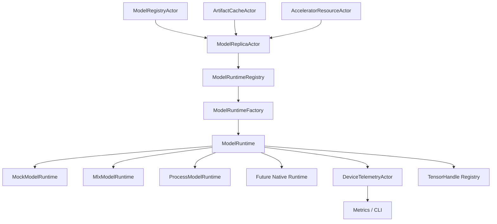

# AI-RUN-001 No-Throw Model Runtime Plugin ABI Design

**Status:** Proposed design; implementation not started
**Requirement ID:** AI-RUN-001
**Parent Architecture:** [Distributed AI Model Inference and Training Architecture](distributed-ai-model-inference-training-architecture.md)
**Related Requirements:** [AI-RUN-002](mock-model-runtime-design.md), [AI-MLX-001](mlx-runtime-plugin-design.md), [AI-MLX-003](mlx-tensor-handle-design.md), [AI-ACC-001](accelerator-resource-plane-design.md), [AI-ACC-002](accelerator-observability-telemetry-design.md), [AI-INF-001](model-replica-lifecycle-design.md), [AI-INF-002](dynamic-batcher-cancellation-design.md), [AI-INF-003](streaming-token-response-design.md), [AI-MOD-001](model-registry-artifact-metadata-design.md), [AI-OBS-001](ai-observability-request-token-metrics-design.md), [AI-SEC-001](ai-tenant-model-authorization-design.md), [AI-DATA-001](tensor-buffer-handle-data-plane-design.md)

## 1. Executive Summary

AI-RUN-001 defines the backend-neutral model runtime plugin ABI. HPActor should
own admission, actor lifecycle, routing, streaming orchestration,
cancellation, tracing, metrics, logging, and shutdown. Model runtimes own model
loading, warmup, inference, streaming decode, tensor execution, runtime memory,
and backend-specific errors.

The ABI must be no-throw, no-RTTI, source-compatible with existing non-AI actor
APIs, and safe for optional backends. The first concrete implementations are
`MockModelRuntime` from AI-RUN-002 and `MlxModelRuntime` from AI-MLX-001. The
same ABI must also support sidecar/process runtimes and future native adapters
without pulling their dependencies into HPActor core.

## 2. Goals

1. Define a stable C++20 runtime interface for load, warmup, infer, stream,
   cancel, stats, health, and unload.
2. Keep all public ABI methods `noexcept` and use `result<T>` plus structured
   error codes.
3. Support in-process native runtimes and out-of-process sidecars behind one
   actor-facing contract.
4. Make runtime calls explicit about blocking behavior, execution context,
   memory ownership, tensor handle ownership, and cancellation.
5. Provide lifecycle contracts that map cleanly to `ModelReplicaActor`,
   graceful shutdown, route invalidation, and observability.
6. Preserve build-time optionality for MLX and future heavyweight runtimes.
7. Provide compatibility and version negotiation for plugin/runtime contracts.
8. Make deterministic mock implementation possible without special-case actor
   code.

## 3. Non-Goals

- Defining one universal tensor execution API for every backend.
- Embedding MLX, PyTorch, ONNX Runtime, TensorRT-LLM, Triton, or tokenizer
  internals in HPActor core.
- Passing large tensors through protobuf `TypedMessage` payloads.
- Guaranteeing exactly-once model execution or training side effects.
- Defining the HTTP/OpenAI API surface; that belongs to inference serving.
- Defining distributed collectives or training rank launch semantics.
- Requiring dynamic loading in the first implementation. Static registration is
  acceptable as long as the ABI leaves room for dynamic loading later.

## 4. Design Approach

Three approaches were considered:

| Approach | Trade-off |
|----------|-----------|
| Header-only C++ virtual interface only | Simple and idiomatic for in-tree backends, but weak for sidecars and future binary plugins. |
| C dynamic plugin ABI first | Strong binary boundary, but too much loader/versioning complexity before the model lifecycle exists. |
| C++ source ABI with explicit versioned descriptor and sidecar protocol boundary | Recommended. It fits HPActor today and can evolve into a C/dynamic ABI when needed. |

The recommended first design is a source-level C++ interface implemented by
runtime adapters compiled into HPActor or optional backend libraries. Runtime
registration is explicit. Every implementation exposes a `ModelRuntimeDescriptor`
with version, backend kind, capabilities, and required build/config features.
Sidecar runtimes implement the same interface from HPActor's perspective while
using a framed process protocol internally.

## 5. Architecture



Components:

- `ModelRuntime`: no-throw runtime interface.
- `ModelRuntimeDescriptor`: backend metadata and ABI compatibility record.
- `ModelRuntimeFactory`: creates runtime instances from config.
- `ModelRuntimeRegistry`: maps backend names to factories.
- `RuntimeExecutionContext`: runtime-owned execution context, clock,
  cancellation registry, telemetry sink, and allocator hooks.
- `RuntimeTensorStore`: runtime-specific tensor handle registry.
- `ProcessModelRuntime`: generic sidecar adapter for process runtimes.

## 6. Runtime Interface

```cpp
class ModelRuntime {
  public:
    virtual ~ModelRuntime() = default;

    virtual ModelRuntimeDescriptor descriptor() const noexcept = 0;
    virtual result<ModelHandle>
    load(const ModelLoadRequest& request) noexcept = 0;
    virtual result<void> warmup(ModelHandle model) noexcept = 0;
    virtual result<InferenceResult>
    infer(ModelHandle model, const InferenceRequest& request) noexcept = 0;
    virtual result<StreamHandle>
    start_stream(ModelHandle model, const StreamRequest& request,
                 TokenSink& sink) noexcept = 0;
    virtual result<void> cancel(RequestId request_id) noexcept = 0;
    virtual ModelRuntimeStats stats(ModelHandle model) noexcept = 0;
    virtual ModelRuntimeHealth health() noexcept = 0;
    virtual result<void> unload(ModelHandle model) noexcept = 0;
};
```

Rules:

- Every method is `noexcept`.
- Every fallible method returns `result<T>`.
- `stats()` and `health()` return snapshots and must not block on heavyweight
  backend calls.
- `start_stream()` returns a `StreamHandle` so actors can reason about stream
  lifecycle separately from request id.
- `TokenSink` callbacks must be non-blocking from the runtime perspective; if a
  sink is actor-backed, delivery goes through a bounded actor message queue.
- Runtime implementations must tolerate duplicate `cancel()` and `unload()`
  requests.

## 7. Core Data Types

### 7.1 Descriptor

```cpp
struct ModelRuntimeDescriptor {
    std::string name;
    std::string backend;
    uint32_t abi_major;
    uint32_t abi_minor;
    RuntimeMode mode;
    RuntimeCapabilities capabilities;
    std::vector<std::string> supported_model_formats;
    std::vector<std::string> supported_tensor_devices;
};
```

`abi_major` changes when source compatibility breaks. `abi_minor` changes when
optional capabilities are added.

### 7.2 Capabilities

```cpp
struct RuntimeCapabilities {
    bool supports_sync_infer;
    bool supports_streaming;
    bool supports_cancel;
    bool supports_batching;
    bool supports_warmup;
    bool supports_stats;
    bool supports_tensor_handles;
    bool supports_sidecar_restart;
    bool requires_device_lease;
};
```

Capabilities are treated as runtime facts, not hints. A request that needs an
unsupported capability must fail during admission or before load, not in the
middle of execution.

### 7.3 Handles

```cpp
struct ModelHandle {
    uint64_t id;
    uint32_t generation;
    std::string runtime_name;
};

struct StreamHandle {
    uint64_t id;
    uint32_t generation;
    RequestId request_id;
};
```

Handle ids are process-local unless wrapped by a future remote runtime handle.
Generation counters prevent stale handle reuse after unload or stream close.

### 7.4 Requests And Results

`ModelLoadRequest` carries:

- model id, version, artifact handle, and format
- requested backend and runtime name
- tokenizer/adapters metadata
- device lease id
- memory budget and tensor handle policy
- warmup policy
- trace context

`InferenceRequest` carries:

- request id and deadline
- model handle
- prompt/input metadata
- input tensor handles or bounded inline inputs
- output mode
- max output tokens/bytes
- cancellation policy
- trace context

`InferenceResult` carries:

- request id
- completion status
- output tensor handles or bounded inline outputs
- token counts or output byte counts
- runtime latency summary
- runtime error code when failed

Large payloads use tensor handles from AI-MLX-003 or future backend-neutral
tensor handles, not protobuf control payloads.

## 8. Error Model

```cpp
enum class ModelRuntimeErrorCode : uint16_t {
    RuntimeUnavailable,
    RuntimeNotBuilt,
    UnsupportedAbiVersion,
    UnsupportedModelFormat,
    InvalidModelArtifact,
    ArtifactVerificationFailed,
    TokenizerUnavailable,
    AdapterUnavailable,
    DeviceLeaseRequired,
    DeviceLeaseMismatch,
    MemoryBudgetUnavailable,
    MemoryLimitExceeded,
    LoadFailed,
    WarmupFailed,
    InferFailed,
    StreamFailed,
    Cancelled,
    DeadlineExceeded,
    BackendOverloaded,
    BackendCrashed,
    TensorHandleInvalid,
    TensorMaterializationDenied,
    ProtocolError,
    InternalError,
};
```

Error rules:

- Runtime adapters map backend-specific errors into this stable namespace.
- Error messages are diagnostic strings, not control-flow keys.
- Error messages must be redacted before logs and metrics.
- `Cancelled` is an expected terminal outcome.
- `DeadlineExceeded` is distinct from backend crash or overload.
- Repeated runtime failures can trigger replica failure and route invalidation.
- Protocol errors apply to sidecars and framed IPC runtimes.

## 9. Lifecycle Contract

Model lifecycle:

1. Runtime is selected from config and model metadata.
2. `ModelReplicaActor` obtains a compatible `DeviceLease` when required.
3. `load()` creates a `ModelHandle` but does not make the model routable.
4. `warmup()` proves readiness for configured warmup inputs.
5. Replica transitions to `Ready`.
6. Requests call `infer()` or `start_stream()`.
7. Drain rejects new requests and lets in-flight work finish or cancel.
8. `unload()` releases model, stream, tensor, and runtime-owned resources.
9. Device lease is released after unload or timeout policy.

State rules:

- `load()` is not idempotent. Loading the same model twice returns separate
  handles unless the runtime explicitly supports handle reuse.
- `warmup()` is idempotent for a loaded handle.
- `unload()` is idempotent for a loaded or already unloaded handle.
- A handle in `Failed` state cannot become `Ready` without a fresh load.
- Runtime health degradation does not automatically unload a model; policy
  lives in the model replica and resource planes.

## 10. Concurrency And Execution Contract

Runtime calls can be expensive and must not run on event-loop or cooperative
scheduler hot paths.

Execution rules:

- `ModelReplicaActor` dispatches runtime work to a dedicated execution pool,
  dense-compute actor, blocking actor, or process sidecar.
- A runtime declares whether requests for one model handle are serialized or can
  run concurrently.
- Runtime-owned mutable state is not shared between actors except through
  message-passed handles.
- `TokenSink` implementations must apply bounded backpressure.
- Cancellation is cooperative unless a backend supports stronger interruption.
- Runtime telemetry is coalesced before entering metrics.

Thread-safety declaration:

```cpp
enum class RuntimeConcurrencyMode : uint8_t {
    SingleThreaded,
    PerModelSerialized,
    ConcurrentRequests,
    SidecarSerialized,
};
```

The runtime descriptor advertises this mode so `ModelReplicaActor` can select a
safe execution strategy.

## 11. Registration And Configuration

Runtime factories should follow subsystem-owned extension patterns.

```cpp
class ModelRuntimeFactory {
  public:
    virtual ~ModelRuntimeFactory() = default;
    virtual ModelRuntimeDescriptor descriptor() const noexcept = 0;
    virtual result<std::unique_ptr<ModelRuntime>>
    create(const RuntimeConfig& config,
           RuntimeExecutionContext& context) noexcept = 0;
};
```

Configuration sketch:

```toml
[[system.ai.runtime]]
name = "mock"
kind = "in_process"
backend = "mock"

[[system.ai.runtime]]
name = "mlx"
kind = "in_process"
backend = "mlx"

[[system.ai.runtime]]
name = "mlx-python-worker"
kind = "process"
backend = "mlx"
command = "python3"
args = ["mlx_worker.py"]
```

Parser rules:

- runtime config uses a self-registering TOML subsystem parser
- public parser interfaces use `TomlTableView`
- unknown runtime backends fail validation with structured config errors
- disabled runtime backends are not registered
- runtime descriptors are inspectable through CLI/admin

## 12. Sidecar Runtime Contract

Sidecar runtimes use the same `ModelRuntime` interface inside HPActor and a
framed IPC protocol outside HPActor.

Sidecar protocol requirements:

- handshake includes runtime name, ABI version, protocol version, and
  capabilities
- every request has a correlation id and deadline
- load, warmup, infer, stream, cancel, stats, health, and unload are explicit
  commands
- stream tokens are ordered and carry sequence numbers
- cancellation is idempotent
- sidecar crash maps to `BackendCrashed`
- malformed frames map to `ProtocolError`
- sidecar stdout/stderr handling is bounded and observable

The first sidecar protocol can be HPActor-owned and local-only. It does not
need to be a public network protocol.

## 13. Observability

Metrics:

- `hpactor_ai_runtime_loads_total`
- `hpactor_ai_runtime_load_duration_seconds`
- `hpactor_ai_runtime_warmup_duration_seconds`
- `hpactor_ai_runtime_inference_duration_seconds`
- `hpactor_ai_runtime_streams_active`
- `hpactor_ai_runtime_errors_total`
- `hpactor_ai_runtime_cancellations_total`
- `hpactor_ai_runtime_health_state`
- `hpactor_ai_runtime_unload_duration_seconds`

Default labels:

- `runtime`
- `backend`
- `mode`
- bounded `error_code`

Logs:

- runtime registered
- runtime rejected by config or ABI
- load started/completed/failed
- warmup started/completed/failed
- inference failed
- stream cancelled
- unload timed out
- sidecar crashed

Trace attributes:

- `ai.runtime.name`
- `ai.runtime.backend`
- `ai.runtime.mode`
- `ai.model.name`
- `ai.model.version`
- `ai.request.id`
- `ai.runtime.error_code`
- `ai.device.lease_id`

## 14. Testing Strategy

Unit tests:

- descriptor version compatibility
- capability validation
- runtime factory registration
- config validation and defaults
- error code mapping
- handle generation/stale rejection
- cancellation idempotence
- sidecar frame encoder/decoder, if introduced

Integration tests:

- `ModelReplicaActor` loads a model through `MockModelRuntime`
- warmup failure keeps replica unroutable
- streaming output preserves order
- cancellation releases stream state
- runtime stats and health are visible through metrics/CLI snapshots
- sidecar crash maps to structured failure

Compatibility tests:

- older minor ABI runtime remains accepted when capabilities match
- incompatible major ABI runtime is rejected
- disabled runtime backend is not registered

Stress tests:

- repeated load/warmup/unload
- concurrent cancellation storm
- runtime error storm with bounded logs and metrics
- long-running mock inference soak

## 15. Acceptance Criteria

AI-RUN-001 is complete when:

- The runtime ABI is defined with no-throw methods and structured `result<T>`
  failures.
- Runtime descriptors expose version, mode, backend, and capabilities.
- Runtime registration supports `MockModelRuntime`, `MlxModelRuntime`, and
  process sidecars without changing actor-facing code.
- Model lifecycle contracts cover load, warmup, infer, stream, cancel, stats,
  health, and unload.
- Runtime calls are explicitly kept off event-loop and cooperative scheduler hot
  paths.
- Errors map to stable runtime error codes.
- Metrics, logs, traces, and CLI/admin snapshots can identify runtime, backend,
  model, request, and error state with bounded labels.
- Public headers expose no MLX, Metal, CUDA, ROCm, Python, or vendor runtime
  types.
- Existing non-AI actor APIs remain source-compatible.

## 16. Open Questions

1. Should the first runtime ABI remain purely source-level C++, or should a C
   binary ABI be designed before the first non-mock implementation lands?
2. Should sidecar protocol frames use protobuf messages, a compact binary
   schema, or HPActor's existing RPC frame style?
3. Should runtime descriptors be registered only at static initialization time,
   or should dynamic runtime registration be allowed after `ActorSystem` start?
4. Should `stats()` be synchronous snapshot-only forever, or should expensive
   runtime stats use a separate async request?
5. Should `warmup()` be mandatory for every runtime, or optional by capability
   with model-specific policy?
