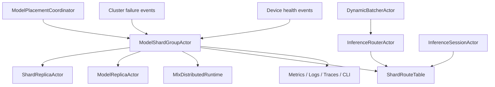

# AI-DIST-002 Model Shard Group Readiness And Stale Route Handling Design

**Status:** Proposed design; implementation not started
**Requirement ID:** AI-DIST-002
**Parent Architecture:** [Distributed AI Model Inference and Training Architecture](distributed-ai-model-inference-training-architecture.md)
**Depends On:** [AI-DIST-001](model-placement-coordinator-design.md), [AI-INF-001](model-replica-lifecycle-design.md), [Cluster Failure Model Architecture Design](../production/cluster-failure-model-design.md), [Cluster Sharding and Placement Architecture Design](../production/cluster-sharding-placement-design.md)
**Related Requirements:** [AI-DIST-MLX-001](mlx-distributed-rendezvous-adapter-design.md), [AI-MOD-001](model-registry-artifact-metadata-design.md), [AI-INF-002](dynamic-batcher-cancellation-design.md), [AI-INF-003](streaming-token-response-design.md), [AI-OBS-001](ai-observability-request-token-metrics-design.md), [AI-SEC-001](ai-tenant-model-authorization-design.md)

## 1. Executive Summary

AI-DIST-002 defines `ModelShardGroupActor`, the actor that turns a distributed
model placement epoch into a routeable shard group. It tracks shard membership,
replica readiness, required rendezvous readiness, route table generation, stale
route responses, drain, and failure semantics for one model deployment epoch.

AI-DIST-001 computes the desired placement. AI-DIST-002 decides whether that
placement is actually safe to route. A shard group becomes ready only after all
required shard replicas have loaded, warmed, joined required backend
rendezvous, and published a consistent route table generation. Requests that
arrive with stale epochs or stale shard owners receive structured route errors
instead of disappearing into old actors.

## 2. Goals

1. Define shard group lifecycle, membership, readiness, and route publication
   semantics.
2. Gate user traffic until every required shard or replica is ready.
3. Return stable stale-route errors such as `PlacementEpochStale`,
   `ModelShardMoved`, and `ShardGroupUnavailable`.
4. Integrate route invalidation with node failure, device loss, drain, rollout,
   and placement epoch change.
5. Support replica-only, tensor-parallel, pipeline-parallel, expert, and
   prefill/decode split metadata.
6. Keep tensor-parallel payloads out of actor messages; backend runtimes own
   collectives and large data movement.
7. Make route handling deterministic and observable.
8. Preserve source-compatible behavior for existing non-AI actor routes.

## 3. Non-Goals

- Computing placement plans or resource assignments.
- Implementing MLX distributed communication.
- Implementing generic cluster sharding from scratch.
- Moving live tensor or model state between nodes.
- Guaranteeing exactly-once inference execution after route retry.
- Owning HTTP, batching, or token stream delivery.

## 4. Design Approach

Three approaches were considered:

| Approach | Trade-off |
|----------|-----------|
| Let routers cache replica addresses directly | Fast for simple replicas, but stale routes and distributed readiness become ad hoc. |
| Reuse generic `ShardCoordinator` only | Good for logical actor ownership, but lacks model-specific readiness barriers and backend rendezvous state. |
| Add `ModelShardGroupActor` per placement epoch | Recommended. It keeps model readiness and stale-route semantics explicit while reusing generic epoch patterns. |

The recommended design uses a `ModelShardGroupActor` for each active or
candidate placement epoch. It owns the shard route table for that epoch and
publishes immutable route snapshots to routers only after readiness conditions
are satisfied.

## 5. Architecture



Primary components:

- `ModelShardGroupActor`: membership, readiness, route table, and drain owner.
- `ShardReplicaActor`: actor wrapper for one model shard or stage on one node.
- `ShardRouteTable`: immutable route snapshot with placement epoch and route
  generation.
- `InferenceSessionActor`: optional coordinator for multi-step distributed
  inference requests.
- `StaleRouteResponder`: helper that turns stale route detection into
  structured control replies.

## 6. Shard Group State Model

```cpp
enum class ModelShardGroupState : uint8_t {
    Planned,
    Activating,
    Loading,
    Warming,
    Rendezvous,
    Ready,
    Degraded,
    Draining,
    Rebalancing,
    Failed,
    Stopped,
};
```

State meanings:

- `Planned`: placement exists but shard actors have not started.
- `Activating`: shard actors are spawning or receiving deployment commands.
- `Loading`: shard replicas are loading artifacts and acquiring runtime handles.
- `Warming`: shard replicas are warming and forcing required evaluation.
- `Rendezvous`: distributed backend group is initializing when required.
- `Ready`: required shards are available and route table can be published.
- `Degraded`: optional replicas are missing but configured degraded mode allows
  limited routing.
- `Draining`: no new requests; in-flight sessions can finish by policy.
- `Rebalancing`: replacement epoch is being prepared.
- `Failed`: required shard or rendezvous failed.
- `Stopped`: all shard actors are unloaded or detached.

Only `Ready` and explicitly configured `Degraded` states are routeable.

## 7. Shard Replica State Model

```cpp
enum class ShardReplicaState : uint8_t {
    Pending,
    Spawning,
    Loading,
    Warming,
    RendezvousPending,
    Ready,
    Draining,
    Unavailable,
    Failed,
    Stopped,
};

struct ShardReplicaSnapshot {
    uint32_t shard_id;
    uint32_t replica_ordinal;
    uint32_t tensor_rank;
    uint32_t pipeline_stage;
    NodeId node_id;
    ActorAddress actor;
    DeviceLeaseId lease_id;
    ShardReplicaState state;
    uint64_t readiness_generation;
};
```

`ShardReplicaActor` may wrap or compose `ModelReplicaActor`. The wrapper adds
shard id, tensor rank, pipeline stage, group epoch, and stale-route behavior.

## 8. Readiness Contract

A shard group is ready when:

1. placement epoch is committed by AI-DIST-001
2. every required shard has at least one ready replica
3. every required replica has loaded and warmed through AI-INF-001
4. required device leases are active
5. cluster node state for owners is `Alive`
6. required distributed backend rendezvous is ready when configured
7. route table generation has been built from current snapshots
8. policy allows the model version and rollout generation to receive traffic

Optional replicas can be missing only when the deployment spec declares a
degraded mode and the router can see the degraded state.

## 9. Route Table Model

```cpp
struct ShardRouteEntry {
    ModelVersionId model_version;
    std::string deployment_name;
    ModelPlacementEpoch placement_epoch;
    uint64_t route_generation;
    uint32_t shard_id;
    uint32_t replica_ordinal;
    uint32_t tensor_rank;
    uint32_t pipeline_stage;
    NodeId owner_node;
    ActorAddress shard_actor;
    ShardReplicaState state;
};

struct ShardRouteTableSnapshot {
    ModelPlacementEpoch placement_epoch;
    uint64_t route_generation;
    ModelShardGroupState state;
    std::vector<ShardRouteEntry> entries;
};
```

Snapshots are immutable. Routers cache snapshots by model deployment, placement
epoch, and route generation.

## 10. Stale Route Handling

Every distributed inference control message should carry:

- model version
- deployment name
- placement epoch
- route generation when known
- shard id or session id
- trace context
- deadline

Structured stale-route outcomes:

- `PlacementEpochStale`: sender used an old placement epoch.
- `RouteGenerationStale`: sender used the right epoch but old route table.
- `ModelShardMoved`: shard has a new owner in a newer route table.
- `ShardGroupUnavailable`: required shard group is not routeable.
- `ShardReplicaDraining`: target is draining and cannot accept new work.

Rules:

- Stale replies include the newest known epoch and route generation when safe.
- Routers may refresh and retry idempotent requests if deadlines allow.
- Non-idempotent requests must not be blindly retried.
- Proxy loops are forbidden; a stale response can recommend refresh but not
  chain through multiple stale owners.
- A node that no longer owns a shard must reject new requests rather than
  performing best-effort execution.

## 11. Inference Session Contract

For replica-only deployments, the router may send directly to a batcher or
replica selected from the route table.

For distributed topologies, an `InferenceSessionActor` can coordinate:

- prefill/decode split steps
- pipeline stage sequencing
- tensor-parallel session metadata
- cancellation propagation across shards
- deadline and route refresh handling
- final outcome aggregation

The session actor carries control metadata only. Large tensors and collectives
remain inside backend runtimes or tensor/data-plane handles.

## 12. Failure Semantics

| Failure | Shard group behavior |
|---------|----------------------|
| required shard load failure | group transitions to `Failed`; route is not published |
| optional replica load failure | group may become `Degraded` by policy |
| node down or quarantined | affected entries invalidated; group fails or degrades by policy |
| device lost | affected shard replicas fail; group fails if required |
| rendezvous failure | group fails before route publication |
| route table stale | reply with structured stale-route outcome |
| old epoch receives request after drain | reject with `PlacementEpochStale` or `ShardReplicaDraining` |
| shard actor restart | readiness generation increments; route table updates |
| split-brain duplicate shard owner | quarantine or fail closed by cluster policy |

Previous routeable epochs remain serving until rollout or placement policy
drains them. Candidate epoch failure does not invalidate the active epoch.

## 13. Security And Audit

AI-SEC-001 gates:

- route table inspection
- forced readiness override
- shard group drain
- route invalidation command
- request cancellation across shards

Audit events:

- shard group ready
- shard group failed
- readiness override
- stale-route spike above threshold
- shard group drain
- route table epoch publication

## 14. Observability

Metrics:

- `hpactor_ai_shard_groups`
- `hpactor_ai_shard_group_state`
- `hpactor_ai_shard_replicas`
- `hpactor_ai_shard_readiness_duration_seconds`
- `hpactor_ai_shard_route_generation`
- `hpactor_ai_stale_routes_total`
- `hpactor_ai_shard_failures_total`
- `hpactor_ai_shard_group_degraded`

Trace spans:

- `ai.shard_group.activate`
- `ai.shard_group.ready`
- `ai.shard_group.route_refresh`
- `ai.shard_group.stale_route`
- `ai.inference_session`
- `ai.shard_replica.request`

CLI/admin surface:

- `/ai shard-groups`
- `/ai shard-group <id> show`
- `/ai shard-group <id> routes`
- `/ai shard-group <id> drain`
- `/ai request <id> route`

## 15. Configuration

Example:

```toml
[system.ai.shards]
enabled = true
readiness_timeout_ms = 120000
route_snapshot_retention = 8
stale_route_retry_limit = 1
allow_degraded_route = false
fail_closed_on_duplicate_owner = true

[model.sharding]
kind = "tensor"
tensor_parallel_degree = 2
required_shards = 2
optional_replicas = 0
readiness_policy = "all_required"
```

## 16. Testing Strategy

Deterministic tests:

- group remains non-routeable until all required shards are ready
- optional replica failure produces degraded state only when configured
- route table generation increments on shard restart
- stale epoch returns `PlacementEpochStale`
- stale route generation returns `RouteGenerationStale`
- moved shard returns `ModelShardMoved`
- node down invalidates affected routes
- old active epoch remains serving while candidate fails
- shard drain rejects new work and allows cancellation

Integration tests:

- placement plan creates shard group and route snapshot
- router refreshes stale route and retries eligible request once
- session cancellation propagates to every shard replica
- MLX rendezvous readiness gates route publication when configured

Stress tests:

- route refresh race during epoch switch
- high-rate stale-route responses bounded by retry policy
- node failure during group activation

## 17. Acceptance Criteria

AI-DIST-002 is ready for implementation when:

- shard group and shard replica states have explicit transition tests
- route snapshots carry placement epoch and route generation
- readiness gates all user traffic for required shards
- stale-route outcomes are stable and actionable
- route retries are bounded and deadline-aware
- node/device/rendezvous failures invalidate routes by policy
- candidate epoch failure does not break the previous routeable epoch
- observability can explain why a shard group is or is not routeable

## 18. Open Questions

1. Should `InferenceSessionActor` exist in the first distributed inference
   milestone, or should routers call shard replicas directly for simple
   replica-only deployments?
2. Should stale-route retry be router-owned only, or can batchers retry when
   they receive a stale response?
3. Should degraded mode ever be allowed for tensor-parallel deployments, or
   only for replica-parallel deployments?
4. How many historical route snapshots should be retained for diagnostics?
