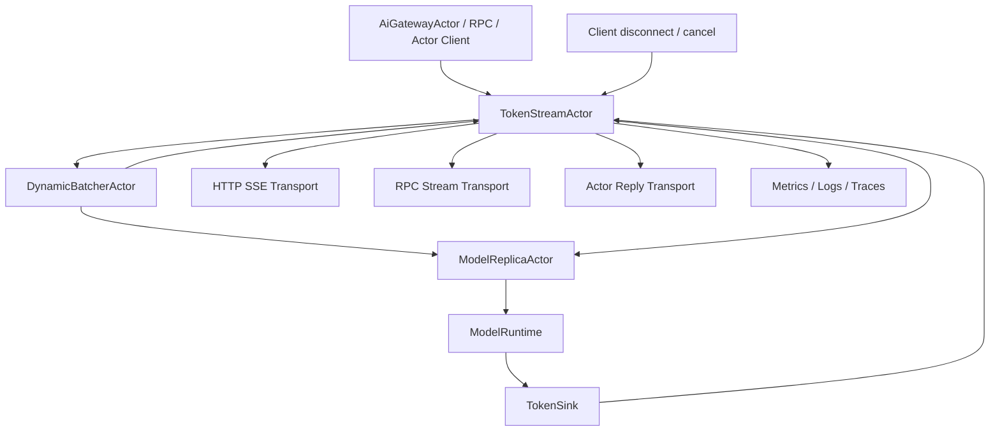
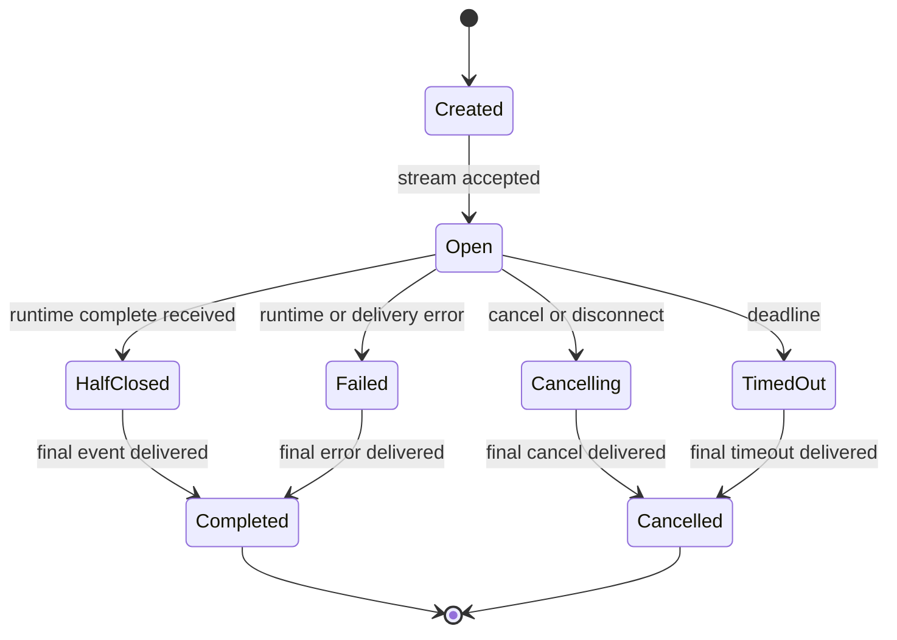

# AI-INF-003 Streaming Token Response Actor Design

**Status:** Proposed design; implementation not started
**Requirement ID:** AI-INF-003
**Parent Architecture:** [Distributed AI Model Inference and Training Architecture](distributed-ai-model-inference-training-architecture.md)
**Depends On:** [AI-INF-001](model-replica-lifecycle-design.md), [AI-INF-002](dynamic-batcher-cancellation-design.md), [AI-RUN-001](model-runtime-plugin-abi-design.md), [AI-RUN-002](mock-model-runtime-design.md)
**Related Requirements:** [AI-MLX-001](mlx-runtime-plugin-design.md), [AI-MLX-003](mlx-tensor-handle-design.md), [AI-OBS-001](ai-observability-request-token-metrics-design.md), [AI-SEC-001](ai-tenant-model-authorization-design.md), [AI-DATA-001](tensor-buffer-handle-data-plane-design.md)

## 1. Executive Summary

AI-INF-003 defines `TokenStreamActor`, the actor that owns one streaming model
response from creation through final delivery. It receives ordered token deltas
from a runtime-backed `TokenSink`, applies bounded buffering and backpressure,
forwards stream events to HTTP, RPC, or actor-native clients, handles
cancellation and client disconnects, and emits a final outcome with usage and
trace correlation.

The stream actor separates model execution from client delivery. `ModelRuntime`
and `ModelReplicaActor` should not write directly to HTTP sockets or external
clients. The stream actor provides the single place where ordering, duplicate
handling, final events, timeout, cancellation, redaction, and transport
backpressure are enforced.

## 2. Goals

1. Deliver token deltas in order with monotonically increasing sequence
   numbers.
2. Bound every stream buffer by event count and bytes.
3. Support cancellation from client disconnect, explicit user cancel, batcher
   cancel, replica failure, timeout, and shutdown.
4. Provide a non-blocking `TokenSink` boundary for model runtimes.
5. Map stream events to HTTP SSE, RPC frames, and actor-native replies without
   coupling runtimes to a transport.
6. Emit a final stream outcome exactly once.
7. Preserve trace context, request id, model id, token counts, and finish
   reason.
8. Test ordering, backpressure, and cancellation deterministically with
   `MockModelRuntime`.

## 3. Non-Goals

- Defining a complete OpenAI-compatible HTTP schema.
- Implementing tokenizer logic or semantic token decoding.
- Owning batch formation or runtime scheduling.
- Guaranteeing that a cancelled backend never computes another token.
- Persisting token streams for replay.
- Logging prompt or completion content by default.

## 4. Design Approach

Three approaches were considered:

| Approach | Trade-off |
|----------|-----------|
| Runtime writes directly to HTTP/RPC transport | Fast path is short, but runtime becomes transport-aware and cancellation/backpressure are duplicated. |
| Batcher owns all streaming state | Keeps queue and stream together, but mixes admission policy with client delivery and transport details. |
| One actor per stream | Recommended. It isolates delivery, backpressure, cancellation, and final outcome for each request. |

The recommended first design creates a `TokenStreamActor` for each streaming
request. The actor has a bounded mailbox and a bounded internal event queue.
Runtime token callbacks enqueue `StreamEvent` messages through a non-blocking
sink. The actor forwards events to a `StreamTransport` abstraction implemented
by HTTP SSE, WebSocket, RPC, or actor-native clients.

## 5. Architecture



Primary components:

- `TokenStreamActor`: actor-owned stream state and event delivery.
- `TokenSinkAdapter`: no-throw runtime callback adapter that sends bounded
  messages to the stream actor.
- `StreamTransport`: transport-neutral delivery interface.
- `StreamEventQueue`: bounded ordered event queue owned by the actor.
- `StreamCancellationLink`: cancellation path back to batcher and replica.

## 6. Stream State Machine



State meanings:

- `Created`: actor exists and transport is being bound.
- `Open`: token events are accepted.
- `HalfClosed`: runtime has sent EOS or final usage; remaining buffered events
  can still be delivered.
- `Cancelling`: cancellation has been requested and propagated.
- `Failed`: runtime or transport failed.
- `TimedOut`: stream deadline expired.
- `Completed`: final success or error event was delivered.
- `Cancelled`: final cancellation event was delivered.

Only one terminal event may be emitted.

## 7. Event Model

```cpp
enum class StreamEventType : uint8_t {
    Started,
    Token,
    Logprob,
    Usage,
    Heartbeat,
    Error,
    Complete,
    Cancelled,
};

struct TokenStreamEvent {
    StreamId stream_id;
    RequestId request_id;
    uint64_t sequence;
    StreamEventType type;
    std::string token_text;
    TensorHandle token_tensor;
    uint32_t token_id;
    FinishReason finish_reason;
    ModelRuntimeError error;
    TokenUsage usage;
    TraceContext trace;
};
```

Rules:

- `sequence` starts at 0 or 1 by config and increments by one per event from
  the runtime sink.
- `Started`, `Complete`, `Cancelled`, and terminal `Error` events participate
  in ordering.
- `token_text` is bounded by per-event byte limits.
- Large logits, embeddings, or token tensors use `TensorHandle`, not inline
  protobuf payloads.
- `Usage` may be separate or included in `Complete`, but final usage must be
  emitted once when available.

## 8. Ordering And Idempotency

The stream actor owns ordering.

Ordering policy:

1. accept the next expected sequence immediately
2. reject duplicate sequence numbers as duplicate callbacks
3. hold a bounded out-of-order gap only if enabled for sidecar runtimes
4. fail the stream on an unrecoverable sequence gap
5. ignore non-terminal events after terminal state
6. accept duplicate terminal signals but emit only the first terminal outcome

In-process runtimes such as `MockModelRuntime` and `MlxModelRuntime` should
emit ordered events. Out-of-order tolerance exists for process runtimes and
future remote stream adapters.

## 9. Backpressure Contract

Backpressure is explicit and bounded.

Budgets:

- max buffered events
- max buffered bytes
- max single event bytes
- max write wait
- max stream duration

When the actor cannot deliver to the transport fast enough:

1. stop accepting more runtime events after the queue reaches capacity
2. return a sink status such as `StreamBackpressure`
3. request cancellation through batcher and replica
4. deliver a terminal error or cancellation to the client if possible
5. release stream and request resources

The stream actor must not drop token events silently. It can coalesce
heartbeats, but not tokens or terminal events.

`TokenSinkAdapter` must never block a runtime thread indefinitely. It returns a
structured status that lets the runtime stop generation or report a
backpressure failure.

## 10. Cancellation Contract

Cancellation sources:

- explicit user request
- client connection close
- ingress timeout
- batcher cancellation
- replica drain or failure
- runtime failure
- stream actor shutdown

Cancellation flow:

1. stream actor transitions to `Cancelling`
2. transport is marked closing
3. batcher receives `CancelInference`
4. replica receives or derives `CancelInference`
5. runtime `cancel(request_id)` is invoked where supported
6. buffered non-terminal events are discarded by policy
7. terminal `Cancelled` event is emitted if the transport is still open
8. final metrics and traces are closed exactly once

Cancellation is idempotent. A late token after cancellation is counted as a
late runtime callback and ignored unless diagnostics are configured to sample
it.

## 11. Transport Contract

```cpp
class StreamTransport {
  public:
    virtual ~StreamTransport() = default;
    virtual result<void> start(const StreamStart& start) noexcept = 0;
    virtual result<void> write(const TokenStreamEvent& event) noexcept = 0;
    virtual result<void> finish(const StreamFinalEvent& final) noexcept = 0;
    virtual StreamTransportState state() const noexcept = 0;
};
```

Transport implementations:

- `SseStreamTransport`: HTTP server-sent events for OpenAI-style streaming.
- `RpcStreamTransport`: HPActor RPC frames for internal clients.
- `ActorStreamTransport`: actor-native ordered replies to an `ActorAddress`.
- `MockStreamTransport`: deterministic tests.

Transport calls must not perform unbounded blocking I/O on cooperative actor
threads. If a transport needs blocking writes, it uses event-loop readiness,
daemon actor ownership, or a transport-specific worker.

## 12. Runtime Sink Contract

The runtime sees a narrow `TokenSink`:

```cpp
class TokenSink {
  public:
    virtual result<void> on_event(const TokenStreamEvent& event) noexcept = 0;
    virtual bool cancelled() const noexcept = 0;
};
```

Rules:

- `on_event()` is no-throw and bounded.
- `cancelled()` is safe to poll from runtime token loops.
- The sink does not expose transport details.
- The sink validates stream id and request id before enqueue.
- Sink failures map to `StreamBackpressure`, `StreamClosed`, or
  `StreamActorUnavailable`.

## 13. Integration With Batcher And Replica

Creation flow:

1. ingress or router decides the request needs streaming output
2. `DynamicBatcherActor` admits the request and creates or asks gateway to
   create a `TokenStreamActor`
3. batcher dispatches `StartTokenStream` to `ModelReplicaActor`
4. replica calls runtime `start_stream()` with a `TokenSinkAdapter`
5. runtime emits events to the stream actor
6. stream actor delivers events and final outcome

Final outcome flow:

- stream actor notifies batcher when terminal state is reached
- batcher releases request accounting
- replica releases in-flight ledger entry when runtime completion arrives
- metrics and traces can link stream completion and runtime completion even if
  they arrive in different order

The batcher remains the request accounting owner. The stream actor owns client
delivery state.

## 14. MLX-First Considerations

For `MlxModelRuntime`:

- token generation may be lazy or stream-synchronized by runtime policy
- runtime must not call `TokenSink` while holding MLX internal locks
- explicit evaluation boundaries should be reflected in time-to-first-token
  and per-token latency metrics
- stream cancellation must stop future token callbacks as soon as practical
- tensor-backed outputs use `MlxTensorHandle` metadata and lifetime rules from
  AI-MLX-003

The stream actor must also work with `MockModelRuntime` to verify ordering,
backpressure, and cancellation without MLX.

## 15. Observability

Metrics:

- `hpactor_ai_streams_started_total`
- `hpactor_ai_streams_completed_total`
- `hpactor_ai_streams_cancelled_total`
- `hpactor_ai_streams_failed_total`
- `hpactor_ai_stream_buffer_events`
- `hpactor_ai_stream_buffer_bytes`
- `hpactor_ai_time_to_first_token_seconds`
- `hpactor_ai_time_per_output_token_seconds`
- `hpactor_ai_stream_tokens_total`
- `hpactor_ai_stream_backpressure_total`
- `hpactor_ai_stream_late_events_total`

Trace spans:

- `ai.stream.open`
- `ai.stream.first_token`
- `ai.stream.token`
- `ai.stream.cancel`
- `ai.stream.finish`

CLI/admin surface:

- `/ai streams`
- `/ai stream <id> show`
- `/ai stream <id> cancel`
- `/ai requests --active`

Default snapshots show ids, model, state, token counts, age, queue depth, and
finish reason. They do not show prompt or completion text unless explicitly
enabled and redacted.

## 16. Configuration

Example:

```toml
[system.ai.streaming]
enabled = true
default_transport = "sse"
max_buffered_events = 128
max_buffered_bytes = 1048576
max_event_bytes = 65536
heartbeat_interval_ms = 15000
stream_timeout_ms = 300000
cancel_on_client_disconnect = true
emit_usage_event = true
allow_out_of_order_gap = false
```

Per-model overrides:

```toml
[model.streaming]
enabled = true
max_output_tokens = 2048
max_stream_duration_ms = 120000
transport = "sse"
```

Configuration parsing should use a self-registering subsystem parser.

## 17. Failure Semantics

| Failure | Stream action | Upstream action |
|---------|---------------|-----------------|
| Client disconnect | transition to `Cancelling` | notify batcher and replica |
| Transport write failure | terminal error or cancel | notify batcher |
| Runtime error event | deliver terminal error | release stream accounting |
| Sequence duplicate | ignore and count duplicate | none unless excessive |
| Sequence gap | fail stream by policy | cancel runtime |
| Buffer full | cancel with `StreamBackpressure` | cancel runtime |
| Deadline exceeded | cancel stream | cancel batcher/replica request |
| Replica drains | deliver cancellation or error | close stream |
| Actor shutdown | drain or cancel by shutdown policy | release resources |

Terminal outcomes:

- `Complete`
- `Cancelled`
- `DeadlineExceeded`
- `RuntimeError`
- `TransportError`
- `StreamBackpressure`
- `ReplicaUnavailable`

## 18. Testing Strategy

Deterministic tests with `MockModelRuntime` and `MockStreamTransport`:

- ordered token delivery
- duplicate token callback ignored
- sequence gap fails stream
- complete event emitted once
- usage emitted once
- client disconnect cancels batcher and runtime
- explicit cancel is idempotent
- buffer full triggers backpressure cancellation
- late token after cancel is ignored and counted
- transport write failure closes stream
- deadline timeout closes stream
- actor shutdown cancels open streams by policy
- trace and metrics close on every terminal path

System tests:

- HTTP SSE receives ordered deltas and final event
- batcher request accounting is released after stream terminal event
- replica in-flight ledger is released after runtime completion
- stream cancellation during model drain does not leak request records

## 19. Acceptance Criteria

AI-INF-003 is ready for implementation when:

- stream state and terminal outcomes have explicit types
- token sequence rules and duplicate handling have tests
- stream buffers have hard event and byte bounds
- backpressure cannot block runtime threads indefinitely
- cancellation is idempotent and propagates to batcher and replica
- transport implementations are separated from runtime code
- prompt/completion logging is disabled by default
- `MockModelRuntime` can prove ordering, finalization, and cancellation in CI

## 20. Open Questions

1. Should SSE be built into HPActor's optional HTTP gateway or delivered first
   as an example gateway adapter?
2. Should the first stream actor support logprobs, or reserve the event type
   and leave it unimplemented until model output metadata is defined?
3. Should stream actors be spawned by gateway, batcher, or a dedicated
   `StreamSupervisorActor`?
4. What is the default policy for buffered tokens after cancellation: discard
   immediately or flush already delivered transport frames only?
