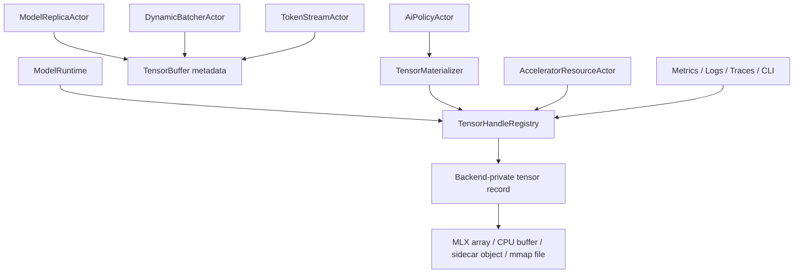

# AI-DATA-001 Tensor Buffer Metadata And Handle Model Design

**Status:** Proposed design; implementation not started
**Requirement ID:** AI-DATA-001
**Parent Architecture:** [Distributed AI Model Inference and Training Architecture](distributed-ai-model-inference-training-architecture.md)
**Related Requirements:** [AI-MLX-003](mlx-tensor-handle-design.md), [AI-RUN-001](model-runtime-plugin-abi-design.md), [AI-MOD-001](model-registry-artifact-metadata-design.md), [AI-INF-001](model-replica-lifecycle-design.md), [AI-INF-002](dynamic-batcher-cancellation-design.md), [AI-INF-003](streaming-token-response-design.md), [AI-SEC-001](ai-tenant-model-authorization-design.md), [AI-OBS-001](ai-observability-request-token-metrics-design.md), [AI-ACC-001](accelerator-resource-plane-design.md), [AI-DIST-001](model-placement-coordinator-design.md), [AI-DIST-002](model-shard-group-readiness-stale-routes-design.md), [AI-DIST-MLX-001](mlx-distributed-rendezvous-adapter-design.md)

## 1. Executive Summary

AI-DATA-001 defines the backend-neutral tensor buffer metadata and handle model
for HPActor AI workloads. Actor `TypedMessage` payloads should carry control
metadata, small bounded values, and opaque handles, not raw tensors, MLX arrays,
device pointers, large logits, embeddings, gradients, or checkpoint chunks.

AI-MLX-003 defines the first concrete MLX handle path. AI-DATA-001 generalizes
that pattern into an HPActor-owned data-plane contract that can support CPU
buffers, MLX unified-memory handles, mmap files, shared memory, remote tensor
references, sidecar object ids, and future CUDA/ROCm handles without leaking
backend headers into public actor APIs.

## 2. Goals

1. Define backend-neutral tensor metadata types for shape, dtype, device kind,
   ownership, readiness, lifetime, and security class.
2. Keep large tensor bytes out of ordinary protobuf actor messages.
3. Define `TensorHandle` generation, ownership, release, invalidation, and
   materialization semantics.
4. Support bounded host materialization for outputs, tests, diagnostics, and
   admin previews.
5. Support MLX unified-memory handles as the first concrete backend-specific
   implementation.
6. Integrate tensor handles with resource leases, security policy,
   observability, cancellation, model unload, and shutdown.
7. Leave room for remote tensor transfer and chunking without requiring it in
   Milestone 1.
8. Preserve no-exception, no-RTTI public API constraints.

## 3. Non-Goals

- Implementing a tensor computation library in HPActor.
- Replacing MLX, PyTorch, ONNX Runtime, CUDA, ROCm, or Metal memory managers.
- Making live device memory transparently migratable between processes or
  nodes.
- Sending gradients or activations through actor messages for distributed
  training collectives.
- Guaranteeing zero-copy interop for every backend.
- Providing unbounded debug previews or tensor dumps.

## 4. Design Approach

Three approaches were considered:

| Approach | Trade-off |
|----------|-----------|
| Put tensor bytes in protobuf payloads | Easy for tiny tests, but unsafe for memory, transport, and device-backed data. |
| Make every runtime define its own handle type | Keeps backends flexible, but makes batchers, streams, security, and observability backend-specific. |
| Backend-neutral handle plus private backend records | Recommended. It gives HPActor one control contract while runtimes own actual buffers. |

The recommended design defines public HPActor metadata and handle ids. Each
runtime owns private records and materialization logic behind the same
interface.

## 5. Architecture



Primary components:

- `TensorHandle`: opaque actor-visible capability id and generation.
- `TensorBuffer`: actor-visible tensor metadata plus handle.
- `TensorHandleRegistry`: runtime or node-local owner of private tensor records.
- `TensorMaterializer`: bounded host-copy and serialization boundary.
- `TensorInvalidationNotifier`: sends release or invalidation messages to
  owners when runtime unload, cancellation, or lease loss occurs.

## 6. Public Data Model

```cpp
enum class TensorDeviceKind : uint8_t {
    Cpu,
    PinnedCpu,
    MlxUnified,
    Cuda,
    Rocm,
    Metal,
    Remote,
    MmapFile,
    SidecarObject,
};

enum class DataType : uint8_t {
    Bool,
    Int8,
    Int16,
    Int32,
    Int64,
    UInt8,
    Float16,
    Float32,
    Float64,
    BFloat16,
};

struct TensorShape {
    std::vector<int64_t> dims;
    std::vector<int64_t> strides;
};

struct TensorHandle {
    uint64_t id;
    uint32_t generation;
    uint64_t registry_id;
};

struct TensorBuffer {
    TensorHandle handle;
    TensorDeviceKind device;
    DataType dtype;
    TensorShape shape;
    uint64_t logical_bytes;
    uint64_t estimated_resident_bytes;
    TensorOwnership ownership;
    TensorReadiness readiness;
    TensorSecurityClass security_class;
};
```

Metadata is safe for actor messages. Tensor contents are not.

## 7. Ownership And Lifetime

```cpp
enum class TensorOwnership : uint8_t {
    Borrowed,
    RuntimeOwned,
    ActorOwned,
    SharedReadOnly,
    External,
};

enum class TensorReadiness : uint8_t {
    Unknown,
    Lazy,
    Evaluating,
    Ready,
    Failed,
    Released,
};

enum class TensorSecurityClass : uint8_t {
    PublicMetadata,
    PromptOrCompletion,
    Embedding,
    Logits,
    Gradient,
    Checkpoint,
    Secret,
};
```

Rules:

- Handle ids are scoped by `registry_id` and protected by generation counters.
- Release is idempotent.
- Stale generation access returns `TensorHandleStale`.
- Runtime unload invalidates runtime-owned handles.
- Cancellation invalidates active output handles unless they already reached a
  terminal delivered state.
- Shared read-only handles cannot be mutated through actor APIs.
- External handles require best-effort release messages to the sidecar or
  external runtime.

## 8. Registry Contract

Messages:

| Message | Outcome |
|---------|---------|
| `RegisterTensorHandle` | creates actor-visible metadata for a backend record |
| `RetainTensorHandle` | increments owner reference or lease association |
| `ReleaseTensorHandle` | decrements owner reference and releases when final |
| `InvalidateTensorHandle` | marks handle released or failed |
| `DescribeTensorHandle` | returns metadata without contents |
| `MaterializeTensor` | returns bounded host bytes by policy |
| `ListTensorHandles` | returns filtered admin snapshot |

Registry ownership can be per-runtime for Milestone 1. A node-local registry can
be added later if multiple runtimes need shared handle lookup.

## 9. Materialization Contract

```cpp
struct TensorMaterializeRequest {
    TensorHandle handle;
    uint64_t max_bytes;
    bool require_ready;
    bool allow_copy;
    bool diagnostic_preview;
    AiIdentityContext identity;
};

struct TensorMaterializeResult {
    std::vector<uint8_t> bytes;
    TensorShape shape;
    DataType dtype;
    bool truncated;
    TensorReadiness readiness;
};
```

Rules:

- Materialization is bounded by `max_bytes`.
- `AiPolicyActor` authorizes materialization and debug preview.
- Lazy handles must be evaluated by the runtime before host copy when
  `require_ready` is true.
- Truncated output is allowed only for diagnostics.
- Correct model outputs must not depend on truncated materialization.
- Materialization runs on runtime execution context, not the event loop.

## 10. Message And Serialization Policy

Actor messages may carry:

- tensor handle id and generation
- registry id
- device kind
- shape and dtype
- logical and estimated resident bytes
- readiness
- security class
- trace/request/model ids

Actor messages must not carry:

- raw device pointers
- MLX arrays
- Metal buffers
- Python object pointers
- unbounded tensor bytes
- credentials for remote object storage

Remote serialization:

- include schema version
- include node endpoint only for future `RemoteTensorHandle`
- include checksum for chunked remote transfer when implemented
- reject process-local handles when remote export is disabled

## 11. Resource Accounting

Tensor handles integrate with AI-ACC-001 resource leases:

- model weight handles are attributed to model replica lease
- KV cache handles are attributed to batch or replica cache budget
- output handles are attributed to request or stream lifetime
- checkpoint handles are attributed to job or checkpoint actor

Accounting is conservative. Runtime memory telemetry remains authoritative for
actual active/cache memory when available.

## 12. Security And Privacy

AI-SEC-001 governs:

- tensor materialization
- debug preview
- remote export
- admin inspection
- retention override

Default policy:

- logs and metrics never include tensor contents
- CLI/admin shows metadata only
- prompt, completion, embedding, gradient, checkpoint, and secret tensors are
  sensitive
- debug preview is disabled
- remote export is disabled
- materialization requires explicit caller authorization

## 13. Observability

Metrics:

- `hpactor_ai_tensor_handles`
- `hpactor_ai_tensor_handle_bytes`
- `hpactor_ai_tensor_handle_releases_total`
- `hpactor_ai_tensor_handle_invalidations_total`
- `hpactor_ai_tensor_materialization_total`
- `hpactor_ai_tensor_materialization_bytes`
- `hpactor_ai_tensor_errors_total`

Trace spans:

- `ai.tensor.register`
- `ai.tensor.retain`
- `ai.tensor.release`
- `ai.tensor.materialize`
- `ai.tensor.invalidate`

CLI/admin surface:

- `/ai tensors`
- `/ai tensor <id> show`
- `/ai tensor <id> materialize --max-bytes <n>`

Materialize commands require explicit authorization and emit audit records.

## 14. MLX-First Mapping

AI-MLX-003 maps `TensorDeviceKind::MlxUnified` to private MLX handle records.

MLX rules:

- MLX arrays stay behind private runtime records.
- `TensorReadiness::Lazy` represents unevaluated MLX computation.
- host materialization forces evaluation when policy allows it.
- stream synchronization is runtime-owned.
- `estimated_resident_bytes` is advisory and paired with MLX active/cache
  memory telemetry.
- runtime unload invalidates live MLX handles.

The generic data-plane contract must remain useful even when `ENABLE_MLX=OFF`.
`MockModelRuntime` and CPU-only tests can use mock tensor registries.

## 15. Failure Semantics

| Failure | Runtime behavior |
|---------|------------------|
| unknown handle | return `TensorHandleNotFound` |
| stale generation | return `TensorHandleStale` |
| released handle | return current released state |
| materialization too large | return `TensorTooLarge` or truncated diagnostic by policy |
| policy denies copy | return `TensorCopyDenied` and audit |
| lazy evaluation fails | mark readiness `Failed` and return runtime error |
| runtime unloads with live handles | invalidate handles and notify owners |
| sidecar disconnects | external handles become invalid |
| remote export disabled | return `TensorRemoteExportDisabled` |
| accounting mismatch | log and metric; runtime memory counters remain authoritative |

## 16. Configuration

Example:

```toml
[system.ai.tensor]
enabled = true
max_handle_count = 65536
default_materialize_max_bytes = 1048576
debug_preview_enabled = false
remote_export_enabled = false
retain_released_handle_ms = 60000

[system.ai.tensor.security]
materialize_requires_policy = true
redact_sensitive_metadata = true
```

## 17. Testing Strategy

Unit tests:

- handle id and generation allocation
- stale handle rejection
- idempotent release
- readiness transitions
- bounded materialization
- sensitive tensor copy denial
- metadata serialization round trip
- runtime unload invalidates handles
- accounting updates on retain and release

Integration tests:

- `MockModelRuntime` returns tensor handles for embeddings/logits
- `TokenStreamActor` carries token tensor metadata without contents
- `ModelReplicaActor` invalidates handles on unload
- AI-SEC denial prevents materialization
- AI-OBS records materialization metrics without contents

Stress tests:

- high-rate create/release
- repeated stale handle access
- unload with many live handles
- materialization requests racing with cancellation

## 18. Acceptance Criteria

AI-DATA-001 is ready for implementation when:

- actor-visible tensor metadata is backend-neutral and HPActor-owned
- tensor contents are excluded from protobuf control messages by contract
- handle generation, release, invalidation, and materialization semantics are
  explicit
- security classes and policy hooks are defined
- resource accounting links handles to leases without claiming exact backend
  cache release
- observability reports metadata and failures without contents
- mock tensor handles can exercise the path in CI
- MLX handle semantics from AI-MLX-003 map cleanly onto the generic model

## 19. Open Questions

1. Should the first implementation use per-runtime registries only, or add a
   node-local registry from the start?
2. Should `TensorSecurityClass::Embedding` be treated as sensitive by default
   for all deployments?
3. Should remote tensor handles be represented now as disabled metadata, or
   deferred until distributed inference placement is designed?
4. Should materialized diagnostic bytes use `std::vector<uint8_t>` or an
   allocator-backed HPActor buffer type from the memory subsystem?
