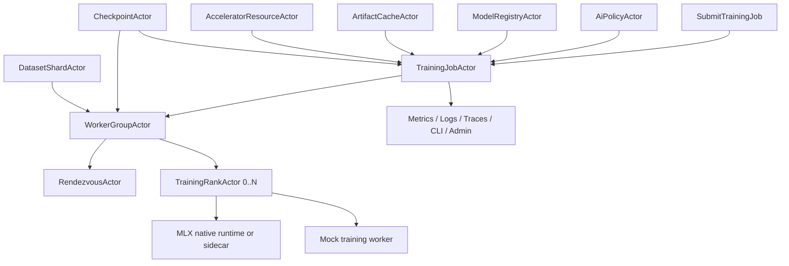
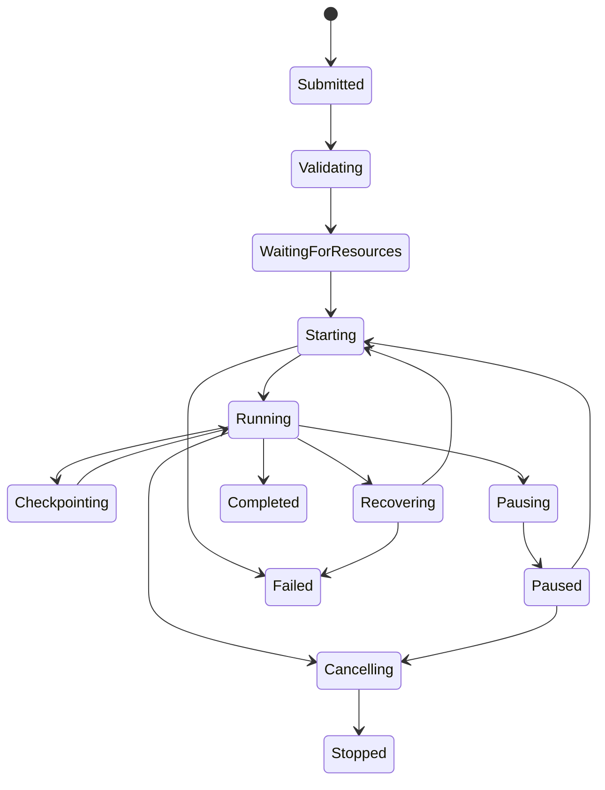

# AI-TRN-001 Training Job Actor And Worker Group Lifecycle Design

**Status:** Proposed design; implementation not started
**Requirement ID:** AI-TRN-001
**Parent Architecture:** [Distributed AI Model Inference and Training Architecture](distributed-ai-model-inference-training-architecture.md)
**Depends On:** [AI-ACC-001](accelerator-resource-plane-design.md), [AI-ACC-002](accelerator-observability-telemetry-design.md), [AI-MOD-001](model-registry-artifact-metadata-design.md), [AI-RUN-001](model-runtime-plugin-abi-design.md), [AI-RUN-002](mock-model-runtime-design.md), [AI-MLX-001](mlx-runtime-plugin-design.md), [AI-DIST-MLX-001](mlx-distributed-rendezvous-adapter-design.md), [AI-SEC-001](ai-tenant-model-authorization-design.md)
**Related Requirements:** [AI-TRN-002](training-rank-rendezvous-checkpoint-design.md), [AI-OPS-001](ai-admin-cli-operations-design.md), [AI-TST-001](ai-fault-injection-chaos-testing-design.md), [AI-OBS-001](ai-observability-request-token-metrics-design.md), [AI-DATA-001](tensor-buffer-handle-data-plane-design.md)

## 1. Executive Summary

AI-TRN-001 defines the training orchestration lifecycle for HPActor's AI
runtime. It introduces `TrainingJobActor` as the authoritative owner of one
training or fine-tuning job, and `WorkerGroupActor` as the owner of one
execution attempt's workers and ranks.

HPActor does not implement optimizer math, gradient kernels, data loaders, or
MLX collectives. It owns the distributed control plane around those frameworks:
job admission, policy checks, gang resource reservation, worker group start,
pause, resume, cancellation, failure classification, recovery state,
observability, and operator-visible history.

The first production-oriented path should target macOS on Apple silicon with
MLX as the preferred training runtime, using an MLX process sidecar or native
adapter behind HPActor supervision. All orchestration contracts must also be
testable with deterministic mock training workers so CI does not require Apple
GPU hardware, multi-machine MLX setup, or real model artifacts.

## 2. Goals

1. Define `TrainingJobActor` lifecycle states and valid transitions.
2. Define `WorkerGroupActor` lifecycle for one job execution attempt.
3. Admit training jobs through tenant policy, model/artifact validation, and
   gang resource reservation.
4. Support MLX-first worker launch while preserving a backend-neutral control
   contract.
5. Prefer whole-worker-group restart for the first recovery policy.
6. Make pause, resume, cancel, checkpoint, and failure recovery explicit
   actor messages.
7. Keep resource leases, job history, failure reasons, and state snapshots
   bounded and observable.
8. Provide deterministic system-test coverage with mock workers and mock
   resources before native MLX tests are enabled.

## 3. Non-Goals

- Implementing MLX, PyTorch, CUDA, ROCm, Metal, optimizer, or data-loader
  internals.
- Defining the full checkpoint manifest and restore protocol. AI-TRN-002 owns
  rank rendezvous and checkpoint coordination details.
- Implementing a global cluster scheduler or preemption engine.
- Guaranteeing exactly-once training side effects.
- Migrating live MLX arrays or device memory between workers.
- Replacing application-level experiment tracking or a hosted MLOps platform.

## 4. Design Approach

Three approaches were considered:

| Approach | Trade-off |
|----------|-----------|
| Treat training as opaque sidecar process launch | Fast, but HPActor cannot explain resource use, failure, checkpoint state, or cancellation. |
| Build a full AI cluster scheduler first | Powerful, but too large before single-node inference and MLX runtime contracts exist. |
| Add actor-owned job and worker group lifecycle on top of existing resource, policy, and runtime planes | Recommended. It keeps HPActor responsible for orchestration while delegating tensor math. |

The recommended design uses job actors as durable-enough control owners. A job
actor may be backed by a future durable state store, but the first design
should define all state transitions and snapshots without assuming one storage
implementation.

## 5. Architecture



Primary components:

- `TrainingJobActor`: authoritative job state, policy, desired worker group,
  recovery policy, history, and final outcome.
- `WorkerGroupActor`: owns one execution attempt, rank actors, group epoch,
  group readiness, and group-level stop/drain.
- `TrainingRankActor`: supervises one in-process worker or sidecar process.
- `TrainingWorkerRuntime`: backend-neutral launch and command contract for
  MLX native workers, MLX Python sidecars, or mock workers.
- `TrainingJobStore`: optional durable adapter for job state snapshots.
- `TrainingEventLog`: bounded event history used by CLI/admin and incident
  timelines.

## 6. Data Model

### 6.1 Job Identity

```cpp
struct TrainingJobId {
    uint64_t value;
};

struct WorkerGroupId {
    TrainingJobId job_id;
    uint64_t attempt;
};
```

Job ids are stable for the life of the submitted job. Worker group attempts
increment whenever HPActor restarts the whole group.

### 6.2 Job Spec

```cpp
struct TrainingJobSpec {
    TrainingJobId job_id;
    std::string job_name;
    std::string tenant_id;
    ModelVersionId base_model;
    std::string runtime_name;
    std::string backend;        // mlx, mlx-sidecar, mock, future backend
    DatasetSpec dataset;
    TrainingHyperparameterSummary hyperparameters;
    TrainingResourceSpec resources;
    TrainingRecoveryPolicy recovery_policy;
    CheckpointPolicy checkpoint_policy;
};
```

`TrainingHyperparameterSummary` is metadata for validation, audit, and
operator inspection. The training framework owns actual optimizer and loop
configuration.

### 6.3 Resource Spec

```cpp
struct TrainingResourceSpec {
    uint32_t world_size;
    uint32_t workers_per_node;
    ResourceQuantities per_rank;
    bool require_gang_reservation;
    bool allow_cpu_fallback;
    std::chrono::milliseconds reservation_timeout;
};
```

The first implementation should require all-or-nothing gang reservation. If
any required lease cannot be granted, the job remains queued or fails with a
structured admission reason before launching workers.

### 6.4 Job State

```cpp
enum class TrainingJobState : uint8_t {
    Submitted,
    Validating,
    WaitingForResources,
    Starting,
    Running,
    Pausing,
    Paused,
    Checkpointing,
    Recovering,
    Cancelling,
    Completed,
    Failed,
    Stopped,
};
```

State rules:

- Only `Running` jobs execute training steps.
- `Checkpointing` is a control-plane state; rank workers may continue or pause
  according to the checkpoint policy in AI-TRN-002.
- `Pausing`, `Cancelling`, and `Recovering` reject new mutating job commands
  except idempotent status queries and force-stop commands.
- Terminal states are `Completed`, `Failed`, and `Stopped`.

### 6.5 Worker Group State

```cpp
enum class WorkerGroupState : uint8_t {
    Planned,
    ReservingResources,
    Launching,
    Rendezvous,
    Running,
    Draining,
    Stopping,
    Stopped,
    Failed,
};
```

The job actor owns desired state. The worker group actor owns current attempt
state and reports structured transitions back to the job actor.

## 7. Job Lifecycle



Submission flow:

1. `SubmitTrainingJob` creates or addresses a `TrainingJobActor`.
2. Job actor authorizes the action through AI-SEC-001.
3. Job actor validates model, artifact, runtime, dataset metadata, and
   resource shape.
4. Job actor asks the resource plane for gang reservations.
5. Job actor creates a `WorkerGroupActor` for attempt 1.
6. Worker group launches rank actors and enters rendezvous through AI-TRN-002.
7. Job becomes `Running` only after all required ranks are ready.

Completion flow:

1. Worker group reports framework-completed outcome with final step metadata.
2. Job actor requests final checkpoint or manifest validation if configured.
3. Job actor releases resource leases.
4. Job state becomes `Completed` with bounded final summary.

## 8. Worker Group Protocol

Worker group commands:

| Command | Source | Valid states | Behavior |
|---------|--------|--------------|----------|
| `StartWorkerGroup` | job actor | `Planned` | launches rank actors after leases are granted |
| `PauseWorkerGroup` | job actor, admin | `Running` | asks ranks to reach a safe pause point |
| `ResumeWorkerGroup` | job actor, admin | `Stopped`, `Draining` by policy | starts a new attempt or resumes paused workers |
| `CancelWorkerGroup` | job actor, admin | any non-terminal | stops ranks and releases attempt resources |
| `CheckpointBarrier` | checkpoint actor | `Running` | coordinates with AI-TRN-002 checkpoint protocol |
| `RankFailed` | rank actor | `Launching`, `Rendezvous`, `Running` | applies recovery policy |
| `WorkerGroupSnapshot` | CLI/admin | any | returns immutable state |

Rank actors are child-like resources from the worker group's perspective. They
may be actual HPActor actors wrapping sidecar processes or in-process adapter
objects, but the worker group sees only bounded messages and snapshots.

## 9. MLX-First Worker Runtime Contract

The first concrete backend should be MLX on macOS Apple silicon. Two launch
modes should share the same actor-facing worker contract:

- `mlx_sidecar`: supervised Python or executable worker process. This is the
  preferred early training path because MLX training examples and experiments
  often begin in Python.
- `mlx_native`: optional native adapter compiled behind `ENABLE_MLX` when a
  stable C++ integration path is available.

Worker runtime responsibilities:

- accept rank id, world size, rendezvous metadata, device lease id, model and
  dataset metadata, checkpoint restore metadata, and redaction policy
- report `RankReady`, progress, metrics, checkpoint acknowledgements, and
  final outcome
- accept pause, resume, cancel, checkpoint, and stop commands
- map MLX or process errors into structured `TrainingFailureReason`

HPActor responsibilities:

- no MLX headers in public actor APIs
- no exceptions crossing HPActor runtime boundaries
- no training tensors or gradients in normal actor messages
- no shell credentials, hostfiles with secrets, or full process environments in
  logs or metrics

## 10. Resource Admission

Training job admission is layered:

1. policy authorization
2. model and artifact validation
3. runtime capability validation
4. dataset metadata validation
5. gang device lease reservation
6. rank rendezvous availability

Admission outcomes:

- `TrainingAccepted`
- `TrainingQueued`
- `TrainingRejectedByPolicy`
- `TrainingModelUnavailable`
- `TrainingDatasetUnavailable`
- `TrainingRuntimeUnavailable`
- `TrainingInsufficientResources`
- `TrainingInvalidSpec`

Gang reservation rules:

- a job starts only when all required per-rank leases are granted
- leases have TTL and must be renewed by the worker group
- expired or revoked leases force the worker group into recovery or failure
- high-priority inference preemption is a future policy; the initial design
  should fail closed rather than silently evict training ranks

## 11. Failure Semantics

| Failure | Job behavior |
|---------|--------------|
| policy denial | job is rejected before resource allocation |
| model or artifact invalid | job enters `Failed` with validation reason |
| gang reservation timeout | job remains queued or fails by submit policy |
| rank launch failure | stop launched ranks, release attempt leases, apply retry policy |
| rank failure while running | mark attempt failed; first policy restarts whole group from checkpoint |
| device lease revoked | stop affected group and recover or fail |
| checkpoint failure | AI-TRN-002 policy decides retry, continue, or fail |
| cancel requested | stop ranks, release leases, mark `Stopped` |
| job actor restart | reconstruct from latest job snapshot if available, otherwise fail safely |

First implementation rule: restart the whole worker group instead of partial
rank repair. Partial rank repair can be introduced later only after checkpoint,
dataset progress, and collective recovery contracts are stronger.

## 12. Observability

Metrics:

- `hpactor_ai_training_jobs_total`
- `hpactor_ai_training_job_state`
- `hpactor_ai_training_admission_total`
- `hpactor_ai_training_group_attempts_total`
- `hpactor_ai_training_rank_state`
- `hpactor_ai_training_step_duration_seconds`
- `hpactor_ai_training_failures_total`
- `hpactor_ai_training_resource_wait_seconds`

Trace spans:

- `ai.training.submit`
- `ai.training.validate`
- `ai.training.reserve`
- `ai.training.group.start`
- `ai.training.rank.launch`
- `ai.training.pause`
- `ai.training.resume`
- `ai.training.cancel`
- `ai.training.recover`

Structured logs:

- job submitted, accepted, rejected, started, paused, resumed, cancelled,
  completed, failed
- worker group attempt started and stopped
- rank launch failure and rank runtime failure
- resource wait and lease revocation

Required correlation keys:

- training job id
- worker group attempt
- rank id when present
- model version
- tenant hash or redacted tenant id
- trace id
- checkpoint id when present

## 13. CLI And Admin Surface

AI-OPS-001 owns the complete command catalog. AI-TRN-001 requires these
snapshots and mutations to exist at the actor-message layer:

- list training jobs
- show one training job
- list worker groups and attempts
- show rank states for a job
- pause, resume, cancel, and force-stop job
- show recent job events

All mutating commands require AI-SEC-001 authorization and audit.

## 14. Configuration

Example:

```toml
[system.ai.training]
enabled = true
default_runtime = "mlx-sidecar"
max_active_jobs = 2
max_queued_jobs = 32
default_reservation_timeout_ms = 60000
default_recovery_policy = "restart-group-from-checkpoint"
job_event_history = 256

[[system.ai.training.runtime]]
name = "mlx-sidecar"
kind = "process"
command = "python3"
args = ["mlx_training_worker.py"]

[[system.ai.training.runtime]]
name = "mock-training"
kind = "mock"

[[training.job_template]]
name = "lora-small"
runtime = "mlx-sidecar"
world_size = 2
checkpoint_interval_steps = 500
allow_cpu_fallback = false

[training.job_template.resources]
device = "mlx-gpu"
unified_memory_mb = 24000
```

Parser implementation should follow the existing TOML parser IoC rule: add a
subsystem-owned parser source file and keep `toml++` out of public interfaces.

## 15. Testing Strategy

Deterministic system tests:

- submit valid mock job and observe `Submitted -> Running -> Completed`
- invalid model fails before resource reservation
- policy denial returns `TrainingRejectedByPolicy`
- gang reservation timeout keeps job queued or fails by policy
- cancel during startup stops launched ranks and releases leases
- pause and resume produce valid state transitions
- rank failure restarts the whole worker group from last checkpoint metadata
- actor snapshots are immutable and do not read worker memory directly

Stress and chaos tests:

- many queued training jobs under bounded resource capacity
- repeated rank launch failure with retry budget
- lease revocation during training
- job actor restart with and without persisted snapshot
- concurrent admin cancel and checkpoint barrier

MLX-gated tests:

- local sidecar worker starts and reports MLX capability
- MLX backend unavailable maps to `TrainingRuntimeUnavailable`
- MLX worker process crash maps to structured rank failure

## 16. Acceptance Criteria

AI-TRN-001 is ready for implementation when:

- job, worker group, and rank lifecycle states are explicit
- valid transitions and terminal outcomes are defined
- job admission is layered, bounded, authorized, and observable
- resource reservation is all-or-nothing for the first training release
- whole-group restart from checkpoint is the first recovery policy
- MLX sidecar and mock worker paths share one actor-facing contract
- CLI/admin snapshots use actor messages and immutable copies
- deterministic system tests can cover lifecycle without MLX hardware

## 17. Open Questions

1. Should the first training job state snapshot be in memory only, filesystem
   backed, or owned by a future durable actor-state adapter?
2. Should queued training jobs be FIFO only at first, or priority-aware from
   the start?
3. Should pause require a checkpoint barrier, or allow framework-defined safe
   points without checkpointing?
4. Should training worker sidecars be launched by HPActor directly, or through
   an explicit process supervisor actor shared with runtime plugins?

## 18. External Design Inputs

- [MLX distributed communication](https://ml-explore.github.io/mlx/build/html/usage/distributed.html)
  for the first distributed training communication target.
- [MLX distributed launching](https://ml-explore.github.io/mlx/build/html/usage/launching_distributed.html)
  for hostfile and launcher behavior that sidecar workers may need to consume.
