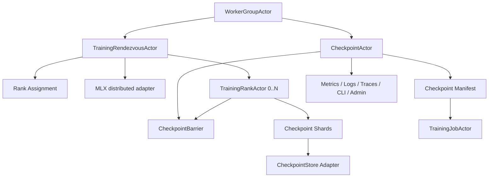
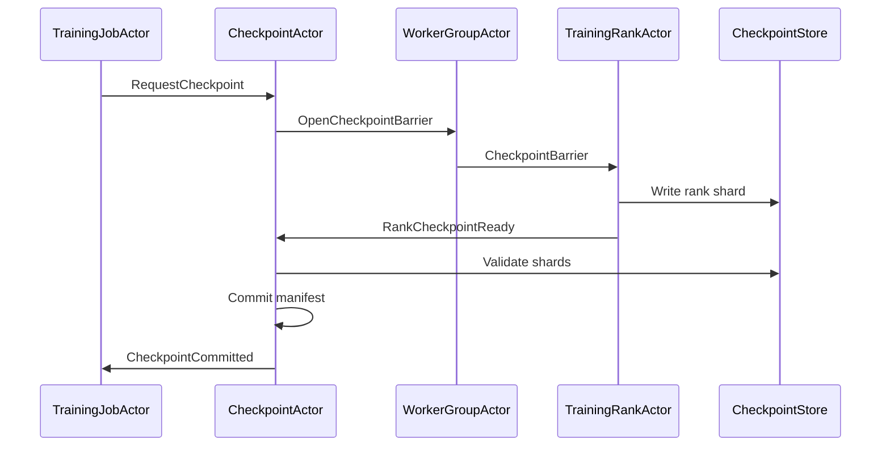

# AI-TRN-002 Training Rank Rendezvous And Checkpoint Coordination Design

**Status:** Proposed design; implementation not started
**Requirement ID:** AI-TRN-002
**Parent Architecture:** [Distributed AI Model Inference and Training Architecture](distributed-ai-model-inference-training-architecture.md)
**Depends On:** [AI-TRN-001](training-job-worker-group-lifecycle-design.md), [AI-DIST-MLX-001](mlx-distributed-rendezvous-adapter-design.md), [AI-DATA-001](tensor-buffer-handle-data-plane-design.md), [AI-MOD-001](model-registry-artifact-metadata-design.md), [AI-SEC-001](ai-tenant-model-authorization-design.md), [AI-OBS-001](ai-observability-request-token-metrics-design.md)
**Related Requirements:** [AI-ACC-001](accelerator-resource-plane-design.md), [AI-ACC-002](accelerator-observability-telemetry-design.md), [AI-OPS-001](ai-admin-cli-operations-design.md), [AI-TST-001](ai-fault-injection-chaos-testing-design.md), [AI-MLX-003](mlx-tensor-handle-design.md)

## 1. Executive Summary

AI-TRN-002 defines the rank rendezvous and checkpoint coordination contract for
distributed AI training jobs. AI-TRN-001 owns job and worker group lifecycle.
This requirement owns the details that make a worker group coherent: rank
assignment, world size, rendezvous generation, rank readiness, checkpoint
barriers, checkpoint manifests, restore selection, and partial checkpoint
failure handling.

For the MLX-first path, HPActor should use the same core ideas as
AI-DIST-MLX-001: HPActor owns rank metadata, lifecycle, epochs, policy, and
observability; MLX owns communication backends and tensor collectives. The
training rendezvous contract must work for supervised MLX sidecars first and
native MLX adapters later.

## 2. Goals

1. Define rank assignment and rendezvous metadata for training worker groups.
2. Define readiness gates before a job enters `Running`.
3. Coordinate checkpoint barriers across ranks.
4. Commit checkpoint manifests only after required rank shards are durable and
   validated.
5. Restore a worker group from a selected checkpoint after failure or resume.
6. Preserve bounded actor messages by passing checkpoint data through artifact
   or tensor handles, not protobuf payload blobs.
7. Make rank, rendezvous, checkpoint, and restore failures structured and
   operator-visible.
8. Provide deterministic mock tests for rank failure, barrier timeout, partial
   checkpoint, and restore failure.

## 3. Non-Goals

- Implementing MLX collectives, checkpoint file formats, or optimizer
  serialization.
- Choosing the best checkpoint based on model quality or validation metrics.
- Building a full experiment tracker.
- Defining dataset loading internals or exactly-once sample processing.
- Requiring one durable storage backend in HPActor core.
- Supporting partial rank repair in the first implementation.

## 4. Design Approach

Three approaches were considered:

| Approach | Trade-off |
|----------|-----------|
| Let each framework own rendezvous and checkpointing opaquely | Simple, but HPActor cannot gate readiness, explain failures, or recover consistently. |
| Store all training state inside HPActor actors | Too much tensor and optimizer data would enter actor memory and protobuf payloads. |
| Actor-owned coordination with framework-owned data files and handles | Recommended. HPActor coordinates barriers and manifests while backends write their data. |

The recommended design separates control and data. HPActor records metadata,
ownership, barriers, and manifests. MLX or another training framework writes
rank-local checkpoint files, tensor handles, or artifact chunks.

## 5. Architecture



Primary components:

- `TrainingRendezvousActor`: assigns ranks, world size, generation, endpoints,
  device lease binding, and backend metadata for one worker group attempt.
- `CheckpointActor`: coordinates barriers, shard acknowledgement, manifest
  commit, retention, and restore selection.
- `CheckpointStore`: no-throw adapter for filesystem, object storage, or mock
  checkpoint persistence.
- `TrainingRankActor`: reports rank readiness, progress, checkpoint shard
  completion, restore completion, and failure.
- `CheckpointManifest`: immutable metadata committed only after all required
  shards satisfy policy.

## 6. Rank Rendezvous Data Model

```cpp
struct TrainingRendezvousId {
    WorkerGroupId worker_group;
    uint64_t generation;
};

struct TrainingRankSpec {
    uint32_t rank;
    uint32_t world_size;
    NodeId node_id;
    DeviceId device_id;
    DeviceLeaseId lease_id;
    ActorAddress rank_actor;
    std::string listen_host;
    uint16_t listen_port;
    std::string backend; // mlx-ring, mlx-jaccl, mock, future backend
};

struct TrainingRendezvousSpec {
    TrainingRendezvousId id;
    std::vector<TrainingRankSpec> ranks;
    std::chrono::milliseconds readiness_timeout;
    std::string rendezvous_backend;
    bool strict_backend;
};
```

Generation rules:

- A new worker group attempt starts with a new generation.
- Rank membership, world size, backend, or restore checkpoint changes require a
  new generation.
- Rank messages include generation and are rejected when stale.
- A ready generation is immutable.

## 7. Rank State Model

```cpp
enum class TrainingRankState : uint8_t {
    Planned,
    Launching,
    Initializing,
    Restoring,
    Ready,
    Running,
    Checkpointing,
    Pausing,
    Stopping,
    Stopped,
    Failed,
};
```

Rules:

- A rank is not ready until it has accepted its rank spec, initialized backend
  rendezvous, restored the selected checkpoint if required, and reported
  framework readiness.
- `Running` requires every required rank in the same generation to be `Ready`.
- Rank progress is advisory. Checkpoint and failure decisions use explicit
  acknowledgements.

## 8. Rendezvous Protocol

1. Worker group asks `TrainingRendezvousActor` to build a generation from
   granted leases and desired world size.
2. Rendezvous actor validates rank count, unique devices, endpoint binding,
   backend availability, and policy.
3. Rendezvous actor emits immutable rank specs.
4. Worker group launches rank actors with their rank specs.
5. Rank actors initialize MLX distributed communication or mock backend.
6. Rank actors report `RankReady`.
7. Rendezvous actor emits `TrainingRendezvousReady` after all required ranks
   are ready before the timeout.
8. Worker group transitions the attempt into `Running`.

MLX integration:

- for MLX sidecars, rank specs become framed IPC messages or sanitized
  environment/hostfile metadata
- for native MLX, rank specs configure the adapter behind `ENABLE_MLX`
- backend selection and fallback policy should be shared with
  AI-DIST-MLX-001 where practical

## 9. Checkpoint Data Model

```cpp
struct CheckpointId {
    TrainingJobId job_id;
    uint64_t sequence;
};

enum class CheckpointState : uint8_t {
    Planned,
    BarrierOpen,
    Writing,
    Validating,
    Committed,
    Retaining,
    Failed,
    Deleted,
};

struct CheckpointShard {
    CheckpointId checkpoint_id;
    uint32_t rank;
    uint64_t step;
    ArtifactHandle artifact;
    uint64_t byte_size;
    Checksum checksum;
    bool required;
};

struct CheckpointManifest {
    CheckpointId checkpoint_id;
    WorkerGroupId worker_group;
    uint64_t rendezvous_generation;
    uint64_t global_step;
    std::vector<CheckpointShard> shards;
    ModelVersionId base_model;
    std::string runtime_name;
    uint64_t created_at_ns;
};
```

Manifest rules:

- Manifests are committed only after every required shard is acknowledged and
  validated.
- Failed or partial checkpoints are visible but not selected for restore unless
  an explicit unsafe/debug policy allows it.
- Checkpoint artifacts are pinned while referenced by active or resumable jobs.
- Sensitive paths and artifact URIs are redacted in metrics and default logs.

## 10. Checkpoint Barrier Protocol



Barrier policies:

- `pause_all`: all ranks stop at a barrier before writing checkpoint shards
- `async_rank_write`: ranks write framework-supported snapshots while training
  continues, but manifest commit still requires all required acknowledgements
- `manual_only`: checkpoints happen only on explicit admin or job request

The first implementation should support `pause_all` for deterministic recovery
tests. Async checkpointing can be added once the backend-specific safety rules
are clear.

## 11. Restore Protocol

Restore flow:

1. Job actor selects a checkpoint by policy or explicit admin request.
2. Checkpoint actor validates manifest state, model compatibility, runtime
   compatibility, shard count, checksums, and artifact availability.
3. Worker group starts a new rendezvous generation with restore metadata.
4. Rank actors load their rank shard through the training framework.
5. Rank actors report `RankRestored`.
6. Readiness barrier opens only after all required restores complete.

Restore failure behavior:

- checkpoint missing or corrupt: choose older checkpoint if policy allows
- rank restore failure: stop whole worker group and apply retry policy
- manifest version mismatch: fail closed unless explicit compatibility policy
  allows migration
- store unavailable: job remains `Recovering` until timeout, then fails or
  retries by policy

## 12. Store Adapter Contract

```cpp
class CheckpointStore {
  public:
    virtual result<ArtifactHandle>
    reserve_shard(const CheckpointShardReservation& request) noexcept = 0;

    virtual result<void>
    validate_shard(const CheckpointShard& shard) noexcept = 0;

    virtual result<void>
    commit_manifest(const CheckpointManifest& manifest) noexcept = 0;

    virtual result<CheckpointManifest>
    load_manifest(CheckpointId checkpoint_id) noexcept = 0;
};
```

Initial adapters:

- `MockCheckpointStore` for deterministic tests
- local filesystem store for macOS developer workflows
- future object-storage adapter for distributed deployments

Store adapter calls may block and must run away from event-loop and cooperative
scheduler hot paths.

## 13. Failure Semantics

| Failure | Coordinator behavior |
|---------|----------------------|
| duplicate rank id | fail rendezvous generation and audit |
| rank reports stale generation | reject message and increment stale-rank metric |
| rank readiness timeout | stop group and apply worker group recovery policy |
| backend unavailable | fail rendezvous before checkpoint/restore starts |
| checkpoint barrier timeout | mark checkpoint failed; job policy decides continue or fail |
| rank shard write failure | mark checkpoint failed and report rank reason |
| manifest commit failure | checkpoint remains uncommitted; never selected for normal restore |
| checksum mismatch | mark checkpoint failed and audit |
| restore checkpoint incompatible | fail restore before launching ranks when detectable |
| checkpoint store unavailable | retry with bounded backoff or fail by policy |

## 14. Observability

Metrics:

- `hpactor_ai_training_rendezvous_total`
- `hpactor_ai_training_rendezvous_duration_seconds`
- `hpactor_ai_training_rank_state`
- `hpactor_ai_checkpoint_total`
- `hpactor_ai_checkpoint_duration_seconds`
- `hpactor_ai_checkpoint_bytes`
- `hpactor_ai_checkpoint_failures_total`
- `hpactor_ai_checkpoint_restore_total`
- `hpactor_ai_checkpoint_restore_duration_seconds`

Trace spans:

- `ai.training.rendezvous.build`
- `ai.training.rank.ready`
- `ai.training.checkpoint.open`
- `ai.training.checkpoint.rank_write`
- `ai.training.checkpoint.validate`
- `ai.training.checkpoint.commit`
- `ai.training.restore.validate`
- `ai.training.restore.rank_load`

CLI/admin snapshots:

- current rendezvous generation
- rank states and readiness reasons
- checkpoint list with state, step, size, and redacted location
- selected restore checkpoint and compatibility decision
- recent checkpoint failures

## 15. Security And Audit

AI-SEC-001 gates:

- job checkpoint request
- restore from checkpoint
- delete checkpoint metadata
- inspect checkpoint location
- force checkpoint barrier release
- force rank stop

Audit events:

- checkpoint requested
- checkpoint committed
- checkpoint failed
- restore requested
- restore completed or failed
- checkpoint deleted or retention-pruned
- force barrier action

Default redaction:

- do not expose dataset paths
- do not expose artifact credentials
- do not log full hostfiles or process environments
- do not log tensor, optimizer, gradient, or checkpoint contents

## 16. Configuration

Example:

```toml
[system.ai.training.rendezvous]
readiness_timeout_ms = 60000
reject_stale_generation = true
strict_backend = true

[system.ai.training.checkpoint]
enabled = true
store = "local"
barrier_policy = "pause_all"
interval_steps = 500
timeout_ms = 120000
retain_last = 3
retain_best = 0
verify_checksums = true

[system.ai.training.checkpoint.local]
root = "/var/lib/hpactor-ai/checkpoints"
redact_paths = true
```

## 17. Testing Strategy

Deterministic tests:

- rank specs are deterministic for a worker group and lease set
- duplicate rank id fails rendezvous
- stale generation message is rejected
- readiness barrier waits for every required rank
- readiness timeout stops all launched ranks
- checkpoint commit requires all required shards
- partial checkpoint is never selected for normal restore
- checksum mismatch fails checkpoint
- restore from committed mock checkpoint reaches `Running`
- restore from missing shard fails with structured reason

System tests:

- mock distributed training job starts, checkpoints, fails one rank, restores,
  and completes
- admin-triggered checkpoint during running job produces manifest
- cancel during checkpoint releases rank and store reservations
- checkpoint store unavailable surfaces in job state and incident timeline

MLX-gated tests:

- MLX sidecar consumes rank spec and reports backend group metadata
- MLX worker reports checkpoint shard completion through framed IPC
- MLX backend unavailable maps to rendezvous failure before job is `Running`

## 18. Acceptance Criteria

AI-TRN-002 is ready for implementation when:

- rank specs, rendezvous generations, rank states, checkpoint ids, shards, and
  manifests have explicit types
- job readiness is gated on rank readiness for one generation
- checkpoint commit is atomic at the manifest level
- partial or failed checkpoints are visible but not restored by default
- restore validates compatibility before returning to `Running`
- all checkpoint data moves through artifacts or tensor handles, not ordinary
  actor payloads
- deterministic system tests cover rank failure and checkpoint restore without
  MLX hardware

## 19. Open Questions

1. Should the first filesystem checkpoint store be part of HPActor runtime or
   shipped as an example adapter?
2. Should asynchronous checkpointing be deferred until real MLX training
   workers prove safe pause/resume behavior?
3. Should checkpoint retention run inside `CheckpointActor`, or through a
   separate artifact retention actor shared with model artifacts?
4. How much optimizer and scheduler metadata should HPActor validate versus
   treating as framework-private manifest fields?

## 20. External Design Inputs

- [`mlx.core.distributed.init`](https://ml-explore.github.io/mlx/build/html/python/_autosummary/mlx.core.distributed.init.html)
  for MLX backend initialization options.
- [MLX saving and loading arrays](https://ml-explore.github.io/mlx/build/html/usage/saving_and_loading.html)
  for MLX-owned checkpoint data serialization considerations.
- [MLX optimizers](https://ml-explore.github.io/mlx/build/html/python/optimizers.html)
  for the expectation that optimizer state is framework-owned and should be
  restored through backend code, not HPActor actor payloads.
