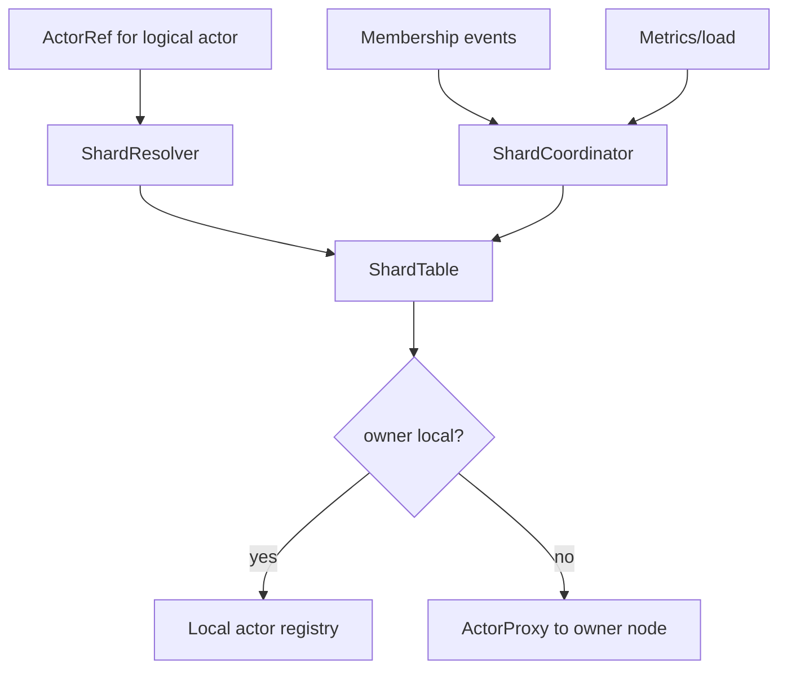

# Cluster Sharding and Placement Architecture Design

## 1. Executive Summary

HPActor needs a placement layer to scale stateful actor populations across many
nodes. Service discovery tells the runtime which nodes exist; placement decides
which node should own a logical actor or shard, how routes are cached, and how
ownership changes during failures and rebalancing.

This design introduces cluster sharding, placement strategies, shard ownership,
handoff, and route invalidation. It keeps ordinary local actor spawning intact
while adding an optional distributed placement model for actors addressed by
logical identity.

## 2. Goals

1. Route logical actors to owning nodes without manual static routes.
2. Support shard-based distribution and rebalancing.
3. Keep actor location cache coherent during movement and node failure.
4. Support future passivation and durable actor recovery.
5. Provide control-plane observability for placement decisions.

## 3. Non-Goals

- Full consensus implementation in the first version.
- Moving arbitrary live actor memory between processes.
- Transparent exactly-once actor migration.

## 4. Core Concepts

### Logical Actor Id

A stable application identity such as `tenant-42/session-9`. It maps to a shard.

### Shard

A partition of the logical actor keyspace. Each shard has one active owner.

### Placement Strategy

A policy that maps shards to nodes. Initial strategies:

- `Static`: TOML-defined mapping.
- `RendezvousHash`: weighted stable placement.
- `LoadAware`: placement based on metrics and capacity.

### Shard Coordinator

A system actor that owns shard metadata and movement decisions. The first
version can be single-coordinator with static majority or external-coordinator
support later.

## 5. Architecture

Components:

- `ShardResolver`: maps logical actor id to shard id and owner.
- `ShardTable`: local cached shard ownership table with epoch.
- `ShardCoordinator`: authoritative owner assignment.
- `PlacementStrategy`: computes desired ownership.
- `ShardHandoff`: drains old owner and activates new owner.

## 6. Handoff Protocol

States:

- `Owned`
- `Draining`
- `Transferring`
- `Recovering`
- `Active`

Protocol:

1. Coordinator selects new owner.
2. Old owner enters `Draining` and stops accepting new user messages.
3. New messages are buffered, rejected, or proxied based on policy.
4. Old owner snapshots or passivates shard actors if durable state is enabled.
5. New owner activates shard and rebuilds actor state if needed.
6. Coordinator publishes a new shard table epoch.
7. Actor location caches invalidate old entries.

## 7. Routing And Cache Invalidation

Every shard table has an epoch. Remote sends include the sender's known epoch
when possible. If a node receives a message for a shard it no longer owns, it
returns a `ShardMoved` control frame with the new owner and epoch.

Invalidation triggers:

- Node down or quarantined.
- Shard ownership epoch change.
- Actor passivation.
- Explicit coordinator command.

## 8. Placement Inputs

The placement engine should consider:

- Node state and readiness.
- Actor count.
- Mailbox pressure.
- CPU load.
- Memory pressure.
- Shard weight.
- Network locality.
- Deployment zone.
- Configured node weights.

## 9. Observability

Metrics:

- `hpactor_shards_total`
- `hpactor_shard_moves_total`
- `hpactor_shard_handoff_duration_seconds`
- `hpactor_shard_route_misses_total`
- `hpactor_shard_actor_count`

CLI:

- `/cluster shards`
- `/cluster shard <id> show`
- `/cluster rebalance plan`
- `/cluster rebalance apply`

Logs:

- Placement plan.
- Handoff start and completion.
- Shard movement rejection.
- Route miss and stale epoch.

## 10. Acceptance Criteria

- Logical actor ids map deterministically to shards.
- Shard ownership changes invalidate stale actor location cache entries.
- Node loss triggers shard reassignment according to the failure model.
- Operators can inspect shard owners, movement history, and rebalance plans.
- Placement can start static and evolve to load-aware without API churn.

