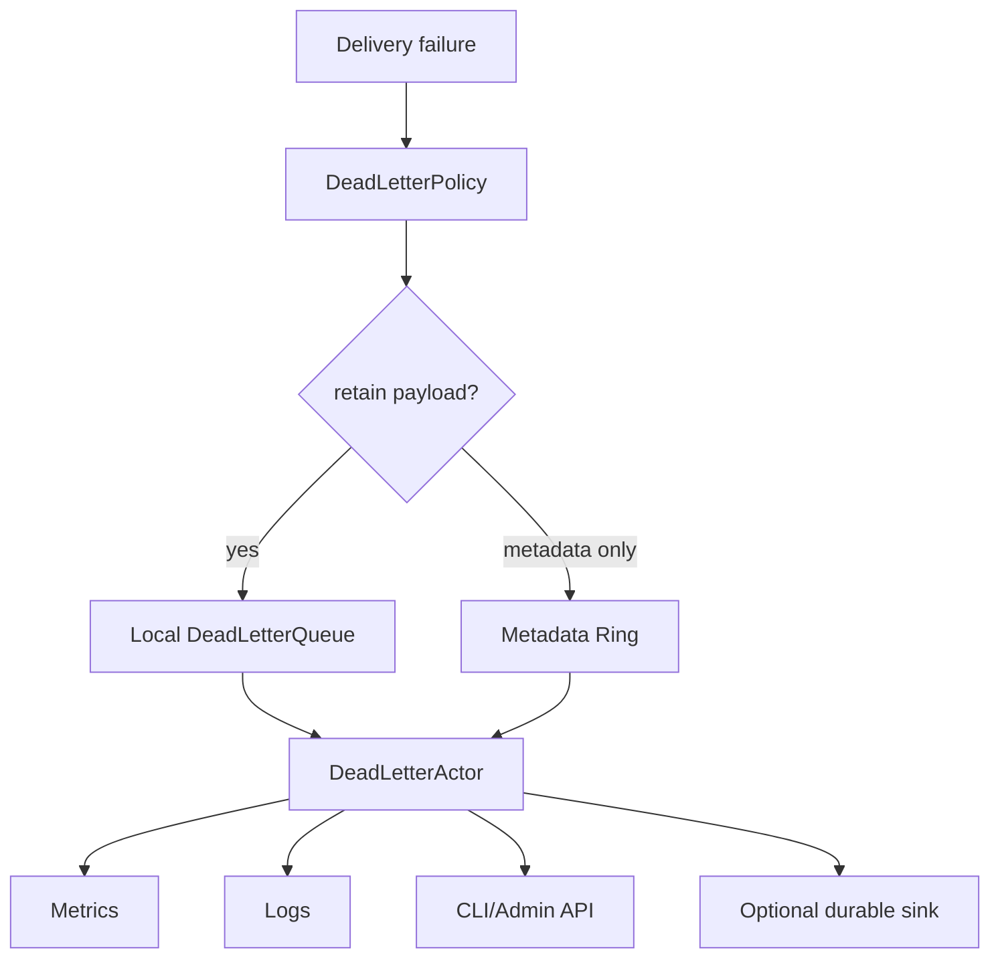

# Dead-Letter Queue Architecture Design

## 1. Executive Summary

Messages that cannot be delivered must not disappear silently. HPActor needs a
dead-letter queue for failed local delivery, remote route failures, mailbox
overflow, expired messages, missing actors, dead actors, serialization errors,
and network partitions.

The dead-letter queue is a bounded operational safety net. It is not a durable
message broker by default. It captures enough metadata to debug and alert on
message loss, supports optional replay for safe cases, and integrates with
metrics, tracing, logging, CLI, and future durable storage.

## 2. Goals

1. Capture undeliverable messages with reason and metadata.
2. Preserve bounded memory behavior under failure storms.
3. Support policy-driven local and cluster-wide handling.
4. Provide operator tooling for inspection, filtering, export, and replay.
5. Integrate with mailbox overflow policy `DeadLetter`.
6. Work for local sends, remote receives, RPC, spawn, and system messages.

## 3. Non-Goals

- Exactly-once replay.
- Infinite retention.
- Replacing durable messaging.
- Replaying arbitrary non-idempotent messages without operator choice.

## 4. Dead Letter Record

```cpp
enum class DeadLetterReason : uint8_t {
    NoRoute,
    ActorDead,
    MailboxFull,
    Expired,
    SerializationError,
    TransportError,
    RejectedByPolicy,
    NodeUnavailable,
    Quarantined,
};

struct DeadLetterRecord {
    MessageId message_id;
    ActorAddress sender;
    ActorAddress receiver;
    TypeTag type_tag;
    DeadLetterReason reason;
    TraceContext trace;
    uint64_t created_ns{0};
    uint64_t failed_ns{0};
    uint32_t payload_size{0};
    uint32_t attempt{0};
    std::string source_node;
    std::string detail;
    TypedMessage message;
};
```

The payload may be retained, sampled, truncated, or omitted by policy.

## 5. Architecture



Components:

- `DeadLetterPolicy`: decides retention, sampling, alert severity, and replay
  eligibility.
- `DeadLetterQueue`: bounded in-memory queue with drop accounting.
- `DeadLetterActor`: system actor for queries, export, and replay commands.
- `DeadLetterSink`: optional extension for file, object store, or durable log.

## 6. Queue Policies

Retention modes:

- `MetadataOnly`: keep reason and envelope metadata, drop payload.
- `RetainPayload`: keep full message while within byte budget.
- `SamplePayload`: retain payload for sampled records only.
- `DurableSink`: forward to configured durable sink.

Overflow policies:

- `DropOldest`: preserve newest failures.
- `DropNewest`: preserve earliest failure burst.
- `Aggregate`: collapse repeated failures by `(receiver, type_tag, reason)`.
- `Escalate`: emit high-severity alert when capacity is exceeded.

## 7. Replay Model

Replay is operator-driven and guarded:

- Only records with retained payload can be replayed.
- Replay requires receiver to exist and pass admission.
- Replay creates a new delivery attempt and records original message id.
- Replay can preserve or regenerate trace context by policy.
- Non-idempotent messages must not be auto-replayed.

CLI examples:

```text
/dlq list --reason MailboxFull --limit 50
/dlq show <dead_letter_id>
/dlq replay <dead_letter_id>
/dlq export --format json --since 10m
```

## 8. Cluster-Wide Handling

Each node owns its local DLQ. Cluster-level views are aggregated by CLI/Admin
queries:

- Query local DLQ.
- Fan out to known nodes.
- Merge records by timestamp and node id.
- Preserve source node for replay routing.

Remote replay should run on the node that owns the retained payload unless a
durable sink is configured.

## 9. Observability

Metrics:

- `hpactor_dead_letters_total`
- `hpactor_dead_letter_queue_depth`
- `hpactor_dead_letter_payload_bytes`
- `hpactor_dead_letter_dropped_total`
- `hpactor_dead_letter_replayed_total`

Logs:

- First occurrence of a new failure signature.
- Aggregated counts for repeated failures.
- Queue overflow and payload truncation.
- Replay attempts and outcomes.

Tracing:

- Dead-letter records preserve `TraceContext`.
- Failed delivery spans include `dead_letter.reason`.

## 10. Acceptance Criteria

- Missing actor, dead actor, mailbox overflow, expired message, route failure,
  and serialization failure all produce dead-letter records when policy enables
  them.
- DLQ memory is bounded by count and byte budget.
- Operators can inspect, filter, export, and replay retained records.
- DLQ overload is observable and does not cause OOM.
- DLQ integrates with mailbox overflow policy `DeadLetter`.

