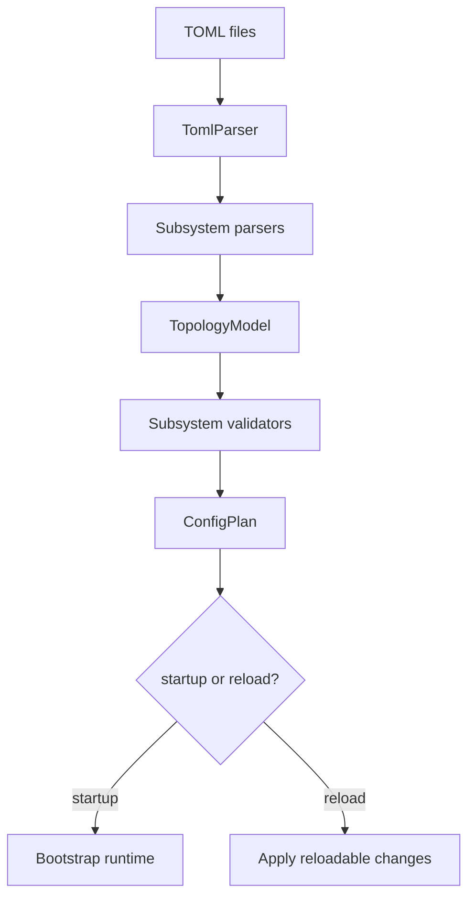

# Dynamic Config and Parser IoC Architecture Design

## 1. Executive Summary

HPActor's TOML topology parser started as a central parser. As production
features grow, each subsystem needs to own its own configuration schema and
validation. The parser should use inversion of control, where subsystem parser
translation units self-register through static registrar objects.

Production operation also needs dynamic configuration reload for selected safe
settings. This design combines parser modularity, schema validation, config
versioning, and safe runtime apply semantics.

## 2. Goals

1. Let each subsystem own its TOML parser and validation.
2. Avoid growing `parse_file_data` with every new feature.
3. Keep `TomlParser::parse()` public API stable.
4. Support static self-registration using file-scope registrar objects.
5. Add config schema versioning and validation reports.
6. Support dynamic reload for explicitly reloadable settings.

## 3. Non-Goals

- Hot-reloading arbitrary actor topology in the first version.
- Allowing unsafe config changes without validation.
- Requiring dynamic plugins.

## 4. Parser IoC Model

Parser categories:

- system parser: reads entrypoint `[system]` subtables into `SystemDef`
- document parser: reads top-level `[[actor]]`, `[[dispatcher]]`, templates,
  and future top-level config documents
- validator: validates parsed subsystem config after merge
- applier: applies reloadable runtime changes

Registration:

```cpp
const TomlSystemParserRegistration<MetricsConfigParser>
    kRegisterMetricsConfigParser;
```

The registry stores factories and sorts by order and name. Parse order is not
dependent on cross-translation-unit initialization order.

## 5. Config Lifecycle



## 6. Validation Report

Validation should return structured findings:

```cpp
enum class ConfigSeverity : uint8_t {
    Info,
    Warning,
    Error,
};

struct ConfigFinding {
    ConfigSeverity severity;
    std::string path;
    std::string message;
};
```

Examples:

- unknown table
- deprecated key
- invalid enum
- reload requires restart
- security config in permissive mode

## 7. Dynamic Reload Classes

Reload classes:

- `LiveReloadable`: can apply without restart.
- `DrainRequired`: requires actor or node drain.
- `RestartRequired`: parse allowed, apply rejected at runtime.
- `Immutable`: cannot change after process start.

Examples:

- log level: live reloadable
- metrics scrape path: restart required if HTTP endpoint changes
- mailbox capacity: drain required for existing actors
- transport protocol version: immutable
- security trust bundle: live reloadable with care

## 8. Apply Protocol

1. Parse new config.
2. Validate full config.
3. Diff old and new effective config.
4. Produce `ConfigPlan`.
5. Reject unsupported runtime changes.
6. Apply changes in subsystem order.
7. Roll back if a subsystem apply fails before commit point.
8. Emit audit log and config reload event.

## 9. Observability

Metrics:

- `hpactor_config_reload_total`
- `hpactor_config_reload_failure_total`
- `hpactor_config_validation_findings_total`

CLI:

- `/config validate <path>`
- `/config diff <path>`
- `/config reload <path>`
- `/config current`

## 10. Acceptance Criteria

- New subsystem config can be added without editing `parse_file_data`.
- Parser registration uses static self-registration.
- Config validation returns structured findings.
- Runtime reload is allowed only for declared reloadable settings.
- Config reload actions are logged, audited, and observable.

