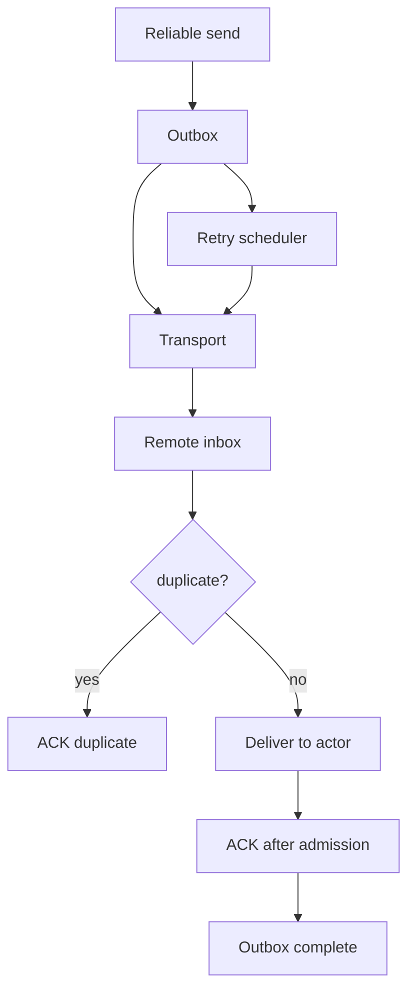

# Reliable Messaging Architecture Design

## 1. Executive Summary

HPActor should keep fast best-effort messaging as the default, but production
systems often need reliable delivery for selected messages. Reliable messaging
adds an opt-in at-least-once path with ACK/NACK, retry, deduplication, optional
durable outbox/inbox, and replay after process restart.

This design builds on the delivery semantics contract. It does not promise
exactly-once delivery. Instead, it gives users the tools to build idempotent
message handlers with clear failure and recovery behavior.

## 2. Goals

1. Provide opt-in at-least-once message delivery.
2. Support process restart recovery with durable outbox/inbox.
3. Avoid slowing default best-effort actor sends.
4. Expose retry, ACK, duplicate, and replay state to operators.
5. Integrate with tracing, DLQ, and delivery semantics.

## 3. Non-Goals

- Exactly-once distributed execution.
- Durable storage for all actor messages.
- Global ordering across actors.
- Replacing RPC for request/response workflows.

## 4. Architecture



Components:

- `ReliableDeliveryManager`: runtime coordinator.
- `Outbox`: pending outbound messages.
- `Inbox`: receiver-side deduplication and admission tracking.
- `AckFrame` and `NackFrame`: remote delivery feedback.
- `RetryScheduler`: timeout, backoff, and max attempts.
- `DurableDeliveryStore`: optional persistence adapter.

## 5. Delivery Lifecycle

1. Sender creates a message with stable `MessageId`.
2. Reliable manager stores the message in outbox.
3. Transport sends frame with reliable flag and attempt number.
4. Receiver checks inbox dedup cache.
5. Receiver admits message to target mailbox.
6. Receiver sends ACK after admission, not after handler completion.
7. Sender marks outbox record complete.
8. Timeout triggers retry until max attempts.
9. Exhausted messages go to DLQ.

ACK after admission is intentional. It avoids tying sender progress to user
handler latency while still proving that the message entered the receiver's
runtime.

## 6. Durable Store Contract

```cpp
class DurableDeliveryStore {
  public:
    virtual result<void> put_outbox(const OutboxRecord& record) = 0;
    virtual result<void> mark_outbox_complete(MessageId id) = 0;
    virtual result<std::vector<OutboxRecord>> load_pending_outbox() = 0;

    virtual result<void> put_inbox(const InboxRecord& record) = 0;
    virtual result<bool> seen_inbox(MessageId id) = 0;
};
```

First adapters:

- `InMemoryDeliveryStore` for tests and non-durable reliable mode.
- `FileDeliveryStore` for simple process restart recovery.
- Future `RocksDbDeliveryStore` or external log adapter.

## 7. Deduplication

Dedup key:

- source node id
- source actor id
- message id

Dedup storage:

- Fixed-size TTL cache for non-durable mode.
- Durable inbox table for durable mode.

Duplicate behavior:

- Do not deliver duplicate to actor.
- Send ACK so sender can complete.
- Emit duplicate metric and trace event.

## 8. Backpressure Integration

Reliable messaging must respect mailbox admission:

- If mailbox accepts, receiver ACKs.
- If mailbox rejects with retryable pressure, receiver NACKs with retry-after.
- If mailbox dead-letters, receiver NACKs non-retryable or records DLQ outcome.
- Sender retry policy must include max total time to avoid infinite pressure.

## 9. Observability

Metrics:

- `hpactor_reliable_outbox_pending`
- `hpactor_reliable_inbox_seen`
- `hpactor_reliable_acks_total`
- `hpactor_reliable_nacks_total`
- `hpactor_reliable_retries_total`
- `hpactor_reliable_replay_total`

CLI:

- `/reliable outbox`
- `/reliable inbox`
- `/reliable replay`
- `/reliable drop <message_id>`

## 10. Acceptance Criteria

- Reliable delivery is opt-in per message or actor.
- Default send path remains best effort and fast.
- ACK/NACK works across remote transport.
- Retry exhaustion produces DLQ records.
- Durable mode can recover pending outbox after restart.
- Receiver dedup prevents duplicate handler execution within configured window.

