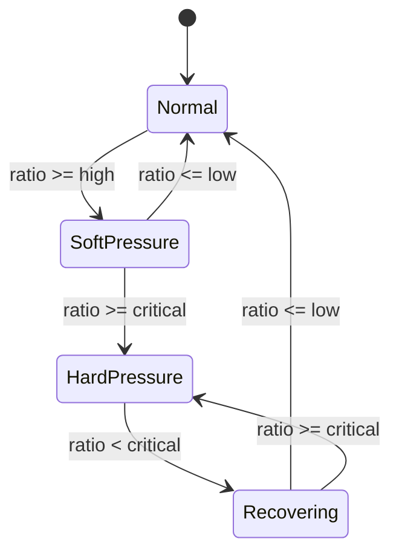
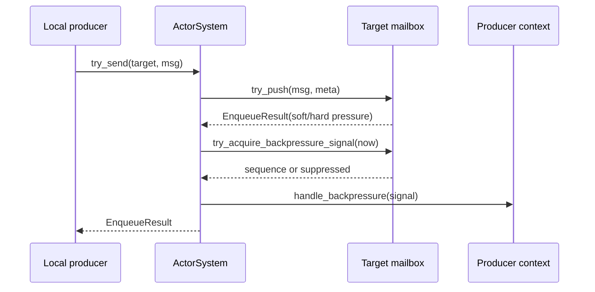
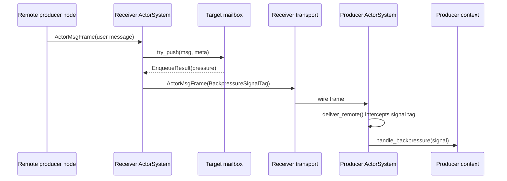

# MBX-003: Upstream Backpressure Signal — Design Spec

**Issue**: [#24](https://github.com/skg7on/HPActor/issues/24)  
**Subsystem**: Mailbox  
**Priority**: P0  
**Backlog status**: Designed  
**Source requirement**: `docs/architecture/production/architecture-requirement-backlog.md`, MBX-003

## 1. Problem

MBX-003 requires pressure signals to reach message producers before overload
turns into hard delivery failure. Local producers need a callback or result they
can act on. Remote producers need the same signal over the existing transport
path, including an advisory retry-after value, without creating a control-plane
storm.

The current runtime already has important foundations:

| Area | Current state |
|---|---|
| Bounded admission | `MPSCActorMailbox::try_push()` enforces message count and byte budget and returns `EnqueueResult`. |
| Soft pressure | `AcceptedWithSoftPressure` is returned when depth crosses `high_watermark`. |
| Local callback | `ActorContext::on_backpressure()` and `ActorSystem::signal_backpressure()` deliver a `BackpressureSignal` to a local sender context. |
| Config | `BackpressureMode`, `signal_min_interval_ms`, `high_watermark`, and `low_watermark` exist in mailbox config. |
| Wire tag | `TypeTag::BackpressureSignalTag = 0x70` already reserves a system tag. |
| Observability | Metrics include `kBackpressureSignal`; mailbox snapshots expose pressure state internally. |

The missing runtime behavior is:

- no critical watermark field or full low/high/critical state contract;
- `MailboxPressureState` only toggles `Normal` and `SoftPressure`;
- local signals ignore `BackpressureMode` and are not rate-limited;
- hard pressure and byte-capacity failures do not emit signals;
- remote backpressure is not serialized, sent, or intercepted on receipt;
- CLI protobuf snapshots expose only mailbox depth, so pressure state is mostly
  invisible through `/actor <id> show`.

## 2. Goals

1. Define mailbox pressure by low, high, and critical watermarks.
2. Use hysteresis so state changes do not flap around a single threshold.
3. Emit local signals through the existing `ActorContext::on_backpressure()`
   callback when config enables local signalling.
4. Emit remote signals over the existing `ActorMsgFrame` transport path using
   `TypeTag::BackpressureSignalTag`.
5. Attach advisory `retry_after` values to soft and hard pressure signals.
6. Rate-limit repeated signals while still allowing severity escalation to pass.
7. Expose emitted signals through metrics and structured logs, and expose
   pressure state through CLI actor inspection.
8. Preserve source-compatible defaults for existing `send()` and `try_send()`.

## 3. Non-Goals

- Implementing remote outbound queue limits or endpoint-level pressure state.
  That remains MBX-006.
- Implementing ACK/NACK, automatic retry, durable outbox, or reliable
  messaging. Those remain MSG-005.
- Adding a new transport frame envelope. MBX-003 can use the existing
  `ActorMsgFrame` plus reserved system `TypeTag`.
- Blocking event-based actor handlers until capacity becomes available.
- Guaranteeing every producer receives every pressure transition. Signals are
  advisory and rate-limited.

## 4. Approach Options

### Option A: In-band System Message Over Existing Actor Frames

Serialize `BackpressureSignal` as a protobuf payload with
`TypeTag::BackpressureSignalTag`, send it through `ActorMsgFrame`, and intercept
it in `ActorSystem::deliver_remote()` before it reaches the producer mailbox.

Pros:

- reuses current frame, address conversion, transport, trace propagation, and
  connection-pool routing;
- uses the existing reserved tag and current actor-system dispatch boundary;
- minimizes protocol churn and keeps the change focused on MBX-003.

Cons:

- control traffic shares the normal connection with actor messages;
- priority treatment in a separate transport-control milestone may require a
  dedicated control lane.

### Option B: Dedicated Control Frame

Add a control-frame variant next to `ActorMsgFrame` for mailbox pressure.

Pros:

- clean separation between data-plane messages and control-plane pressure;
- easier to prioritize separately in a transport scheduler milestone.

Cons:

- larger protocol change;
- more code in frame parsing and connection routing;
- unnecessary before outbound queue limits exist.

### Option C: Local Result Only, Remote Producers Poll

Only expose `EnqueueResult` locally and require remote producers to infer
pressure from retry failures or metrics.

Pros:

- smallest implementation.

Cons:

- does not satisfy issue #24 because remote senders do not receive slow-down or
  retry-after signals.

**Recommendation**: Option A. It satisfies MBX-003 with the least protocol churn
and leaves a clean upgrade path for a dedicated control lane if MBX-006 needs it.

## 5. Runtime Contract

### 5.1 Pressure Ratio

Mailbox pressure is the maximum of the count pressure and byte pressure:

```cpp
count_ratio = capacity.max_messages > 0
                ? depth / capacity.max_messages
                : 0.0;
byte_ratio = capacity.max_bytes > 0
                ? queued_bytes / capacity.max_bytes
                : 0.0;
pressure_ratio = max(count_ratio, byte_ratio);
```

If both capacities are unlimited, pressure ratio is `0.0` and the state remains
`Normal`.

### 5.2 Watermarks

`MailboxConfig` gains a `critical_watermark` field:

```cpp
struct MailboxConfig {
    MailboxCapacity capacity;
    uint8_t priority_levels = 4;
    OverflowPolicy overflow_policy = OverflowPolicy::RejectNewest;
    BackpressureMode backpressure_mode = BackpressureMode::LocalAndRemoteSignal;
    double high_watermark = 0.80;
    double low_watermark = 0.50;
    double critical_watermark = 1.00;
    uint32_t protected_system_messages = 32;
    uint32_t max_overflow_depth = 0;
    uint32_t signal_min_interval_ms = 100;
    bool priority_aware = false;
    bool enable_dead_letters = true;
};
```

Config validation clamps the operational relationship:

- `low_watermark` must be `>= 0.0`;
- `high_watermark` must be `>= low_watermark`;
- `critical_watermark` must be `>= high_watermark`;
- `critical_watermark` must be `<= 1.0`;
- invalid values are normalized to defaults in runtime config parsing rather
  than throwing.

Default values preserve existing behavior except that `HardPressure` becomes a
first-class state at capacity.

### 5.3 Pressure State Machine



State meanings:

| State | Meaning | Producer advice |
|---|---|---|
| `Normal` | Mailbox is below high watermark. | Send normally. |
| `SoftPressure` | Mailbox is filling but still admits messages. | Slow down and honor `retry_after` when possible. |
| `HardPressure` | Mailbox is at or above critical watermark or admission failed due capacity. | Stop burst sending; retry after the advised delay. |
| `Recovering` | Mailbox has drained below critical but not below low watermark. | Continue slower rate until normal. |

### 5.4 Enqueue Result Extensions

`EnqueueResult` gains pressure metadata so local and remote emission paths use
the same information:

```cpp
struct EnqueueResult {
    EnqueueResultCode code = EnqueueResultCode::Accepted;
    ActorId target;
    uint32_t depth = 0;
    uint32_t capacity = 0;
    uint64_t bytes = 0;
    uint64_t byte_capacity = 0;
    double pressure_ratio = 0.0;
    std::chrono::milliseconds retry_after{0};
    TypeTag affected_type = TypeTag::Invalid;
    uint64_t affected_message_id = 0;
    BackpressureReason pressure_reason = BackpressureReason::HighWatermark;
    MailboxPressureState pressure_state = MailboxPressureState::Normal;
};
```

This is source-compatible for current callers because it only adds fields.

### 5.5 Signal Semantics

A signal is emitted when all of these are true:

1. `DeliveryOptions::emit_backpressure` is true.
2. The mailbox result is `AcceptedWithSoftPressure`, or the result is a
   retryable admission failure caused by mailbox pressure.
3. The configured `BackpressureMode` enables the target direction:
   `LocalSignal`, `RemoteSignal`, or `LocalAndRemoteSignal`.
4. The signal budget allows emission, or the new signal is a severity
   escalation.

Signal reasons map to the dominant pressure cause:

| Cause | Reason |
|---|---|
| `pressure_ratio >= high_watermark` and admission succeeds | `HighWatermark` |
| count capacity rejects admission | `HardCapacity` |
| byte capacity rejects admission | `ByteCapacity` |
| overflow policy drops, rejects, or dead-letters under pressure | `OverflowPolicy` |
| memory-region pressure rejects admission | `NodeMemoryPressure` |

`retry_after` is advisory and defaults to `signal_min_interval_ms`. Hard pressure
uses `2 * signal_min_interval_ms` to slow bursts more aggressively while keeping
the value deterministic and config-derived.

### 5.6 Rate Limiting

Each mailbox owns a small signal budget:

```cpp
struct BackpressureSignalBudget {
    std::atomic<uint64_t> last_signal_ns{0};
    std::atomic<uint8_t> last_severity{0};
    std::atomic<uint64_t> sequence{0};
};
```

`MPSCActorMailbox::try_acquire_backpressure_signal(now_ns)` returns a sequence
number when either:

- no signal has been emitted for this mailbox;
- `now_ns - last_signal_ns >= signal_min_interval_ms`;
- the new signal severity is higher than the last emitted severity.

Repeated same-severity signals inside the interval are suppressed. This limits
storms without hiding Soft-to-Hard escalation.

## 6. Local Data Flow



`send()` remains fire-and-forget and discards the result. Signals still flow to a
registered handler when the sender has an actor context.

## 7. Remote Data Flow



Remote signals are control messages, not user messages. The producer node
intercepts `BackpressureSignalTag` in `ActorSystem::deliver_remote()` and calls
`signal_backpressure()` directly. The control message is not enqueued into the
producer actor mailbox, so producers can learn about pressure even if their own
mailbox is busy.

## 8. Wire Contract

Add `BackpressureSignalMessage` to `protos/hpactor/messages.proto`:

```proto
message BackpressureSignalMessage {
  PbActorAddress target = 1;
  PbActorAddress sender = 2;
  uint32 reason = 3;
  uint32 pressure_state = 4;
  uint32 depth = 5;
  uint32 capacity = 6;
  uint64 bytes = 7;
  uint64 byte_capacity = 8;
  double pressure_ratio = 9;
  uint64 retry_after_ms = 10;
  uint64 sequence = 11;
}
```

Register it with `ProtoTypeRegistry`:

```cpp
register_type<::hpactor::BackpressureSignalMessage>(
    TypeTag::BackpressureSignalTag,
    "hpactor.BackpressureSignalMessage");
```

The outbound control frame uses:

- `sender = signal.target` (the pressured actor);
- `receiver = signal.sender` (the producer actor);
- `type_tag = TypeTag::BackpressureSignalTag`;
- `message_id = signal.sequence`;
- `flags = 0`;
- `payload = serialized BackpressureSignalMessage`.

## 9. Observability

Metrics:

- emit `MetricEventType::kBackpressureSignal` once for each emitted local or
  remote signal;
- set `actor_id` to the pressured target actor;
- set `code` to `BackpressureReason`;
- set `aux` to `MailboxPressureState`.

Logs:

- log emitted signals at mailbox warning level when state is `HardPressure`;
- log soft signals at debug level if mailbox logging is enabled;
- include target actor id, sender actor id, reason, state, depth, capacity,
  bytes, byte capacity, and retry-after milliseconds.

CLI:

- extend `cli.MailboxSnapshot` protobuf with capacity, byte counters, pressure
  ratio, rejected/dropped/dead-letter counters, pressure state, and overflow
  policy;
- update `/actor <id> show` to print pressure state, depth/capacity, byte
  usage, rejected/dropped/dead-letter counters, and overflow policy when
  mailbox data is present.

## 10. Compatibility

- Existing `send()` call sites keep the same signature and behavior.
- Existing `try_send()` call sites keep compiling; they receive more result
  metadata.
- The new protobuf message uses the already reserved system tag, so no user tag
  allocation changes.
- Nodes that have not implemented MBX-003 will treat a remote signal as an
  ordinary unknown system payload if it reaches an actor. Mixed-version rolling
  upgrade behavior is advisory only until protocol negotiation exists.
- No exceptions, RTTI, or blocking actor-handler waits are introduced.

## 11. Acceptance Evidence

Focused tests must prove:

1. `Normal`, `SoftPressure`, `HardPressure`, and `Recovering` state transitions
   follow low/high/critical hysteresis.
2. Count pressure and byte pressure both contribute to `pressure_ratio`.
3. Local signals honor `BackpressureMode` and `DeliveryOptions::emit_backpressure`.
4. Hard capacity and byte capacity failures emit retryable signals.
5. Repeated same-severity signals are rate-limited.
6. Severity escalation bypasses rate limiting.
7. `BackpressureSignalTag` frames serialize, deserialize, and invoke the
   producer context handler without enqueuing user mailbox data.
8. Remote admission pressure sends a control frame to the original remote sender.
9. Metrics count emitted signals and carry reason/state metadata.
10. CLI actor inspection exposes mailbox pressure state and counters.

## 12. Out of Scope Follow-Ups

- MBX-006: remote outbound queue limits and endpoint-level pressure state.
- MSG-005: ACK/NACK retry and reliable delivery retry exhaustion.
- HTTP gateway translation of remote hard pressure to `429 Too Many Requests`.
- Dedicated transport control frames or prioritized control lanes.
