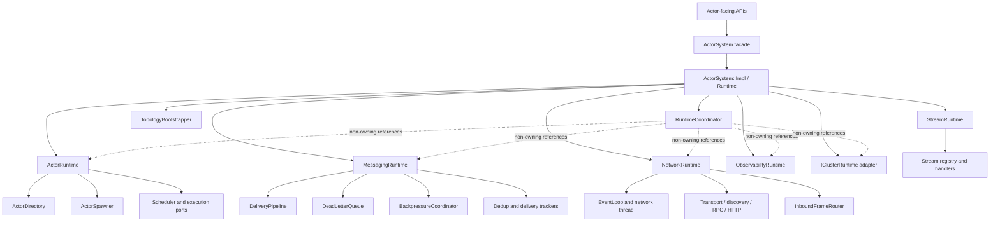
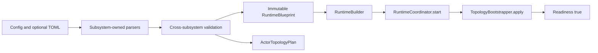

# ActorSystem Component Refactor Design Specification

**Date:** 2026-06-27

**Status:** Draft for review

**Scope:** Architecture and incremental refactor design; no implementation in this document

**Supersedes:** The unfinished portions of
`docs/superpowers/specs/2026-06-05-actor-system-refactor-design.md`

## 1. Executive Summary

`ActorSystem` must remain HPActor's stable user-facing runtime facade, but it
must stop being the implementation owner, service locator, startup script,
actor manager, protocol dispatcher, and configuration mutation point for the
entire process.

The current refactor has already created useful seams: `ActorDirectory`,
`DeliveryPipeline`, `LocalDeliveryEngine`, `BackpressureCoordinator`, and
`ShutdownCoordinator`. Those extractions reduced some method bodies, but
`ActorSystem` still owns and wires almost every subsystem and still contains
policy for spawning, topology application, remote frame dispatch, streams,
network lifecycle, telemetry, and cluster integration. The result remains a
God Class even though some work is delegated.

This design completes the refactor by combining four patterns:

1. **Component-based architecture** is the primary internal structure. Each
   runtime component owns one cohesive subsystem and its state.
2. **Dependency injection** supplies explicit typed dependencies at component
   construction. HPActor will not add a general-purpose DI container.
3. **A non-owning runtime coordinator** mediates startup, readiness, reload,
   drain, and shutdown ordering without owning subsystem state.
4. **`ActorSystem` remains a facade** that preserves existing actor-facing APIs
   while delegating to the component graph.

Mixins are intentionally not used as the main decomposition mechanism. Mixins
would split method declarations while retaining shared state, implicit
dependencies, and one object lifetime. That would make the class look smaller
without changing its architecture.

The migration is deliberately incremental. Correctness defects caused by the
current ownership model are fixed first. Subsequent phases move ownership and
policy behind existing APIs, keep the runtime buildable after every phase, and
preserve local delivery, mailbox, scheduler, wire, and actor API contracts.

## 2. Context and Design Inputs

This design is based on the current `main` implementation, not only on older
architecture documents.

Primary code inputs:

- `include/hpactor/actor/actor_system.hpp`
- `src/actor/actor_system.cpp`
- `include/hpactor/actor/actor_directory.hpp`
- `include/hpactor/mailbox/delivery_pipeline.hpp`
- `include/hpactor/mailbox/local_delivery_engine.hpp`
- `include/hpactor/mailbox/backpressure_coordinator.hpp`
- `include/hpactor/actor/lifecycle/shutdown_coordinator.hpp`

Normative architecture inputs:

- `docs/architecture/production/production-reliability-plane.md`
- `docs/architecture/production/dynamic-config-parser-ioc-design.md`
- `docs/architecture/production/graceful-shutdown-rolling-upgrade-design.md`
- `docs/architecture/actor/actor-concurrency-and-lockfree-mailbox-rules.md`
- `docs/superpowers/specs/2026-05-29-scheduler-decoupling-design.md`
- `docs/superpowers/specs/2026-06-05-actor-system-refactor-design.md`
- `docs/superpowers/specs/2026-06-06-msg-subsystem-extraction-design.md`

Current structural evidence:

- `src/actor/actor_system.cpp` is 1,227 lines and defines approximately 59
  `ActorSystem` methods or overloads.
- The constructor spans roughly 298 lines and has cyclomatic complexity 21 and
  cognitive complexity 38 in the repository knowledge graph.
- `ActorSystem` directly owns actor, scheduler, mailbox delivery, backpressure,
  network, discovery, RPC, HTTP, streams, metrics, logging, tracing, fault
  injection, passivation, process, topology, shutdown, and cluster state.
- The constructor starts threads and services while also creating actors and
  installing callbacks that capture `this`.
- The public facade exposes raw subsystem pointers, causing consumers to use it
  as a service locator.

These numbers are diagnostic signals, not the design objective. The objective
is coherent ownership and explicit contracts; line-count reduction follows
from that change.

### 2.1 Relationship to the 2026-06-05 refactor

The earlier ActorSystem refactor established the correct initial direction and
has been partially implemented. This specification preserves those successful
boundaries and designs the remaining work from the current state.

| Earlier target | Current status | Remaining work in this specification |
|---|---|---|
| `ActorDirectory` | Implemented and used for actor entries and lookups | Remove the second name registry and make directory ownership exclusive |
| `LocalDeliveryEngine` | Implemented as an extracted helper | Place it under one messaging owner and eliminate facade bypass/duplicate policy |
| `DeliveryPipeline` | Implemented with injected dependencies | Stabilize dependency lifetimes and move it under `MessagingRuntime` |
| `BackpressureCoordinator` | Implemented and delegated to | Remove late setter wiring and inject stable transport/telemetry capabilities |
| `ShutdownCoordinator` | Implemented with callback dependencies | Integrate it into one full runtime lifecycle coordinator and remove destructor duplication |
| `ActorSpawner` | Not yet a unified owner | Consolidate all local/system/configured adoption paths |
| `RemoteRuntime` | Network resources remain in `ActorSystem` | Extract ownership, callback installation, and idempotent lifecycle |
| `TopologyBootstrapper` | Parsing/application remain in `ActorSystem` | Separate immutable startup blueprint from actor topology application |

The old implementation plan must not be resumed verbatim because its file
paths, starting assumptions, and completed tasks no longer match the codebase.
Each phase in this specification requires a fresh, current-state implementation
plan.

## 3. Problem Statement

`ActorSystem` currently performs five architectural roles at once:

| Role | Current examples |
|---|---|
| Public facade | `spawn`, `deliver_local`, `load_topology`, `shutdown` |
| Composition root | Constructs scheduler, delivery, network, telemetry, RPC, and system actors |
| State owner | Holds directories, stream maps, trackers, managers, threads, and cluster objects |
| Policy engine | Chooses dispatch policy, config application, frame routing, and subsystem enablement |
| Lifecycle orchestrator | Starts and stops process, scheduler, transport, discovery, telemetry, and actors |

This convergence creates four recurring failure modes:

1. **Temporal coupling:** components receive raw pointers to objects that are
   later replaced or configured after they have started.
2. **Duplicated sources of truth:** registries, spawn flows, and configuration
   values are maintained in more than one place.
3. **Transitive coupling:** scheduler, event loop, actors, tracing, CLI, and
   lifecycle helpers depend on the whole `ActorSystem` when they need only one
   capability.
4. **Change amplification:** adding a protocol, runtime service, or config key
   adds fields, includes, constructor wiring, shutdown logic, and accessors to
   one central class.

The existing extracted helpers are useful but insufficient while their
dependencies, lifetime, and mutable wiring remain centralized in
`ActorSystem`.

## 4. Goals

1. Preserve source-compatible defaults for existing public actor APIs.
2. Keep `ActorSystem` as the user-facing facade and compatibility boundary.
3. Establish one owner and one source of truth for each runtime resource.
4. Separate construction, ownership, orchestration, and hot-path execution.
5. Parse and validate effective startup configuration before starting threads
   or publishing readiness.
6. Unify template, configured, system, and remote-receiver actor registration
   through one spawn/adoption pipeline.
7. Keep local and remote ordinary message ingress converged on one delivery
   pipeline.
8. Isolate wire-frame demultiplexing and stream protocol state from the facade.
9. Make startup and shutdown order explicit, idempotent, testable, and capable
   of reverse-order rollback.
10. Replace broad `ActorSystem*` dependencies with concrete subsystem
    references or narrow cross-library capability interfaces.
11. Preserve HPActor's no-exceptions, no-RTTI, bounded-resource, and
    actor-concurrency contracts.
12. Preserve operations surfaces: metrics, logs, traces, CLI/admin queries,
    health/readiness, DLQ, and fault-injection visibility.

## 5. Non-Goals

- Rewriting the actor runtime, scheduler, mailbox, or transport algorithms.
- Changing protobuf wire formats or `TypeTag` assignments.
- Replacing `TypedMessage` or actor programming APIs.
- Introducing a general service container, runtime reflection, RTTI, or
  exception-based startup.
- Moving all internal types into public headers.
- Making every dependency an abstract virtual interface.
- Adding sharding, durability, security, or other backlog features as part of
  this refactor.
- Hot-reloading arbitrary topology or immutable transport/scheduler settings.
- Removing all existing `ActorSystem` accessors in the first migration.
- Using inheritance or mixins to share mutable runtime state.

## 6. Important Correctness Findings

These findings are implementation defects or concrete correctness risks, not
merely style concerns. They must be stabilized before broad ownership moves.

### 6.1 P1: `DeliveryPipeline` can retain a dangling DLQ pointer

During construction, `pipeline_cfg.dlq` receives `dead_letters_.get()`. Later,
`load_topology()` assigns a new `std::unique_ptr<DeadLetterQueue>` to
`dead_letters_`. `DeliveryPipeline::Config` continues to store the original raw
pointer, whose object has been destroyed.

Consequences:

- A later rejection, expiry, missing actor, or circuit-open path can access
  freed memory.
- DLQ snapshots exposed by `ActorSystem` can refer to a different queue than
  the delivery path uses.
- Whether the defect manifests depends on allocator reuse and traffic, making
  it difficult to reproduce.

Required stabilization:

- Establish one DLQ object with a lifetime at least as long as
  `MessagingRuntime`.
- Do not replace the queue after injecting its address.
- If configuration is reloadable, update policy through an explicit validated
  `reconfigure()` operation that preserves object identity, or build a new
  complete messaging component and atomically swap it only after quiescence.
- Add a regression test that loads topology with a different DLQ configuration
  and then exercises a dead-letter path under ASan.

### 6.2 P1: named actor registration has two inconsistent sources of truth

`register_actor()` writes both the nested `ActorRegistry` and
`ActorDirectory`. `resolve_actor()` reads only `ActorDirectory`.
`unregister_actor()` erases only the nested registry. Topology bootstrap writes
only the nested registry.

Consequences:

- `unregister_actor()` can leave the actor resolvable.
- A topology actor can be present in the legacy registry but unavailable to
  `resolve_actor()`.
- Future changes can update one map and silently diverge from the other.

Required stabilization:

- Make `ActorDirectory` the sole owner of name-to-address mappings.
- Add an explicit `unregister_name()` operation to `ActorDirectory`.
- Remove the nested `ActorRegistry` after all facade methods delegate to the
  directory.
- Add tests for register, duplicate registration policy, resolve, unregister,
  topology registration, and actor removal/name cleanup.

### 6.3 P1: runtime configuration is mutated after dependent services start

The constructor starts metrics, logging, process mode, scheduler, tracing,
network discovery, transport, and a network thread. `load_topology()` later
mutates `config_`, metrics configuration, logging configuration, mailbox
defaults, DLQ configuration, process configuration, tracing, and connection
pool configuration. Only some of those changes are actively applied.

Consequences:

- `config()` may describe values the running subsystem never adopted.
- Logging and metrics objects can continue using defaults while the stored
  configuration reports TOML values.
- Scheduler, process, endpoint, and transport startup-only settings cannot be
  safely changed after threads exist.
- Individual subsystems implement ad hoc reload semantics.

Required stabilization:

- Distinguish `Immutable`, `RestartRequired`, `DrainRequired`, and
  `LiveReloadable` fields as defined by the dynamic-config architecture.
- Build an immutable `RuntimeBlueprint` before starting the runtime.
- Keep `load_topology()` source-compatible, but restrict it to actor topology
  plus explicitly reloadable settings. It must validate and reject conflicting
  startup-only values rather than silently mutating `config_`.
- Provide a preferred factory/builder path that parses TOML before startup.

### 6.4 P2: actor spawn paths have divergent lifecycle behavior

The template `spawn<T>()`, `spawn_configured()`, and manual `SpawnReceiver`
registration each perform variants of the same sequence: allocate an id,
assign an address, construct a mailbox and context, insert a directory entry,
wire scheduler and telemetry, select a dispatch path, activate the actor, and
publish lifecycle state.

The paths are not equivalent. In particular, configured spawning does not
perform every metrics, logger, lifecycle-transition, and event emission step
performed by template spawning.

Consequences:

- Actor behavior depends on how it was created rather than on its declared
  configuration.
- Fixes to lifecycle ordering or instrumentation can land in one path only.
- System actors can bypass invariants expected by directory and shutdown code.

Required stabilization:

- Introduce one `ActorSpawner::adopt()` pipeline for a constructed local actor.
- Represent variations as an explicit `SpawnSpec`, not separate orchestration
  code.
- The template API constructs `T` and delegates to a non-template helper.
- Add a parameterized contract test that runs the same assertions against
  template, configured, and system actor spawning.

### 6.5 P2: stream registry concurrency ownership is unspecified

`stream_senders_` and `stream_receivers_` are ordinary unordered maps.
Inbound stream frames are handled from the network path, while stream creation
and closure can be initiated from actor or external threads. The class exposes
no lock and documents no single-thread confinement rule.

Consequences:

- Concurrent insertion, lookup, and erase can race.
- A close/error frame can race with local stream registration.
- Moving the code without first defining ownership can preserve or worsen an
  existing latent defect.

Required stabilization:

- Move the maps into `StreamRuntime`.
- Use a small dedicated mutex for registry operations during the incremental
  migration. Copy the target `ActorId` and release the lock before delivery,
  transport calls, actor spawning, or callbacks.
- Document the network-loop callback thread and actor/external producer roles.
- Add TSAN-oriented tests for open/data/ack/close/error interleavings.

## 7. Architectural Options Considered

### 7.1 Option A: mixin-based horizontal split

Example: derive `ActorSystem` from `SpawnMixin`, `DeliveryMixin`,
`NetworkMixin`, and `ObservabilityMixin`.

Advantages:

- Small mechanical change to call sites.
- Can group declarations and implementation files.
- Compile-time dispatch with no virtual calls.

Disadvantages:

- Mixins still share the same object lifetime and usually reach into the same
  private state.
- Dependencies remain implicit through the derived type.
- Construction and destruction order becomes harder to understand.
- Tests still require a complete `ActorSystem`.
- The God Class is distributed across base classes rather than removed.

Decision: **Rejected as the primary architecture.** Small stateless policy
mixins remain acceptable in isolated leaf components, but not for runtime
ownership.

### 7.2 Option B: PImpl-only facade reduction

Move every private member and method into `ActorSystem::Impl` while preserving
the public class.

Advantages:

- Reduces public header dependencies and recompilation.
- Preserves ABI flexibility and source compatibility.
- Can be performed mechanically as an early migration step.

Disadvantages:

- `Impl` can become the same God Class behind an opaque pointer.
- Does not establish subsystem ownership or dependency direction.
- Does not independently improve testing or lifecycle correctness.

Decision: **Accepted only as a migration and encapsulation mechanism.** PImpl
is useful when `Impl` owns a component graph, not when it owns all subsystem
state directly.

### 7.3 Option C: component graph with facade, typed DI, and coordinator

`ActorSystem` delegates through an internal runtime object. Runtime components
own cohesive state. A non-owning coordinator sequences lifecycle transitions.

Advantages:

- Makes ownership and lifetime explicit.
- Enables focused component and failure-path tests.
- Separates control-plane orchestration from data-plane hot paths.
- Allows staged migration behind stable public methods.
- Aligns with existing extracted components and subsystem-owned config parsers.

Disadvantages:

- Requires deliberate dependency design and migration adapters.
- Temporarily increases forwarding code while old and new paths coexist.
- Cross-library boundaries such as cluster integration require a stable port.

Decision: **Selected.** Use PImpl to contain the selected component graph.

## 8. Target Architecture

### 8.1 Structural overview



`Runtime` is the composition root and owner. `RuntimeCoordinator` is not a
second container; it holds references and performs explicit phase transitions.
No component owns or calls back into the entire `ActorSystem`.

### 8.2 `ActorSystem`: stable facade

Responsibilities:

- Preserve existing public signatures and default behavior.
- Validate facade-level preconditions.
- Delegate to exactly one owning component.
- Translate internal results only where the public API requires it.
- Expose compatibility accessors during migration.

Non-responsibilities:

- Owning subsystem fields directly.
- Starting threads or registering transport callbacks.
- Parsing TOML.
- Selecting actor scheduling policy.
- Decoding wire frames.
- Holding stream registries or cluster objects.

Target private state:

```cpp
class ActorSystem {
  public:
    // Existing public surface remains source-compatible.

  private:
    class Impl;
    std::unique_ptr<Impl> impl_;

    Actor adopt_actor(std::shared_ptr<AbstractActor> actor,
                      const SpawnSpec& spec);
};
```

The header-only `spawn<T>()` constructs the concrete actor and calls
`adopt_actor()`. It does not access `Impl`, the directory, scheduler, mailbox,
metrics, or logger directly.

### 8.3 `Runtime`: composition root and owner

Responsibilities:

- Own components in an order that makes destruction safe.
- Build typed dependency bundles once.
- Provide component references to the facade and coordinator.
- Keep component object identity stable for the runtime lifetime.

`Runtime` contains no message-routing policy and no lifecycle phase logic. Its
constructor allocates and wires objects but does not start threads or external
I/O. A `RuntimeBuilder` creates it from a validated `RuntimeBlueprint`.

### 8.4 `ActorRuntime`

Owns:

- `ActorDirectory`.
- `ActorSpawner`.
- Actor type registry.
- System pseudo-actor identity.
- Passivation manager and actor lifecycle adapters.
- References to scheduler execution/readiness capabilities.

Responsibilities:

- Local actor identity and lifetime.
- Actor lookup, enumeration, name registration, and removal.
- Unified adoption of constructed actors.
- Lifecycle and dispatch registration after directory publication.
- Rollback of partially adopted actors.

`ActorRuntime` does not deliver ordinary messages, own a transport, parse
topology, or manage telemetry backends.

#### Spawn contract

```cpp
struct SpawnSpec {
    std::string_view type_name;
    std::optional<std::string_view> registered_name;
    mailbox::MailboxConfig mailbox;
    sched::DispatchPolicy dispatch_policy;
    sched::DispatchHints dispatch_hints;
    std::optional<QuarantineConfig> quarantine;
    bool system_actor{false};
};

result<Actor> ActorSpawner::adopt(
    std::shared_ptr<AbstractActor> actor,
    const SpawnSpec& spec) noexcept;
```

Adoption order:

1. Validate actor mode and `SpawnSpec`.
2. Allocate actor id or validate a reserved system id.
3. Assign address and type name.
4. Create mailbox and context.
5. Wire scheduler, mailbox, metrics, and logger references.
6. Insert one complete `ActorDirectoryEntry`.
7. Register an optional name in the same directory transaction.
8. Invoke activation and lifecycle transition.
9. Register dispatch or notify readiness.
10. Emit spawn metrics and logs.

If a step before publication fails, nothing is visible. If a step after
publication fails, rollback removes the directory entry and dispatch
registration before returning a typed error.

### 8.5 `MessagingRuntime`

Owns:

- `DeadLetterQueue`.
- `DeliveryPipeline`.
- Fast local delivery helper.
- `BackpressureCoordinator`.
- Receiver dedup cache.
- Reliable and outbound delivery trackers.

Responsibilities:

- Full local delivery admission and result mapping.
- Fast internal delivery with explicit restricted semantics.
- DLQ, deduplication, TTL, circuit-breaker, ACK/NACK, and pressure integration.
- Stable instrumentation sinks for delivery.

The ordinary local and remote actor-message paths converge here. The fast path
remains separately named and must document which checks it bypasses.

Hot-path constraints:

- Do not add virtual dispatch, allocation, or a generic service lookup to each
  message delivery.
- Use concrete references to `ActorDirectory`, mailbox types, and stable
  telemetry sinks inside the compiled runtime.
- Preserve message metadata: sender, trace, priority, deadline, message id,
  flags, and delivery mode.
- Preserve mailbox reservation, release, single-consumer, ready-gate, and
  lost-wakeup contracts.

### 8.6 `NetworkRuntime`

Owns:

- Event loop and its thread.
- Transport.
- Service discovery and registrar.
- Actor location cache and maintenance timers.
- RPC channel and HTTP client.
- Remote spawn client and receiver integration.
- `InboundFrameRouter`.

Responsibilities:

- Start and stop remote ingress.
- Install transport callbacks without capturing `ActorSystem`.
- Convert network events into calls on narrow messaging, stream, RPC, and
  backpressure handlers.
- Maintain endpoint and transport-level configuration.
- Report node membership changes through a control-plane callback.

`NetworkRuntime` does not own local actors, mailboxes, the DLQ, or the stream
registry.

### 8.7 `InboundFrameRouter`

The current `deliver_remote()` method mixes stream protocol routing, reliable
ACK/NACK handling, backpressure control frames, trace decoding, ordinary
message construction, and final delivery.

`InboundFrameRouter` becomes a stateless or narrowly stateful demultiplexer:

```text
WireFrame
  +-- RPC response --------------------> RpcChannel
  +-- stream open/data/ack/close/error -> StreamRuntime
  +-- reliable ACK/NACK ---------------> MessagingRuntime trackers
  +-- backpressure signal -------------> BackpressureCoordinator
  +-- ordinary actor data -------------> decoder -> MessagingRuntime
  +-- invalid/unsupported -------------> typed failure + metrics/log/DLQ policy
```

The router executes on the network-loop thread. Its handler table is assembled
once and uses concrete references or function pointers; it does not perform a
runtime service lookup or allocate a handler object per frame.

Malformed frames must return an explicit decode/dispatch result. The network
runtime decides whether to drop, close, quarantine, or report the peer based on
transport policy.

### 8.8 `StreamRuntime`

Owns:

- Stream id allocation.
- Sender and receiver actor registries.
- Stream open/data/ack/close/error handlers.
- Registration cleanup and stream-specific metrics.

Concurrency contract:

- Network callbacks may look up or remove stream entries.
- Actor or external threads may open and register streams.
- A dedicated mutex protects only registry structure and id-to-actor mapping.
- Callers copy the required `ActorId`, then release the lock before spawning,
  delivery, transport, logging, or callbacks.
- Stream payload delivery continues through the existing explicitly documented
  fast path where appropriate.

This is intentionally simpler than converting stream management into another
actor during the refactor. Actor-based stream registry ownership can be
evaluated separately after behavior and performance are characterized.

### 8.9 `ObservabilityRuntime`

Owns:

- Metrics ring buffer and metrics actor integration.
- Log manager and logger.
- Trace manager.
- Stable telemetry adapters passed to producers.

Responsibilities:

- Start telemetry consumers before producers publish events.
- Keep sink object identity stable while scheduler, mailbox, network, and actor
  code retain pointers.
- Stop producers before destroying sinks.
- Apply only configuration classified as live reloadable.
- Flush best effort during shutdown without blocking cooperative workers.

Metrics/logging/tracing policy remains subsystem-owned. `ActorSystem` may keep
compatibility accessors, but new internal code depends on typed sinks rather
than asking the facade for managers.

### 8.10 `IClusterRuntime` adapter

The current facade uses `unique_ptr<void>` plus cleanup functions and
`static_cast` accessors to avoid a library cycle. Replace this with a core-owned
interface implemented by the cluster library:

```cpp
class IClusterRuntime {
  public:
    virtual ~IClusterRuntime() = default;
    virtual result<void> start() noexcept = 0;
    virtual result<void> begin_leave() noexcept = 0;
    virtual void stop() noexcept = 0;
    virtual ClusterStatusSnapshot snapshot() const = 0;
};
```

This virtual boundary is acceptable because it is a control-plane boundary,
not a per-message hot path. Concrete cluster services remain behind the
adapter. Compatibility accessors can be retained temporarily in the cluster
extension layer, not implemented with type-erased ownership in the core
facade.

### 8.11 `TopologyBootstrapper` and `RuntimeBlueprint`

Configuration has two distinct outputs:

1. `RuntimeBlueprint`: effective, validated subsystem configuration required
   before runtime start.
2. `ActorTopologyPlan`: validated actor definitions and dependency order that
   can be executed after core runtime startup.



Preferred startup APIs may be added without removing existing construction:

```cpp
static result<std::unique_ptr<ActorSystem>>
ActorSystem::create(Config config) noexcept;

static result<std::unique_ptr<ActorSystem>>
ActorSystem::create_from_topology(std::string_view path) noexcept;
```

The existing constructor remains source-compatible during migration. It uses
the same internal builder. Because it cannot return a typed error, a detected
startup failure leaves the object stopped and not ready, keeps its accessors
safe to call, and emits the structured startup failure through available
logging/health state. It does not continue with a partially started component
graph. The result-returning factories become the recommended production API
because they return the failure directly without exceptions.

Existing `load_topology(path)` remains available. Its contract becomes:

- Parse and validate the complete document.
- Spawn or initialize the actor topology.
- Apply only settings explicitly marked `LiveReloadable`.
- Return a structured error for conflicting `Immutable`, `RestartRequired`, or
  unsupported `DrainRequired` changes.
- Never replace an object whose address has been injected into a running
  component.

### 8.12 `RuntimeCoordinator`: orchestration without ownership

`RuntimeCoordinator` is the mediator for lifecycle transitions. It receives
non-owning references to already constructed components and contains the
explicit phase state machine. It does not expose a generic component registry.

Startup sequence:

1. Validate that the coordinator is in `Constructed` state.
2. Prepare process mode before creating worker threads.
3. Start observability consumers.
4. Install fault-injection integration.
5. Start scheduler workers.
6. Start network loop, discovery, transport, and ingress in a non-ready state.
7. Start optional cluster adapter.
8. Adopt required system actors.
9. Apply the actor topology plan.
10. Publish readiness only after required components and actors report ready.

On failure, stop every successfully started phase in reverse order and return
the original structured failure plus rollback findings.

Shutdown sequence:

1. Atomically set readiness false and enter `DrainingIngress`.
2. Stop accepting HTTP, remote-spawn, and ordinary external ingress while
   preserving required system/control messages.
3. Snapshot actors and execute per-actor drain policy.
4. Ask the cluster adapter to leave.
5. Stop network timers, transport, discovery, event loop, and network thread.
6. Stop scheduler workers after actor execution is quiescent.
7. Flush traces, logs, metrics, and DLQ best effort.
8. Remove fault hooks and release process resources.
9. Enter `Stopped` or `ForcedStop` with a structured reason.

Coordinator rules:

- `start()` and `stop()` are idempotent.
- Only the control thread executes phase transitions.
- Data-plane callbacks never call coordinator phase methods directly; they
  publish bounded control events or update atomic ingress/readiness gates.
- No component lock is held while starting, stopping, draining, or invoking
  another component.
- Destruction delegates to idempotent stop and does not implement a second
  independent shutdown sequence.

#### Relationship to the existing `ShutdownCoordinator`

The target architecture has one lifecycle phase state machine. The existing
`ShutdownCoordinator` must not remain as a competing owner of runtime phases.
During migration:

- Its actor snapshot, drain initiation, drain polling, timeout, and user-phase
  behavior is retained as the actor-drain phase helper.
- Runtime-wide ingress, cluster, network, scheduler, and telemetry transitions
  move to `RuntimeCoordinator`.
- `RuntimeCoordinator` is the sole writer of runtime lifecycle phase and
  readiness state.
- The source-compatible `ActorSystem::shutdown_coordinator()` accessor returns
  a compatibility view that delegates user-phase registration and shutdown
  queries to `RuntimeCoordinator`.

After call sites migrate, the helper may be renamed `ActorDrainCoordinator`.
That rename is internal and must not remove the compatibility type or accessor
during this refactor.

## 9. Dependency Injection and Inversion Rules

HPActor will use explicit construction, not a service locator.

1. A component constructor receives only dependencies needed for its steady
   state.
2. Optional runtime links are represented by nullable narrow ports or explicit
   optional adapters, not by access to `ActorSystem`.
3. Setter injection is limited to lifecycle transitions that are genuinely
   cyclic and must document when the pointer becomes valid. The preferred
   design eliminates such cycles in `RuntimeBuilder`.
4. Use concrete references inside one library where ownership and compilation
   dependencies are stable.
5. Introduce virtual interfaces only at true replaceable or cross-library
   boundaries, such as `IScheduler`, `IServiceDiscovery`, transport, and
   `IClusterRuntime`.
6. Never perform dependency lookup on message, mailbox, scheduler, or network
   hot paths.

Representative narrow capabilities:

- Actor lookup/directory access.
- Actor readiness notification and execution host.
- Message delivery.
- Wire transport send.
- Ingress gate state.
- Metrics/log/trace sink.
- Clock/timer scheduling.

Existing classes that currently store `ActorSystem*` migrate one at a time to
the smallest applicable capability. Compatibility constructors can temporarily
adapt `ActorSystem` to the capability while call sites migrate.

## 10. Ownership and Lifetime Contract

| Resource | Sole owner | Borrowers | Destruction requirement |
|---|---|---|---|
| Actor entries and names | `ActorRuntime/ActorDirectory` | scheduler, messaging, CLI snapshots | Stop execution before destroying entries |
| Scheduler workers | scheduler component | actor runtime, mailboxes | Join workers before actor/telemetry teardown |
| DLQ, dedup, delivery trackers | `MessagingRuntime` | delivery pipeline, CLI snapshots | Stable identity until delivery producers stop |
| Event loop/thread/transport | `NetworkRuntime` | frame router, RPC, stream, backpressure | Stop ingress and join thread before handlers die |
| Stream maps | `StreamRuntime` | frame router, stream APIs | Quiesce network callback, then clear registry |
| Metrics/log/trace managers | `ObservabilityRuntime` | all producers | Producers stop before sink destruction |
| Cluster implementation | cluster adapter owner | coordinator, operations queries | Leave/stop before network and identity teardown |
| Runtime configuration | immutable `RuntimeBlueprint` | all components | Lives for the whole runtime |

Raw pointers may be used on hot paths only when this table gives a stable owner
and shutdown ordering proves the pointee outlives every borrower. Replacing an
owned object in place is prohibited while borrowers retain its address.

## 11. Data and Control Flows

### 11.1 Local message delivery

```text
ActorContext / ActorRef / facade
        -> MessagingRuntime::try_deliver
        -> ActorDirectory lookup
        -> DeliveryPipeline policy checks
        -> MPSCActorMailbox admission
        -> ActorReadyGate / scheduler notification
        -> result + DLQ/metrics/backpressure as required
```

The refactor must not add another consumer to a mailbox, weaken memory
ordering, alter reservation accounting, or call user code under mailbox or
directory locks.

### 11.2 Remote ordinary message ingress

```text
Transport callback on network loop
        -> InboundFrameRouter
        -> frame validation and TypedMessage decode
        -> MessagingRuntime::try_deliver
        -> same local mailbox path
```

Remote metadata and trace context are decoded before the call to messaging and
are not reconstructed downstream.

### 11.3 Actor spawning

```text
template/config/system factory
        -> construct AbstractActor
        -> ActorSystem::adopt_actor facade helper
        -> ActorSpawner::adopt(SpawnSpec)
        -> one directory/mailbox/context/lifecycle/scheduler sequence
```

### 11.4 Runtime configuration

```text
parse -> validate -> classify diff -> plan
    +-- startup: build immutable blueprint before side effects
    +-- reload: reject immutable/restart-required changes
                apply live changes through owning subsystem
                emit audit/log/metric outcome
```

## 12. Error and Failure Semantics

- Construction and startup helpers return `result<T>`; they do not throw.
- A failed component start includes component, phase, canonical failure reason,
  and underlying detail where available.
- Startup rollback is best effort but observable. Rollback failure never hides
  the initiating error.
- Actor adoption returns an error without publishing a partial directory entry,
  or removes it before returning if failure occurs after publication.
- Invalid or unsupported frames produce a typed dispatch result and bounded
  observability; they never invoke actor code directly.
- Reload rejects unsupported changes before partial application. For a future
  multi-component live reload, validation and prepare complete before commit.
- Shutdown timeouts enter `ForcedStop` according to existing policy and record
  the component or actor that prevented clean drain.
- Facade `void` compatibility methods preserve existing behavior but delegate
  to result-returning internals and record failures through the existing
  observability policy.

## 13. Operations and Observability Contract

The refactor is incomplete if component decisions become less visible.

Required preserved surfaces:

- Existing actor, delivery, backpressure, scheduler, transport, DLQ, and
  shutdown metrics.
- Existing structured logs and trace propagation.
- CLI/admin actor listing, lookup, DLQ inspection, timer stats, health,
  readiness, and shutdown status.
- Fault-injection sites and deterministic failure testing.

Recommended component-level additions:

- Runtime lifecycle phase and duration.
- Component startup and rollback failure counts.
- Config validation/reload rejection counts by reload class.
- Inbound frame dispatch failures by payload category.
- Active stream registry size and rejected/unknown stream frame counts.

Readiness contract:

- False until required system actors, scheduler, and configured ingress are
  operational.
- False before ingress drain begins.
- Liveness remains independent of readiness and reports control-thread/runtime
  progress.

CLI/admin views should consume snapshots from owning components. They must not
reach through the facade into component containers or hold internal locks while
formatting output.

## 14. Public API and Compatibility Strategy

### Preserved throughout migration

- `ActorSystem(const Config&)`.
- `spawn<T>()` and configured spawn behavior unless correcting a tested defect.
- `ActorContext::send()`, `ActorRef::send()`, and delivery result APIs.
- `load_topology()` signature.
- Shutdown, readiness, timer, metrics, logging, tracing, network, registry, and
  cluster-facing accessors currently used by applications and tests.
- Actor address, message, TypeTag, and wire compatibility.

### Added as preferred APIs

- Result-returning startup factory/builder.
- Optional grouped facade views such as `actors()`, `messaging()`, and
  `operations()` only after internal ownership is stable.

### Deprecated only after internal migration

Raw manager and transport accessors that allow mutation may be marked
deprecated after call sites have narrow alternatives. They are not removed in
this refactor. Read-only snapshots should replace broad mutable access where
practical.

No ABI guarantee is asserted unless HPActor's release policy currently promises
one. Source compatibility is mandatory; PImpl reduces future ABI and compile
coupling.

## 15. Proposed File Organization

Public facade:

```text
include/hpactor/actor/actor_system.hpp
src/actor/actor_system.cpp
```

Internal composition and orchestration:

```text
src/runtime/runtime.hpp
src/runtime/runtime.cpp
src/runtime/runtime_builder.hpp
src/runtime/runtime_builder.cpp
src/runtime/runtime_coordinator.hpp
src/runtime/runtime_coordinator.cpp
src/runtime/runtime_blueprint.hpp
```

Subsystem-owned implementation helpers:

```text
src/actor/actor_runtime.hpp/.cpp
src/actor/actor_spawner.hpp/.cpp
src/mailbox/messaging_runtime.hpp/.cpp
src/net/network_runtime.hpp/.cpp
src/net/inbound_frame_router.hpp/.cpp
src/actor/stream_runtime.hpp/.cpp
src/metrics/observability_runtime.hpp/.cpp
include/hpactor/cluster/cluster_runtime.hpp
src/config/topology_bootstrapper.hpp/.cpp
```

Existing extracted public headers remain in place initially. A later header
hygiene phase may move implementation-only types to private headers after all
external usage is measured. The refactor must not create a new umbrella public
runtime API accidentally.

## 16. Incremental Migration Plan

Every phase must compile, pass its focused tests, preserve public APIs, and be
independently reviewable. Production changes follow RED -> GREEN -> REFACTOR.

This specification is an umbrella architecture, not a single implementation
batch. Create, review, and execute one phase-specific implementation plan at a
time. A phase may be split again if its plan cannot be reviewed or verified as
one coherent change. Do not generate or execute a monolithic plan covering all
eight phases.

### Phase 0: correctness stabilization

Scope:

- Fix DLQ lifetime without changing delivery semantics.
- Collapse actor names onto `ActorDirectory` and fix unregister/topology paths.
- Add spawn-path parity characterization tests.
- Define and test stream registry synchronization.
- Record current startup, shutdown, and delivery behavior as characterization
  tests.

Exit criteria:

- ASan does not report use-after-free after topology reload and dead-lettering.
- Register/resolve/unregister/topology name tests use one directory.
- Stream registry has a documented lock/confinement contract and stress test.
- No ownership extraction begins while these sources of truth are ambiguous.

### Phase 1: introduce `ActorSystem::Impl` and `Runtime` ownership shell

Detailed phase documents:

- Design:
  `docs/superpowers/specs/2026-06-27-actor-system-phase1-runtime-shell-design.md`
- Implementation plan:
  `docs/superpowers/plans/2026-06-27-actor-system-phase1-runtime-shell-implementation.md`

Scope:

- Add PImpl to the public facade.
- Move existing private state into `Runtime` without changing owners or
  algorithms yet.
- Preserve facade forwarding methods and template `spawn<T>()` through a
  non-template adoption helper.
- Establish construction/destruction tests.

Exit criteria:

- `ActorSystem` private state is the `Impl` pointer plus unavoidable facade
  declarations.
- No public method signature changes.
- `Impl` contains named component members rather than one undifferentiated bag
  by the end of the phase.

### Phase 2: complete `ActorRuntime` and unified spawning

Detailed phase documents:

- Design:
  `docs/superpowers/specs/2026-06-27-actor-system-phase2-actor-runtime-design.md`
- Implementation plan:
  `docs/superpowers/plans/2026-06-27-actor-system-phase2-actor-runtime-implementation.md`

Scope:

- Move directory, actor type, passivation, and system actor ownership into
  `ActorRuntime`.
- Introduce `ActorSpawner` and `SpawnSpec`.
- Route template, configured, reserved system, and remote-receiver registration
  through the adoption pipeline.
- Adapt scheduler dependencies toward actor lookup/execution capabilities.

Exit criteria:

- Exactly one code path publishes a complete actor directory entry.
- Spawn variants satisfy the same lifecycle, telemetry, and scheduler contract.
- No manual directory entry construction remains in `ActorSystem`.

### Phase 3: consolidate `MessagingRuntime`

Detailed phase documents:

- Design:
  `docs/superpowers/specs/2026-06-28-actor-system-phase3-messaging-runtime-design.md`
- Implementation plan:
  `docs/superpowers/plans/2026-06-28-actor-system-phase3-messaging-runtime-implementation.md`

Scope:

- Move DLQ, delivery pipeline, fast local delivery, backpressure, dedup, and
  trackers under one owner.
- Replace callbacks capturing `ActorSystem` with direct subsystem references or
  narrow sinks.
- Preserve one ordinary local/remote ingress path.
- Keep stable telemetry and DLQ object identity.

Exit criteria:

- `ActorSystem` delivery methods are thin forwards.
- Delivery code has no dependency on the complete facade.
- Mailbox concurrency, reservation, metadata, and observability tests pass.

### Phase 4: extract frame and stream protocol handling

Detailed phase documents:

- Design:
  `docs/superpowers/specs/2026-06-28-actor-system-phase4-frame-stream-routing-design.md`
- Implementation plan:
  `docs/superpowers/plans/2026-06-28-actor-system-phase4-frame-stream-routing-implementation.md`

Scope:

- Introduce `InboundFrameRouter`.
- Move stream maps and handlers into `StreamRuntime`.
- Move ACK/NACK and backpressure frame handling to their owning components.
- Add malformed/unsupported frame results and observability.

Exit criteria:

- `ActorSystem::deliver_remote()` is a compatibility forward only.
- No stream protocol state remains in the facade/runtime shell.
- TSAN-oriented stream tests and remote delivery integration tests pass.

### Phase 5: extract `NetworkRuntime`

Scope:

- Move event loop/thread, transport, discovery, timers, location cache, RPC,
  HTTP, and remote spawn integration under one owner.
- Install callbacks against `InboundFrameRouter` and narrow node-death ports.
- Make start/stop idempotent and independently testable.

Exit criteria:

- No network thread, transport, discovery, or timer fields remain in
  `ActorSystem` or the generic runtime shell.
- Shutdown joins the network thread before destroying frame handlers.
- Networking-disabled construction needs no dummy transport services.

### Phase 6: immutable startup blueprint and lifecycle coordinator

Scope:

- Introduce `RuntimeBlueprint`, `RuntimeBuilder`, and result-returning startup.
- Parse optional TOML before side effects in the preferred startup path.
- Classify runtime config fields by reload class.
- Introduce `RuntimeCoordinator` with startup rollback and one shutdown path.
- Make destructor use the same idempotent stop operation.

Exit criteria:

- Startup order and reverse rollback are covered with deterministic fault
  injection at every component boundary.
- `load_topology()` no longer silently mutates startup-only runtime state.
- Readiness reflects completed startup and changes before drain.
- Constructor and explicit factory share one builder and component graph.

### Phase 7: observability and cluster boundary cleanup

Scope:

- Move metrics/log/tracing ownership into `ObservabilityRuntime`.
- Replace type-erased cluster pointers with `IClusterRuntime`.
- Move CLI/admin queries to read-only component snapshots.
- Remove remaining new internal dependencies on `ActorSystem`.

Exit criteria:

- Telemetry sinks outlive all producers and are flushed in coordinator order.
- Core code has no `unique_ptr<void>` cluster ownership or downcasts.
- Operations surfaces provide equivalent or better visibility.

### Phase 8: facade and compatibility cleanup

Scope:

- Remove migration adapters and dead setters.
- Mark unsafe raw accessors deprecated where replacements exist.
- Reduce transitive public includes through PImpl and forward declarations.
- Update architecture and runbook documentation.

Exit criteria:

- The constructor, destructor, and facade methods contain no subsystem policy.
- Each owned resource appears in one component only.
- New runtime features can be added to a subsystem without adding unrelated
  state or switches to `ActorSystem`.

## 17. Testing and Verification Strategy

### 17.1 Regression tests for correctness findings

- DLQ lifetime after topology configuration and subsequent rejection.
- Name registration, topology resolution, unregister, and duplicate policy.
- Spawn parity across template/configured/system paths.
- Stream registry concurrent open/data/ack/close/error.
- Config mismatch rejection for immutable and restart-required fields.

### 17.2 Component unit tests

- `ActorSpawner` adoption order, rollback, and reserved ids.
- `MessagingRuntime` delivery outcomes, metadata preservation, and sink routing.
- `InboundFrameRouter` dispatch matrix and malformed frames.
- `NetworkRuntime` partial startup rollback and idempotent stop.
- `RuntimeCoordinator` phase transitions, timeouts, rollback, and forced stop.
- `RuntimeBuilder` validation and optional component construction.

### 17.3 Integration tests

- Existing actor spawn/send/ask/reply behavior.
- Topology startup with named actors and system initialization.
- Local and remote delivery equivalence.
- Backpressure and reliable ACK/NACK behavior.
- RPC, HTTP gateway/client, discovery, and node-death delivery.
- Graceful shutdown and readiness transitions.
- CLI/admin snapshots during running and draining states.

### 17.4 Concurrency and reliability evidence

- TSAN for stream registry and lifecycle interleavings.
- Existing mailbox stress/model tests unchanged for delivery extraction.
- Fault injection at each startup component to prove reverse rollback.
- Repeated start-fail-destroy and start-stop-destroy loops under ASan.
- No timing-only assertions; use controlled schedulers, barriers, or condition
  polling according to repository test rules.

### 17.5 Compatibility verification

- Compile existing examples and applications without source changes.
- Add compile-only coverage for legacy construction and accessor APIs.
- Verify wire/protobuf golden data remains unchanged.
- Verify no new public dependency on RTTI, exceptions, or `toml++`.

Each phase uses the narrowest relevant build and test targets. A full configure,
build, and test cycle is required before the completed cross-cutting refactor is
proposed for merge.

## 18. Acceptance Criteria

The target architecture is achieved when all of the following are true:

1. `ActorSystem` is a facade over `Impl/Runtime`; it does not directly own
   subsystem resources.
2. Each runtime resource has one documented owner and stable lifetime.
3. Constructor, destructor, and facade forwarding methods contain no subsystem
   policy or independent shutdown sequence.
4. Actor creation uses one adoption pipeline with explicit variation in
   `SpawnSpec`.
5. `ActorDirectory` is the only source of truth for actor ids, entries, and
   names.
6. The delivery pipeline's DLQ and telemetry dependencies cannot dangle during
   runtime reconfiguration.
7. Ordinary local and remote message ingress converge on `MessagingRuntime`.
8. Network frame routing and stream state are absent from the facade.
9. Startup configuration is validated before side effects in the recommended
   API; late topology loading cannot silently mutate immutable runtime state.
10. Startup rollback and shutdown ordering are deterministic and tested.
11. Scheduler, mailbox, transport, actor, and protocol compatibility contracts
    remain intact.
12. Cluster integration uses a typed control-plane adapter, not `void*`
    ownership.
13. Existing applications and examples compile without source changes.
14. Operations surfaces remain available and component failures are observable.
15. Focused, integration, sanitizer, and full-suite verification required by
    each migration phase passes.

## 19. Risks and Mitigations

| Risk | Mitigation |
|---|---|
| PImpl hides a new God Object | Require named owning components and enforce acceptance criterion 1 at every phase |
| Temporary adapter layers increase complexity | Time-box adapters to explicit migration phases and remove them in Phase 8 |
| Spawn unification changes activation order | Characterize current paths first; define and test one canonical order |
| Network extraction creates callback lifetime bugs | Network owner installs callbacks and joins its thread before handler destruction |
| Delivery extraction changes hot-path performance | No service lookup/virtual dispatch per message; benchmark focused delivery targets |
| Config cleanup breaks `load_topology()` users | Preserve signature, validate reload classes, add preferred pre-start factory, document rejected changes |
| Directory move creates actor lifetime races | Return stable shared handles, snapshot under lock, invoke no callbacks while locked |
| Stream mutex introduces contention | Protect registry metadata only and never hold it across delivery or transport calls |
| Coordinator becomes another central switch | Limit it to explicit lifecycle phases; subsystem policy stays with component owners |
| Too many interfaces add indirection | Use concrete references internally; virtual ports only at real replaceable/cross-library boundaries |
| Long-running refactor conflicts with feature work | Keep phases small, buildable, independently mergeable, and source-compatible |

## 20. Decision Summary

- Keep `ActorSystem` as a public facade.
- Use PImpl for encapsulation, not as the architecture itself.
- Use component ownership and composition over inheritance.
- Use typed DI; do not add a DI container or runtime service locator.
- Use a non-owning mediator only for lifecycle orchestration.
- Do not use mixins to divide stateful runtime responsibilities.
- Fix correctness defects before moving ownership.
- Prefer immutable pre-start configuration and explicit reload classes.
- Keep hot paths concrete, bounded, allocation-aware, and free of new virtual
  dispatch.
- Migrate incrementally with compatibility adapters and evidence at every
  boundary.
