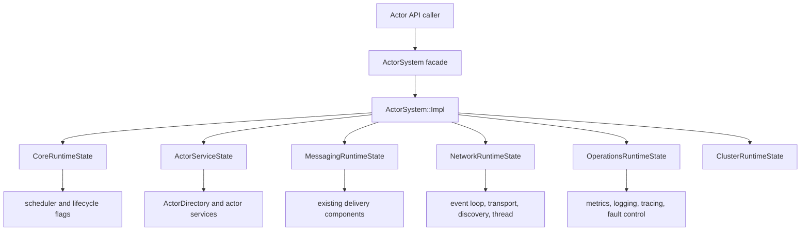

# ActorSystem Phase 1 Runtime Ownership Shell Design

**Date:** 2026-06-27

**Status:** Proposed phase design

**Parent design:**
`docs/superpowers/specs/2026-06-27-actor-system-component-refactor-design.md`

**Prerequisite:** Phase 0 correctness stabilization is merged and its focused
ASan/TSAN verification passes.

**Scope:** A behavior-neutral ownership and compilation-boundary refactor. This
phase introduces `ActorSystem::Impl`, moves existing runtime state behind it,
and leaves subsystem policy extraction to later phases.

## 1. Summary

Phase 1 turns `ActorSystem` into a real facade without attempting the riskier
behavioral extractions at the same time. The public class keeps its existing
API, while one private `std::unique_ptr<Impl>` becomes its only runtime-state
owner. `Impl` is an internal composition shell organized into named state
groups that preserve current subsystem identities, construction order,
callback behavior, and destruction order.

The shell is deliberately transitional. It is not permission to move the God
Class unchanged behind an opaque pointer. Named state groups make ownership
visible now and establish the destinations that Phases 2 through 7 will
replace with cohesive runtime components. Policy and algorithms remain in
their current methods during Phase 1 unless a mechanical move is necessary to
access relocated state.

The key outcome is a stable seam:

```text
public ActorSystem facade -> private ActorSystem::Impl -> named runtime state
```

No actor lifecycle, scheduling, delivery, network, wire, configuration, or
shutdown semantics are intentionally changed.

## 2. Preconditions from Phase 0

Phase 1 must not begin until these Phase 0 invariants are true:

1. `ActorDirectory` is the sole source of truth for actor names.
2. The dead-letter queue has stable object identity for every raw pointer held
   by the delivery pipeline.
3. configured and template spawn lifecycle behavior has characterization
   coverage.
4. stream routing state has one documented synchronization owner.
5. startup, delivery, and shutdown behavior has sufficient characterization
   coverage to detect an accidental semantic change.

These are hard prerequisites, not cleanup that may be folded into Phase 1.
Moving ambiguous or dangling ownership behind PImpl would conceal the defects
and make later component extraction harder to verify.

## 3. Problem Addressed by This Phase

The public `ActorSystem` header currently exposes the implementation's full
private object graph. Inline accessors and `spawn<T>()` directly manipulate
the actor directory, scheduler, mailbox, metrics, logger, delivery trackers,
network objects, and lifecycle state. Consequently:

- nearly every private ownership change recompiles consumers of the public
  header;
- construction and destruction dependencies are encoded as member order and
  one large constructor body;
- template actor creation cannot delegate across a private implementation
  boundary;
- later extractions cannot be introduced behind a stable facade seam; and
- review cannot distinguish public API compatibility from internal ownership.

Phase 1 addresses that structural problem only. The later phases remain
responsible for creating true `ActorRuntime`, `MessagingRuntime`,
`NetworkRuntime`, `StreamRuntime`, `ObservabilityRuntime`, and cluster
components.

## 4. Goals

1. Preserve all public `ActorSystem` method signatures and default behavior.
2. Make `std::unique_ptr<ActorSystem::Impl> impl_` the facade's only owned
   runtime state.
3. Move implementation-only includes out of the public header where public
   declarations do not require complete types.
4. Preserve the identity and lifetime of all current runtime objects.
5. Preserve the effective construction, startup, shutdown, and destruction
   sequence.
6. Bridge header-only `spawn<T>()` through one private non-template function.
7. Organize `Impl` into named ownership groups aligned with the target
   component graph.
8. Add architecture fitness checks that prevent runtime fields from returning
   to the public facade.
9. Leave every commit buildable and reviewable through incremental state-group
   migration.

## 5. Non-Goals

- Introducing `ActorSpawner`, `SpawnSpec`, or a unified adoption pipeline.
- Changing actor registration or lifecycle semantics.
- Rewriting the constructor into the final validated `RuntimeBuilder` model.
- Making configuration immutable; that belongs to Phase 6.
- Extracting message delivery, stream-frame routing, network lifecycle, or
  shutdown policy into their final components.
- Removing compatibility accessors or raw subsystem pointers from the public
  API.
- Replacing the current cluster type-erasure bridge.
- Changing protobuf schemas, wire frames, `TypeTag` values, mailbox admission,
  scheduler ready-gate transitions, or thread-placement rules.
- Adding a DI container, service locator, mixin hierarchy, RTTI, exceptions,
  or new virtual interfaces.

## 6. Considered Approaches

### 6.1 One-shot PImpl move

Move every field and method into one flat `Impl` in a single patch.

This reduces header exposure quickly, but it creates a hidden God Object,
makes destruction dependencies difficult to inspect, and produces an overly
large review. Rejected.

### 6.2 Extract final runtime components immediately

Introduce the final actor, messaging, networking, stream, observability, and
cluster components together with PImpl.

This would combine ownership movement with policy and concurrency changes.
Failures would be hard to localize, and Phase 0 characterization would no
longer isolate behavior. Rejected for Phase 1.

### 6.3 Incremental PImpl with named ownership groups

Introduce `Impl`, migrate related state in reviewable groups, and finish by
moving startup/shutdown wiring behind the facade. The groups are storage and
lifetime boundaries, not final subsystem APIs.

Selected. It creates the required facade seam while keeping the refactor
mechanical and preparing explicit replacement points for later phases.

## 7. Target Phase 1 Structure



The state groups are private implementation details. They may be nested types
inside `Impl` or internal types in `src/runtime/actor_system_impl.hpp`. They
must not appear in public headers.

### 7.1 Public facade

The final Phase 1 private surface is conceptually:

```cpp
class ActorSystem {
  public:
    // Existing public API, unchanged.

  private:
    class Impl;
    std::unique_ptr<Impl> impl_;

    Actor adopt_preconstructed_actor(std::shared_ptr<AbstractActor> actor,
                                     std::string_view type_name);
};
```

`adopt_preconstructed_actor()` is intentionally narrower than the target
Phase 2 `ActorSpawner`. It preserves the current template-spawn algorithm and
exists only because a public header template cannot inspect an incomplete
`Impl` type.

The public header may retain declarations and public configuration types that
require their existing includes. PImpl is not used as an excuse for unrelated
public API redesign.

### 7.2 `ActorSystem::Impl`

`Impl` has four responsibilities in Phase 1:

1. own the named runtime state groups;
2. preserve current construction and destruction dependencies;
3. perform the existing startup wiring using the facade reference where
   legacy APIs require `ActorSystem&` or `ActorSystem*`; and
4. provide storage to the existing facade method implementations.

It does not become a general service locator. No `get<T>()`, string-keyed
lookup, untyped dependency map, or public `runtime()` accessor is introduced.

`Impl` stores a stable reference to its facade:

```cpp
class ActorSystem::Impl final {
  public:
    Impl(ActorSystem& facade, const Config& config);
    ~Impl();

    Impl(const Impl&) = delete;
    Impl& operator=(const Impl&) = delete;

    ActorSystem& facade;
    CoreRuntimeState core;
    OperationsRuntimeState operations;
    ActorServiceState actors;
    MessagingRuntimeState messaging;
    NetworkRuntimeState network;
    ClusterRuntimeState cluster;
};
```

This order illustrates the intended outlives relation: after explicit
quiescence, cluster and network consumers destruct before messaging and actor
state, while operations and core/scheduler owners remain alive longest. The
implementation must still derive the exact order from the current
constructor/destructor and document it beside the member declarations.

## 8. Named Ownership Groups

The exact Phase 0 field names are authoritative at implementation time. The
following allocation is the intended boundary.

| Group | Existing state moved in Phase 1 | Later replacement |
|---|---|---|
| `CoreRuntimeState` | effective config, endpoint, clock, start time, running/readiness/shutdown atomics, scheduler, protobuf registry | validated blueprint plus `RuntimeCoordinator` |
| `ActorServiceState` | `ActorDirectory`, compatibility registry view, actor type definitions, system actor, actor-type registry, ask/passivation services, receptionist/CLI/HTTP gateway actor handles | `ActorRuntime` and `ActorSpawner` |
| `MessagingRuntimeState` | stable DLQ, local delivery engine, delivery pipeline, backpressure coordinator, outbound/reliable trackers, dedup cache | `MessagingRuntime` |
| `NetworkRuntimeState` | transport, event loop, network thread, discovery, registrar, location cache, timers, RPC channel, HTTP client, test wire sink | `NetworkRuntime` and `InboundFrameRouter` |
| `OperationsRuntimeState` | metrics config/buffer/actor, log config/manager/logger, tracing config/manager, fault controller | `ObservabilityRuntime` |
| `ClusterRuntimeState` | cluster-enabled state and existing type-erased cluster resources | typed cluster port/adapter |
| Phase 0 stream owner | the complete synchronized stream registry, if not already a standalone component | `StreamRuntime` |

Rules for these groups:

- A resource has exactly one owning group.
- Non-owning pointers continue to point to the same object identity as before.
- Groups do not expose generic public APIs.
- Methods are not moved merely to make group names look component-like.
- A group may contain references only when the referenced owner is guaranteed
  to outlive it by declaration and explicit shutdown order.
- A later phase replaces a whole group or a coherent subset; it does not add a
  second owner beside it.

## 9. Construction and Startup Contract

The facade constructor becomes:

```cpp
ActorSystem::ActorSystem(const Config& config)
    : impl_(std::make_unique<Impl>(*this, config)) {}
```

The Phase 1 `Impl` constructor preserves the current observable sequence,
including these ordering constraints:

1. establish immutable identities used by all later objects: facade,
   effective config copy, endpoint, clock/start time, and actor directory;
2. construct scheduler and stable messaging dependencies before early system
   actors may spawn or messages may be delivered;
3. create telemetry objects before injecting their non-owning pointers;
4. initialize process mode before scheduler worker threads start;
5. start the scheduler at the same point as the current constructor;
6. install tracing, network discovery, transport handlers, timers, and the
   event-loop thread in the existing order;
7. create network-dependent services only when networking is enabled;
8. create passivation, CLI, receptionist, fault injection, and shutdown
   coordination in the current order.

Phase 1 does not introduce a rollback-capable builder. If current startup has
a partial-start limitation, characterize and record it; do not silently change
it in this phase.

### 9.1 Callback capture rule

Moving constructor code changes what `this` means. Every callback must be
audited individually.

- A callback that only uses state captures `Impl*` through `[this]` inside an
  `Impl` method.
- A callback that must invoke a compatibility facade method calls the stored
  `facade` reference.
- No asynchronous callback captures the constructor parameter `facade` by
  reference.
- No callback captures a state-group local by reference.
- Each callback owner is stopped or destroyed before the captured object.

The network thread, discovery membership callback, timers, transport handlers,
delivery callbacks, shutdown callbacks, and test wire sink all require an
explicit audit.

## 10. Destruction and Shutdown Contract

Member destruction order alone is insufficient because worker threads and
callbacks retain raw pointers. `Impl::~Impl()` must preserve the current
explicit stop sequence before any owning group is destroyed:

1. publish `running = false`;
2. stop the network event loop;
3. join the network thread;
4. stop transport listening and discovery callbacks/services;
5. cancel or make network timers unreachable as current APIs require;
6. drive or preserve the existing actor shutdown behavior;
7. stop scheduler workers before destroying mailboxes, telemetry buffers,
   loggers, actors, or delivery dependencies they may reference;
8. stop/flush telemetry in the current order;
9. release cluster type-erased resources with their existing deleters;
10. allow named groups to destruct after all producers and callbacks are
    quiescent.

`ActorSystem::~ActorSystem()` is defined out of line, where `Impl` is complete,
and delegates to `Impl` destruction. Shutdown remains idempotent according to
its Phase 0 characterization.

The implementation plan must include a checked lifetime table containing, at
minimum, each raw pointer injection, its owner, every consumer, and the stop
event that ends consumer access.

## 11. Template Spawn Bridge

The public template continues to construct `T` so arbitrary actor constructor
arguments remain source-compatible:

```cpp
template <typename T, typename... Args>
Actor ActorSystem::spawn(Args&&... args) {
    auto actor = std::make_shared<T>(nullptr, *this,
                                     std::forward<Args>(args)...);
    if constexpr (requires { T::kActorTypeName; }) {
        return adopt_preconstructed_actor(actor, T::kActorTypeName);
    }
    return adopt_preconstructed_actor(actor, "unknown");
}
```

The non-template helper reproduces the current remaining steps exactly:

- allocate the actor id;
- assign address and type name;
- construct mailbox and context;
- publish the complete directory entry;
- inject scheduler, mailbox, metrics, and logger;
- register the selected dispatch policy;
- invoke activation and lifecycle transition in their existing order;
- emit the existing log and metric event; and
- return the same `Actor` handle.

This helper is not reused by configured, reserved system, or remote receiver
spawn paths in Phase 1. Unifying those paths belongs to Phase 2 and requires a
separate behavioral design around `SpawnSpec`.

## 12. Public Accessor Migration

Inline methods that read private runtime fields become declarations in
`actor_system.hpp` and out-of-line definitions in `actor_system.cpp` or a
focused facade implementation file. This includes accessors for delivery
trackers, DLQ, dedup, network loop, transport, registrar, actor type registry,
shutdown coordinator, telemetry, and other private owners present after
Phase 0.

Contracts remain unchanged:

- nullable accessors remain nullable under the same configuration;
- documented pointers remain stable for the same lifetime;
- constness and `noexcept` are preserved;
- no accessor lazily constructs a subsystem;
- no accessor returns a pointer to a temporary or replaceable group object.

`ActorSystem::ActorRegistry`, if retained as the Phase 0 compatibility view,
also moves method bodies out of line when that permits `ActorDirectory` to be
forward-declared.

## 13. Source and Build Layout

Recommended files:

```text
include/hpactor/actor/actor_system.hpp
src/actor/actor_system.cpp
src/runtime/CMakeLists.txt
src/runtime/actor_system_impl.hpp
src/runtime/actor_system_impl.cpp
tests/architecture/assert_file_excludes.cmake
tests/integration/actor/test_actor_system.cpp
tests/integration/actor/test_actor_system_lifecycle.cpp
```

`actor_system_impl.hpp` is private to `hpactor_lib`; it must never be added to
the public include tree or an installed header set. `src/runtime` denotes the
composition shell, not a new public runtime library.

The existing facade method definitions may remain in
`src/actor/actor_system.cpp` during Phase 1. Later phase-specific extractions
move policy to their final component files.

## 14. Dependency and Include Rules

1. `actor_system.hpp` may include only types required by public declarations,
   public inline templates, or public nested value types.
2. Implementation-only complete types belong in `actor_system_impl.hpp` or
   `.cpp` files.
3. `actor_system_impl.hpp` may include concrete subsystem headers because it is
   the private composition boundary.
4. Subsystems must not include `actor_system_impl.hpp`.
5. No public API exposes a state-group type.
6. Moving `Config` out of the facade header is out of scope because it is a
   public type; Phase 6 may redesign its parsing and blueprint boundary.

## 15. Concurrency and Hot-Path Contract

Phase 1 changes object location, not concurrency ownership.

- Actor mailbox MPSC and scheduler ready-gate rules remain exactly as defined
  by `actor-concurrency-and-lockfree-mailbox-rules.md`.
- Existing atomics retain their memory orders.
- Existing directory, DLQ, stream-registry, tracker, and transport locks retain
  their scope and ownership.
- No additional mutex protects `Impl`; broad locking would serialize unrelated
  hot paths and hide missing component boundaries.
- Facade forwarding adds no virtual dispatch, dynamic allocation, or blocking
  operation to local delivery after construction.
- The PImpl pointer is immutable after successful construction.
- The facade and `Impl` have the same externally managed lifetime; methods may
  not race with facade destruction beyond the currently supported contract.

Any change to these rules is a behavior change and must be deferred to a
separate phase/design.

## 16. Failure Semantics and Observability

Construction failure behavior, including the project's no-exceptions policy,
must remain unchanged. Phase 1 does not introduce a new public factory or
`result<ActorSystem>`.

Existing logs, metrics, traces, dead letters, health/readiness state, CLI
queries, and fault injection continue to observe the same objects. Relocating
their owners must not:

- reset counters or queues;
- create duplicate managers;
- change enablement defaults;
- reorder actor-spawn telemetry;
- publish readiness earlier or later; or
- suppress shutdown-phase visibility.

Architecture fitness tests supplement behavior tests by checking that runtime
storage does not migrate back into the facade header.

## 17. Incremental Migration Sequence

The implementation is split by ownership group so reviews can verify one set
of pointer and lifetime changes at a time.

1. Add architecture checks and characterize public size/API/lifecycle.
2. Introduce empty `Impl` and migrate messaging plus Phase 0 stream ownership.
3. Migrate network state and audit every network callback/thread lifetime.
4. Migrate operations and cluster state.
5. Migrate actor-service and core/scheduler state.
6. Move construction/destruction wiring into `Impl` and make the facade
   constructor/destructor thin.
7. Convert remaining inline accessors, reduce implementation-only includes,
   and enforce the final pointer-only facade check.
8. Run focused, full, ASan, and TSAN verification appropriate to the changed
   lifecycle and public header.

Temporary coexistence is permitted while a group is being migrated, but a
resource may never have two owners. A commit must not leave a callback pointing
at a moved-from or subsequently replaced object.

## 18. Verification Strategy

### 18.1 Architecture fitness

- Compile-time assertion that `ActorSystem` remains pointer-sized within a
  deliberately documented allowance for ABI/platform alignment.
- Text/CMake checks that forbidden runtime field names do not appear in the
  facade's private section after their migration task.
- A standalone consumer translation unit that includes only
  `<hpactor/actor/actor_system.hpp>` and exercises representative public APIs.
- Include/build verification that `actor_system_impl.hpp` is private.

### 18.2 Behavioral regression

- template spawn address/type/context/mailbox/lifecycle parity;
- cooperative, dedicated-thread, and dedicated-pool registration parity;
- local and remote delivery characterization;
- network-enabled and network-disabled construction/destruction;
- repeated `shutdown()` and destructor-after-shutdown;
- service discovery member-loss callback;
- DLQ, reliable tracker, dedup, metrics, logging, tracing, and accessor identity;
- CLI/receptionist/HTTP conditional startup;
- Phase 0 stream registry concurrency tests.

### 18.3 Sanitizers

- ASan: construct, topology load, actor spawn/delivery, shutdown, destruction,
  including networking enabled.
- TSAN: network callback plus shutdown, stream registry access, and actor
  delivery while lifecycle flags change through supported APIs.

## 19. Acceptance Criteria

Phase 1 is complete only when:

1. `ActorSystem` directly owns only `std::unique_ptr<Impl>` as runtime state.
2. All existing public signatures remain source-compatible.
3. `spawn<T>()` delegates to one non-template compatibility adoption helper
   and preserves Phase 0 lifecycle characterization.
4. `Impl` owns named state groups with documented lifetime order; it is not a
   flat field dump.
5. Startup and explicit shutdown/destruction order match the baseline.
6. Every asynchronous callback capture and raw pointer injection has a
   documented owner and quiescence point.
7. No subsystem includes or exposes `actor_system_impl.hpp`.
8. No new service locator, mixin hierarchy, RTTI, exception flow, protobuf
   change, or concurrency-policy change is introduced.
9. Focused and full tests pass, and the lifecycle scenarios pass under ASan
   and targeted TSAN.
10. The next phase can replace `ActorServiceState` with `ActorRuntime` without
    changing the public facade shape.

## 20. Risks and Mitigations

| Risk | Mitigation |
|---|---|
| PImpl merely hides the God Class | Require named groups, architecture checks, and explicit Phase 2 replacement boundary |
| Declaration order changes lifetime | Build a before/after lifetime table and preserve explicit stop order |
| `[this]` changes meaning after moving constructor code | Audit every callback and use stored `facade` only for legacy facade calls |
| Template spawn behavior drifts | Keep construction in the template and characterize every post-construction step |
| Public header cleanup accidentally breaks consumers | Add standalone public-header compile coverage and preserve signatures/noexcept/constness |
| Incremental moves temporarily duplicate ownership | Move one owner atomically per task; compatibility code holds references only |
| Sanitizers report unrelated background activity | Use focused lifecycle fixtures and record baseline failures before production edits |

## 21. Phase 2 Handoff

Phase 1 deliberately ends with storage groups and compatibility forwarding.
Phase 2 begins by replacing `ActorServiceState` with a cohesive
`ActorRuntime`, introducing `ActorSpawner` and `SpawnSpec`, and converging all
local actor adoption paths. The Phase 1 helper
`adopt_preconstructed_actor()` is therefore a migration seam, not the final
spawning abstraction.

No additional actor policy should be added to `Impl` between these phases.
New actor behavior should target the approved Phase 2 component contract or
wait until that design is accepted.
