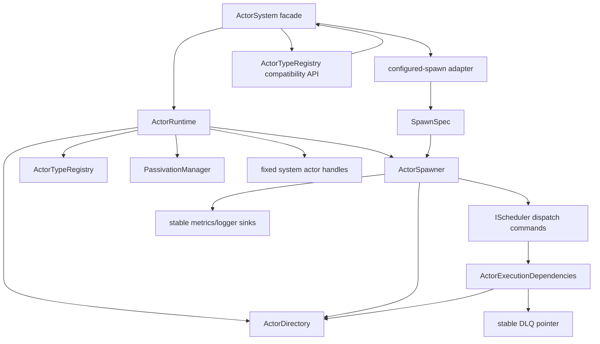
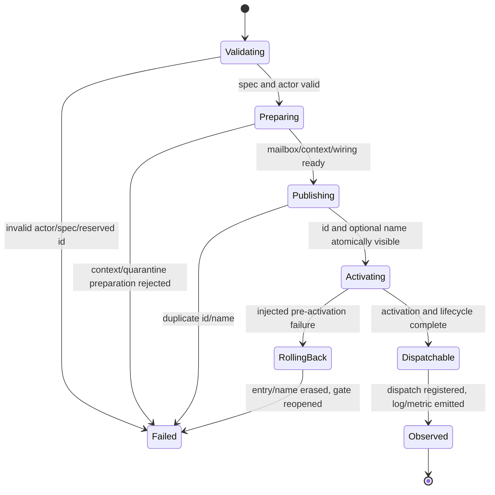

# ActorSystem Phase 2 ActorRuntime and Unified Spawning Design

**Date:** 2026-06-27

**Status:** Proposed phase design

**Parent design:**
`docs/superpowers/specs/2026-06-27-actor-system-component-refactor-design.md`

**Prerequisites:** Phase 0 correctness stabilization and Phase 1 runtime
ownership shell are merged, and their focused normal/ASan/TSAN verification
passes.

**Scope:** Extract actor identity, lookup, publication, type registration, and
adoption policy from the Phase 1 ownership shell into `ActorRuntime`. Introduce
one `ActorSpawner`/`SpawnSpec` pipeline for template, configured, reserved
system, and remote-spawn receiver actors. Narrow scheduler execution
dependencies without extracting messaging or network policy.

## 1. Summary

Phase 2 replaces the Phase 1 `ActorServiceState` storage group with the first
cohesive runtime component: `ActorRuntime`. It owns the actor directory, actor
type registry, passivation service, system actor identities/handles, and one
`ActorSpawner`. `ActorSystem` remains the public facade and no longer builds
mailboxes, contexts, directory entries, or dispatch registrations itself.

The central rule is simple: every constructed local actor becomes visible
through exactly one transactional adoption path. Programmatic `spawn<T>()`,
TOML-configured actors, reserved-id actors such as `SpawnReceiver`, and actors
created by remote-spawn factories all receive the same identity, context,
mailbox, lifecycle, dispatch, telemetry, and rollback treatment.

Phase 2 also removes the scheduler's stored dependency on the complete
`ActorSystem`. Scheduler execution receives a fixed, concrete dependency
bundle containing the actor directory, stable dead-letter sink, and immutable
coroutine mode. This is a dependency-direction improvement, not the Phase 3
messaging extraction.

The phase deliberately stops before delivery, wire-frame, stream, network,
configuration-blueprint, shutdown-coordinator, or cluster extraction.

## 2. Current-State Evidence

The codebase graph and source show three directory-publication implementations:

1. header-only `ActorSystem::spawn<T>()` allocates an id, builds mailbox and
   context, inserts `ActorDirectoryEntry`, registers dispatch, activates the
   actor, transitions lifecycle, and emits telemetry;
2. `ActorSystem::spawn_configured()` repeats most of that flow with configured
   dispatch/quarantine overrides; and
3. the `ActorSystem` constructor manually constructs and inserts
   `SpawnReceiver` with its reserved id.

Remote actor creation through `ActorTypeRegistry` normally calls a registered
factory which, in turn, calls `ActorSystem::spawn<T>()`. Custom factories may
return an empty actor, but `ActorTypeRegistry::spawn()` currently assumes a
valid handle and returns its address.

The scheduler also retains `ActorSystem&` across `HybridScheduler`,
`ActorReadyGate`, and actor execution runners. The actual execution needs are
narrower:

- actor lookup;
- mailbox lookup;
- the stable DLQ pointer for expired messages; and
- the immutable coroutine-mode flag.

These facts make actor adoption and scheduler lookup a coherent Phase 2
boundary.

## 3. Important Correctness Findings

These findings must be represented by regression tests before ownership moves.
Some may already be stabilized by Phase 0; if so, their tests become Phase 2
acceptance evidence rather than duplicate fixes.

### 3.1 Scheduler admission can race actor activation

The current template and configured paths register or notify scheduler dispatch
before `on_activate()` completes. With running workers, an actor can be selected
while activation or lifecycle transition is still in progress.

This creates an observable race between actor initialization and first message
processing. Reordering only the explicit `notify_ready()` is insufficient:
`on_activate()` may enqueue a self-message through a mailbox already wired to
the scheduler.

Required contract:

- adoption closes an actor-local spawn admission gate before directory
  publication;
- mailbox notifications may queue messages but cannot make the actor runnable
  while the gate is closed;
- activation and lifecycle transition complete;
- a release operation opens the gate; and
- the spawner performs the one initial dispatch registration/notification,
  which observes any messages queued during activation.

The gate is an atomic flag on `AbstractActor`, default-open for source
compatibility with direct scheduler test fixtures. Only `ActorSpawner` closes
and reopens it. `ActorReadyGate` checks it before admitting any actor mode.

### 3.2 Directory entry and registered name are not one publication

Configured actors are first inserted by id and later registered by topology
name. A duplicate name or intervening lookup can expose a partially published
actor.

Required contract: `ActorDirectory::publish()` checks both actor id and optional
name and commits both mappings under one directory lock. A duplicate leaves
neither mapping visible. No actor callback, scheduler call, log, or metric is
performed while that lock is held.

### 3.3 Directory insertion results are ignored

Existing spawn paths do not consistently check `ActorDirectory::insert()`.
This is especially important for reserved system ids, which must never silently
collide with an existing entry.

Required contract: automatic ids and explicit reserved ids use one validation
path. Duplicate id, duplicate name, invalid reserved id, and invalid actor
mode return typed spawn errors and emit one failure observation.

### 3.4 Configured spawning uses an unchecked concrete cast

`spawn_configured()` casts `AbstractActor*` to `LocalActor*` without an RTTI-free
capability check. A misregistered factory can cause undefined behavior.

Required contract: `AbstractActor` exposes an internal virtual context-binding
capability with a safe default failure. `LocalActor` implements it. The spawner
rejects actors that cannot bind an `ActorContext`; it does not use
`dynamic_cast`, `typeid`, or an unchecked downcast.

### 3.5 Spawn variants have historically drifted

The configured and reserved receiver paths have omitted parts of the template
contract at different points: lifecycle transition, logger/metrics injection,
spawn telemetry, scheduler/mailbox back-references, dispatch policy, and
activation order.

Required contract: only `ActorSpawner` constructs `ActorDirectoryEntry` and
performs adoption. Variant adapters may calculate `SpawnSpec`, but may not
repeat adoption steps.

### 3.6 Remote type factories can return an invalid actor

`ActorTypeRegistry::spawn()` assumes a registered factory returned a valid
actor and converts it to an address. Fault injection or a custom factory can
return an empty handle.

Required contract: the registry validates the returned actor and converts an
empty handle to a canonical spawn error. Existing `SpawnFactory` signatures
remain source-compatible; Phase 2 does not force custom factories into a new
construction ABI.

### 3.7 Post-publication rollback has a precise limit

Current activation and scheduler registration APIs return `void`, and
exceptions are forbidden. The design must not pretend those calls report
recoverable failures.

Required contract:

- validation, context binding, mailbox creation, quarantine configuration, and
  atomic publication occur before activation;
- every reported or injected failure after publication but before activation
  erases the entry/name and reopens the actor's admission gate;
- activation and dispatch registration are treated as infallible under their
  existing API contracts;
- if those APIs become fallible later, their new result must be connected to
  the existing rollback operation before use.

### 3.8 Scheduler lifetime dependencies are wider than necessary

`HybridScheduler` stores the whole facade even though execution uses directory
lookup, DLQ access, and a boolean mode. This makes actor ownership movement
appear cyclic and permits future scheduler code to reach unrelated services.

Required contract: new scheduler construction stores only
`ActorExecutionDependencies`. A source-compatible `ActorSystem&` constructor
may remain as a delegating adapter, but no scheduler/runner member stores the
facade.

### 3.9 System pseudo-actor identity is implicit

The current `system_actor_` handle may be empty while its address is used as a
remote-spawn supervisor identity. Phase 2 must characterize the intended
behavior rather than silently inventing a new wire-visible identity.

Required contract: test and document the Phase 1 value. `ActorRuntime` owns it
explicitly and preserves that value in Phase 2. Creating a new reserved system
actor or changing its address requires a separate compatibility design.

## 4. Goals

1. Make `ActorRuntime` the sole owner of local actor identity and lookup state.
2. Make `ActorSpawner` the sole publisher of complete actor directory entries.
3. Route template, configured, reserved system, and remote factory paths
   through the same adoption contract.
4. Atomically publish actor id and optional registered name.
5. Prevent scheduler execution before activation completes.
6. Preserve public `ActorSystem` spawn, lookup, registry, and actor-type APIs.
7. Preserve actor mailbox, dispatch, lifecycle, telemetry, and quarantine
   semantics except for the intentional activation-race correction.
8. Return typed internal errors for invalid actor mode, duplicate identity,
   duplicate name, reserved-id misuse, and invalid factory results.
9. Remove stored `ActorSystem&` dependencies from scheduler execution classes.
10. Preserve no-exceptions, no-RTTI, bounded-resource, and actor concurrency
    rules.
11. Leave a clean handoff to Phase 3 `MessagingRuntime`.

## 5. Non-Goals

- Extracting delivery policy, DLQ ownership, backpressure, deduplication, ACK,
  retry, or reliable trackers.
- Extracting remote transport, RPC, frame routing, streams, or discovery.
- Replacing `ActorFactoryRegistry` TOML parsing or introducing a validated
  `RuntimeBlueprint`.
- Changing remote-spawn protobuf messages or existing error-code meanings.
- Redesigning passivation/durability internals.
- Adding supervision trees, restart semantics, sharding, placement, or actor
  migration.
- Making activation callbacks return errors.
- Removing existing public `ActorSystem` compatibility accessors.
- Changing actor constructors to receive `ActorRuntime` instead of
  `ActorSystem`.
- Introducing virtual service ports, `std::function` lookups, or a service
  locator on scheduler hot paths.

## 6. Considered Approaches

### 6.1 Keep adoption in `ActorSystem::Impl`

Consolidate the repeated code into the Phase 1 private implementation but keep
directory, type registry, and passivation as state groups.

This is mechanically small, but it turns `Impl` into the actor policy owner and
blocks the component graph. Rejected.

### 6.2 Introduce abstract actor-runtime and scheduler interfaces

Define virtual interfaces for actor lookup, mailbox lookup, spawn telemetry,
dispatch registration, and lifecycle operations.

This improves mocking but introduces indirect calls on scheduler and mailbox
hot paths, proliferates interfaces around concrete in-process objects, and
obscures ownership. Rejected.

### 6.3 Concrete `ActorRuntime` with typed dependency bundles

Use a concrete, internal `ActorRuntime`/`ActorSpawner`; inject stable concrete
references through fixed structs; keep the public facade as adapter; and give
the scheduler a narrow non-owning dependency bundle.

Selected. It provides explicit ownership, testable policy, no runtime lookup,
and no new hot-path allocation or virtual dispatch.

## 7. Target Phase 2 Architecture



`ActorRuntime` is an owner and cohesive actor component. `ActorSpawner` owns
adoption policy but no independently replaceable resource. `SpawnSpec` is a
synchronous value contract. The facade performs compatibility translation and
does not construct directory entries.

## 8. Component Contracts

### 8.1 `ActorRuntime`

Recommended private internal interface:

```cpp
class ActorRuntime final {
  public:
    struct Dependencies {
        ActorSystem& facade;
        EndPoint endpoint;
        sched::IScheduler& scheduler;
        metrics::MpscRingBuffer<metrics::MetricEvent>* metrics;
        log::Logger* logger;
    };

    ActorRuntime(Dependencies dependencies,
                 std::unique_ptr<ActorDirectory> directory) noexcept;

    result<Actor> adopt(std::shared_ptr<AbstractActor> actor,
                        const SpawnSpec& spec) noexcept;

    std::shared_ptr<AbstractActor> find_actor(ActorId id) const noexcept;
    std::shared_ptr<mailbox::MPSCActorMailbox<TypedMessage>>
    find_mailbox(ActorId id) const noexcept;
    std::shared_ptr<ActorContext> find_context(ActorId id) const noexcept;
    std::vector<ActorDirectoryEntry> snapshot() const;
    std::size_t actor_count() const noexcept;

    bool register_name(std::string name, ActorAddress address);
    bool unregister_name(const std::string& name);
    std::optional<Actor> resolve_name(const std::string& name) const;

    ActorTypeRegistry& type_registry() noexcept;
    PassivationManager* passivation_manager() noexcept;
    Actor system_actor() const noexcept;
};
```

The exact return types of existing facade forwards remain source-compatible.
Internal methods may use `optional` or `result` where the public facade
currently returns an empty handle or `void`.

Ownership:

- `std::unique_ptr<ActorDirectory>`;
- `ActorSpawner`;
- `ActorTypeRegistry`;
- passivation manager and its current store ownership;
- current actor type definitions;
- the system pseudo-actor identity; and
- fixed, typed handles/aliases needed by existing CLI, metrics, receptionist,
  HTTP gateway, and spawn receiver accessors.

`ActorRuntime` does not own scheduler, telemetry backends, messaging state,
network resources, configuration parsing, or shutdown orchestration.

### 8.2 `SpawnSpec`

```cpp
enum class SpawnOrigin : uint8_t {
    Programmatic,
    Configured,
    System,
    RemoteFactory,
};

struct SpawnSpec final {
    std::string_view type_name;
    std::optional<std::string_view> registered_name;
    mailbox::MailboxConfig mailbox;
    sched::DispatchPolicy dispatch_policy;
    sched::DispatchHints dispatch_hints;
    std::optional<config::QuarantinePolicy> quarantine;
    std::optional<ActorId> reserved_id;
    std::optional<ActorType> actor_type_override;
    SpawnOrigin origin{SpawnOrigin::Programmatic};
};
```

Semantics:

- `type_name` is copied into the actor during synchronous adoption.
- `registered_name` is copied by the directory transaction.
- absent `reserved_id` allocates a normal monotonically increasing id.
- a reserved id is accepted only for `actor.is_system_actor()` and the
  inclusive 32-bit system range `0xFFFF0000` through `0xFFFFFFFF`; automatic
  allocation must never return a value in that range.
- `actor_type_override` exists for established system addresses such as
  `SpawnReceiver`; ordinary actors use `actor.type()`.
- dispatch policy and hints are already effective values. Precedence between
  actor-declared and topology-configured policy is calculated by the configured
  adapter, not inside the spawner.
- the mailbox config is complete. The spawner does not read global config.
- quarantine is applied only through the existing RTTI-free event-actor
  capability check.
- `SpawnOrigin` affects observability, never behavior.

`SpawnSpec` is internal to `hpactor_lib`; it is not a new public configuration
API.

### 8.3 `ActorSpawner`

```cpp
class ActorSpawner final {
  public:
    struct Dependencies {
        ActorSystem& facade;
        EndPoint endpoint;
        ActorDirectory& directory;
        sched::IScheduler& scheduler;
        metrics::MpscRingBuffer<metrics::MetricEvent>* metrics;
        log::Logger* logger;
    };

    explicit ActorSpawner(Dependencies dependencies) noexcept;

    result<Actor> adopt(std::shared_ptr<AbstractActor> actor,
                        const SpawnSpec& spec) noexcept;

  private:
    void rollback_publication(ActorId id,
                              AbstractActor& actor) noexcept;
};
```

The spawner stores only stable non-owning references/pointers. All owners
outlive it. It performs no topology lookup, type-factory lookup, message
delivery, remote I/O, or passivation.

### 8.4 Actor adoption capabilities

Add an RTTI-free capability to `AbstractActor` with a safe default rejection:

```cpp
virtual bool bind_context(ActorContext* context) noexcept;
virtual void activate_after_spawn();
```

`LocalActor` overrides it, stores the pointer through its existing context
mechanism, and returns true. It also overrides `activate_after_spawn()` to call
its existing `on_activate()` hook. Existing `set_context()` and `on_activate()`
remain source-compatible. Actor types without local context support return
false and are rejected before publication, so the default activation hook is
never used by successful adoption.

This capability must not be used as a general downcast mechanism.

### 8.5 Spawn admission gate

`AbstractActor` receives one private atomic boolean representing whether
scheduler admission is open. It defaults to true to preserve direct actor test
fixtures and non-spawner construction behavior.

Only `ActorSpawner` may close/open the gate during adoption. Scheduler readiness
checks it with acquire semantics; the spawner opens it with release semantics
after activation/lifecycle writes. Rejection while closed uses an explicit
`ReadyAdmissionCode::ActorStarting` so tests and metrics can distinguish it
from missing/terminated actors.

The flag is not the actor lifecycle state and does not replace the existing
`ActorState` ready/running state machine.

### 8.6 Atomic directory publication

Add a non-throwing status result:

```cpp
enum class DirectoryPublishStatus : uint8_t {
    Published,
    DuplicateActorId,
    DuplicateName,
};

DirectoryPublishStatus
ActorDirectory::publish(ActorDirectoryEntry entry,
                        std::optional<std::string_view> name);
```

Under one mutex scope, `publish()`:

1. checks the actor id;
2. checks the optional name;
3. inserts the complete entry; and
4. inserts the copied name/address mapping.

It calls no external code. `insert()` remains as a source-compatible wrapper
for existing non-spawn call sites until all are audited. `erase(id)` removes
every name that resolves to that actor as required by Phase 0.

### 8.7 Scheduler execution dependencies

```cpp
namespace hpactor::sched {

struct ActorExecutionDependencies final {
    ActorDirectory& actors;
    mailbox::DeadLetterQueue* dead_letters;
    bool use_coroutines;

    static ActorExecutionDependencies from(ActorSystem& system) noexcept;
};

} // namespace hpactor::sched
```

The new `HybridScheduler` constructor accepts this bundle and stores its fields,
not `ActorSystem&`. `ActorReadyGate` and actor execution runners receive the
specific directory/DLQ/value they use. The coroutine runner drops its currently
unused facade member.

The existing `HybridScheduler(ActorSystem&, ...)`,
`ActorReadyGate(ActorSystem&)`, actor execution runner, and execution-engine
constructor signatures remain as delegating compatibility overloads. None
stores the facade. `ActorExecutionDependencies::from()` is implemented at the
facade boundary and is the only scheduler compatibility adapter permitted to
inspect `ActorSystem::Impl`.

The dependency bundle contains no `std::function`, virtual lookup interface,
generic context, or mutable service map.

## 9. Unified Adoption State Machine



Detailed order:

1. reject a null actor, empty required type name, invalid reserved-id request,
   or incompatible quarantine target;
2. close the actor's spawn admission gate;
3. allocate an id or validate the reserved id;
4. assign the complete address and copy type name;
5. allocate mailbox and context;
6. bind context and inject scheduler, mailbox, metrics, and logger;
7. apply quarantine configuration;
8. create one complete `ActorDirectoryEntry`;
9. atomically publish entry plus optional name;
10. execute the post-publication fault-injection checkpoint; rollback on that
    reported failure;
11. invoke `activate_after_spawn()`, which dispatches to the established local
    `on_activate()` contract;
12. transition the optional lifecycle mixin to active;
13. open spawn admission with release ordering;
14. register dedicated dispatch or notify cooperative readiness exactly once;
15. emit one spawn log and one spawn metric with origin and type; and
16. return the valid `Actor` handle.

No directory lock is held after step 9. User actor code runs only at step 11.

## 10. Variant Adapters

### 10.1 Template `spawn<T>()`

The public template still constructs `T` with `(nullptr, *this, args...)` and
chooses `T::kActorTypeName` or `"unknown"`. It calls the Phase 1 private
non-template helper. The helper builds the default mailbox and effective actor
dispatch values, sets `SpawnOrigin::Programmatic`, and delegates to
`ActorRuntime::adopt()`.

The public return type remains `Actor`. An internal adoption error is logged and
returns an empty handle, matching existing failure conventions. No new public
throwing path is introduced.

### 10.2 Configured actors

`spawn_configured()` becomes a translation adapter:

- merge mailbox settings with existing helpers;
- calculate current actor-vs-topology dispatch precedence;
- set topology id as `registered_name`;
- copy quarantine policy;
- set `SpawnOrigin::Configured`; and
- delegate once.

`load_topology()` checks the returned handle/result before adding an id to the
SystemInit broadcast list. It no longer separately writes a registry name.

### 10.3 Reserved system actors

The `SpawnReceiver` construction path creates a `SpawnSpec` with:

- `SpawnReceiverId`;
- `SystemActorType` override;
- default system mailbox;
- actor-declared dispatch hints;
- `SpawnOrigin::System`; and
- no public registered name unless one already exists in the Phase 1 contract.

It then uses the same spawner. No constructor code manually creates a directory
entry. A reserved receiver adoption failure is treated as remote-startup
failure: rely on the spawner's single typed failure observation, publish
readiness/running false, stop and join the network loop/thread, stop transport
listening and discovery, and leave the receiver handle empty. The facade
remains destructible under the existing no-exception constructor contract.

Metrics, CLI, receptionist, and HTTP gateway actors already use template spawn;
they automatically receive the unified contract. Their typed handles remain in
the appropriate fixed owner/alias slot.

### 10.4 Remote factory actors

`ActorTypeRegistry` retains existing `SpawnFactory` compatibility. Default
`register_type<T>()` factories construct `T` and call a private friend facade
helper that delegates with `SpawnOrigin::RemoteFactory`. This is the same
construction/adoption split as `spawn<T>()`, with a different observability
origin. Custom factories remain responsible for using a supported public spawn
path; factories that call `system.spawn<T>()` report `Programmatic`, preserving
that explicit choice.

`ActorTypeRegistry::spawn()` validates the returned handle. Empty factory
results become a canonical non-success `spawn_errors` response and emit one
failure log at the receiver boundary. No wire schema changes.

## 11. Construction and Lifetime

Phase 2 must break the apparent scheduler/directory construction cycle without
late mutable wiring:

1. construct stable messaging and telemetry owners required by scheduler and
   spawner;
2. allocate `ActorDirectory` under a temporary `unique_ptr` in the composition
   root;
3. construct scheduler with `ActorExecutionDependencies{*directory, dlq,
   use_coroutines}`; do not start it;
4. construct `ActorRuntime`, transferring the same `unique_ptr<ActorDirectory>`
   and injecting the scheduler/telemetry references;
5. create early system actors through `ActorRuntime`;
6. start scheduler and the remaining services at the phase-defined point.

Transferring the `unique_ptr` does not move the directory object, so scheduler
references remain stable. The scheduler is explicitly stopped before
`ActorRuntime`, directory, DLQ, or telemetry owners are destroyed.

If Phase 1's exact member ordering cannot express this outlives relation, adjust
the internal state-group declaration order and update its lifetime inventory in
the same task.

## 12. Concurrency Contract

- `ActorDirectory` remains mutex-protected and safe from any thread.
- `publish()` and `erase()` never call actor, scheduler, telemetry, or user
  code while locked.
- The spawn admission gate uses release on open and acquire on scheduler read,
  publishing activation/lifecycle initialization to the worker.
- The existing `ActorState` Idle/Ready/Running/IOWaiting/Terminated CAS rules do
  not change.
- Mailbox MPSC ownership, ready-gate lost-wakeup handling, and single-consumer
  execution remain normative.
- Automatic id allocation remains monotonic under the directory lock/atomic
  mechanism established by Phase 0.
- Adoption is synchronous. `SpawnSpec` string views must not escape the call.
- `ActorSpawner` does not serialize all spawns with a new global mutex; only
  the existing directory publication critical section is shared.
- Scheduler execution performs direct concrete directory calls and one atomic
  admission check; it performs no generic lookup or per-dispatch allocation.

## 13. Error Model and Rollback

Add internal spawn error codes outside the established remote values or map
them to existing canonical errors without changing meanings. At minimum the
internal result distinguishes:

- null/invalid actor;
- actor cannot bind local context;
- invalid reserved id or actor type override;
- incompatible quarantine target;
- duplicate actor id;
- duplicate registered name;
- atomic publication failure; and
- factory returned an empty actor.

Only errors intended for remote response are translated into the existing
`spawn_errors` wire code space. Unknown older peers continue to see a generic
spawn failure; protobuf does not change.

Rollback after successful publication:

1. keep admission closed;
2. remove id and name through `ActorDirectory::erase()`;
3. call `scheduler.unregister_dedicated(id)` only if a dedicated registration
   was actually made;
4. reopen/reset the actor gate so a caller retaining another shared pointer is
   not left permanently closed; and
5. emit one failure observation.

Because dispatch registration follows activation and is currently infallible,
the initial implementation's reported rollback checkpoint is before actor code
runs. No compensating `on_exit()` is invented.

## 14. Observability and Operations Surface

Every adoption attempt emits at most one terminal observation.

Metrics use the existing fixed-size event fields. Successful adoption emits
`kActorSpawned` with `code = SpawnOrigin`. Append
`MetricEventType::kActorSpawnFailed = 70`; failure events store the canonical
`FailureReason` in `code` and `SpawnOrigin` in `aux`. Existing metric values
`0` through `69` do not change.

Success log/metric fields:

- actor id;
- actor type/type name;
- `SpawnOrigin`;
- dispatch policy;
- system/reserved-id flag; and
- registered-name presence (the name value may be logged only under existing
  logging policy).

Failure log/metric fields:

- `SpawnOrigin`;
- requested type name;
- canonical failure reason/error code;
- publication stage; and
- retryability where the existing failure model defines it.

Serialized constructor arguments, actor config args, and payload data are never
logged.

Existing CLI/admin actor listings, health checks, shutdown snapshots, metrics
actor access, receptionist access, and passivation access continue through
facade forwards to `ActorRuntime`. No operations endpoint learns about
`ActorSystem::Impl`.

Architecture fitness checks ensure:

- `ActorDirectoryEntry` construction occurs only in `ActorSpawner` and tests;
- `ActorDirectory::publish()` is called only by `ActorSpawner`;
- no scheduler production member stores `ActorSystem&`; references are
  confined to source-compatible delegating signatures and the fixed
  `ActorExecutionDependencies::from()` adapter; and
- `ActorSystem` actor methods are forwards/adapters, not policy copies.

## 15. Source and Build Layout

Recommended private runtime files:

```text
src/runtime/actor_runtime.hpp
src/runtime/actor_runtime.cpp
src/runtime/actor_spawner.hpp
src/runtime/actor_spawner.cpp
src/runtime/spawn_spec.hpp
```

Public/source-compatible scheduler and actor capability files:

```text
include/hpactor/sched/actor_execution_dependencies.hpp
include/hpactor/actor/abstract_actor.hpp
include/hpactor/actor/local_actor.hpp
include/hpactor/actor/actor_directory.hpp
src/actor/actor_directory.cpp
src/sched/actor_ready_gate.cpp
src/sched/actor_execution_engine.cpp
src/sched/scheduler.cpp
```

Tests:

```text
tests/unit/actor/test_actor_spawner.cpp
tests/unit/actor/test_actor_directory.cpp
tests/integration/actor/test_actor_spawn_unification.cpp
tests/integration/config/test_bootstrap_engine.cpp
tests/integration/spawn/test_actor_type_registry.cpp
tests/integration/sched/test_actor_execution_dependencies.cpp
tests/architecture/CMakeLists.txt
```

Runtime headers remain private to `hpactor_lib`. Tests may receive a private
`${CMAKE_SOURCE_DIR}/src` include path; no runtime-internal header is installed.

## 16. Incremental Migration Sequence

1. Characterize all spawn variants, activation ordering, invalid factories,
   reserved ids, and existing pseudo-system identity.
2. Add atomic directory publication and cleanup tests.
3. Add the context-binding capability and spawn admission gate.
4. Implement `SpawnSpec` and `ActorSpawner` against the existing Phase 1 actor
   state group.
5. Route the Phase 1 template adoption helper through `ActorSpawner`.
6. Route configured actors and atomic topology names through it.
7. Route reserved `SpawnReceiver` registration through it.
8. Harden `ActorTypeRegistry` invalid-result handling.
9. Replace `ActorServiceState` with `ActorRuntime` and move ownership.
10. Inject `ActorExecutionDependencies` into scheduler/ready gate/runners and
    remove stored facade references.
11. Run architecture checks, full verification, ASan, and focused TSAN.

Each step is independently buildable. No commit may contain both an old manual
directory publication and a new publication for the same actor path.

## 17. Verification Strategy

### 17.1 Unit tests

- atomic id+name publication and duplicate rollback;
- erase removes names;
- normal and reserved id validation;
- context-binding rejection without RTTI;
- spawn admission acquire/release behavior;
- every `SpawnSpec` validation error;
- rollback after injected post-publication failure;
- telemetry exactly once for success/failure;
- actor type registry empty-factory result.

### 17.2 Integration tests

- template and configured parity for address, mailbox, context, lifecycle,
  quarantine, dispatch, metrics, and logs;
- self-message from `on_activate()` is processed only after activation returns;
- configured duplicate name publishes no orphan actor;
- SpawnReceiver reserved address is resolvable and dispatchable;
- remote default factory reaches unified adoption;
- topology SystemInit list excludes failed actors;
- CLI/health/shutdown snapshots see actors through `ActorRuntime`;
- cooperative, dedicated-thread, and dedicated-pool behavior remains correct.

### 17.3 Architecture tests

- no production `ActorDirectoryEntry` construction outside
  `src/runtime/actor_spawner.cpp`;
- no manual `actor_directory.publish/insert` in `ActorSystem` or constructor
  code;
- no stored `ActorSystem&` in scheduler production headers/sources;
- no `dynamic_cast`, `typeid`, or exception flow in Phase 2 files;
- facade actor methods contain only translation/forwarding logic.

### 17.4 Sanitizers and stress

- ASan: failed publication, duplicate name, reserved receiver, topology load,
  shutdown/destruction;
- TSAN: concurrent spawn/name resolution, activation self-message, scheduler
  lookup while actors are published, and rollback visibility;
- repeat/stress: many concurrent automatic ids and mixed configured/template
  actors without duplicate ids or partial entries.

## 18. Acceptance Criteria

Phase 2 is complete only when:

1. `ActorRuntime` solely owns directory, spawner, type registry, passivation,
   and established system actor identity/handles.
2. `ActorSpawner` is the only production code constructing and publishing
   `ActorDirectoryEntry`.
3. Template, configured, reserved receiver, and remote default-factory paths
   use the unified adoption contract.
4. Actor id and optional name publish atomically.
5. Duplicate/invalid publication returns a typed error and leaves no actor or
   name visible.
6. No actor becomes runnable before activation/lifecycle initialization is
   published through the admission gate.
7. Every successful path has parity for mailbox/context, dispatch, lifecycle,
   quarantine, metrics, and logging.
8. Existing public `ActorSystem`, scheduler constructor, actor factory, and
   registry APIs remain source-compatible.
9. Scheduler execution classes store no `ActorSystem&` and use only fixed
   concrete dependencies.
10. `ActorSystem` contains no actor directory construction or adoption policy.
11. No RTTI, exceptions, generic service lookup, broad lock, wire change, or
    Phase 3 messaging extraction is introduced.
12. Focused/full tests and required ASan/TSAN scenarios pass.

## 19. Risks and Mitigations

| Risk | Mitigation |
|---|---|
| Unified code accidentally erases variant-specific policy | Put effective values in `SpawnSpec` and add parity tests per origin |
| Actor runs during activation | Close actor admission before publication; release-open only after lifecycle transition |
| Self-message during activation is lost | Allow mailbox enqueue, reject readiness while starting, explicitly dispatch after gate opens |
| Duplicate topology name leaves an orphan actor | Atomic directory `publish(entry, name)` with prechecks under one lock |
| Reserved id collides | Validate range/system mode and treat duplicate id as typed failure |
| New context capability becomes a downcast backdoor | Single-purpose `bind_context()` with default false; no general type query |
| Scheduler dependency change adds hot-path indirection | Concrete references/pointers and immutable bool; no virtual lookup or `std::function` |
| Directory transfer invalidates scheduler reference | Transfer `unique_ptr`; object address stays stable; start scheduler only after ownership transfer |
| Rollback calls user code | Roll back only before activation; directory/scheduler cleanup contains no actor callback |
| Remote custom factories bypass construction-only model | Preserve source compatibility, validate returned handle, document supported public spawn path |

## 20. Phase 3 Handoff

Phase 2 ends with scheduler execution holding a stable DLQ pointer in
`ActorExecutionDependencies` and actor spawning holding stable telemetry
pointers. Phase 3 replaces the Phase 1 messaging state group with
`MessagingRuntime`, then decides the final narrow expiry/dead-letter sink for
scheduler execution.

No delivery method, DLQ owner, backpressure handler, tracker, or wire callback
should move into `ActorRuntime`. New local-delivery work must wait for the
approved Phase 3 design rather than expanding `ActorSpawner` or
`ActorExecutionDependencies` into a service bundle.
